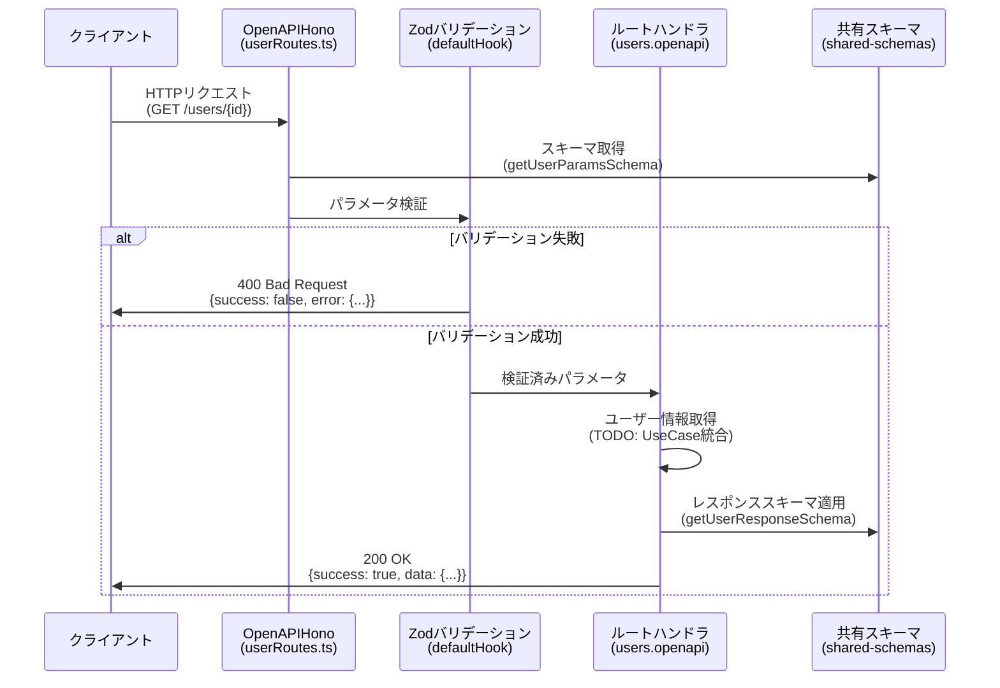
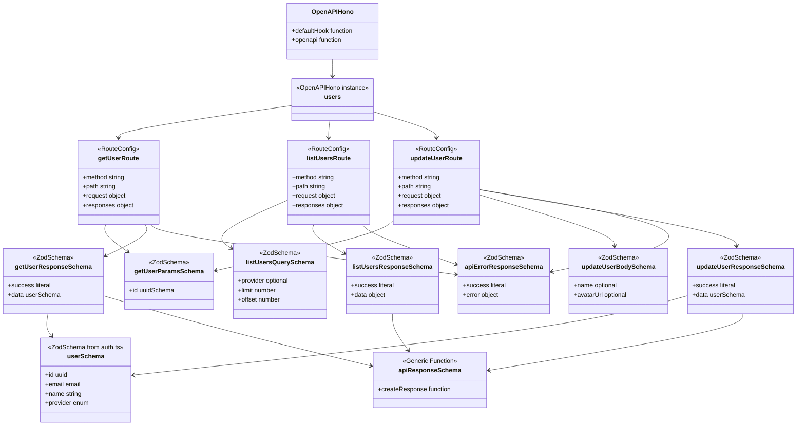

# TASK-903: ユーザー管理エンドポイントのOpenAPI対応化 - コード解説

**作成日**: 2025-10-20
**対象要件**: type-safety-enhancement（型安全性強化・API契約強化）
**対象TASK**: TASK-903

## この機能が何を解決するのか

この機能は「**ユーザー管理APIをOpenAPI 3.1に対応させ、型安全性を確保する**」ことを解決します。

具体的には：
- ユーザー情報の取得・一覧取得・更新の3つのエンドポイントをOpenAPI形式で定義
- Zodスキーマを使ってリクエスト・レスポンスの型を自動検証
- OpenAPI仕様書から自動生成されたドキュメントで、APIの使い方が明確になる

これを「**スキーマ駆動開発**」と呼び、コードとドキュメントの不整合を防ぎ、型安全なAPI開発ができます。

## 全体の処理の流れ

### 処理フローとファイル関係



この図の流れを簡単に説明すると：

1. クライアントがAPIリクエストを送る（例: `GET /users/550e8400-...`）
2. OpenAPIHonoがリクエストを受け取り、Zodスキーマでパラメータを検証
3. 検証が成功すればハンドラが実行され、ユーザー情報を返す
4. 検証が失敗すれば、その時点で400エラーを返す

**重要なポイント**: この仕組みのおかげで、不正なデータ（UUIDじゃないIDなど）がハンドラに届く前にブロックされます。

## ファイルの役割と責任

### 今回解説するメインのファイル

#### `app/server/src/presentation/http/routes/userRoutes.ts`

**役割**: ユーザー管理APIのルート定義とハンドラ実装

このファイルは3つの大きな仕事をしています：

1. **OpenAPIルート定義の作成** (`createRoute`で定義)
2. **Zodバリデーションの設定** (`defaultHook`でエラーハンドリング)
3. **APIハンドラの実装** (`users.openapi`でビジネスロジック)

```typescript
// app/server/src/presentation/http/routes/userRoutes.ts

// OpenAPIHonoインスタンスを作成（バリデーションエラーを自動で400に変換）
const users = new OpenAPIHono({
  defaultHook: (result, c) => {
    if (!result.success) {
      // Zodのエラーをわかりやすい形式に変換
      return c.json({
        success: false,
        error: {
          code: 'VALIDATION_ERROR',
          message: 'バリデーションエラー',
          details: { /* フィールドごとのエラー */ }
        }
      }, 400);
    }
  }
});
```

**初学者がつまずきやすいポイント**: `defaultHook`は「Zodバリデーションが失敗した時に自動で呼ばれる関数」です。つまり、手動でif文を書かなくても、不正なリクエストは自動で弾かれます。

#### ルート定義の例（GET /users/{id}）

```typescript
// app/server/src/presentation/http/routes/userRoutes.ts

const getUserRoute = createRoute({
  method: 'get',
  path: '/users/{id}',
  tags: ['ユーザー管理'],
  summary: 'ユーザー情報取得',
  description: 'ユーザーIDでユーザー情報を取得する',
  request: {
    params: getUserParamsSchema,  // パスパラメータのスキーマ
  },
  responses: {
    200: {
      content: {
        'application/json': {
          schema: getUserResponseSchema,  // 成功時のレスポンススキーマ
        },
      },
      description: 'ユーザー情報取得成功',
    },
    400: { /* バリデーションエラー */ },
    404: { /* ユーザーが見つからない */ },
    500: { /* サーバーエラー */ },
  },
});
```

この定義をすることで：
- OpenAPI仕様書が自動生成される
- Zodがリクエストを自動検証してくれる
- TypeScriptの型推論が効くようになる

**よくある勘違い**: このルート定義は「ドキュメントを書くためだけのもの」ではありません。実際に実行時のバリデーションとして機能します。

#### ハンドラの実装（GET /users/{id}）

```typescript
// app/server/src/presentation/http/routes/userRoutes.ts

users.openapi(getUserRoute, async (c) => {
  try {
    // c.req.valid('param')で検証済みパラメータを取得
    const { id } = c.req.valid('param');

    // TODO: 今はダミーデータを返しているが、本来はUseCaseを呼ぶ
    const userResponse = {
      success: true as const,
      data: {
        id,
        externalId: 'dummy-external-id',
        provider: 'google' as const,
        email: 'user@example.com',
        name: 'Dummy User',
        avatarUrl: 'https://example.com/avatar.jpg',
        createdAt: new Date().toISOString(),
        updatedAt: new Date().toISOString(),
        lastLoginAt: new Date().toISOString(),
      },
    };

    return c.json(userResponse, 200);
  } catch (error) {
    // 予期しないエラーは500として返す
    return c.json(handleInternalServerError(error, '/api/users/{id}'), 500);
  }
});
```

**重要な処理の詳細**:

1. `c.req.valid('param')` - これは「Zodで検証済みのパラメータ」を取得します
   - バリデーション失敗時は既に`defaultHook`で400が返されているので、ここに到達する時点で必ず正しい値です

2. `as const` - TypeScriptの型を「リテラル型」にするためのもの
   - `success: true`だと型は`boolean`になるが、`as const`を付けると`true`というリテラル型になる
   - これによりZodスキーマの`z.literal(true)`と型が一致します

3. TODO部分 - 現在はダミーデータですが、本来は`GetUserUseCase`を呼んでデータベースから取得します

### 呼び出されているファイル（依存先）

#### `app/packages/shared-schemas/src/users.ts`

**役割**: ユーザー管理APIの契約スキーマを定義

このファイルは、サーバーとクライアント（フロントエンド）の両方で使われる「共通のルールブック」です。

```typescript
// app/packages/shared-schemas/src/users.ts

// パスパラメータのスキーマ（UUIDであることを保証）
export const getUserParamsSchema = z.object({
  id: uuidSchema,  // common.tsから提供される共通UUID型
});

// 成功レスポンスのスキーマ
export const getUserResponseSchema = apiResponseSchema(userSchema);
// これは以下と同じ意味:
// z.object({ success: z.literal(true), data: userSchema })
```

**初学者向けの補足**: `uuidSchema`や`apiResponseSchema`は別ファイル（`common.ts`）で定義されています。これを「再利用」することで、プロジェクト全体で一貫した型定義ができます。

#### `app/packages/shared-schemas/src/common.ts`

**役割**: プロジェクト全体で使う共通型を提供

```typescript
// app/packages/shared-schemas/src/common.ts

// UUID型（UUIDv4形式の文字列であることを検証）
export const uuidSchema = z.string().uuid('有効なUUID v4形式である必要があります');

// レスポンスの共通構造を作る関数
export const apiResponseSchema = <T extends z.ZodTypeAny>(dataSchema: T) =>
  z.object({
    success: z.literal(true),
    data: dataSchema,
  });

// エラーレスポンスの構造
export const apiErrorResponseSchema = z.object({
  success: z.literal(false),
  error: z.object({
    code: z.string(),
    message: z.string(),
    details: z.union([z.record(z.any(), z.string()), z.string()]).optional(),
  }),
});
```

**なぜこの設計が良いのか**: すべてのAPIが同じレスポンス形式（`{success: true, data: ...}`）を使うので、フロントエンドのコードが統一できます。

#### `app/packages/shared-schemas/src/auth.ts`

**役割**: 認証関連のスキーマを定義

```typescript
// app/packages/shared-schemas/src/auth.ts

// 認証プロバイダーの種別（google, github等）
export const authProviderSchema = z.enum([
  'google', 'apple', 'microsoft', 'github', 'facebook', 'line',
]);

// ユーザー情報のスキーマ（API契約用）
export const userSchema = z.object({
  id: z.string().uuid(),
  externalId: z.string(),
  provider: authProviderSchema,
  email: emailSchema,
  name: z.string(),
  avatarUrl: z.string().url().nullable().optional(),
  createdAt: z.string().datetime(),
  updatedAt: z.string().datetime(),
  lastLoginAt: z.string().datetime().nullable().optional(),
});
```

**users.tsとの関係**: `users.ts`は`auth.ts`から`userSchema`をインポートして使っています。つまり、ユーザー情報の「本体」は`auth.ts`で定義されており、`users.ts`はそれをAPI契約として再利用しているだけです。

## クラスと関数の呼び出し関係

### クラス構造と依存関係



**この図の読み方**:

- `OpenAPIHono`が基礎となるクラス（`@hono/zod-openapi`から提供）
- `users`はその具体的なインスタンス（ユーザー管理API用）
- 各ルート（`getUserRoute`など）は`createRoute`で作成された設定オブジェクト
- すべてのルートが共有スキーマ（`getUserParamsSchema`など）に依存している

**依存の方向**: すべての矢印は「使う側」から「使われる側」へ向かっています。例えば`getUserRoute`は`getUserParamsSchema`を使います。

## 重要な処理の詳細解説

### 1. Zodバリデーションの自動実行

```typescript
// app/server/src/presentation/http/routes/userRoutes.ts

const users = new OpenAPIHono({
  defaultHook: (result, c) => {
    if (result.success) {
      return;  // バリデーション成功時は何もしない
    }

    // バリデーション失敗時の処理
    return c.json(
      {
        success: false,
        error: {
          code: 'VALIDATION_ERROR',
          message: 'バリデーションエラー',
          details: result.error.issues.reduce(
            (acc: Record<string, string>, issue) => {
              const field = issue.path.join('.');  // エラーのフィールド名
              acc[field] = issue.message;  // エラーメッセージ
              return acc;
            },
            {},
          ),
        },
      },
      400,
    );
  },
});
```

**この処理が必要である理由**:

- Zodのデフォルトエラー形式は複雑で、フロントエンドで使いにくい
- `defaultHook`でエラーを変換することで、すべてのエンドポイントで一貫したエラー形式になる
- フロントエンドは`error.details.フィールド名`で簡単にエラーメッセージを取得できる

**よくある勘違い**: 「この処理は各ハンドラで書くべきでは？」と思うかもしれませんが、`defaultHook`に書くことで重複コードを避けられます。

### 2. OpenAPIルート定義の登録

```typescript
// app/server/src/presentation/http/routes/userRoutes.ts

const getUserRoute = createRoute({
  method: 'get',
  path: '/users/{id}',
  request: {
    params: getUserParamsSchema,  // このスキーマで自動検証される
  },
  responses: {
    200: {
      content: {
        'application/json': {
          schema: getUserResponseSchema,  // レスポンスの型定義
        },
      },
      description: 'ユーザー情報取得成功',
    },
  },
});

// ルート定義をHonoアプリに登録
users.openapi(getUserRoute, async (c) => {
  // ハンドラ実装
});
```

**この処理の流れ**:

1. `createRoute`でルート定義を作成（型定義・バリデーションルール・ドキュメントを含む）
2. `users.openapi`でルート定義とハンドラを紐付ける
3. リクエストが来ると、まず`getUserParamsSchema`でバリデーション
4. 成功すればハンドラが実行され、失敗すれば`defaultHook`でエラーレスポンス

**押さえるべきポイント**: `createRoute`の戻り値は「ルート設定オブジェクト」であり、まだハンドラは紐付いていません。`users.openapi`で初めてハンドラが登録されます。

### 3. レスポンススキーマの再利用

```typescript
// app/packages/shared-schemas/src/users.ts

export const getUserResponseSchema = apiResponseSchema(userSchema);
export const updateUserResponseSchema = apiResponseSchema(userSchema);
```

**なぜ別々に定義するのか**: 将来、仕様が変わって「更新時のレスポンスにはタイムスタンプを追加したい」となった場合、`updateUserResponseSchema`だけを変更すれば良いからです。

```typescript
// app/packages/shared-schemas/src/common.ts

export const apiResponseSchema = <T extends z.ZodTypeAny>(dataSchema: T) =>
  z.object({
    success: z.literal(true),
    data: dataSchema,
  });
```

**この関数の仕組み**: ジェネリック関数を使って「どんなスキーマでも`{success: true, data: ...}`の形にできる」ようにしています。

**比喩で理解**: `apiResponseSchema`は「ラッピング機械」のようなものです。中身（`dataSchema`）が何であれ、同じ包装紙（`{success: true, data: ...}`）で包んでくれます。

### 4. エラーハンドリングの共通化

```typescript
// app/server/src/presentation/http/routes/userRoutes.ts

function handleInternalServerError(error: unknown, endpoint: string) {
  // セキュリティのため、スタックトレースは記録せずメッセージのみ
  console.error('[SECURITY] Unexpected error:', {
    timestamp: new Date().toISOString(),
    error: error instanceof Error ? error.message : 'Unknown error',
    endpoint,
  });

  return {
    success: false as const,
    error: {
      code: 'INTERNAL_SERVER_ERROR',
      message: '一時的にサービスが利用できません',
    },
  };
}
```

**この処理が必要である理由**:

- サーバー内部のエラー詳細（スタックトレース等）をクライアントに送ると、セキュリティリスクになる
- すべての500エラーで一貫したメッセージを返すことで、攻撃者に情報を与えない
- ログには詳細を記録しつつ、レスポンスには最小限の情報だけ

**よくある勘違い**: 「エラーメッセージを詳しく返した方が親切では？」と思うかもしれませんが、本番環境では攻撃者に手がかりを与えないことが重要です。

## 初学者がつまずきやすいポイント

### 1. `c.req.valid('param')`と`c.req.param('id')`の違い

```typescript
// ❌ これは使わない（型安全でない）
const id = c.req.param('id');

// ✅ これを使う（Zod検証済み・型安全）
const { id } = c.req.valid('param');
```

- `c.req.param('id')` - 生のリクエストパラメータを取得（検証なし、型は`string | undefined`）
- `c.req.valid('param')` - Zodで検証済みのパラメータ（型は`getUserParamsSchema`から推論）

**なぜ重要か**: `c.req.valid`を使うことで、TypeScriptの型チェックとZodのランタイム検証の両方が効きます。

### 2. `as const`の意味

```typescript
// ❌ これだと型が広すぎる
const response = {
  success: true,  // 型は boolean
  data: { /* ... */ }
};

// ✅ リテラル型にする
const response = {
  success: true as const,  // 型は true
  data: { /* ... */ }
};
```

- `success: true` → TypeScriptの型は`boolean`（`true`または`false`のどちらでも良い）
- `success: true as const` → TypeScriptの型は`true`（必ず`true`）

**Zodスキーマとの関係**: `apiResponseSchema`は`success: z.literal(true)`なので、型も`true`でないと一致しません。

### 3. OpenAPIルート定義とハンドラの分離

```typescript
// ルート定義（設定だけ）
const getUserRoute = createRoute({ /* ... */ });

// ハンドラの登録（実装を紐付ける）
users.openapi(getUserRoute, async (c) => { /* ... */ });
```

**よくある勘違い**: 「`createRoute`の中でハンドラも書けるのでは？」と思うかもしれませんが、OpenAPIでは「定義」と「実装」を分けることで、仕様書の自動生成やテストが簡単になります。

### 4. Zodスキーマの`.optional()`と`.nullable()`の違い

```typescript
// .optional() - フィールド自体が省略可能
name: z.string().optional()  // { name: "太郎" } または { }

// .nullable() - フィールドはあるがnullでも良い
avatarUrl: z.string().url().nullable()  // { avatarUrl: null } または { avatarUrl: "..." }

// 両方使うと「省略可能かつnullでも良い」
avatarUrl: z.string().url().nullable().optional()
```

**API設計での使い分け**:
- `.optional()` - クライアントが送らなくても良いフィールド（例: 更新時の`name`）
- `.nullable()` - フィールドは必須だがnullを許可（例: 未設定の`avatarUrl`）

## この設計のいい点

### 1. スキーマの一元管理による型の不整合防止

`shared-schemas`パッケージを使うことで：
- サーバーとクライアントが同じスキーマを共有
- データベースのスキーマ変更が自動でAPI契約に反映される
- 「サーバーはstringを返すのに、クライアントはnumberだと思っている」みたいなバグが起きない

**具体例**: もし`User`型に新しいフィールド`role`を追加したら、`userSchema`を1箇所変更するだけで、全エンドポイントとフロントエンドに反映されます。

### 2. 実行時バリデーションとコンパイル時型チェックの両立

- **コンパイル時**: TypeScriptが型エラーを検出（例: `id`に数値を渡そうとするとエラー）
- **実行時**: Zodがリクエストを検証（例: 不正なUUIDが来たら400を返す）

これにより、「TypeScriptの型は合っているのに、実行時にエラーになる」という問題が起きません。

### 3. エラーレスポンスの統一による開発体験の向上

すべてのエンドポイントが同じエラー形式（`{success: false, error: {...}}`）を返すので：
- フロントエンドのエラーハンドリングコードを1箇所に集約できる
- 新しいエンドポイントを追加しても、エラー処理の実装を考えなくて良い

### 4. OpenAPI仕様書の自動生成による開発効率の向上

ルート定義を書くだけで：
- Swagger UIで対話的にAPIをテストできる
- フロントエンドの型定義が自動生成される（`openapi-typescript`を使う場合）
- APIドキュメントとコードが常に一致している

**従来の問題**: 手書きのAPIドキュメントは、実装と不整合が起きやすかった。OpenAPIなら「コードがドキュメント」なので、不整合が起きません。
