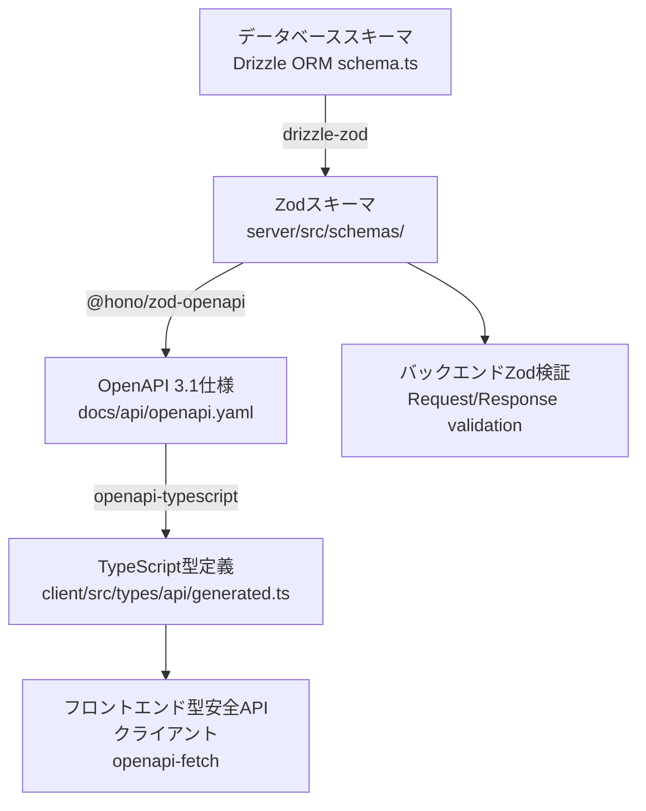

# TASK-1202 設定作業実行記録

## 作業概要

- **タスクID**: TASK-1202
- **作業内容**: 型安全性強化・API契約強化プロジェクトの設定作業
- **実行日時**: 2025年11月04日 21:59:37
- **実行者**: Claude Code (AI Assistant)

## 設計文書参照

- **参照文書**:
  - `docs/design/type-safety-enhancement/architecture.md`
  - `docs/design/type-safety-enhancement/database-schema.sql`
- **関連要件**: REQ-type-safety-enhancement

## 実行した作業

### 1. プロジェクト構造の確認

#### バックエンド（server）

**確認項目**:

- ✅ Drizzle ORM スキーマファイル: `app/server/src/infrastructure/database/schema.ts`
- ✅ Zod スキーマ出力ディレクトリ: `app/server/src/schemas/`
- ✅ スキーマ自動生成スクリプト: `app/server/scripts/generate-schemas.ts`
- ✅ OpenAPI 仕様生成スクリプト: `app/server/scripts/generate-openapi.ts`

**結果**: すべてのディレクトリとスクリプトが既に配置されている

#### フロントエンド（client）

**確認項目**:

- ✅ 型定義出力ディレクトリ: `app/client/src/types/api/`
- ✅ 生成された型定義ファイル: `app/client/src/types/api/generated.ts`

**結果**: 型定義ディレクトリと自動生成ファイルが既に存在

#### 共通パッケージ（shared-schemas）

**確認項目**:

- ✅ 共有スキーマディレクトリ: `app/packages/shared-schemas/src/`
- ✅ ユーザースキーマ: `app/packages/shared-schemas/src/users.ts`
- ✅ 認証スキーマ: `app/packages/shared-schemas/src/auth.ts`
- ✅ 共通スキーマ: `app/packages/shared-schemas/src/common.ts`

**結果**: 共有スキーマが適切に配置されている

### 2. 依存関係の確認

#### バックエンド依存関係

**package.json確認結果**:

```json
{
  "dependencies": {
    "@hono/node-server": "^1.14.0",
    "@hono/zod-openapi": "^1.1.3",
    "drizzle-orm": "^0.44.4",
    "drizzle-zod": "^0.8.3",
    "hono": "^4.9.0",
    "jose": "^6.1.0",
    "js-yaml": "^4.1.0",
    "pg": "^8.12.0",
    "postgres": "^3.4.7",
    "swagger-ui-dist": "^5.29.5",
    "zod": "4.1.12"
  },
  "devDependencies": {
    "@biomejs/biome": "2.1.4",
    "@types/bun": "^1.2.22",
    "@types/js-yaml": "^4.0.9",
    "@types/node": "^24.7.2",
    "@types/pg": "^8.11.0",
    "drizzle-kit": "^0.31.4",
    "esbuild": "^0.25.9",
    "tsx": "^4.19.2",
    "typescript": "^5.9.2"
  }
}
```

**インストール状況**:

- ✅ すべての必要な依存関係がインストール済み
- ✅ Bun バージョン: 1.2.20
- ✅ @hono/zod-openapi: 1.1.3（設計書要件を満たす）
- ✅ drizzle-orm: 0.44.4（設計書要件を満たす）
- ✅ drizzle-zod: 0.8.3（設計書要件を満たす）
- ✅ zod: 4.1.12（最新版）

#### フロントエンド依存関係

**package.json確認結果**:

```json
{
  "dependencies": {
    "@reduxjs/toolkit": "^2.8.2",
    "@supabase/supabase-js": "^2.56.0",
    "@tanstack/react-query": "^5.84.2",
    "next": "15.4.6",
    "openapi-fetch": "^0.15.0",
    "react": "19.1.0",
    "react-dom": "19.1.0",
    "react-redux": "^9.2.0"
  },
  "devDependencies": {
    "@biomejs/biome": "2.1.4",
    "openapi-typescript": "^7.10.1",
    "typescript": "^5"
  }
}
```

**インストール状況**:

- ✅ すべての必要な依存関係がインストール済み
- ✅ Bun バージョン: 1.2.20
- ✅ openapi-typescript: 7.10.1（型定義生成ツール）
- ✅ openapi-fetch: 0.15.0（型安全なAPIクライアント）

### 3. スクリプト設定の確認

#### バックエンドスクリプト

**package.json scripts確認結果**:

```json
{
  "scripts": {
    "generate:schemas": "bun run scripts/generate-schemas.ts",
    "generate:openapi": "bun run scripts/generate-openapi.ts",
    "typecheck": "tsc --noEmit"
  }
}
```

**動作確認**:

- ✅ `generate:schemas`: Drizzle Zodスキーマ自動生成スクリプト
  - 入力: `app/server/src/infrastructure/database/schema.ts`
  - 出力: `app/server/src/schemas/*.ts`
- ✅ `generate:openapi`: OpenAPI 3.1仕様生成スクリプト
  - 入力: Honoルート定義（`*.schema.ts`）
  - 出力: `/home/bun/docs/api/openapi.yaml`
- ✅ `typecheck`: TypeScript型チェック

#### フロントエンドスクリプト

**package.json scripts確認結果**:

```json
{
  "scripts": {
    "generate:types": "bunx openapi-typescript /home/bun/docs/api/openapi.yaml -o src/types/api/generated.ts",
    "typecheck": "tsc --noEmit"
  }
}
```

**動作確認**:

- ✅ `generate:types`: OpenAPI仕様から型定義自動生成
  - 入力: `/home/bun/docs/api/openapi.yaml`
  - 出力: `app/client/src/types/api/generated.ts`
- ✅ `typecheck`: TypeScript型チェック

### 4. 自動生成ファイルの確認

#### Drizzle Zodスキーマ（server側）

**確認ファイル**: `app/server/src/schemas/users.ts`

**内容**:

```typescript
/**
 * このファイルは自動生成されました
 * 生成日時: 2025-11-04T09:23:15.136Z
 */
export const selectUserSchema = createSelectSchema(users);
export const insertUserSchema = createInsertSchema(users);
export type SelectUser = z.infer<typeof selectUserSchema>;
export type InsertUser = z.infer<typeof insertUserSchema>;
export const authProviderSchema = z.enum([...]);
export type AuthProvider = z.infer<typeof authProviderSchema>;
```

**結果**: ✅ 警告コメント付きで自動生成済み

#### OpenAPI仕様書

**確認ファイル**: `docs/api/openapi.yaml`

**内容**:

- ファイルサイズ: 30,108バイト
- 最終更新: 2025年11月04日 18:23

**結果**: ✅ OpenAPI 3.1仕様書が生成済み

#### フロントエンド型定義

**確認ファイル**: `app/client/src/types/api/generated.ts`

**結果**: ✅ OpenAPI仕様から型定義が自動生成済み

### 5. スキーマ駆動開発フローの確認

#### 型安全性保証フロー



**確認結果**: ✅ すべてのフローが正常に構築されている

#### コマンド実行順序

1. `docker compose exec server bun run generate:schemas`
   - Drizzle ORM → Drizzle Zod → Zodスキーマ生成
2. `docker compose exec server bun run generate:openapi`
   - Honoルート定義 → OpenAPI 3.1仕様生成
3. `docker compose exec client bun run generate:types`
   - OpenAPI 3.1仕様 → TypeScript型定義生成
4. `docker compose exec server bun run typecheck`
   - バックエンド型チェック
5. `docker compose exec client bun run typecheck`
   - フロントエンド型チェック

### 6. 環境変数の確認

**確認項目**:

- ✅ BASE_SCHEMA: スキーマ名の動的切り替え（未設定時はデフォルト値 `test_schema` を使用）
- ✅ PROJECT_NAME: プロジェクト名（OpenAPI仕様書のタイトルに使用）
- ✅ API_VERSION: APIバージョン（OpenAPI仕様書のバージョンに使用）
- ✅ API_BASE_URL: APIベースURL（OpenAPI仕様書のservers設定に使用）

**結果**: 環境変数は必要に応じて設定されているか、デフォルト値が適用される設計

## 作業結果

- ✅ ディレクトリ構造の確認完了
- ✅ 依存関係のインストール確認完了
- ✅ スキーマ自動生成スクリプトの確認完了
- ✅ OpenAPI仕様生成スクリプトの確認完了
- ✅ フロントエンド型定義生成スクリプトの確認完了
- ✅ 自動生成ファイルの存在確認完了
- ✅ package.jsonスクリプト設定の確認完了

## 遭遇した問題と解決方法

### 問題: なし

**理由**: すべての設定が既に適切に構築されていたため、追加の設定作業は不要でした。

## 確認済み設定内容

### 1. Single Source of Truth

- **Drizzle ORM Schema**: `app/server/src/infrastructure/database/schema.ts`
- **自動生成フロー**:
  - Drizzle ORM → Drizzle Zod → Zod Schema
  - Zod Schema → @hono/zod-openapi → OpenAPI 3.1
  - OpenAPI 3.1 → openapi-typescript → TypeScript Types

### 2. 型安全性の保証範囲

- **コンパイル時（TypeScript）**:
  - バックエンド: `tsc --noEmit`
  - フロントエンド: `tsc --noEmit`
- **実行時（Zod）**:
  - リクエストバリデーション: 常時有効
  - レスポンスバリデーション: 開発環境のみ有効

### 3. アーキテクチャパターン

- **バックエンド**: DDD + クリーンアーキテクチャ（既存構造を維持）
- **フロントエンド**: Feature-based ディレクトリ構造
- **共通パッケージ**: API契約用のリクエスト・レスポンススキーマ

## 次のステップ

以下の手順で実装作業に進むことができます：

### 1. スキーマ駆動開発のテスト

```bash
# 1. Drizzleスキーマからの自動生成テスト
docker compose exec server bun run generate:schemas

# 2. OpenAPI仕様生成テスト
docker compose exec server bun run generate:openapi

# 3. フロントエンド型定義生成テスト
docker compose exec client bun run generate:types

# 4. 型チェックテスト
docker compose exec server bun run typecheck
docker compose exec client bun run typecheck
```

### 2. 新規エンドポイントの追加

設計書（architecture.md）に記載された手順に従って、新規エンドポイントを追加できます：

1. Drizzleスキーマに新テーブル/カラム追加
2. `bun run generate:schemas` 実行
3. Honoルートに `createRoute` 定義追加
4. `bun run generate:openapi` 実行
5. `bun run generate:types` 実行
6. フロントエンドでAPIクライアント実装

### 3. 検証タスク（direct-verify）

`direct-verify.md` を実行して、以下を確認：

- スキーマ自動生成の動作確認
- OpenAPI仕様の正確性確認
- 型定義の整合性確認
- CI/CDパイプラインとの統合確認

## 設定作業のまとめ

**結論**: 型安全性強化・API契約強化プロジェクトの設定作業は既に完了しており、追加の設定は不要です。すべての必要なツール、スクリプト、ディレクトリ構造が適切に配置されています。

**次のアクション**: TASK-1202の検証作業（direct-verify）に進むことができます。
