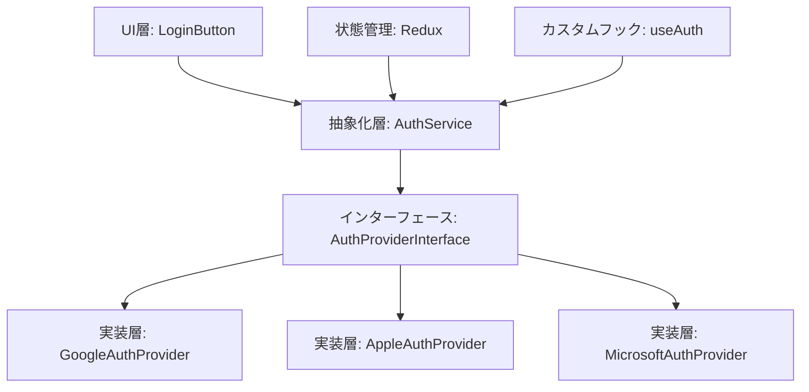

# プロバイダー非依存設計実装指針：TASK-301

**作成日**: 2025-08-30  
**更新日**: 2025-08-30  
**対象**: TASK-301 フロントエンド認証フロー  
**設計原則**: 開放閉鎖・依存性逆転によるプロバイダー抽象化

---

## 設計思想と原則

### SOLID原則の適用

#### 1. 開放閉鎖の原則（Open/Closed Principle）
- **新規プロバイダー追加時に既存コードを変更しない**
- インターフェース拡張による機能追加
- LoginButtonコンポーネントは抽象化により変更不要

#### 2. 依存性逆転の原則（Dependency Inversion Principle）  
- **上位モジュール（UI・Redux）が下位モジュール（具体的なプロバイダー）に依存しない**
- AuthProviderInterfaceによる抽象化
- 具体的なプロバイダー実装の変更がUI層に影響しない

---

## アーキテクチャ設計

### 層構造設計



### 責務分離

| 層 | 責務 | 具体例 |
|---|-----|-------|
| **UI層** | ユーザーインターフェース・イベント処理 | LoginButton・LogoutButton |
| **抽象化層** | プロバイダー選択・統一インターフェース | AuthService |
| **インターフェース層** | プロバイダー共通仕様定義 | AuthProviderInterface |
| **実装層** | 具体的なプロバイダー連携 | GoogleAuthProvider |
| **状態管理層** | 認証状態・プロバイダー情報管理 | Redux AuthSlice |

---

## 実装仕様

### 1. AuthProviderInterface（プロバイダー統一仕様）

```typescript
// services/providers/authProviderInterface.ts

export type AuthProvider = 'google' | 'apple' | 'microsoft' | 'github';

export interface AuthResult {
  success: boolean;
  user?: User;
  error?: string;
  isNewUser?: boolean;
}

export interface SessionResult {
  isValid: boolean;
  user?: User;
  provider?: AuthProvider;
}

/**
 * 認証プロバイダー統一インターフェース
 * 全プロバイダー実装がこのインターフェースに準拠
 */
export interface AuthProviderInterface {
  /** プロバイダー名 */
  readonly providerName: AuthProvider;
  
  /** ログイン実行 */
  signIn(options?: AuthOptions): Promise<AuthResult>;
  
  /** ログアウト実行 */
  signOut(): Promise<{ success: boolean }>;
  
  /** セッション状態取得 */
  getCurrentSession(): Promise<SessionResult>;
  
  /** セッション変更監視 */
  onSessionChange(callback: (session: SessionResult) => void): () => void;
}

export interface AuthOptions {
  redirectTo?: string;
  scopes?: string[];
  metadata?: Record<string, any>;
}
```

### 2. AuthService（抽象化サービス層）

```typescript
// services/authService.ts

import type { AuthProviderInterface, AuthProvider, AuthResult } from './providers/authProviderInterface';
import { GoogleAuthProvider } from './providers/googleAuthProvider';
// 将来追加: import { AppleAuthProvider } from './providers/appleAuthProvider';

/**
 * 認証サービス抽象化層
 * プロバイダーの選択・切り替えを管理
 */
class AuthServiceClass {
  private providers = new Map<AuthProvider, AuthProviderInterface>();
  private currentProvider: AuthProviderInterface | null = null;

  constructor() {
    // プロバイダー登録（将来的にはファクトリーパターンまたは設定ファイル化）
    this.registerProvider(new GoogleAuthProvider());
    // 将来追加: this.registerProvider(new AppleAuthProvider());
  }

  /**
   * プロバイダー登録
   * 新規プロバイダー追加時にここを変更するのみ
   */
  private registerProvider(provider: AuthProviderInterface): void {
    this.providers.set(provider.providerName, provider);
  }

  /**
   * プロバイダー選択ログイン
   * UI層から呼び出される統一メソッド
   */
  async signIn(provider: AuthProvider, options?: AuthOptions): Promise<AuthResult> {
    const authProvider = this.providers.get(provider);
    if (!authProvider) {
      return { success: false, error: `Provider ${provider} not found` };
    }

    this.currentProvider = authProvider;
    return await authProvider.signIn(options);
  }

  /**
   * 現在のプロバイダーでログアウト
   */
  async signOut(): Promise<{ success: boolean }> {
    if (!this.currentProvider) {
      return { success: true }; // 既にログアウト状態
    }

    const result = await this.currentProvider.signOut();
    if (result.success) {
      this.currentProvider = null;
    }
    return result;
  }

  /**
   * セッション復元（プロバイダー自動検出）
   */
  async getCurrentSession(): Promise<SessionResult> {
    // 全プロバイダーからアクティブセッションを検索
    for (const [providerName, provider] of this.providers) {
      const session = await provider.getCurrentSession();
      if (session.isValid) {
        this.currentProvider = provider;
        return { ...session, provider: providerName };
      }
    }
    
    return { isValid: false };
  }

  /**
   * 利用可能プロバイダー一覧取得
   */
  getAvailableProviders(): AuthProvider[] {
    return Array.from(this.providers.keys());
  }
}

// シングルトンエクスポート
export const authService = new AuthServiceClass();
```

### 3. GoogleAuthProvider（Google専用実装）

```typescript
// services/providers/googleAuthProvider.ts

import { createClient } from '@supabase/supabase-js';
import type { 
  AuthProviderInterface, 
  AuthResult, 
  SessionResult, 
  AuthOptions 
} from './authProviderInterface';

/**
 * Google認証プロバイダー実装
 * SupabaseベースのGoogle OAuth処理
 */
export class GoogleAuthProvider implements AuthProviderInterface {
  readonly providerName = 'google' as const;
  private supabase = createClient(
    process.env.NEXT_PUBLIC_SUPABASE_URL!,
    process.env.NEXT_PUBLIC_SUPABASE_ANON_KEY!
  );

  async signIn(options?: AuthOptions): Promise<AuthResult> {
    try {
      const { data, error } = await this.supabase.auth.signInWithOAuth({
        provider: 'google',
        options: {
          redirectTo: options?.redirectTo || window.location.origin,
          ...options?.metadata
        }
      });

      if (error) {
        return { 
          success: false, 
          error: error.message 
        };
      }

      // OAuth リダイレクト開始のため、ここでは成功応答
      return { success: true };
    } catch (error) {
      return { 
        success: false, 
        error: error instanceof Error ? error.message : 'Unknown error' 
      };
    }
  }

  async signOut(): Promise<{ success: boolean }> {
    try {
      const { error } = await this.supabase.auth.signOut();
      return { success: !error };
    } catch {
      return { success: false };
    }
  }

  async getCurrentSession(): Promise<SessionResult> {
    try {
      const { data: { session } } = await this.supabase.auth.getSession();
      
      if (!session) {
        return { isValid: false };
      }

      // User情報をAPIから取得（JITプロビジョニング対応）
      const userResponse = await fetch('/api/user/profile', {
        headers: {
          'Authorization': `Bearer ${session.access_token}`,
          'Content-Type': 'application/json'
        }
      });

      if (!userResponse.ok) {
        return { isValid: false };
      }

      const userData = await userResponse.json();
      
      return {
        isValid: true,
        user: userData.data,
        provider: 'google'
      };
    } catch {
      return { isValid: false };
    }
  }

  onSessionChange(callback: (session: SessionResult) => void): () => void {
    const { data: { subscription } } = this.supabase.auth.onAuthStateChange(
      async (event, session) => {
        if (event === 'SIGNED_OUT') {
          callback({ isValid: false });
        } else if (event === 'SIGNED_IN' && session) {
          const sessionResult = await this.getCurrentSession();
          callback(sessionResult);
        }
      }
    );

    return () => subscription.unsubscribe();
  }
}
```

### 4. LoginButton（抽象化UI コンポーネント）

```typescript
// components/LoginButton.tsx

'use client'
import React from 'react';
import { authService } from '../services/authService';
import type { AuthProvider } from '../services/providers/authProviderInterface';

interface LoginButtonProps {
  /** 使用する認証プロバイダー */
  provider: AuthProvider;
  /** ログイン開始時コールバック */
  onLoginStart?: () => void;
  /** ログイン成功時コールバック */
  onLoginSuccess?: (user: User) => void;
  /** ログインエラー時コールバック */
  onLoginError?: (error: string) => void;
  /** カスタムボタンテキスト */
  children?: React.ReactNode;
  /** カスタムCSS クラス */
  className?: string;
}

/**
 * プロバイダー非依存ログインボタン
 * props.providerに基づいて適切な認証処理を実行
 */
export const LoginButton: React.FC<LoginButtonProps> = ({
  provider,
  onLoginStart,
  onLoginSuccess,
  onLoginError,
  children,
  className = "px-4 py-2 bg-blue-500 text-white rounded hover:bg-blue-600"
}) => {
  const [isLoading, setIsLoading] = React.useState(false);

  /**
   * プロバイダー表示名取得
   */
  const getProviderDisplayName = (provider: AuthProvider): string => {
    const displayNames: Record<AuthProvider, string> = {
      google: 'Google',
      apple: 'Apple', 
      microsoft: 'Microsoft',
      github: 'GitHub'
    };
    return displayNames[provider];
  };

  /**
   * 統一ログイン処理
   * AuthService抽象化層経由で実行
   */
  const handleLogin = async (): Promise<void> => {
    setIsLoading(true);
    onLoginStart?.();

    try {
      const result = await authService.signIn(provider, {
        redirectTo: process.env.NEXT_PUBLIC_SITE_URL || window.location.origin
      });

      if (result.success) {
        if (result.user) {
          onLoginSuccess?.(result.user);
        }
      } else {
        onLoginError?.(result.error || 'Login failed');
      }
    } catch (error) {
      onLoginError?.(
        error instanceof Error ? error.message : 'Unexpected error occurred'
      );
    } finally {
      setIsLoading(false);
    }
  };

  const buttonText = children || `${getProviderDisplayName(provider)}でログイン`;

  return (
    <button
      type="button"
      role="button"
      onClick={handleLogin}
      disabled={isLoading}
      className={className}
      aria-label={`${getProviderDisplayName(provider)}でログイン`}
    >
      {isLoading ? 'ログイン中...' : buttonText}
    </button>
  );
};
```

### 5. Redux統合（プロバイダー情報管理）

```typescript
// store/authSlice.ts に追加

export interface AuthState {
  isAuthenticated: boolean;
  user: User | null;
  isLoading: boolean;
  error: string | null;
  currentProvider: AuthProvider | null; // 追加: 現在のプロバイダー情報
}

const initialState: AuthState = {
  isAuthenticated: false,
  user: null,
  isLoading: false,
  error: null,
  currentProvider: null // 初期値追加
};

// authSuccessアクションにプロバイダー情報を追加
interface AuthSuccessPayload {
  user: User;
  isNewUser: boolean;
  provider: AuthProvider; // 追加
}

export const authSlice = createSlice({
  name: 'auth',
  initialState,
  reducers: {
    authSuccess: (state, action: PayloadAction<AuthSuccessPayload>) => {
      state.isAuthenticated = true;
      state.user = action.payload.user;
      state.currentProvider = action.payload.provider; // プロバイダー情報保存
      state.isLoading = false;
      state.error = null;
    },
    authLogout: (state) => {
      state.isAuthenticated = false;
      state.user = null;
      state.currentProvider = null; // プロバイダー情報クリア
      state.isLoading = false;
      state.error = null;
    }
    // その他のアクション...
  }
});
```

---

## 実装順序とマイルストーン

### Phase 1: 基盤抽象化（優先度: 最高）
1. **AuthProviderInterface定義** - プロバイダー統一仕様
2. **AuthService実装** - 抽象化サービス層
3. **GoogleAuthProvider実装** - 既存機能の抽象化対応

### Phase 2: UI層抽象化（優先度: 高）
1. **LoginButton抽象化** - GoogleLoginButton→LoginButtonリファクタリング
2. **Redux拡張** - プロバイダー情報管理機能追加
3. **既存コンポーネント統合** - UserProfileとの連携

### Phase 3: 拡張性確保（優先度: 中）
1. **将来プロバイダー準備** - AppleAuthProvider・MicrosoftAuthProvider雛形
2. **設定外部化** - プロバイダー設定のファイル化
3. **テスト基盤整備** - MockAuthProvider・テスト支援ツール

### Phase 4: 品質向上（優先度: 低）
1. **エラーハンドリング統一** - プロバイダー横断エラー処理
2. **パフォーマンス最適化** - プロバイダー選択キャッシュ機能
3. **セキュリティ強化** - プロバイダー間セッション管理

---

## 拡張例: 将来のApple Sign In対応

### Apple認証プロバイダー実装例

```typescript
// services/providers/appleAuthProvider.ts

export class AppleAuthProvider implements AuthProviderInterface {
  readonly providerName = 'apple' as const;

  async signIn(options?: AuthOptions): Promise<AuthResult> {
    // Apple Sign In実装
    // Supabaseまたは他のSDK使用
  }

  async signOut(): Promise<{ success: boolean }> {
    // Apple固有のログアウト処理
  }

  async getCurrentSession(): Promise<SessionResult> {
    // Apple セッション確認
  }

  onSessionChange(callback: (session: SessionResult) => void): () => void {
    // Apple セッション変更監視
  }
}
```

### AuthService拡張（1行追加のみ）

```typescript
// services/authService.ts
constructor() {
  this.registerProvider(new GoogleAuthProvider());
  this.registerProvider(new AppleAuthProvider()); // ← この1行のみ追加
}
```

### UI利用例（既存コード変更なし）

```typescript
// 既存のGoogleログイン
<LoginButton provider="google" />

// 新規Appleログイン（既存コンポーネント変更なし）
<LoginButton provider="apple" />
```

---

## テスト戦略

### 1. インターフェース準拠テスト
- 全プロバイダーがAuthProviderInterfaceに準拠することを保証
- 統一的なテストケースでプロバイダー間の動作一貫性を確保

### 2. 抽象化層テスト
- AuthServiceのプロバイダー選択・切り替え機能
- エラーハンドリング・例外処理の統一性

### 3. UI層分離テスト
- LoginButtonがプロバイダー実装に依存しないことを確認
- プロバイダー変更時のUI動作一貫性

### 4. 統合テスト
- プロバイダー横断認証フロー
- セッション復元・状態管理のプロバイダー非依存性

---

## 保守・拡張ガイドライン

### 新規プロバイダー追加手順
1. `AuthProviderInterface`を実装した新規クラス作成
2. `AuthService`のコンストラクタに1行追加
3. 型定義`AuthProvider`に新規プロバイダー名追加
4. テストケース作成・実行

### 既存コード変更禁止原則
- **UI層（LoginButton・UserProfile）**: プロバイダー追加時に変更禁止
- **状態管理（Redux AuthSlice）**: プロバイダー固有ロジック追加禁止
- **共通処理（セッション復元・エラーハンドリング）**: プロバイダー依存コード禁止

### コードレビュー観点
- 新規コードにプロバイダー固有の実装詳細が上位層に漏れていないか
- インターフェース経由でのみプロバイダーにアクセスしているか
- SOLID原則（特に開放閉鎖・依存性逆転）に準拠しているか

---

## まとめ

この実装指針により、TASK-301フロントエンド認証フローは：

1. **拡張性**: 新規プロバイダー追加時の既存コード変更最小化
2. **保守性**: プロバイダー固有ロジックの分離による障害影響範囲限定  
3. **テスタビリティ**: インターフェース抽象化による統一テストケース
4. **品質**: SOLID原則準拠による設計品質向上

を実現し、将来の認証要件変更に対する柔軟性と安定性を両立します。
