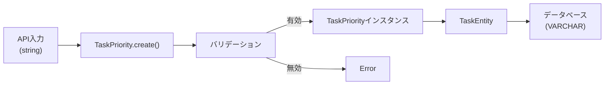

# TaskPriority値オブジェクト TDD要件定義書

## 📄 ドキュメント情報

- **作成日**: 2025-11-20
- **タスクID**: TASK-1306
- **要件名**: TODO リストアプリ
- **フェーズ**: Phase 2 - バックエンドDomain層実装
- **推定工数**: 8時間
- **依存タスク**: TASK-1305 (Phase 1完了)

## 1. 機能の概要

### 目的

🔵 *要件定義書 REQ-005、タスクファイルより*

タスクの優先度を表現する値オブジェクト（Value Object）を実装する。
DDD（ドメイン駆動設計）の原則に従い、優先度という概念をイミュータブルな値オブジェクトとしてカプセル化する。

### 何をする機能か

🔵 *要件定義書 REQ-005、技術設計 interfaces.ts より*

- 優先度の値（`high`, `medium`, `low`）を型安全に扱う
- 不正な優先度値を実行時にバリデーション
- 優先度の等価性比較機能を提供
- イミュータブル（不変）な値オブジェクトとして振る舞う

### どのような問題を解決するか

🔵 *DDD設計原則、既存実装パターンより*

- **型安全性**: 文字列リテラル型だけでは実行時の不正値を防げない
- **ビジネスルールの集約**: 優先度の検証ロジックを一箇所に集約
- **意図の明確化**: TaskPriorityという型名でドメイン概念を明示
- **不変性の保証**: 値オブジェクトパターンでデータの整合性を保証

### 想定されるユーザー

🔵 *アーキテクチャ設計より*

- **直接利用**: TaskEntity（ドメイン層）
- **間接利用**: CreateTaskUseCase、UpdateTaskUseCase（アプリケーション層）
- **データソース**: PostgreSQL tasks テーブルの priority カラム

### システム内での位置づけ

🔵 *アーキテクチャ設計、既存実装パターンより*

```
app/server/src/domain/task/
├── valueobjects/
│   └── TaskPriority.ts        # ← このファイル
├── TaskEntity.ts              # TaskPriorityを集約
└── errors/
```

**依存関係**:
- **依存しない**: 外部ライブラリに依存しない（Pure TypeScript）
- **依存される**: TaskEntity、CreateTaskInput、UpdateTaskInput

## 2. 入力・出力の仕様

### 入力パラメータ

🔵 *要件定義書 REQ-005、技術設計 interfaces.ts より*

#### `TaskPriority.create(value: string): TaskPriority`

| パラメータ | 型 | 必須 | 制約 | 説明 |
|-----------|-----|------|------|------|
| value | string | ✅ | `'high'` \| `'medium'` \| `'low'` | 優先度の文字列表現 |

**有効な値**:
- `'high'`: 高優先度
- `'medium'`: 中優先度（デフォルト）
- `'low'`: 低優先度

**不正な値の例**:
- 空文字列 `''`
- `null`
- `undefined`
- 不正な文字列 `'invalid'`, `'HIGH'`, `'Medium'`（大文字小文字を区別）

### 出力値

🔵 *既存実装パターン（UserEntity等）より*

#### `TaskPriority` インスタンス

| メソッド | 戻り値型 | 説明 |
|---------|---------|------|
| `getValue()` | `TaskPriorityValue` | 優先度の値を取得（`'high'` \| `'medium'` \| `'low'`） |
| `equals(other: TaskPriority)` | `boolean` | 他のTaskPriorityインスタンスと等価か判定 |

**型定義**:
```typescript
export type TaskPriorityValue = 'high' | 'medium' | 'low';

export class TaskPriority {
  private readonly value: TaskPriorityValue;

  private constructor(value: TaskPriorityValue);
  public static create(value: string): TaskPriority;
  public getValue(): TaskPriorityValue;
  public equals(other: TaskPriority): boolean;
}
```

### 入出力の関係性

🔵 *DDD値オブジェクトパターンより*

```typescript
// 入力: 文字列
const input = 'high';

// 処理: バリデーション → インスタンス生成
const priority = TaskPriority.create(input);

// 出力: 値オブジェクト
priority.getValue(); // => 'high'
```

### データフロー

🔵 *アーキテクチャ設計、既存実装パターンより*



## 3. 制約条件

### ビジネスルール制約

🔵 *要件定義書 REQ-005、REQ-103 より*

- **有効値**: `'high'`, `'medium'`, `'low'` のいずれか
- **デフォルト値**: タスク作成時は `'medium'` がデフォルト（TaskEntity側で設定）
- **大文字小文字**: 厳密に小文字のみ受け付ける
- **空値禁止**: 空文字列、null、undefined は不正値

### アーキテクチャ制約

🔵 *アーキテクチャ設計 ADR-001、既存実装パターンより*

- **イミュータブル**: 一度生成したインスタンスの値は変更不可
- **値オブジェクト**: 識別子を持たず、値の等価性で判定
- **Pure TypeScript**: 外部ライブラリに依存しない
- **Private Constructor**: `new TaskPriority()` による直接生成を禁止
- **Static Factory Method**: `TaskPriority.create()` のみで生成

### データベース制約

🔵 *要件定義書 データベーススキーマ、database-schema.sql より*

```sql
-- tasks テーブルの priority カラム
priority VARCHAR(10) NOT NULL DEFAULT 'medium'

-- CHECK制約
CHECK (priority IN ('high', 'medium', 'low'))
```

### TypeScript型制約

🔵 *技術スタック、CLAUDE.md より*

- **厳密モード**: `tsconfig.json` の `strict: true`
- **禁止事項**:
  - `any` 型の使用
  - `var` キーワード
  - `@ts-ignore` ディレクティブ
- **推奨**:
  - `const` の使用
  - `readonly` プロパティ

### パフォーマンス要件

🟡 *一般的な値オブジェクトのパフォーマンス要件*

- バリデーションは O(1) で完了すること
- メモリ使用量は最小限（文字列1つ分）

## 4. 想定される使用例

### 基本的な使用パターン

#### ケース1: 有効な優先度での生成

🔵 *要件定義書 REQ-005 より*

```typescript
// Given: 有効な優先度文字列
const input = 'high';

// When: TaskPriorityインスタンスを生成
const priority = TaskPriority.create(input);

// Then: 値が正しく取得できる
console.log(priority.getValue()); // => 'high'
```

#### ケース2: TaskEntityでの使用

🔵 *アーキテクチャ設計、技術設計 TaskEntity より*

```typescript
// TaskEntity内での使用
export class TaskEntity {
  private priority: TaskPriority;

  public static create(input: {
    title: string;
    priority?: string;
  }): TaskEntity {
    // デフォルト値 'medium' を適用
    const priorityValue = input.priority ?? 'medium';
    const priority = TaskPriority.create(priorityValue);

    return new TaskEntity({
      // ...
      priority,
    });
  }

  public changePriority(newPriority: string): void {
    // 優先度変更時のバリデーション
    this.priority = TaskPriority.create(newPriority);
    this.touch(); // updatedAt更新
  }

  public getPriority(): string {
    return this.priority.getValue();
  }
}
```

#### ケース3: 等価性比較

🔵 *DDD値オブジェクトパターンより*

```typescript
const priority1 = TaskPriority.create('high');
const priority2 = TaskPriority.create('high');
const priority3 = TaskPriority.create('medium');

console.log(priority1.equals(priority2)); // => true
console.log(priority1.equals(priority3)); // => false
```

### エッジケース

#### Edgeケース1: 空文字列

🔵 *要件定義書 EDGE-001（類似パターン） より*

```typescript
// Given: 空文字列
const input = '';

// When: TaskPriorityインスタンスを生成しようとする
// Then: エラーがスローされる
expect(() => TaskPriority.create(input)).toThrow('不正な優先度です');
```

#### Edgeケース2: null/undefined

🟡 *一般的なバリデーション要件*

```typescript
// Given: null または undefined
const input = null;

// When: TaskPriorityインスタンスを生成しようとする
// Then: エラーがスローされる
expect(() => TaskPriority.create(input as any)).toThrow('不正な優先度です');
```

#### Edgeケース3: 大文字小文字の違い

🟡 *既存実装パターン（AuthProvider等）より*

```typescript
// Given: 大文字を含む文字列
const input = 'HIGH'; // 大文字

// When: TaskPriorityインスタンスを生成しようとする
// Then: エラーがスローされる（厳密な小文字チェック）
expect(() => TaskPriority.create(input)).toThrow('不正な優先度です: HIGH');
```

#### Edgeケース4: 不正な文字列

🟡 *要件定義書 EDGE-001（類似パターン） より*

```typescript
// Given: 無効な優先度文字列
const input = 'invalid';

// When: TaskPriorityインスタンスを生成しようとする
// Then: エラーがスローされる
expect(() => TaskPriority.create(input)).toThrow('不正な優先度です: invalid');
```

### エラーケース

#### エラーケース1: 型変換エラー

🟡 *TypeScript型安全性の観点*

```typescript
// Given: 数値型
const input = 123;

// When: TaskPriorityインスタンスを生成しようとする
// Then: 型エラー（コンパイル時）またはランタイムエラー
// TypeScript: Argument of type 'number' is not assignable to parameter of type 'string'.
expect(() => TaskPriority.create(input as any)).toThrow();
```

### データフロー（統合）

🔵 *アーキテクチャ設計、データフローより*

```typescript
// 1. API入力
const createTaskRequest = {
  title: 'タスク1',
  priority: 'high', // 文字列
};

// 2. ユースケース
class CreateTaskUseCase {
  async execute(input: CreateTaskInput): Promise<TaskEntity> {
    // 3. TaskEntity生成（内部でTaskPriority.create()を呼び出し）
    const task = TaskEntity.create({
      userId: input.userId,
      title: input.title,
      priority: input.priority, // 'high'
    });

    // 4. リポジトリで永続化
    return await this.taskRepository.save(task);
  }
}

// 5. データベース保存
// INSERT INTO tasks (priority) VALUES ('high')
```

## 5. EARS要件・設計文書との対応関係

### 参照したユーザストーリー

🔵 *要件定義書 ユーザーストーリー 2.2 より*

- **US-002**: タスクに優先度を設定する

### 参照した機能要件

🔵 *要件定義書より*

- **REQ-005**: システムはタスクに優先度(高・中・低)を設定できなければならない
- **REQ-103**: ユーザーがタスクを作成する場合、システムはデフォルトで優先度を「中」に設定しなければならない

### 参照した非機能要件

🔵 *要件定義書より*

- **REQ-401**: システムはDDD + クリーンアーキテクチャパターンを適用しなければならない
- **NFR-104**: タスクの入力値はサーバーサイドでZodバリデーションを実施しなければならない
- **NFR-304**: 各層の責務が明確に分離され、独立してテスト可能であること

### 参照したEdgeケース

🔵 *要件定義書より*

- **EDGE-001**: タイトルが空文字の場合、システムは「タイトルを入力してください」エラーを表示する（類似パターン）

### 参照した受け入れ基準

🔵 *タスクファイル todo-app-phase2.md より*

- TaskPriority値オブジェクトが実装される
- すべてのテストケースが通る
- テストカバレッジ100%
- Biomeチェック合格
- 型チェック合格

### 参照した設計文書

#### アーキテクチャ設計

🔵 *architecture.md より*

- **セクション**: レイヤ構成 → Domain層
- **内容**: 値オブジェクト（TaskPriority）の責務と位置づけ

#### データフロー設計

🔵 *architecture.md データフロー より*

- **セクション**: タスク作成フロー
- **内容**: TaskPriorityの生成とバリデーションのタイミング

#### 型定義設計

🔵 *interfaces.ts より*

- **行番号**: 26-27
- **内容**: `TaskPriorityValue` 型定義

#### データベース設計

🔵 *要件定義書 データベーススキーマ より*

- **行番号**: 147-149
- **内容**: `priority VARCHAR(10) NOT NULL DEFAULT 'medium'`

#### 既存実装パターン

🔵 *既存コードベース（UserEntity、AuthProvider等）より*

- **パターン1**: Private Constructor + Static Factory Method
- **パターン2**: Readonly プロパティによる不変性
- **パターン3**: 型ガード関数による型安全性
- **パターン4**: エラーメッセージのテンプレート化

## 6. 実装方針

### 採用する実装パターン

🔵 *既存実装パターン分析より*

#### パターン: 値オブジェクト（クラスベース）

```typescript
export type TaskPriorityValue = 'high' | 'medium' | 'low';

export class TaskPriority {
  private readonly value: TaskPriorityValue;

  private constructor(value: TaskPriorityValue) {
    this.value = value;
  }

  public static create(value: string): TaskPriority {
    if (!this.isValid(value)) {
      throw new Error(`不正な優先度です: ${value}`);
    }
    return new TaskPriority(value as TaskPriorityValue);
  }

  private static isValid(value: string): value is TaskPriorityValue {
    return ['high', 'medium', 'low'].includes(value);
  }

  public getValue(): TaskPriorityValue {
    return this.value;
  }

  public equals(other: TaskPriority): boolean {
    return this.value === other.value;
  }
}
```

**選択理由**:
- 既存パターン（AuthProvider等）との一貫性
- 型安全性の確保（型ガード関数）
- イミュータビリティの保証（readonly + private constructor）
- ビジネスルールのカプセル化（isValid メソッド）

### ファイル配置

🔵 *CLAUDE.md、既存ディレクトリ構造より*

```
app/server/src/domain/task/valueobjects/TaskPriority.ts
```

### テストファイル配置

🔵 *CLAUDE.md テストファイル配置ルールより*

```
app/server/src/domain/task/__tests__/TaskPriority.test.ts
```

## 7. 品質判定

### 要件の明確性

✅ **高品質**:
- 要件定義書（REQ-005）から明確に定義
- 既存設計文書（interfaces.ts）との整合性
- 既存実装パターンとの一貫性

### 入出力定義

✅ **完全**:
- 入力: string型の優先度値
- 出力: TaskPriorityインスタンス
- エラー: Error（不正値時）

### 制約条件

✅ **明確**:
- ビジネスルール: `'high'`, `'medium'`, `'low'` のいずれか
- アーキテクチャ: Pure TypeScript、イミュータブル
- データベース: VARCHAR(10) + CHECK制約

### 実装可能性

✅ **確実**:
- 既存実装パターンが存在（AuthProvider、GreetEntity等）
- 技術スタックとの整合性
- テスト戦略の明確化

## 8. 信頼性レベルサマリー

| 項目 | 信頼性 | 根拠 |
|-----|--------|------|
| 機能概要 | 🔵 | 要件定義書 REQ-005、タスクファイル |
| 入力仕様 | 🔵 | interfaces.ts、要件定義書 |
| 出力仕様 | 🔵 | 既存実装パターン（UserEntity等） |
| ビジネスルール | 🔵 | 要件定義書 REQ-005、REQ-103 |
| アーキテクチャ制約 | 🔵 | ADR-001、CLAUDE.md |
| データベース制約 | 🔵 | データベーススキーマ定義 |
| エッジケース | 🟡 | 要件定義書 EDGE-001（類似パターン） |
| 実装パターン | 🔵 | 既存コードベース分析 |

**凡例**:
- 🔵 **青信号**: 要件定義書・設計文書から確実
- 🟡 **黄信号**: 既存パターンから妥当な推測
- 🔴 **赤信号**: 推測（該当なし）

## 9. 次のステップ

✅ **要件定義完了**: 品質基準をすべて満たしています

**推奨する次のアクション**:

```bash
/tsumiki:tdd-testcases
```

このコマンドで、整理された要件に基づいて包括的なテストケースの洗い出しを行います。
