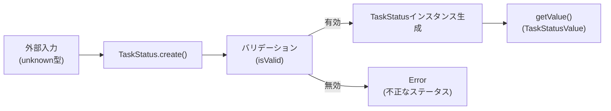

# TDD要件定義: TaskStatus値オブジェクト

## 📄 ドキュメント情報

- **作成日**: 2025-11-21
- **TASK-ID**: TASK-1307
- **要件名**: todo-app
- **機能名**: TaskStatus値オブジェクト
- **TDDフェーズ**: 要件定義
- **推定工数**: 8時間

## 1. 機能の概要（EARS要件定義書・設計文書ベース）

### 何をする機能か

🔵 **青信号**: EARS要件定義書・設計文書から確実

- タスクのステータス（未着手、進行中、レビュー中、完了）を表現する値オブジェクト
- DDD原則に従い、ステータスという概念をイミュータブルな値オブジェクトとしてカプセル化する
- 不正な値を受け付けず、型安全なステータス管理を実現する

**参照したEARS要件**:
- REQ-004: システムはタスクのステータス(未着手・進行中・レビュー中・完了)を変更できなければならない
- REQ-104: ユーザーがタスクを作成する場合、システムはデフォルトでステータスを「未着手」に設定しなければならない

**参照した設計文書**:
- [interfaces.ts](../../design/todo-app/interfaces.ts) - `TaskStatus`型定義（line 29-36）
- [architecture.md](../../design/todo-app/architecture.md) - Domain層の値オブジェクト（line 178）

### どのような問題を解決するか

🔵 **青信号**: EARS要件定義書から確実

- **型安全性**: 文字列リテラルによるタイポや不正な値の混入を防ぐ
- **ドメイン知識のカプセル化**: ステータスのバリデーションロジックを値オブジェクトに集約
- **イミュータビリティ**: ステータスの値が不正に変更されることを防ぐ
- **将来的な拡張性**: ユーザー定義ステータスへの拡張を考慮した設計

**参照したEARS要件**:
- NFR-303: ステータスはユーザーが自由にカスタマイズできる構造への拡張可能性を残す
- REQ-401: システムはDDD + クリーンアーキテクチャパターンを適用しなければならない

### 想定されるユーザー

🔵 **青信号**: EARS要件定義書から確実

- **直接利用者**: TaskEntityクラス（Domain層）
- **間接利用者**: Application層のユースケース（CreateTaskUseCase、UpdateTaskUseCase等）
- **最終利用者**: タスク管理を行うログイン済みユーザー

### システム内での位置づけ

🔵 **青信号**: 設計文書から確実

- **Domain層**: `app/server/src/domain/task/valueobjects/TaskStatus.ts`
- **役割**: TaskEntityの構成要素として、ステータスという概念をカプセル化
- **依存関係**: 外部に依存しない（Pure TypeScript）

**参照した設計文書**:
- [architecture.md](../../design/todo-app/architecture.md) - Domain層の構造（line 168-180）

## 2. 入力・出力の仕様（EARS機能要件・TypeScript型定義ベース）

### 入力パラメータ

🔵 **青信号**: 設計文書から確実

**ファクトリメソッド `create(value: unknown)`**:
- **型**: `unknown`（実行時にバリデーション）
- **範囲**: `'not_started' | 'in_progress' | 'in_review' | 'completed'`
- **制約**:
  - 文字列型であること
  - 許容値リストに含まれること
  - `null`、`undefined`、空文字列は不可

**参照したEARS要件**: REQ-004
**参照した設計文書**: [interfaces.ts line 29-36](../../design/todo-app/interfaces.ts)

### 出力値

🔵 **青信号**: 設計文書から確実

**`getValue()` メソッド**:
- **型**: `TaskStatusValue`（`'not_started' | 'in_progress' | 'in_review' | 'completed'`）
- **形式**: 文字列リテラル
- **例**:
  - `'not_started'` - 未着手
  - `'in_progress'` - 進行中
  - `'in_review'` - レビュー中
  - `'completed'` - 完了

**`equals(other: TaskStatus)` メソッド**:
- **型**: `boolean`
- **形式**: 真偽値
- **例**: `status1.equals(status2) // true or false`

**`isCompleted()` メソッド**:
- **型**: `boolean`
- **形式**: 真偽値
- **例**: `status.isCompleted() // true（完了状態の場合）`

**参照した設計文書**: [interfaces.ts line 29-36](../../design/todo-app/interfaces.ts)

### 入出力の関係性

🔵 **青信号**: TaskPriorityの実装パターンから確実

```typescript
// 正常系
const status = TaskStatus.create('in_progress');
status.getValue(); // 'in_progress'
status.isCompleted(); // false

// 異常系
TaskStatus.create('invalid'); // Error: 不正なステータスです: invalid
TaskStatus.create(null); // Error: 不正なステータスです: null
TaskStatus.create(''); // Error: 不正なステータスです:
```

### データフロー

🔵 **青信号**: 設計文書から確実



**参照した設計文書**: [dataflow.md](../../design/todo-app/dataflow.md)

## 3. 制約条件（EARS非機能要件・アーキテクチャ設計ベース）

### パフォーマンス要件

🟡 **黄信号**: 値オブジェクトの一般的な性質から推測

- 値オブジェクトの生成は高速であること（ナノ秒オーダー）
- メモリ効率的であること（immutableパターン）

### アーキテクチャ制約

🔵 **青信号**: 設計文書から確実

- **DDD原則の遵守**: 値オブジェクトとしてイミュータブルであること
- **単一責任の原則**: ステータスの表現とバリデーションのみに責務を限定
- **依存関係**: 外部ライブラリに依存しない（Pure TypeScript）

**参照したEARS要件**: REQ-401
**参照した設計文書**: [architecture.md line 168-180](../../design/todo-app/architecture.md)

### データベース制約

🔵 **青信号**: 要件定義書から確実

```sql
-- CHECK制約（データベース層）
CHECK (status IN ('not_started', 'in_progress', 'in_review', 'completed'))
```

**参照したEARS要件**: データベーススキーマ定義（line 150-186）

### イミュータビリティ制約

🔵 **青信号**: DDD原則から確実

- 値オブジェクトは生成後に値を変更できない
- `private readonly value` によってイミュータビリティを保証
- 等価性比較は値の一致で判定（概念的な同一性ではない）

## 4. 想定される使用例（EARSEdgeケース・データフローベース）

### 基本的な使用パターン

🔵 **青信号**: EARS要件定義書から確実

**正常系 - 未着手ステータスの生成**:
```typescript
const status = TaskStatus.create('not_started');
console.log(status.getValue()); // 'not_started'
console.log(status.isCompleted()); // false
```

**正常系 - 進行中ステータスの生成**:
```typescript
const status = TaskStatus.create('in_progress');
console.log(status.getValue()); // 'in_progress'
console.log(status.isCompleted()); // false
```

**正常系 - レビュー中ステータスの生成**:
```typescript
const status = TaskStatus.create('in_review');
console.log(status.getValue()); // 'in_review'
console.log(status.isCompleted()); // false
```

**正常系 - 完了ステータスの生成**:
```typescript
const status = TaskStatus.create('completed');
console.log(status.getValue()); // 'completed'
console.log(status.isCompleted()); // true
```

**正常系 - 等価性比較**:
```typescript
const status1 = TaskStatus.create('in_progress');
const status2 = TaskStatus.create('in_progress');
const status3 = TaskStatus.create('completed');

console.log(status1.equals(status2)); // true
console.log(status1.equals(status3)); // false
```

**参照したEARS要件**: REQ-004

### エッジケース

🟡 **黄信号**: バリデーション要件から推測

**異常系 - 不正なステータス値**:
```typescript
try {
  TaskStatus.create('invalid_status');
} catch (error) {
  console.error(error.message);
  // 'not正なステータスです: invalid_status (許容値: not_started, in_progress, in_review, completed)'
}
```

**異常系 - 空文字列**:
```typescript
try {
  TaskStatus.create('');
} catch (error) {
  console.error(error.message);
  // '不正なステータスです:  (許容値: not_started, in_progress, in_review, completed)'
}
```

**異常系 - null**:
```typescript
try {
  TaskStatus.create(null);
} catch (error) {
  console.error(error.message);
  // '不正なステータスです: null (許容値: not_started, in_progress, in_review, completed)'
}
```

**異常系 - undefined**:
```typescript
try {
  TaskStatus.create(undefined);
} catch (error) {
  console.error(error.message);
  // '不正なステータスです: undefined (許容値: not_started, in_progress, in_review, completed)'
}
```

**参照したEARS要件**: EDGE-001（類似のバリデーションエラー）

### エラーケース

🔵 **青信号**: EARS要件定義書から確実

```typescript
// TaskEntityでの使用例
class TaskEntity {
  private status: TaskStatus;

  public changeStatus(newStatus: string): void {
    try {
      this.status = TaskStatus.create(newStatus);
      this.touch(); // updatedAtを更新
    } catch (error) {
      throw new InvalidTaskDataError(error.message);
    }
  }
}
```

**参照したEARS要件**: REQ-004

## 5. EARS要件・設計文書との対応関係

### 参照したユーザストーリー

🔵 **青信号**

- **US-002**: タスクのステータス管理
  - 「私はタスクのステータスを管理したい。なぜなら進捗状況を可視化したいから。」

### 参照した機能要件

🔵 **青信号**

- **REQ-004**: システムはタスクのステータス(未着手・進行中・レビュー中・完了)を変更できなければならない
- **REQ-104**: ユーザーがタスクを作成する場合、システムはデフォルトでステータスを「未着手」に設定しなければならない
- **REQ-401**: システムはDDD + クリーンアーキテクチャパターンを適用しなければならない

### 参照した非機能要件

🔵 **青信号**

- **NFR-303**: ステータスはユーザーが自由にカスタマイズできる構造への拡張可能性を残す
- **NFR-304**: 各層の責務が明確に分離され、独立してテスト可能であること

### 参照したEdgeケース

🟡 **黄信号**: 類似のバリデーションエラーから推測

- **EDGE-001**: タイトルが空文字の場合、システムは「タイトルを入力してください」エラーを表示する（類似パターン）

### 参照した設計文書

🔵 **青信号**

- **アーキテクチャ**: [architecture.md line 168-180](../../design/todo-app/architecture.md) - Domain層の値オブジェクト
- **データフロー**: [dataflow.md](../../design/todo-app/dataflow.md) - タスク作成フロー
- **型定義**: [interfaces.ts line 29-36](../../design/todo-app/interfaces.ts) - `TaskStatus`型定義
- **データベース**: [要件定義書 line 136-188](../../spec/todo-app-requirements.md) - データベーススキーマ（tasksテーブル）

## 6. 実装パターン（TaskPriorityからの学習）

🔵 **青信号**: 既存実装から確実

TaskPriorityの実装パターンを参考に、以下の構造を踏襲する:

```typescript
/**
 * 許容されるステータス値の定数配列（Single Source of Truth）
 */
const TASK_STATUS_VALUES = [
  'not_started',
  'in_progress',
  'in_review',
  'completed'
] as const;

/**
 * タスクステータスの型定義
 */
export type TaskStatusValue = (typeof TASK_STATUS_VALUES)[number];

/**
 * TaskStatus 値オブジェクト
 */
export class TaskStatus {
  private readonly value: TaskStatusValue;

  private constructor(value: TaskStatusValue) {
    this.value = value;
  }

  public static create(value: unknown): TaskStatus {
    if (!TaskStatus.isValid(value)) {
      throw new Error(
        `不正なステータスです: ${value} (許容値: ${TASK_STATUS_VALUES.join(', ')})`
      );
    }
    return new TaskStatus(value);
  }

  public getValue(): TaskStatusValue {
    return this.value;
  }

  public equals(other: TaskStatus): boolean {
    return this.value === other.value;
  }

  public isCompleted(): boolean {
    return this.value === 'completed';
  }

  private static isValid(value: unknown): value is TaskStatusValue {
    return (
      typeof value === 'string' &&
      (TASK_STATUS_VALUES as readonly string[]).includes(value)
    );
  }
}
```

## 7. 品質判定

### 要件の明確さ

✅ **高品質**: 曖昧さなし

- ステータスの種類が明確（4種類）
- バリデーションルールが明確
- エラーメッセージのフォーマットが明確

### 入出力定義

✅ **高品質**: 完全

- 入力: `unknown`型（実行時バリデーション）
- 出力: `TaskStatusValue`型（型安全）
- エラー: `Error`（不正な値の場合）

### 制約条件

✅ **高品質**: 明確

- イミュータビリティ制約が明確
- DDD原則の遵守が明確
- データベースCHECK制約との整合性が明確

### 実装可能性

✅ **高品質**: 確実

- TaskPriorityの実装パターンを踏襲可能
- 既存のアーキテクチャと整合性あり
- テスト戦略が明確

## 8. 次のステップ

次のお勧めステップ: `/tsumiki:tdd-testcases` でテストケースの洗い出しを行います。

---

**作成者**: Claude Code (TDD requirements agent)
**レビュー**: 未実施
**承認**: 未実施
