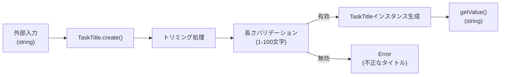

# TDD要件定義: TaskTitle値オブジェクト

## 📄 ドキュメント情報

- **作成日**: 2025-11-21
- **TASK-ID**: TASK-1308
- **要件名**: todo-app
- **機能名**: TaskTitle値オブジェクト
- **TDDフェーズ**: 要件定義
- **推定工数**: 8時間

## 1. 機能の概要（EARS要件定義書・設計文書ベース）

### 何をする機能か

🔵 **青信号**: EARS要件定義書・設計文書から確実

- タスクのタイトル（1-100文字）を表現する値オブジェクト
- DDD原則に従い、タイトルという概念をイミュータブルな値オブジェクトとしてカプセル化する
- 不正な値（空文字列、空白のみ、101文字以上）を受け付けず、型安全なタイトル管理を実現する

**参照したEARS要件**:
- REQ-001: システムはログイン済みユーザーがタスクを作成できなければならない
- REQ-102: ユーザーが新規タスクを追加する場合、システムはタイトルの入力を必須としなければならない
- EDGE-001: タイトルが空文字の場合、システムは「タイトルを入力してください」エラーを表示する
- EDGE-002: タイトルが100文字を超える場合、システムは「タイトルは100文字以内で入力してください」エラーを表示する

**参照した設計文書**:
- [interfaces.ts](../../design/todo-app/interfaces.ts) - `TaskEntity`型定義（line 42-50）
- [architecture.md](../../design/todo-app/architecture.md) - Domain層の値オブジェクト（line 178）

### どのような問題を解決するか

🔵 **青信号**: EARS要件定義書から確実

- **型安全性**: 文字列リテラルによる不正な値の混入を防ぐ
- **ドメイン知識のカプセル化**: タイトルのバリデーションロジックを値オブジェクトに集約
- **イミュータビリティ**: タイトルの値が不正に変更されることを防ぐ
- **空白処理の一貫性**: タイトルのトリミング処理を値オブジェクト内で統一

**参照したEARS要件**:
- REQ-102: タイトルの入力必須
- REQ-401: システムはDDD + クリーンアーキテクチャパターンを適用しなければならない

### 想定されるユーザー

🔵 **青信号**: EARS要件定義書から確実

- **直接利用者**: TaskEntityクラス（Domain層）
- **間接利用者**: Application層のユースケース（CreateTaskUseCase、UpdateTaskUseCase等）
- **最終利用者**: タスク管理を行うログイン済みユーザー

### システム内での位置づけ

🔵 **青信号**: 設計文書から確実

- **Domain層**: `app/server/src/domain/task/valueobjects/TaskTitle.ts`
- **役割**: TaskEntityの構成要素として、タイトルという概念をカプセル化
- **依存関係**: 外部に依存しない（Pure TypeScript）

**参照した設計文書**:
- [architecture.md](../../design/todo-app/architecture.md) - Domain層の構造（line 168-180）

## 2. 入力・出力の仕様（EARS機能要件・TypeScript型定義ベース）

### 入力パラメータ

🔵 **青信号**: 設計文書から確実

**ファクトリメソッド `create(value: string)`**:
- **型**: `string`
- **範囲**: 1-100文字（トリミング後）
- **制約**:
  - 文字列型であること
  - トリミング後の長さが1文字以上であること
  - トリミング後の長さが100文字以内であること
  - `null`、`undefined`は不可

**参照したEARS要件**:
- REQ-001
- REQ-102
- EDGE-001
- EDGE-002

**参照した設計文書**: [interfaces.ts line 42-50](../../design/todo-app/interfaces.ts)

### 出力値

🔵 **青信号**: 設計文書から確実

**`getValue()` メソッド**:
- **型**: `string`
- **形式**: トリミング済みの文字列（1-100文字）
- **例**:
  - `'タスクのタイトル'` - 通常のタイトル
  - `'a'` - 1文字のタイトル（最小長）
  - `'a'.repeat(100)` - 100文字のタイトル（最大長）

**`equals(other: TaskTitle)` メソッド**:
- **型**: `boolean`
- **形式**: 真偽値
- **例**: `title1.equals(title2) // true or false`

**参照した設計文書**: [interfaces.ts line 42-50](../../design/todo-app/interfaces.ts)

### 入出力の関係性

🔵 **青信号**: TaskPriorityの実装パターンから確実

```typescript
// 正常系
const title = TaskTitle.create('  タスクのタイトル  ');
title.getValue(); // 'タスクのタイトル'（トリミング済み）

// 正常系 - 最小長
const minTitle = TaskTitle.create('a');
minTitle.getValue(); // 'a'

// 正常系 - 最大長
const maxTitle = TaskTitle.create('a'.repeat(100));
maxTitle.getValue(); // 'aaa...aaa' (100文字)

// 異常系 - 空文字列
TaskTitle.create(''); // Error: タイトルを入力してください

// 異常系 - 空白のみ
TaskTitle.create('   '); // Error: タイトルを入力してください

// 異常系 - 101文字以上
TaskTitle.create('a'.repeat(101)); // Error: タイトルは100文字以内で入力してください

// 異常系 - null
TaskTitle.create(null); // Error: タイトルを入力してください
```

### データフロー

🔵 **青信号**: 設計文書から確実



**参照した設計文書**: [dataflow.md](../../design/todo-app/dataflow.md)

## 3. 制約条件（EARS非機能要件・アーキテクチャ設計ベース）

### ビジネスルール制約

🔵 **青信号**: EARS要件定義書から確実

- **最小長**: 1文字（トリミング後）
- **最大長**: 100文字（トリミング後）
- **トリミング**: 前後の空白は自動削除
- **空値禁止**: 空文字列、空白のみ、`null`、`undefined`は不正値

**参照したEARS要件**:
- EDGE-001: 空文字列エラー
- EDGE-002: 100文字超過エラー

### アーキテクチャ制約

🔵 **青信号**: 設計文書から確実

- **DDD原則の遵守**: 値オブジェクトとしてイミュータブルであること
- **単一責任の原則**: タイトルの表現とバリデーションのみに責務を限定
- **依存関係**: 外部ライブラリに依存しない（Pure TypeScript）

**参照したEARS要件**: REQ-401
**参照した設計文書**: [architecture.md line 168-180](../../design/todo-app/architecture.md)

### データベース制約

🔵 **青信号**: 要件定義書から確実

```sql
-- CHECK制約（データベース層）
title VARCHAR(100) NOT NULL,
CHECK (length(trim(title)) > 0)
```

**参照したEARS要件**: データベーススキーマ定義（line 145-147）

### イミュータビリティ制約

🔵 **青信号**: DDD原則から確実

- 値オブジェクトは生成後に値を変更できない
- `private readonly value` によってイミュータビリティを保証
- 等価性比較は値の一致で判定（概念的な同一性ではない）

### パフォーマンス要件

🟡 **黄信号**: 値オブジェクトの一般的な性質から推測

- 値オブジェクトの生成は高速であること（ナノ秒オーダー）
- トリミング処理は効率的であること（O(n)）
- メモリ効率的であること（immutableパターン）

## 4. 想定される使用例（EARSEdgeケース・データフローベース）

### 基本的な使用パターン

🔵 **青信号**: EARS要件定義書から確実

**正常系 - 通常のタイトル**:
```typescript
const title = TaskTitle.create('タスクのタイトル');
console.log(title.getValue()); // 'タスクのタイトル'
```

**正常系 - 前後の空白を含むタイトル**:
```typescript
const title = TaskTitle.create('  タスクのタイトル  ');
console.log(title.getValue()); // 'タスクのタイトル'（トリミング済み）
```

**正常系 - 最小長（1文字）**:
```typescript
const title = TaskTitle.create('a');
console.log(title.getValue()); // 'a'
```

**正常系 - 最大長（100文字）**:
```typescript
const title = TaskTitle.create('a'.repeat(100));
console.log(title.getValue()); // 'aaa...aaa' (100文字)
```

**正常系 - 等価性比較**:
```typescript
const title1 = TaskTitle.create('タスクA');
const title2 = TaskTitle.create('タスクA');
const title3 = TaskTitle.create('タスクB');

console.log(title1.equals(title2)); // true
console.log(title1.equals(title3)); // false
```

**参照したEARS要件**: REQ-001

### エッジケース

🔵 **青信号**: EARS要件定義書から確実

**異常系 - 空文字列**:
```typescript
try {
  TaskTitle.create('');
} catch (error) {
  console.error(error.message);
  // 'タイトルを入力してください'
}
```

**異常系 - 空白のみ（スペース）**:
```typescript
try {
  TaskTitle.create('   ');
} catch (error) {
  console.error(error.message);
  // 'タイトルを入力してください'
}
```

**異常系 - 空白のみ（タブ）**:
```typescript
try {
  TaskTitle.create('\t\t\t');
} catch (error) {
  console.error(error.message);
  // 'タイトルを入力してください'
}
```

**異常系 - 101文字以上**:
```typescript
try {
  TaskTitle.create('a'.repeat(101));
} catch (error) {
  console.error(error.message);
  // 'タイトルは100文字以内で入力してください'
}
```

**異常系 - null**:
```typescript
try {
  TaskTitle.create(null as any);
} catch (error) {
  console.error(error.message);
  // 'タイトルを入力してください'
}
```

**異常系 - undefined**:
```typescript
try {
  TaskTitle.create(undefined as any);
} catch (error) {
  console.error(error.message);
  // 'タイトルを入力してください'
}
```

**参照したEARS要件**:
- EDGE-001: 空文字列エラー
- EDGE-002: 100文字超過エラー

### エラーケース

🔵 **青信号**: EARS要件定義書から確実

```typescript
// TaskEntityでの使用例
class TaskEntity {
  private title: TaskTitle;

  public updateTitle(newTitle: string): void {
    try {
      this.title = TaskTitle.create(newTitle);
      this.touch(); // updatedAtを更新
    } catch (error) {
      throw new InvalidTaskDataError(error.message);
    }
  }
}
```

**参照したEARS要件**: REQ-002

## 5. EARS要件・設計文書との対応関係

### 参照したユーザストーリー

🔵 **青信号**

- **US-001**: タスクの作成
  - 「私はタスクを作成したい。なぜなら業務を整理したいから。」

### 参照した機能要件

🔵 **青信号**

- **REQ-001**: システムはログイン済みユーザーがタスクを作成できなければならない
- **REQ-102**: ユーザーが新規タスクを追加する場合、システムはタイトルの入力を必須としなければならない
- **REQ-401**: システムはDDD + クリーンアーキテクチャパターンを適用しなければならない

### 参照したEdgeケース

🔵 **青信号**

- **EDGE-001**: タイトルが空文字の場合、システムは「タイトルを入力してください」エラーを表示する
- **EDGE-002**: タイトルが100文字を超える場合、システムは「タイトルは100文字以内で入力してください」エラーを表示する

### 参照した非機能要件

🔵 **青信号**

- **NFR-304**: 各層の責務が明確に分離され、独立してテスト可能であること

### 参照した設計文書

🔵 **青信号**

- **アーキテクチャ**: [architecture.md line 168-180](../../design/todo-app/architecture.md) - Domain層の値オブジェクト
- **データフロー**: [dataflow.md](../../design/todo-app/dataflow.md) - タスク作成フロー
- **型定義**: [interfaces.ts line 42-50](../../design/todo-app/interfaces.ts) - `TaskEntity`型定義
- **データベース**: [要件定義書 line 136-188](../../spec/todo-app-requirements.md) - データベーススキーマ（tasksテーブル）

## 6. 実装パターン（TaskPriorityからの学習）

🔵 **青信号**: 既存実装から確実

TaskPriorityの実装パターンを参考に、以下の構造を踏襲する:

```typescript
/**
 * タイトルの長さ制約定数
 */
const TASK_TITLE_CONSTRAINTS = {
  MIN_LENGTH: 1,
  MAX_LENGTH: 100,
} as const;

/**
 * TaskTitle 値オブジェクト
 */
export class TaskTitle {
  private readonly value: string;

  private constructor(value: string) {
    this.value = value;
  }

  public static create(value: string): TaskTitle {
    // null/undefinedチェック
    const trimmed = value?.trim() ?? '';

    // 最小長チェック
    if (trimmed.length < TASK_TITLE_CONSTRAINTS.MIN_LENGTH) {
      throw new Error('タイトルを入力してください');
    }

    // 最大長チェック
    if (trimmed.length > TASK_TITLE_CONSTRAINTS.MAX_LENGTH) {
      throw new Error('タイトルは100文字以内で入力してください');
    }

    return new TaskTitle(trimmed);
  }

  public getValue(): string {
    return this.value;
  }

  public equals(other: TaskTitle): boolean {
    return this.value === other.value;
  }
}
```

### 実装上の注意点

🔵 **青信号**: TaskPriorityの実装パターンから確実

1. **トリミング処理**: `value?.trim() ?? ''` で null/undefined 安全に処理
2. **エラーメッセージ**: EARS要件定義書に従った日本語メッセージ
3. **定数管理**: 制約値を定数として定義（Single Source of Truth）
4. **イミュータビリティ**: `readonly` プロパティと `private` コンストラクタ

## 7. 品質判定

### 要件の明確さ

✅ **高品質**: 曖昧さなし

- タイトルの長さ制約が明確（1-100文字）
- バリデーションルールが明確（トリミング、長さチェック）
- エラーメッセージが明確（EARS要件定義書に基づく）

### 入出力定義

✅ **高品質**: 完全

- 入力: `string`型（トリミング処理あり）
- 出力: `string`型（1-100文字、トリミング済み）
- エラー: `Error`（不正な値の場合）

### 制約条件

✅ **高品質**: 明確

- イミュータビリティ制約が明確
- DDD原則の遵守が明確
- データベースCHECK制約との整合性が明確

### 実装可能性

✅ **高品質**: 確実

- TaskPriorityの実装パターンを踏襲可能
- 既存のアーキテクチャと整合性あり
- テスト戦略が明確

## 8. 次のステップ

次のお勧めステップ: `/tsumiki:tdd-testcases` でテストケースの洗い出しを行います。

---

**作成者**: Claude Code (TDD requirements agent)
**レビュー**: 未実施
**承認**: 未実施
