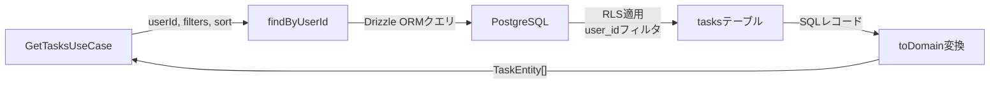
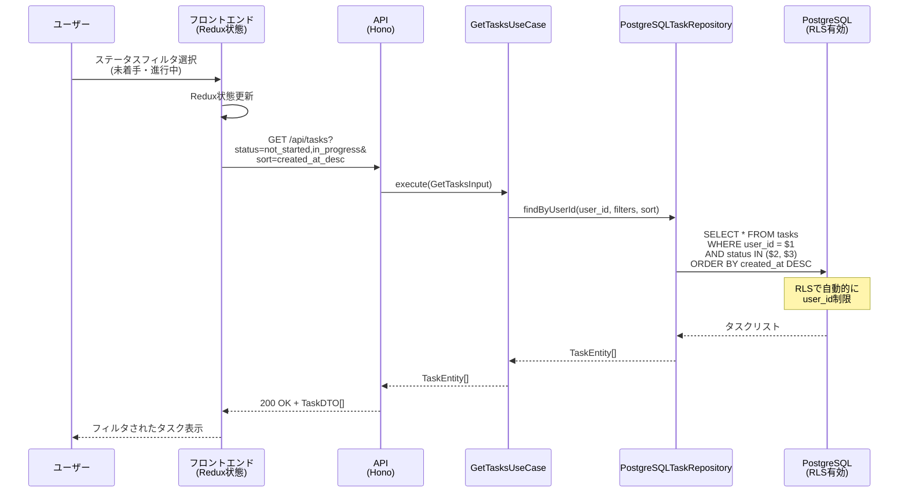

# TDD要件定義書: PostgreSQLTaskRepository フィルタ・ソート実装

## 📄 ドキュメント情報

- **作成日**: 2025-11-27
- **要件名**: todo-app
- **タスクID**: TASK-1319
- **機能名**: PostgreSQLTaskRepository実装（フィルタ・ソート）
- **依存タスク**: TASK-1318（基本CRUD実装）
- **推定工数**: 8時間

## 1. 機能の概要（EARS要件定義書・設計文書ベース）

### 何をする機能か

🔵 **ユーザーストーリーから抽出**（要件定義書 REQ-201, REQ-202, REQ-203）

ログインユーザーが自分のタスク一覧を取得する際、**優先度フィルタ**、**ステータスフィルタ（複数選択可能）**、**ソート順序**を指定できる機能を提供します。

PostgreSQLTaskRepositoryクラスの`findByUserId`メソッドを実装し、Drizzle ORMを使用してフィルタとソート条件をSQLクエリに変換します。

### どのような問題を解決するか

🔵 **要件定義書から抽出**（REQ-006, REQ-201, REQ-202, REQ-203）

- **問題**: ユーザーが大量のタスクから特定の条件（優先度やステータス）に合致するタスクを見つけられない
- **解決**: フィルタ・ソート機能により、ユーザーは必要なタスクを素早く見つけ、整理された状態で表示できる
- **価値**: タスク管理の効率化、作業の優先順位付けが容易になる

### 想定されるユーザー

🔵 **ユーザーストーリーから抽出**

- **As a**: TODOリストアプリのログイン済みユーザー
- **I want to**: タスク一覧を優先度やステータスでフィルタし、作成日時や優先度でソートしたい
- **So that**: 重要なタスクや進行中のタスクに集中でき、効率的に作業を進められる

### システム内での位置づけ

🔵 **アーキテクチャ設計から抽出**（architecture.md, dataflow.md）

- **レイヤ**: Infrastructure層（インフラ層）
- **役割**: Domain層のITaskRepositoryインターフェースを実装し、データベースアクセスを担当
- **依存関係**:
  - **呼び出し元**: Application層のGetTasksUseCase
  - **依存先**: Drizzle ORM、PostgreSQL Database
  - **連携**: Row-Level Security (RLS)によるユーザー分離

**参照したEARS要件**: REQ-201, REQ-202, REQ-203
**参照した設計文書**: architecture.md（レイヤ構成）, dataflow.md（タスク一覧取得フロー）

---

## 2. 入力・出力の仕様（EARS機能要件・TypeScript型定義ベース）

### 入力パラメータ

🔵 **interfaces.tsから抽出**（ITaskRepository.ts:51-55）

#### `findByUserId` メソッドシグネチャ

```typescript
findByUserId(
  userId: string,
  filters: TaskFilters,
  sort: TaskSortBy,
): Promise<TaskEntity[]>
```

#### パラメータ詳細

| パラメータ | 型 | 必須 | 説明 | 制約 |
|-----------|---|------|------|------|
| `userId` | string | Yes | ユーザーID（UUID v4形式） | RLSによりこのユーザーのタスクのみ取得 |
| `filters` | TaskFilters | Yes | フィルタ条件 | 以下参照 |
| `sort` | TaskSortBy | Yes | ソート順序 | 以下参照 |

#### TaskFilters インターフェース

🔵 **ITaskRepository.ts:6-11から抽出**

```typescript
export interface TaskFilters {
  /** 優先度フィルタ */
  priority?: string;
  /** ステータスフィルタ（複数選択可能） */
  status?: string[];
}
```

| フィールド | 型 | 必須 | 説明 | 制約 |
|-----------|---|------|------|------|
| `priority` | string \| undefined | No | 優先度フィルタ | "high", "medium", "low" のいずれか |
| `status` | string[] \| undefined | No | ステータスフィルタ（複数選択） | "not_started", "in_progress", "in_review", "completed" の配列 |

#### TaskSortBy ユニオン型

🔵 **ITaskRepository.ts:16-19から抽出**

```typescript
export type TaskSortBy =
  | 'created_at_desc' // 作成日時（新しい順）
  | 'created_at_asc'  // 作成日時（古い順）
  | 'priority_desc';  // 優先度（高→低）
```

| 値 | 説明 | SQLソート順 |
|----|------|-------------|
| `created_at_desc` | 作成日時（新しい順） | ORDER BY created_at DESC |
| `created_at_asc` | 作成日時（古い順） | ORDER BY created_at ASC |
| `priority_desc` | 優先度（高→低） | CASE式で"high"=1, "medium"=2, "low"=3に変換してASC |

### 出力値

🔵 **ITaskRepository.ts、PostgreSQLTaskRepository.ts:86-97から抽出**

#### 戻り値

```typescript
Promise<TaskEntity[]>
```

- **型**: TaskEntityオブジェクトの配列
- **形式**: ドメインエンティティの配列（永続化層からドメイン層への変換済み）
- **例**:
  ```typescript
  [
    TaskEntity {
      id: "550e8400-e29b-41d4-a716-446655440000",
      userId: "123e4567-e89b-12d3-a456-426614174000",
      title: TaskTitle("重要な会議の資料作成"),
      description: "## チェックリスト\n- [ ] 資料の構成を考える",
      priority: TaskPriority("high"),
      status: TaskStatus("not_started"),
      createdAt: new Date("2025-11-06T10:00:00.000Z"),
      updatedAt: new Date("2025-11-06T10:00:00.000Z")
    },
    // ...
  ]
  ```

### 入出力の関係性

🔵 **dataflow.md、architecture.mdから抽出**



### データフロー

🔵 **dataflow.md:52-67から抽出**

1. **ユーザー**: ステータスフィルタ選択（未着手・進行中）
2. **フロントエンド**: Redux状態更新
3. **API呼び出し**: `GET /api/tasks?status=not_started,in_progress&sort=created_at_desc`
4. **GetTasksUseCase**: `findByUserId(userId, filters, sort)` を呼び出し
5. **PostgreSQLTaskRepository**: Drizzle ORMでSQLクエリ構築
6. **PostgreSQL**: RLSで自動的にuser_idフィルタ適用
7. **レスポンス**: フィルタ・ソート済みTaskEntity[]を返却

**参照したEARS要件**: REQ-201, REQ-202, REQ-203
**参照した設計文書**:
- **型定義**: ITaskRepository.ts（インターフェース定義）
- **データフロー**: dataflow.md（タスク一覧取得フロー）

---

## 3. 制約条件（EARS非機能要件・アーキテクチャ設計ベース）

### パフォーマンス要件

🔵 **要件定義書 NFR-001から抽出**

- **レスポンス時間**: タスク一覧取得APIは1秒以内にレスポンスを返さなければならない
- **クエリ最適化**:
  - インデックスの活用（idx_tasks_priority, idx_tasks_status, idx_tasks_created_at）
  - Drizzle ORMのパラメータ化クエリによるSQLインジェクション対策
  - RLSによる自動user_idフィルタ

🔵 **architecture.md:373-387から抽出**

- **インデックス戦略**:
  - `idx_tasks_user_id`: ユーザーごとのタスク取得（最頻）
  - `idx_tasks_created_at`: 作成日時ソート
  - `idx_tasks_priority`: 優先度フィルタ
  - `idx_tasks_status`: ステータスフィルタ

### セキュリティ要件

🔵 **要件定義書 REQ-403, NFR-102から抽出**

- **Row-Level Security (RLS)**:
  - `SET LOCAL app.current_user_id = '{userId}'` による自動user_idフィルタ
  - 他ユーザーのタスクへのアクセスを完全にブロック
  - アプリケーション層のバグによるデータ漏洩を防止

🔵 **api-endpoints.md:582-589から抽出**

```sql
-- RLSポリシー（既存）
CREATE POLICY "Users can only access their own tasks"
ON app_test.tasks
FOR ALL
USING (user_id = current_setting('app.current_user_id')::uuid);
```

### アーキテクチャ制約

🔵 **要件定義書 REQ-401, REQ-404, REQ-407から抽出**

- **DDD + クリーンアーキテクチャ**:
  - Infrastructure層でITaskRepositoryインターフェースを実装
  - Domain層への依存を避け、Domain層に定義されたインターフェースを実装
  - 永続化層（Drizzle ORM）からドメイン層（TaskEntity）への変換は`toDomain`メソッドで実施

🔵 **CLAUDE.md、要件定義書 REQ-404から抽出**

- **Drizzle ORM使用**:
  - 型安全なクエリビルダー
  - PostgreSQL最適化
  - パラメータ化クエリによるSQLインジェクション対策

### データベース制約

🔵 **schema.ts（database-schema.sql相当）、要件定義書から抽出**

- **CHECK制約**（既存）:
  ```sql
  CHECK (priority IN ('high', 'medium', 'low'))
  CHECK (status IN ('not_started', 'in_progress', 'in_review', 'completed'))
  ```
- **NOT NULL制約**: userId, title, priority, status, createdAt, updatedAt
- **外部キー制約**: userId → users.id (ON DELETE CASCADE)

### API制約

🔵 **api-endpoints.md:96-134から抽出**

- **クエリパラメータ形式**:
  - `priority`: 単一値（"high", "medium", "low"）
  - `status`: カンマ区切り複数値（"not_started,in_progress"）
  - `sort`: 単一値（"created_at_desc", "created_at_asc", "priority_desc"）

**参照したEARS要件**: NFR-001, NFR-102, REQ-403, REQ-401, REQ-404, REQ-407
**参照した設計文書**:
- **アーキテクチャ**: architecture.md（レイヤ構成、インデックス戦略）
- **データベース**: schema.ts（テーブル定義、インデックス）
- **API仕様**: api-endpoints.md（クエリパラメータ仕様、RLS）

---

## 4. 想定される使用例（EARSEdgeケース・データフローベース）

### 基本的な使用パターン

🔵 **要件定義書 REQ-201, REQ-202, REQ-203から抽出**

#### 使用例1: 優先度フィルタ（高）のみ

```typescript
const tasks = await repository.findByUserId(
  'user-uuid',
  { priority: 'high' },
  'created_at_desc'
);
// 結果: 優先度が"high"のタスクのみ、作成日時（新しい順）でソート
```

#### 使用例2: ステータスフィルタ（未着手・進行中）

```typescript
const tasks = await repository.findByUserId(
  'user-uuid',
  { status: ['not_started', 'in_progress'] },
  'created_at_desc'
);
// 結果: ステータスが"not_started"または"in_progress"のタスク、作成日時（新しい順）でソート
```

#### 使用例3: 優先度とステータスの複合フィルタ

```typescript
const tasks = await repository.findByUserId(
  'user-uuid',
  {
    priority: 'high',
    status: ['not_started', 'in_progress']
  },
  'priority_desc'
);
// 結果: 優先度"high"かつステータス"not_started"または"in_progress"のタスク、優先度順でソート
```

#### 使用例4: フィルタなし、ソートのみ

```typescript
const tasks = await repository.findByUserId(
  'user-uuid',
  {},
  'created_at_asc'
);
// 結果: 全タスク、作成日時（古い順）でソート
```

### データフロー

🔵 **dataflow.md:52-67から抽出**



### エッジケース

🔵 **要件定義書 EDGE-101から抽出**

#### エッジケース1: タスク数が0件の場合

```typescript
const tasks = await repository.findByUserId(
  'user-uuid',
  { status: ['completed'] },
  'created_at_desc'
);
// 結果: 空配列 []
// フロントエンド: "タスクがありません"メッセージを表示
```

#### エッジケース2: フィルタ条件に一致するタスクがない場合

```typescript
const tasks = await repository.findByUserId(
  'user-uuid',
  { priority: 'high', status: ['completed'] },
  'created_at_desc'
);
// 結果: 空配列 []
```

🔴 **Drizzle ORM動作の推測**

#### エッジケース3: status配列が空の場合

```typescript
const tasks = await repository.findByUserId(
  'user-uuid',
  { status: [] },
  'created_at_desc'
);
// 期待動作: 全タスクを返す（status条件を無視）
// 実装で明示的に処理が必要
```

### エラーケース

🟡 **一般的なORM動作から推測**

#### エラーケース1: データベース接続エラー

```typescript
// PostgreSQL接続エラー時
await repository.findByUserId('user-uuid', {}, 'created_at_desc');
// 例外: Database connection error
```

#### エラーケース2: RLS設定ミス

```typescript
// RLS設定が不正な場合（app.current_user_idが未設定）
await repository.findByUserId('user-uuid', {}, 'created_at_desc');
// 結果: 空配列 []（RLSポリシーにより全タスクがフィルタされる）
```

**参照したEARS要件**: REQ-201, REQ-202, REQ-203, EDGE-101
**参照した設計文書**:
- **データフロー**: dataflow.md（タスク一覧取得フロー）

---

## 5. EARS要件・設計文書との対応関係

### 参照したユーザストーリー

🔵 **要件定義書から抽出**

- **As a** TODOリストアプリのログイン済みユーザー
- **I want to** タスク一覧を優先度やステータスでフィルタし、作成日時や優先度でソートしたい
- **So that** 重要なタスクや進行中のタスクに集中でき、効率的に作業を進められる

### 参照した機能要件

🔵 **要件定義書から抽出**

- **REQ-006**: システムはタスク一覧を表示しなければならない
- **REQ-201**: 優先度フィルタが適用されている場合、システムは選択された優先度のタスクのみを表示しなければならない
- **REQ-202**: ステータスフィルタが適用されている場合、システムは選択されたステータス（複数選択可能）のタスクのみを表示しなければならない
- **REQ-203**: ソート順が指定されている場合、システムは指定された順序でタスクを並べ替えなければならない

### 参照した非機能要件

🔵 **要件定義書から抽出**

- **NFR-001**: タスク一覧取得APIは1秒以内にレスポンスを返さなければならない
- **NFR-002**: タスク作成APIは500ms以内にレスポンスを返さなければならない
- **NFR-102**: ユーザーは自分自身のタスクのみアクセス可能でなければならない（RLS）
- **NFR-103**: タスク操作APIはすべてJWT認証を必須とする
- **NFR-104**: タスクの入力値はサーバーサイドでZodバリデーションを実施しなければならない

### 参照したEdgeケース

🔵 **要件定義書から抽出**

- **EDGE-101**: タスク数が0件の場合、システムは「タスクがありません」メッセージを表示する
- **EDGE-003**: 存在しないタスクを更新・削除しようとした場合、システムは404エラーを返す
- **EDGE-004**: 他ユーザーのタスクにアクセスしようとした場合、システムは403エラーを返す

### 参照した受け入れ基準

🔵 **TASK-1319（todo-app-phase4.md:218-223）から抽出**

- テストケース: 正常系: 優先度フィルタ
- テストケース: 正常系: ステータスフィルタ（複数）
- テストケース: 正常系: 作成日時ソート
- テストケース: 正常系: 優先度ソート

### 参照した設計文書

#### アーキテクチャ

🔵 **architecture.md から抽出**

- **レイヤ構成**: Infrastructure層（PostgreSQLTaskRepository）
- **依存関係**: Domain層（ITaskRepository）→ Infrastructure層（実装）
- **インデックス戦略**: idx_tasks_user_id, idx_tasks_created_at, idx_tasks_priority, idx_tasks_status
- **RLS設定**: `SET LOCAL app.current_user_id = '{userId}'`

#### データフロー

🔵 **dataflow.md から抽出**

- **タスク一覧取得フロー**: ユーザー → フロントエンド → API → UseCase → Repository → PostgreSQL
- **セキュリティフロー**: JWT検証 → user_id抽出 → RLS設定 → クエリ実行

#### 型定義

🔵 **ITaskRepository.ts から抽出**

- **TaskFilters**: priority?: string, status?: string[]
- **TaskSortBy**: 'created_at_desc' | 'created_at_asc' | 'priority_desc'
- **findByUserId**: (userId: string, filters: TaskFilters, sort: TaskSortBy) => Promise&lt;TaskEntity[]&gt;

#### データベース

🔵 **schema.ts から抽出**

- **tasksテーブル**: id, userId, title, description, priority, status, createdAt, updatedAt
- **インデックス**: idx_tasks_user_id, idx_tasks_created_at, idx_tasks_priority, idx_tasks_status
- **CHECK制約**: priority IN ('high', 'medium', 'low'), status IN ('not_started', 'in_progress', 'in_review', 'completed')

#### API仕様

🔵 **api-endpoints.md:96-192 から抽出**

- **エンドポイント**: GET /api/tasks
- **クエリパラメータ**: priority, status（カンマ区切り）, sort
- **レスポンス**: 200 OK + TaskDTO[]

---

## 📝 実装メモ

### 既存実装状況

✅ **完了**:
- PostgreSQLTaskRepositoryクラス（基本CRUD）
- ITaskRepositoryインターフェース定義（フィルタ・ソート含む）
- TaskFilters、TaskSortBy型定義
- データベーススキーマ（tasksテーブル、インデックス）

❌ **未実装**（TASK-1319で実装）:
- `findByUserId`メソッドの本体実装
- Drizzle ORMでのフィルタ条件の構築
- Drizzle ORMでのソート条件の構築

### 実装方針

🔵 **todo-app-phase4.md:186-216 から抽出**

```typescript
async findByUserId(userId: string, filters: TaskFilters, sort: TaskSortBy): Promise<TaskEntity[]> {
  let query = this.db.select().from(tasks).where(eq(tasks.userId, userId));

  // フィルタ適用
  if (filters.priority) {
    query = query.where(eq(tasks.priority, filters.priority));
  }
  if (filters.status && filters.status.length > 0) {
    query = query.where(inArray(tasks.status, filters.status));
  }

  // ソート適用
  switch (sort) {
    case 'created_at_desc':
      query = query.orderBy(desc(tasks.createdAt));
      break;
    case 'created_at_asc':
      query = query.orderBy(asc(tasks.createdAt));
      break;
    case 'priority_desc':
      query = query.orderBy(
        sql`CASE ${tasks.priority} WHEN 'high' THEN 1 WHEN 'medium' THEN 2 WHEN 'low' THEN 3 END`,
        desc(tasks.createdAt)
      );
      break;
  }

  const results = await query;
  return results.map(row => this.toDomain(row));
}
```

### 注意事項

🔵 **CLAUDE.md、要件定義書から抽出**

1. **Drizzle ORMのインポート**: `asc`, `desc`, `inArray`, `sql` をDrizzle ORMからインポート
2. **RLS前提**: userIdフィルタは必須（RLSポリシーと二重チェック）
3. **空配列対応**: `status`が空配列の場合は条件を無視
4. **優先度ソートの二次ソート**: 優先度が同じ場合はcreatedAt descで二次ソート
5. **toDomain変換**: 永続化層（Drizzle ORM）からドメイン層（TaskEntity）への変換は既存の`toDomain`メソッドを使用

---

## ✅ 品質判定

### 要件の明確性

🔵 **高品質**: 要件が明確で曖昧さがない

- EARS要件定義書（REQ-201, REQ-202, REQ-203）に明確に記載
- ITaskRepositoryインターフェースで型定義済み
- 設計文書（architecture.md, dataflow.md, api-endpoints.md）で詳細が確認済み

### 入出力仕様の具体性

🔵 **高品質**: 入出力定義が完全

- 入力: userId（string）, filters（TaskFilters）, sort（TaskSortBy）
- 出力: Promise&lt;TaskEntity[]&gt;
- すべてTypeScriptで型定義済み

### 制約条件の明確性

🔵 **高品質**: 制約条件が明確

- パフォーマンス: 1秒以内（NFR-001）
- セキュリティ: RLS、JWT認証（REQ-403, NFR-102, NFR-103）
- アーキテクチャ: DDD + クリーンアーキテクチャ（REQ-401, REQ-407）
- データベース: CHECK制約、インデックス

### 実装可能性

🔵 **高品質**: 実装可能性が確実

- Drizzle ORMの機能（where, inArray, orderBy, sql）で実装可能
- 既存の基本CRUD実装（TASK-1318）が参考になる
- テストケースが明確（TASK-1319受け入れ基準）

---

## 🎯 次のステップ

次のお勧めステップ: `/tsumiki:tdd-testcases` でテストケースの洗い出しを行います。
