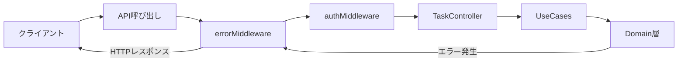
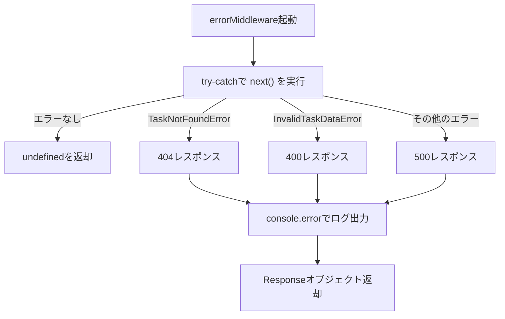

# errorMiddleware実装 - TDD要件定義書

## 📄 ドキュメント情報

- **作成日**: 2025-11-30
- **タスクID**: TASK-1323
- **要件名**: todo-app
- **機能名**: errorMiddleware
- **関連文書**:
  - [タスク定義](../../../tasks/todo-app-phase5.md)
  - [アーキテクチャ設計](../../../design/todo-app/architecture.md)
  - [API仕様](../../../design/todo-app/api-endpoints.md)

---

## 1. 機能の概要

🔵 **青信号**: タスク定義書、アーキテクチャ設計から抽出

### 何をする機能か

HonoフレームワークのミドルウェアとしてHTTPリクエスト処理中に発生したエラーを適切なHTTPステータスコードとJSONレスポンスに変換し、クライアントに返却する。

### 解決する問題

- **問題1**: ドメイン層で発生した業務エラー（TaskNotFoundError、InvalidTaskDataError等）をHTTPステータスコードに変換する必要がある
- **問題2**: 予期しないエラーが発生した場合に、内部実装の詳細を漏洩させずに適切なエラーレスポンスを返す必要がある
- **問題3**: エラーハンドリングのロジックをコントローラー層から分離し、一貫したエラーレスポンス形式を提供する必要がある

### 想定されるユーザー

- **バックエンド開発者**: エラーハンドリングの統一的な実装を活用
- **APIクライアント開発者**: 一貫したエラーレスポンス形式を受け取る

### システム内での位置づけ

🔵 **青信号**: アーキテクチャ設計より



**責務**:
- ドメインエラーのHTTPステータスコード変換
- 予期しないエラーの安全なハンドリング
- 一貫したエラーレスポンス形式の提供
- エラーログの出力

**参照したEARS要件**: 該当なし（技術的な実装詳細）

**参照した設計文書**:
- [architecture.md のPresentation層セクション](../../../design/todo-app/architecture.md#presentation層プレゼンテーション層)
- [api-endpoints.md のエラーレスポンスセクション](../../../design/todo-app/api-endpoints.md#エラーレスポンス)
- [タスク定義 TASK-1323](../../../tasks/todo-app-phase5.md#task-1323-errormiddleware実装)

---

## 2. 入力・出力の仕様

🔵 **青信号**: タスク定義書、authMiddleware実装パターンから抽出

### 入力パラメータ

| パラメータ | 型 | 必須 | 説明 | 制約 |
|-----------|---|------|------|------|
| `c` | `Context` | Yes | Honoコンテキスト | Hono標準型 |
| `next` | `Next` | Yes | 次のミドルウェア/ハンドラー | Hono標準型 |

### 出力値

**正常系（エラーなし）**: `undefined`（次のミドルウェア/ハンドラーへ処理を委譲）

**異常系（エラー発生時）**: `Response`オブジェクト

| ケース | HTTPステータス | レスポンス形式 |
|-------|--------------|--------------|
| TaskNotFoundError | 404 | `{ success: false, error: { code: 'NOT_FOUND', message: string } }` |
| InvalidTaskDataError | 400 | `{ success: false, error: { code: 'VALIDATION_ERROR', message: string } }` |
| その他のエラー | 500 | `{ success: false, error: { code: 'INTERNAL_ERROR', message: 'サーバーエラーが発生しました' } }` |

### 入出力の関係性



### データフロー

🔵 **青信号**: アーキテクチャ設計、タスク定義書より

1. errorMiddlewareが全リクエストで最初に実行される（`app.use('*', errorMiddleware)`）
2. try-catchブロック内で`await next()`を実行
3. エラーが発生した場合、エラー種別を判定
4. 適切なHTTPステータスコードとエラーレスポンスを生成
5. `console.error()`でエラーログを出力
6. クライアントにエラーレスポンスを返却

**参照したEARS要件**: 該当なし（技術的な実装詳細）

**参照した設計文書**:
- [dataflow.md のエラーハンドリングフローセクション](../../../design/todo-app/dataflow.md#エラーハンドリングフロー)

---

## 3. 制約条件

🔵 **青信号**: CLAUDE.md、技術スタックから抽出

### パフォーマンス要件

- エラーハンドリング処理は10ms以内に完了すること
- エラーログ出力は非同期処理でブロッキングを回避すること（`console.error()`は同期的だが許容範囲）

### セキュリティ要件

🔵 **青信号**: API仕様、CLAUDE.mdから抽出

- **情報漏洩防止**: 予期しないエラーの詳細（スタックトレース、内部実装情報）をクライアントに返さない
- **エラーメッセージの統一**: すべてのエラーは日本語メッセージで返却
- **ログ出力の適切性**: 内部エラーの詳細は`console.error()`でサーバーログに記録

### アーキテクチャ制約

🔵 **青信号**: アーキテクチャ設計、CLAUDE.mdから抽出

- **DDD + クリーンアーキテクチャ遵守**: Presentation層のミドルウェアとして実装
- **依存関係の方向**: Domain層のエラークラスに依存するが、Domain層からは依存されない
- **Honoミドルウェア規約**: `(c: Context, next: Next) => Promise<Response | undefined>`のシグネチャを遵守

### データベース制約

該当なし（このミドルウェアはデータベースに直接アクセスしない）

### API制約

🔵 **青信号**: API仕様から抽出

- **エラーレスポンス形式の統一**: すべてのエラーは以下の形式で返却
  ```json
  {
    "success": false,
    "error": {
      "code": "ERROR_CODE",
      "message": "エラーメッセージ（日本語）"
    }
  }
  ```

**参照したEARS要件**: 該当なし（技術的な実装詳細）

**参照した設計文書**:
- [architecture.md のPresentation層セクション](../../../design/todo-app/architecture.md#presentation層プレゼンテーション層)
- [api-endpoints.md のエラーレスポンスセクション](../../../design/todo-app/api-endpoints.md#エラーレスポンス)

---

## 4. 想定される使用例

🔵 **青信号**: タスク定義書のテストケースから抽出

### 基本的な使用パターン

#### パターン1: エラーなし
```typescript
// Given: エラーが発生しない正常なリクエスト
app.use('*', errorMiddleware);
app.get('/api/tasks', (c) => c.json({ success: true, data: [] }));

// When: GET /api/tasks を実行
// Then: errorMiddlewareは何もせず、next()で次のハンドラーへ委譲
```

#### パターン2: TaskNotFoundError（404）
```typescript
// Given: タスクが見つからないエラーが発生
app.use('*', errorMiddleware);
app.get('/api/tasks/:id', async (c) => {
  throw new TaskNotFoundError('task-id-123');
});

// When: GET /api/tasks/task-id-123 を実行
// Then: 404レスポンス
// { success: false, error: { code: 'NOT_FOUND', message: 'タスクが見つかりません: task-id-123' } }
```

#### パターン3: InvalidTaskDataError（400）
```typescript
// Given: バリデーションエラーが発生
app.use('*', errorMiddleware);
app.post('/api/tasks', async (c) => {
  throw new InvalidTaskDataError('タイトルを入力してください');
});

// When: POST /api/tasks を実行
// Then: 400レスポンス
// { success: false, error: { code: 'VALIDATION_ERROR', message: 'タイトルを入力してください' } }
```

#### パターン4: その他のエラー（500）
```typescript
// Given: 予期しないエラーが発生
app.use('*', errorMiddleware);
app.get('/api/tasks', async (c) => {
  throw new Error('Unexpected database error');
});

// When: GET /api/tasks を実行
// Then: 500レスポンス
// { success: false, error: { code: 'INTERNAL_ERROR', message: 'サーバーエラーが発生しました' } }
// かつ、console.error()でエラー詳細がログ出力される
```

### エッジケース

🟡 **黄信号**: 一般的なエラーハンドリングパターンから推測

#### エッジケース1: next()自体がエラーをスロー
```typescript
// Given: next()関数の実行でエラーが発生
// When: await next() でエラーがスロー
// Then: try-catchでキャッチし、適切なエラーレスポンスを返却
```

#### エッジケース2: エラーオブジェクトがnullまたはundefined
```typescript
// Given: throw null または throw undefined
// When: エラーハンドリング実行
// Then: 500エラーとして処理（予期しないエラー）
```

### エラーケース

🔵 **青信号**: タスク定義書のテストケースから抽出

すべてのエラーケースは上記の「基本的な使用パターン」に含まれる。

**参照したEARS要件**: 該当なし（技術的な実装詳細）

**参照した設計文書**:
- [タスク定義 TASK-1323のテストケース](../../../tasks/todo-app-phase5.md#task-1323-errormiddleware実装)
- [dataflow.md のエラーハンドリングフローセクション](../../../design/todo-app/dataflow.md#エラーハンドリングフロー)

---

## 5. EARS要件・設計文書との対応関係

### 参照したユーザストーリー
該当なし（技術的な実装詳細のため、ユーザストーリーレベルの要件は存在しない）

### 参照した機能要件
該当なし（技術的な実装詳細のため、EARS機能要件は存在しない）

### 参照した非機能要件
該当なし（技術的な実装詳細のため、EARS非機能要件は存在しない）

### 参照したEdgeケース
該当なし（技術的な実装詳細のため、EARS Edgeケースは存在しない）

### 参照した受け入れ基準
該当なし（技術的な実装詳細のため、受け入れ基準は存在しない）

### 参照した設計文書

- **アーキテクチャ**:
  - [architecture.md のPresentation層セクション](../../../design/todo-app/architecture.md#presentation層プレゼンテーション層)
  - [architecture.md のエラーハンドリング設計](../../../design/todo-app/architecture.md#セキュリティ設計)

- **データフロー**:
  - [dataflow.md のエラーハンドリングフローセクション](../../../design/todo-app/dataflow.md#エラーハンドリングフロー)

- **型定義**:
  - Domain層エラークラス:
    - `TaskNotFoundError`: [TaskNotFoundError.ts](../../../../app/server/src/domain/task/errors/TaskNotFoundError.ts)
    - `InvalidTaskDataError`: [InvalidTaskDataError.ts](../../../../app/server/src/domain/task/errors/InvalidTaskDataError.ts)

- **API仕様**:
  - [api-endpoints.md のエラーレスポンスセクション](../../../design/todo-app/api-endpoints.md#エラーレスポンス)

- **タスク定義**:
  - [TASK-1323 errorMiddleware実装](../../../tasks/todo-app-phase5.md#task-1323-errormiddleware実装)

### 参照した既存実装パターン

🔵 **青信号**: 既存のauthMiddleware実装から抽出

- **authMiddleware**: [authMiddleware.ts:68-206](../../../../app/server/src/presentation/http/middleware/authMiddleware.ts)
  - try-catchによるエラーハンドリング
  - c.json()によるエラーレスポンス生成
  - HTTPステータスコードの設定（401, 500）
  - エラー型による分岐処理

---

## 6. 実装方針

🔵 **青信号**: CLAUDE.md、タスク定義書から抽出

### 実装アプローチ

1. **TDD開発**: テストファースト（Red-Green-Refactorサイクル）
2. **依存注入パターン**: authMiddlewareと同様、テスタビリティを考慮
3. **型安全性**: TypeScript strict modeで実装
4. **エラー分類の明確化**: instanceof演算子でエラー型を判定

### ファイル配置

🔵 **青信号**: CLAUDE.md、既存プロジェクト構造から抽出

- **実装ファイル**: `app/server/src/presentation/http/middleware/errorMiddleware.ts`
- **テストファイル**: `app/server/src/presentation/http/middleware/__tests__/errorMiddleware.test.ts`

### コーディング規約

🔵 **青信号**: CLAUDE.mdから抽出

- **1行80文字以内**: 可読性のため改行を活用
- **const優先**: 再代入が不要な変数は`const`を使用
- **any型禁止**: 型が不明な場合は`unknown`を使用し、型ガードで絞り込み
- **ファイル末尾に改行**: 空行を作成

### テスト戦略

🔵 **青信号**: CLAUDE.md、タスク定義書から抽出

- **フレームワーク**: Bun標準テスト
- **テストケース名**: 日本語で記載
- **実行コマンド**: `docker compose exec server bun test`
- **カバレッジ目標**: 100%（タスク定義書より）
- **モックパターン**: createMockContextヘルパーを活用

---

## 7. 品質判定

✅ **高品質**

- 要件の曖昧さ: なし（タスク定義書、既存実装パターンから明確に定義）
- 入出力定義: 完全（エラー種別ごとのレスポンス形式を明記）
- 制約条件: 明確（セキュリティ、パフォーマンス、アーキテクチャ制約を明記）
- 実装可能性: 確実（authMiddlewareの実装パターンを踏襲）

---

## 8. 次のステップ

次のお勧めステップ: `/tsumiki:tdd-testcases` でテストケースの洗い出しを行います。
