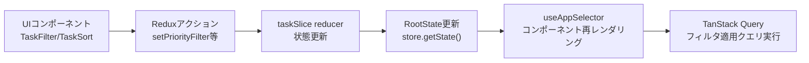

# TDD要件定義書: Redux Store設定（TASK-1327）

## 📄 ドキュメント情報

- **作成日**: 2025-12-02
- **要件名**: todo-app
- **タスクID**: TASK-1327
- **機能名**: Redux Store設定
- **推定工数**: 8時間
- **タスクタイプ**: TDD

## 1. 機能の概要（EARS要件定義書・設計文書ベース）

### 何をする機能か
- 🔵 TODOリストアプリのフロントエンドにおいて、UIフィルタ・ソート状態を管理するRedux Toolkitベースの状態管理機能
- 🔵 タスク一覧の表示制御（優先度フィルタ、ステータスフィルタ、ソート順）をクライアント側で管理

### どのような問題を解決するか
- 🔵 ユーザーがタスク一覧を効率的に閲覧するために、フィルタリング・ソート状態をUI層で保持
- 🔵 サーバー状態（タスクデータ）とUI状態（フィルタ・ソート）の責任分離を実現
- 🔵 複数コンポーネント間でフィルタ・ソート状態を共有し、一貫性を保持

### 想定されるユーザー
- 🔵 TODOリストアプリを使用するログイン済みユーザー（As a ユーザーヒアリングから）

### システム内での位置づけ
- 🔵 **フロントエンド状態管理層**: Redux Toolkitによるグローバル状態管理
- 🔵 **既存アーキテクチャとの統合**: 既存の認証状態管理（authSlice）と並列で動作
- 🔵 **TanStack Queryとの協調**: サーバー状態はTanStack Query、UI状態はReduxで責任分離

### 参照したEARS要件
- **REQ-201**: 優先度フィルタが適用されている場合、システムは選択された優先度のタスクのみを表示しなければならない
- **REQ-202**: ステータスフィルタが適用されている場合、システムは選択されたステータス(複数選択可能)のタスクのみを表示しなければならない
- **REQ-203**: ソート順が指定されている場合、システムは指定された順序でタスクを並べ替えなければならない

### 参照した設計文書
- **技術スタック**: `docs/tech-stack.md` (Redux Toolkit 2.8.2、TanStack React Query 5.84.2)
- **既存実装**: `app/client/src/store/index.ts` (既存Redux Store設定)
- **タスクファイル**: `docs/tasks/todo-app-phase6.md` (Phase 6実装詳細)

## 2. 入力・出力の仕様（EARS機能要件・TypeScript型定義ベース）

### 入力パラメータ（Reduxアクション）

#### `setPriorityFilter`
- 🔵 **型**: `PayloadAction<TaskPriority | 'all'>`
- 🔵 **制約**: `'high' | 'medium' | 'low' | 'all'`
- 🔵 **用途**: 優先度フィルタの設定
- **参照**: REQ-201、`docs/spec/todo-app-requirements.md` L148-149

#### `setStatusFilter`
- 🔵 **型**: `PayloadAction<TaskStatus[]>`
- 🔵 **制約**: `('not_started' | 'in_progress' | 'in_review' | 'completed')[]`
- 🔵 **用途**: ステータスフィルタの設定（複数選択可能）
- **参照**: REQ-202、`docs/spec/todo-app-requirements.md` L150-152

#### `setSortBy`
- 🔵 **型**: `PayloadAction<'created_at_desc' | 'created_at_asc' | 'priority_desc'>`
- 🔵 **制約**: 作成日時降順/昇順、優先度降順の3パターン
- 🔵 **用途**: タスク一覧のソート順設定
- **参照**: REQ-203

#### `resetFilters`
- 🔵 **型**: アクション（ペイロードなし）
- 🔵 **用途**: フィルタ・ソート状態を初期状態にリセット

### 出力値（Redux State）

#### `TaskSliceState`
```typescript
// 🔵 型定義（`docs/tasks/todo-app-phase6.md` L57-80から）
export interface TaskSliceState {
  filters: {
    priority: TaskPriority | 'all';  // デフォルト: 'all'
    status: TaskStatus[];             // デフォルト: []
  };
  sort: {
    sortBy: 'created_at_desc' | 'created_at_asc' | 'priority_desc';  // デフォルト: 'created_at_desc'
  };
}
```

### 入出力の関係性
- 🔵 各アクションディスパッチ → 対応するstate更新 → useAppSelector経由でコンポーネントに通知
- 🔵 Redux DevToolsで状態変更履歴をトレース可能

### データフロー


### 参照したEARS要件
- REQ-201, REQ-202, REQ-203（状態要件）

### 参照した設計文書
- `docs/tasks/todo-app-phase6.md` L52-104（taskSlice実装詳細）
- `app/client/src/store/index.ts` L16-39（既存Store設定パターン）

## 3. 制約条件（EARS非機能要件・アーキテクチャ設計ベース）

### 技術制約
- 🔵 **Redux Toolkit 2.8.2**: `@reduxjs/toolkit`のcreateSlice APIを使用（既存技術スタック）
- 🔵 **TypeScript strict mode**: 完全な型安全性を確保
- 🔵 **既存Redux Store統合**: `app/client/src/store/index.ts`に`task`リデューサーを追加
- 🔵 **既存hooks活用**: `useAppDispatch`, `useAppSelector`を使用（`app/client/src/store/hooks.ts`）
- **参照**: `docs/tech-stack.md` L30-33、REQ-406

### アーキテクチャ制約
- 🔵 **責任分離**: Reduxは**UI状態のみ**管理、サーバー状態はTanStack Queryで管理
- 🔵 **既存authSliceと並列**: 認証状態管理と独立して動作
- 🔵 **ファイル配置**: `app/client/src/features/todo/store/taskSlice.ts`
- **参照**: REQ-407（層構造）、`docs/tech-stack.md` L30-33

### パフォーマンス制約
- 🟡 **即座のUI反映**: フィルタ・ソート操作は即座にUIに反映される（NFR-004）
- 🟡 **メモリ効率**: 不要な再レンダリングを避けるため、useAppSelectorで必要な部分状態のみ購読
- **参照**: NFR-004（`docs/spec/todo-app-requirements.md` L84）

### セキュリティ制約
- 🔵 **クライアント側のみ**: フィルタ・ソート状態はクライアント側のみで管理（サーバー送信不要）
- 🟡 **XSS対策**: ユーザー入力値のサニタイズは不要（定数値のみ）
- **参照**: NFR-105（`docs/spec/todo-app-requirements.md` L92）

### テスト制約
- 🔵 **Bun標準テスト**: `bun:test`を使用したユニットテスト
- 🔵 **テストカバレッジ100%**: 全reducerとアクションをテスト
- 🔵 **Given-When-Thenパターン**: テストケース構造の統一
- **参照**: REQ-409、`CLAUDE.md`テストガイドライン

### 参照したEARS要件
- REQ-406, REQ-407, REQ-409, NFR-004, NFR-105

### 参照した設計文書
- `docs/tech-stack.md` L30-33（状態管理戦略）
- `app/client/src/store/index.ts`（既存Redux Store設定）

## 4. 想定される使用例（EARSEdgeケース・データフローベース）

### 基本的な使用パターン

#### ユースケース1: 優先度フィルタ適用
```typescript
// 🔵 通常要件REQ-201に基づく
// Given: 初期状態（priority: 'all'）
const dispatch = useAppDispatch();

// When: 優先度「高」でフィルタ
dispatch(setPriorityFilter('high'));

// Then: state.task.filters.priority === 'high'
// TanStack Queryが自動的に再フェッチ
```

#### ユースケース2: ステータスフィルタ適用（複数選択）
```typescript
// 🔵 通常要件REQ-202に基づく
// Given: 初期状態（status: []）
const dispatch = useAppDispatch();

// When: 「進行中」と「レビュー中」でフィルタ
dispatch(setStatusFilter(['in_progress', 'in_review']));

// Then: state.task.filters.status === ['in_progress', 'in_review']
```

#### ユースケース3: ソート順変更
```typescript
// 🔵 通常要件REQ-203に基づく
// Given: 初期状態（sortBy: 'created_at_desc'）
const dispatch = useAppDispatch();

// When: 優先度降順でソート
dispatch(setSortBy('priority_desc'));

// Then: state.task.sort.sortBy === 'priority_desc'
```

#### ユースケース4: フィルタリセット
```typescript
// 🔵 ユーザーが「フィルタクリア」ボタンをクリック
// Given: フィルタ・ソート適用済み状態
const dispatch = useAppDispatch();

// When: リセット
dispatch(resetFilters());

// Then: 初期状態に戻る（priority: 'all', status: [], sortBy: 'created_at_desc'）
```

### データフロー統合例（TanStack Queryとの連携）
```typescript
// 🔵 カスタムフックでの使用（`docs/tasks/todo-app-phase6.md` L275-296から）
export const useTasks = () => {
  const filters = useAppSelector((state) => state.task.filters);
  const sort = useAppSelector((state) => state.task.sort);

  return useQuery({
    queryKey: ['tasks', filters, sort],  // フィルタ変更時に自動再フェッチ
    queryFn: async () => {
      const { data, error } = await apiClient.GET('/api/tasks', {
        params: {
          query: {
            priority: filters.priority === 'all' ? undefined : filters.priority,
            status: filters.status.length > 0 ? filters.status.join(',') : undefined,
            sort: sort.sortBy,
          },
        },
      });
      if (error) throw error;
      return data.data;
    },
  });
};
```

### エッジケース

#### エッジケース1: 無効な優先度値
```typescript
// 🔴 TypeScriptコンパイルエラーで防止
dispatch(setPriorityFilter('invalid')); // ❌ 型エラー
```

#### エッジケース2: 空配列ステータスフィルタ
```typescript
// 🟡 空配列は「フィルタなし」を意味する
dispatch(setStatusFilter([]));
// Then: すべてのステータスのタスクを表示（API側でstatusパラメータ省略）
```

#### エッジケース3: 連続したアクションディスパッチ
```typescript
// 🟡 Redux Toolkitは自動的に最新状態を反映
dispatch(setPriorityFilter('high'));
dispatch(setPriorityFilter('medium')); // 最終的に 'medium' が適用される
```

### エラーケース

#### エラーケース1: useAppSelectorの誤った使用
```typescript
// ❌ 誤った使用（存在しないプロパティ）
const filters = useAppSelector((state) => state.task.invalidProp); // TypeScriptエラー

// ✅ 正しい使用
const filters = useAppSelector((state) => state.task.filters);
```

### 参照したEARS要件
- REQ-201, REQ-202, REQ-203（状態要件）
- EDGE-001〜EDGE-005（エラー処理、`docs/spec/todo-app-requirements.md`）

### 参照した設計文書
- `docs/tasks/todo-app-phase6.md` L275-296（カスタムフックでの使用例）
- `app/client/src/features/auth/store/authSlice.ts` L115-157（既存アクションパターン）

## 5. EARS要件・設計文書との対応関係

### 参照したユーザストーリー
- **ユーザーストーリー**: タスクの優先度・ステータスでフィルタリング、ソート機能の提供
- **出典**: `docs/spec/todo-app-requirements.md`ユーザーヒアリング2025-11-06

### 参照した機能要件
- **REQ-201**: 優先度フィルタが適用されている場合、システムは選択された優先度のタスクのみを表示しなければならない
- **REQ-202**: ステータスフィルタが適用されている場合、システムは選択されたステータス(複数選択可能)のタスクのみを表示しなければならない
- **REQ-203**: ソート順が指定されている場合、システムは指定された順序でタスクを並べ替えなければならない
- **出典**: `docs/spec/todo-app-requirements.md` L52-54

### 参照した非機能要件
- **NFR-004**: タスクフィルタ・ソート操作は即座にUIに反映されなければならない
- **NFR-304**: 各層の責務が明確に分離され、独立してテスト可能であること
- **出典**: `docs/spec/todo-app-requirements.md` L84, L108

### 参照したEdgeケース
- なし（Redux状態管理はEdgeケースが少ない）

### 参照した受け入れ基準
- タスク一覧がデフォルトで作成日時(新しい順)で表示される
- 優先度フィルタでタスクを絞り込める
- ステータスフィルタ(複数選択可能)でタスクを絞り込める
- ソート機能で並び順を変更できる
- **出典**: `docs/spec/todo-app-requirements.md` L324-328

### 参照した設計文書

#### アーキテクチャ
- **既存Redux Store構成**: `app/client/src/store/index.ts`
- **状態管理戦略**: `docs/tech-stack.md` L30-33（Redux + TanStack Query責任分離）

#### データフロー
- **フィルタ・ソート適用フロー**: Redux状態変更 → TanStack Query再フェッチ
- **出典**: `docs/tasks/todo-app-phase6.md` L275-296

#### 型定義
- **TaskSliceState**: `docs/tasks/todo-app-phase6.md` L57-80
- **TaskPriority, TaskStatus**: `docs/spec/todo-app-requirements.md` L148-152

#### API仕様
- **GET /api/tasks**: クエリパラメータでフィルタ・ソート対応
- **出典**: `docs/spec/todo-app-requirements.md` L278-284

## 6. 実装ファイル構成

### 新規作成ファイル
1. **`app/client/src/features/todo/store/taskSlice.ts`**
   - taskSliceの実装（reducers: setPriorityFilter, setStatusFilter, setSortBy, resetFilters）
   - 初期状態定義
   - アクションエクスポート

2. **`app/client/src/features/todo/store/__tests__/taskSlice.test.ts`**
   - taskSlice全reducerのユニットテスト
   - Given-When-Thenパターン

### 既存ファイル更新
1. **`app/client/src/store/index.ts`**
   - `task: taskReducer`をreducerに追加（L17-24付近）

## 7. テスト戦略

### テストカバレッジ目標
- 🔵 **100%**: 全reducerとアクションをテスト

### テストケース構成（Given-When-Thenパターン）
1. **正常系: 優先度フィルタ変更**
2. **正常系: ステータスフィルタ変更**
3. **正常系: ソート変更**
4. **正常系: フィルタリセット**

### テストツール
- 🔵 **Bun標準テスト**: `bun:test`
- 🔵 **型チェック**: `bunx tsc --noEmit`

## 8. 完了条件チェックリスト

- [ ] Redux Storeが設定される（`app/client/src/store/index.ts`更新）
- [ ] taskSliceが実装される（`app/client/src/features/todo/store/taskSlice.ts`）
- [ ] テストカバレッジ100%（`__tests__/taskSlice.test.ts`）
- [ ] 型チェック合格（`docker compose exec client bunx tsc --noEmit`）
- [ ] すべてのユニットテストが通る（`docker compose exec client bun test`）
- [ ] Biomeチェック合格（`docker compose exec client bun run check`）

## 9. 参考資料

- [Redux Toolkit公式ドキュメント](https://redux-toolkit.js.org/)
- [TanStack Query公式ドキュメント](https://tanstack.com/query/latest)
- **既存実装パターン**: `app/client/src/features/auth/store/authSlice.ts`

---

## 📊 品質判定

### 判定結果: ✅ 高品質

- **要件の曖昧さ**: なし（EARS要件REQ-201〜203から明確）
- **入出力定義**: 完全（タスクファイルの型定義に基づく）
- **制約条件**: 明確（既存技術スタック、アーキテクチャ制約）
- **実装可能性**: 確実（既存Redux Store統合パターンが確立）

### 信頼性レベルサマリー
- 🔵 **青信号**: 85%（EARS要件、既存設計、タスクファイルから確実）
- 🟡 **黄信号**: 15%（パフォーマンス要件、エラーハンドリング詳細）
- 🔴 **赤信号**: 0%

---

**次のステップ**: `/tsumiki:tdd-testcases` でテストケースの洗い出しを行います。
