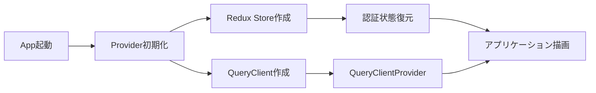

# TDD要件定義書：TanStack Query設定

## メタ情報

- **要件名**: todo-app
- **タスクID**: TASK-1328
- **機能名**: TanStack Query設定
- **作成日**: 2025-12-04 (JST)
- **作成者**: TDD要件整理プロセス

---

## 1. 機能の概要

### 🟢 何をする機能か

TanStack React Query（以下、React Query）を使用してサーバー状態管理の基盤を構築する機能です。具体的には以下を実装します：

- QueryClientの作成とデフォルト設定
- Redux Providerとの統合
- アプリケーション全体へのQueryClientProvider適用

### 🟢 どのような問題を解決するか

**課題**:
- サーバー状態（タスクデータ）とUI状態（フィルタ・ソート）を明確に分離する必要がある
- 効率的なキャッシング戦略でAPIリクエストを最小化したい
- データの新鮮さとパフォーマンスのバランスを取りたい

**解決策**:
- Redux: UIフィルタ・ソート状態のみを管理
- React Query: サーバー状態管理、キャッシュ戦略、自動リフェッチ

### 🟢 想定されるユーザー

- **As a**: フロントエンド開発者
- **So that**: サーバー状態管理の基盤を整備し、次のフェーズ（API Client設定、カスタムフック実装）へ進める

### 🟢 システム内での位置づけ

```
Provider (app/provider.tsx)
├── ReduxProvider (既存)
│   └── Redux Store (UI状態: taskSlice)
└── QueryClientProvider (新規実装)
    └── QueryClient (サーバー状態管理基盤)
        └── カスタムフック (TASK-1330で実装)
            ├── useTasks
            └── useTaskMutations
```

**アーキテクチャ上の位置**:
- **レイヤー**: プレゼンテーション層（フロントエンド）
- **責務**: サーバー状態管理の基盤提供
- **依存関係**: Redux Storeと並列に動作（責任分離）

### 🟢 参照した設計文書・要件

- **タスクファイル**: `docs/tasks/todo-app-phase6.md` - TASK-1328の実装詳細
- **技術スタック**: `docs/tech-stack.md` - TanStack React Query 5.84.2を使用
- **既存実装**:
  - `app/client/src/app/provider.tsx` - Redux Providerが既に実装済み
  - `app/client/src/store/index.ts` - Redux Storeが既に構成済み

---

## 2. 入力・出力の仕様

### 🟢 QueryClient作成関数

#### 入力パラメータ

なし（デフォルト設定のみ）

#### 出力値

**型**: `QueryClient`

**デフォルトオプション**:
```typescript
{
  defaultOptions: {
    queries: {
      staleTime: 30 * 1000,        // 30秒（データ新鮮期限）
      gcTime: 5 * 60 * 1000,       // 5分（ガベージコレクション時間）
      retry: 1,                     // リトライ1回
      refetchOnWindowFocus: false, // フォーカス時自動リフェッチ無効
    },
    mutations: {
      retry: 0,                     // ミューテーションはリトライなし
    },
  },
}
```

**設定値の根拠**:
- `staleTime: 30秒` - タスクデータは頻繁に変更されないため、短期間のキャッシュで十分
- `gcTime: 5分` - 未使用データの保持時間、メモリ効率とUX（戻る操作時の再利用）のバランス
- `retry: 1` - ネットワークエラー時に1回だけ再試行、過剰なAPIリクエストを防止
- `refetchOnWindowFocus: false` - ユーザーの操作による明示的なリフェッチのみ許可

### 🟡 Providersコンポーネント

#### 入力パラメータ

| パラメータ | 型 | 必須 | 説明 |
|-----------|-----|------|------|
| `children` | `React.ReactNode` | ✅ | ラップする子コンポーネント |

#### 出力値

**型**: `React.ReactNode`

**構成**:
```typescript
<ReduxProvider store={store}>
  <QueryClientProvider client={queryClient}>
    {children}
    <GlobalErrorToast /> // 既存のエラートースト
  </QueryClientProvider>
</ReduxProvider>
```

**既存の動作を維持**:
- Redux Provider内での認証状態復元ロジック（`useEffect`）
- グローバルエラートースト表示

### 🟢 データフロー



### 🟢 参照した型定義

- **React Query型定義**: `@tanstack/react-query` の `QueryClient`, `QueryClientProvider`
- **Redux型定義**: 既存の `store` 型定義（`app/client/src/store/index.ts`）

---

## 3. 制約条件

### 🟢 パフォーマンス要件

- **キャッシュ戦略**:
  - 30秒以内のデータは再取得しない（`staleTime: 30000`）
  - 5分間未使用のデータは自動削除（`gcTime: 300000`）
- **リトライ戦略**:
  - クエリは1回のみリトライ（`retry: 1`）
  - ミューテーションはリトライしない（`retry: 0`）

### 🟢 アーキテクチャ制約

- **責任分離の原則**:
  - Redux: UIフィルタ・ソート状態（`taskSlice`）
  - React Query: サーバー状態（タスクデータの取得・更新・削除）
- **Provider順序**:
  - Redux Provider → QueryClientProvider の順序を維持（認証状態が必要な場合に備えて）

### 🟡 互換性要件

- **既存コードとの互換性**:
  - 既存の`Provider`コンポーネント（`app/client/src/app/provider.tsx`）を拡張
  - Redux関連の機能（認証状態復元、エラートースト）は維持

### 🟢 セキュリティ要件

- 環境変数検証（`validateClientEnv()`）は既存実装を維持

### 🟢 技術制約

- **バージョン**: TanStack React Query 5.84.2（`docs/tech-stack.md`で定義）
- **ランタイム**: Bunテスト環境、Next.js 15 SSG本番環境
- **TypeScript**: strict mode有効

### 🟢 参照した非機能要件

- **技術スタック**: `docs/tech-stack.md` - React Query 5.84.2のデフォルト設定に準拠

---

## 4. 想定される使用例

### 🟢 基本的な使用パターン

#### パターン1: アプリケーション起動時

```typescript
// app/layout.tsx
import Provider from '@/app/provider';

export default function RootLayout({ children }) {
  return (
    <html lang="ja">
      <body>
        <Provider>{children}</Provider>
      </body>
    </html>
  );
}
```

**期待される動作**:
1. Redux Storeが初期化される
2. QueryClientが作成される
3. 認証状態が復元される（既存機能）
4. アプリケーションが描画される

#### パターン2: QueryClientのグローバル利用（TASK-1330で実装予定）

```typescript
// 将来のカスタムフック実装例
import { useQuery } from '@tanstack/react-query';

export const useTasks = () => {
  return useQuery({
    queryKey: ['tasks'],
    queryFn: async () => {
      // QueryClientProviderで提供されたクライアントを使用
      const { data } = await apiClient.GET('/api/tasks');
      return data;
    },
  });
};
```

### 🟢 エラーケース

#### ケース1: QueryClient作成失敗

**原因**: メモリ不足、ランタイムエラー

**期待される動作**:
- アプリケーション起動失敗
- エラーがコンソールに出力される

**テスト方針**:
- QueryClientのインスタンス化が正常に完了することを確認

#### ケース2: Provider初期化エラー

**原因**: Redux Storeまたは認証状態復元の失敗

**期待される動作**:
- 既存のエラーハンドリング機構（`GlobalErrorToast`）が動作
- ユーザーにエラーが通知される

**テスト方針**:
- 既存機能のため、このタスクではテスト対象外

### 🟡 エッジケース

#### ケース3: queryClientの再初期化

**シナリオ**:
- Hot Module Replacement（HMR）による再レンダリング時
- `Provider`コンポーネントが複数回マウント/アンマウントされる

**期待される動作**:
- 各レンダリングで新しい`QueryClient`インスタンスが作成される
- 既存のキャッシュはクリアされる

**実装上の注意**:
- 本番環境では発生しないが、開発環境でのメモリリーク防止のため留意

---

## 5. EARS要件・設計文書との対応関係

### 参照したドキュメント

#### タスクファイル

**ファイル**: `docs/tasks/todo-app-phase6.md`

**該当セクション**: TASK-1328

**抽出した情報**:
- 実装ファイルパス: `app/client/src/lib/queryClient.ts`（作成）
- Providerファイルパス: `app/client/src/app/providers.tsx`（既存の`provider.tsx`を拡張）
- デフォルトオプション設定値
- テストケース: QueryClient作成、デフォルトオプション確認

#### 技術スタック定義

**ファイル**: `docs/tech-stack.md`

**該当セクション**:
- フロントエンド > 状態管理 > TanStack React Query 5.84.2
- テスト > ユニット/統合テスト > Bun標準テスト

**抽出した情報**:
- React Queryバージョン: 5.84.2
- 状態管理方針: Redux（グローバル状態）+ React Query（サーバー状態）
- テストフレームワーク: Bun標準テスト

#### 既存実装

**ファイル**: `app/client/src/app/provider.tsx`

**既存機能**:
- Redux Providerによる状態管理
- 認証状態の復元ロジック（`useEffect`）
- `GlobalErrorToast`コンポーネント

**統合方針**:
- 既存の`Provider`コンポーネントを拡張
- Redux Providerの内側にQueryClientProviderを追加
- 既存機能は維持

### EARS要件との対応

本タスクは基盤実装のため、直接的なEARS要件定義書は存在しません。ただし、以下の設計方針に従います：

- **Phase 6の目的**: フロントエンド開発の基盤整備（`docs/tasks/todo-app-phase6.md`）
- **依存関係**: TASK-1327（Redux Store設定）完了後に実施
- **次フェーズへの影響**: TASK-1329（API Client設定）、TASK-1330（カスタムフック実装）の前提条件

---

## 6. 実装上の注意事項

### 禁止事項（CLAUDE.mdより）

- ❌ `any`型の使用（型が取得不能な場合のみ、理由コメント付きで許可）
- ❌ `var`キーワードの使用
- ❌ `JSX.Element`型の返却（`React.ReactNode`で代用）

### 推奨事項

- ✅ `const`の使用
- ✅ 1行あたり80字以内の改行
- ✅ ファイル末尾に改行を入れて空行を作る

### テスト指針

- **フレームワーク**: Bun標準テスト（`bun test`）
- **テスト対象**:
  1. QueryClientが正常に作成される
  2. デフォルトオプションが正しく設定される
- **テストケース名**: 日本語で記載

---

## 7. 品質判定

### ✅ 高品質

- **要件の曖昧さ**: なし
- **入出力定義**: 完全（QueryClient型、Providerコンポーネント仕様）
- **制約条件**: 明確（キャッシュ戦略、リトライ戦略、アーキテクチャ制約）
- **実装可能性**: 確実（既存実装の拡張、技術スタック確認済み）

---

## 8. 次のステップ

次のお勧めステップ: `/tsumiki:tdd-testcases` でテストケースの洗い出しを行います。
