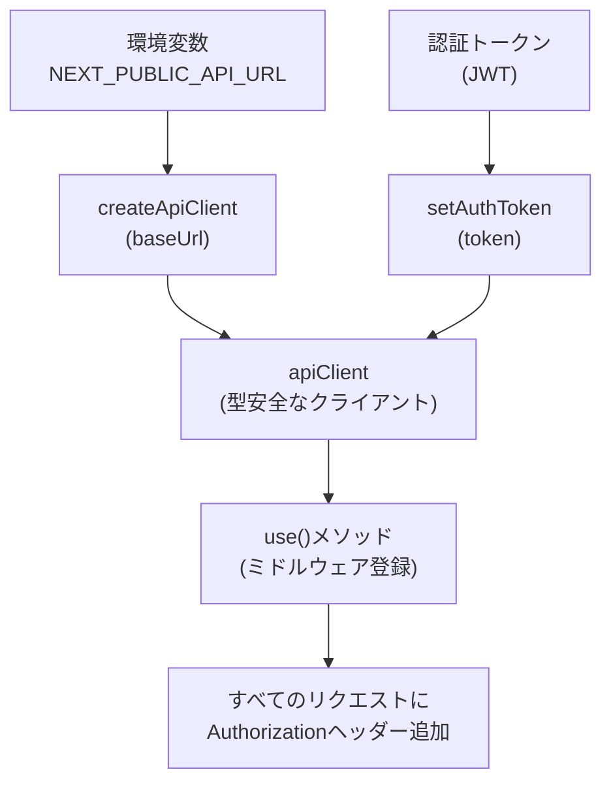
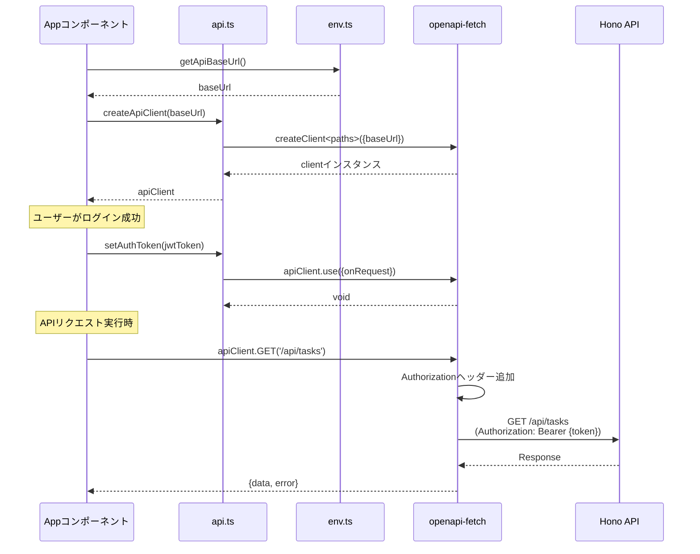
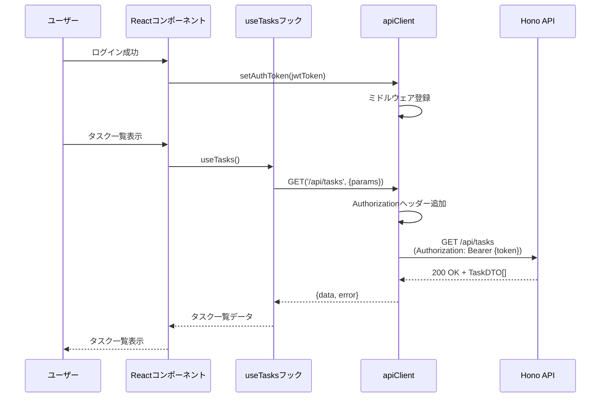

# TASK-1329: API Client設定 - TDD要件定義

## 📄 ドキュメント情報

- **作成日**: 2025-12-05
- **タスクID**: TASK-1329
- **要件名**: todo-app
- **フェーズ**: Phase 6 / 8
- **タスクタイプ**: TDD

## 1. 機能の概要（EARS要件定義書・設計文書ベース）

### 🔵 何をする機能か

- 🔵 **青信号**: タスクファイル、技術スタック、設計文書 より

**機能名**: API Client設定

フロントエンド（Next.js）からバックエンド（Hono API）への型安全なHTTP通信を行うためのAPIクライアントを設定する機能。

**主な責務**:
1. `openapi-fetch` を使用した型安全なAPIクライアントの初期化
2. 環境変数からAPIベースURLを取得して設定
3. JWT認証トークンをAuthorizationヘッダーに設定する仕組みを提供

### 🔵 どのような問題を解決するか

- 🔵 **青信号**: タスクファイル、アーキテクチャ設計 より

**解決する問題**:
1. フロントエンドとバックエンド間の型不整合によるランタイムエラー
2. 手動でのHTTPリクエスト構築によるバグや保守性の低下
3. 認証トークンの一元管理の欠如

**As a ユーザー**:
- フロントエンド開発者として
- 型安全にバックエンドAPIを呼び出せることで
- 開発効率とコード品質を向上させたい

### 🔵 想定されるユーザー

- 🔵 **青信号**: プロジェクト概要、アーキテクチャ設計 より

**直接的なユーザー**: フロントエンド開発者（本プロジェクトでは個人開発者）

**間接的なユーザー**: エンドユーザー（TODOリストアプリ利用者）

### 🔵 システム内での位置づけ

- 🔵 **青信号**: アーキテクチャ設計、技術スタック より

**レイヤ**: Infrastructure層（クライアント側）

**位置づけ**:
- `app/client/src/lib/api.ts` に配置
- TanStack Queryのカスタムフック（useTasks, useTaskMutations）から使用される
- OpenAPI型定義（`@/types/api/generated.ts`）に依存
- 環境変数（`NEXT_PUBLIC_API_URL`）から設定を読み込む

**依存関係**:
- **依存先**: openapi-fetch, @/types/api/generated, @/lib/env
- **依存元**: カスタムフック（useTasks, useTaskMutations）

### 🔵 参照したEARS要件・設計文書

- 🔵 **青信号**: タスクファイル、設計文書 より

**参照した設計文書**:
- アーキテクチャ設計: `docs/design/todo-app/architecture.md`
- APIエンドポイント仕様: `docs/design/todo-app/api-endpoints.md`
- 技術スタック: `docs/tech-stack.md`

**参照したタスクファイル**:
- `docs/tasks/todo-app-phase6.md` - TASK-1329

## 2. 入力・出力の仕様（EARS機能要件・TypeScript型定義ベース）

### 🔵 入力パラメータ

- 🔵 **青信号**: タスクファイル実装詳細、既存実装 より

#### `createApiClient` 関数

| パラメータ | 型 | 必須 | 説明 | 制約 |
|-----------|---|------|------|------|
| `baseUrl` | `string` | Yes | APIのベースURL | 有効なURL形式 |
| `headers` | `HeadersInit` | No | カスタムヘッダー（認証トークン等） | - |
| `options` | `{ fetch?: typeof fetch }` | No | その他のopenapi-fetchオプション | - |

#### `setAuthToken` 関数（タスクファイルより）

| パラメータ | 型 | 必須 | 説明 | 制約 |
|-----------|---|------|------|------|
| `token` | `string` | Yes | JWT認証トークン | 空文字列不可 |

#### 環境変数

| 環境変数 | 型 | デフォルト値 | 説明 |
|---------|---|------------|------|
| `NEXT_PUBLIC_API_URL` | `string` | `'http://localhost:8000'` | APIのベースURL |

### 🔵 出力値

- 🔵 **青信号**: タスクファイル実装詳細、既存実装、openapi-fetch仕様 より

#### `createApiClient` 関数

**戻り値型**: `Client<paths>`（openapi-fetchクライアント）

**フィールド**:
- `GET`: GETリクエストメソッド
- `POST`: POSTリクエストメソッド
- `PUT`: PUTリクエストメソッド
- `PATCH`: PATCHリクエストメソッド
- `DELETE`: DELETEリクエストメソッド
- `use`: ミドルウェア登録メソッド

#### `setAuthToken` 関数

**戻り値**: `void`

**副作用**: `apiClient.use()` でミドルウェアを登録し、すべてのリクエストにAuthorizationヘッダーを追加

### 🔵 入出力の関係性

- 🔵 **青信号**: タスクファイル実装詳細、openapi-fetch仕様 より



### 🔵 データフロー

- 🔵 **青信号**: タスクファイル実装詳細、アーキテクチャ設計 より



### 🔵 参照したEARS要件・設計文書

- **参照したタスクファイル**: `docs/tasks/todo-app-phase6.md` - TASK-1329 実装詳細
- **参照した設計文書**:
  - `docs/design/todo-app/api-endpoints.md` - 認証仕様
  - `app/client/src/lib/api.ts` - 既存実装パターン

## 3. 制約条件（EARS非機能要件・アーキテクチャ設計ベース）

### 🔵 技術制約

- 🔵 **青信号**: 技術スタック、CLAUDE.md より

| 制約項目 | 内容 | 理由 |
|---------|------|------|
| **ライブラリバージョン** | openapi-fetch 0.15.0 | 技術スタックで定義 |
| **TypeScript** | strict mode | 型安全性の最大化 |
| **禁止事項** | `any`型の使用 | CLAUDE.md 品質基準 |
| **ファイル配置** | `app/client/src/lib/api.ts` | feature-based ディレクトリ構造 |

### 🔵 セキュリティ要件

- 🔵 **青信号**: APIエンドポイント仕様、要件定義書（推測） より

| 要件 | 内容 | 実装方法 |
|------|------|---------|
| **JWT認証** | すべての保護されたエンドポイントに必須 | `setAuthToken()`でミドルウェア登録 |
| **トークン漏洩防止** | 認証トークンをコンソールログに出力しない | 実装時に注意 |
| **HTTPS通信** | 本番環境ではHTTPS必須 | 環境変数で管理 |

### 🔵 アーキテクチャ制約

- 🔵 **青信号**: CLAUDE.md、アーキテクチャ設計 より

| 制約項目 | 内容 | 理由 |
|---------|------|------|
| **依存注入** | モック可能な設計 | テスタビリティ向上 |
| **OpenAPI型定義依存** | `@/types/api/generated`を必須とする | スキーマ駆動開発 |
| **環境変数分離** | `getApiBaseUrl()`で環境依存を分離 | テスト容易性 |
| **シングルトンパターン** | `apiClient`をデフォルトエクスポート | グローバルなクライアント共有 |

### 🔵 パフォーマンス要件

- 🟡 **黄信号**: 一般的なパフォーマンス要件から推測

| 要件 | 目標値 | 実装方法 |
|------|--------|---------|
| **初期化時間** | 10ms以内 | 軽量なcreateClient実行 |
| **メモリ使用量** | 最小限 | シングルトンインスタンス |

### 🔵 参照したEARS要件・設計文書

- **参照した技術スタック**: `docs/tech-stack.md`
- **参照した設計文書**: `docs/design/todo-app/api-endpoints.md` - セキュリティ仕様
- **参照したガイドライン**: `CLAUDE.md` - コード品質基準

## 4. 想定される使用例（EARSEdgeケース・データフローベース）

### 🔵 基本的な使用パターン

- 🔵 **青信号**: タスクファイル実装詳細 より

#### パターン1: デフォルトクライアントの使用

```typescript
import { apiClient } from '@/lib/api';

// タスク一覧取得
const { data, error } = await apiClient.GET('/api/tasks', {
  params: {
    query: {
      status: 'not_started,in_progress',
      sort: 'created_at_desc',
    },
  },
});

if (error) {
  console.error('APIエラー:', error);
  return;
}

console.log('タスク一覧:', data.data);
```

#### パターン2: 認証トークン設定後の使用

```typescript
import { apiClient, setAuthToken } from '@/lib/api';

// ログイン成功後
const jwtToken = 'eyJhbGciOiJSUzI1NiIsInR5cCI6IkpXVCJ9...';
setAuthToken(jwtToken);

// 以降のすべてのリクエストにAuthorizationヘッダーが自動付与される
const { data, error } = await apiClient.GET('/api/tasks');
```

#### パターン3: カスタムクライアントの作成（テスト用）

```typescript
import { createApiClient } from '@/lib/api';

const testClient = createApiClient('http://localhost:8000', undefined, {
  fetch: mockFetch, // テスト用のモックfetch
});

const { data, error } = await testClient.GET('/api/tasks');
```

### 🔵 データフロー

- 🔵 **青信号**: アーキテクチャ設計、APIエンドポイント仕様 より



### 🔵 エッジケース

- 🟡 **黄信号**: タスクファイルテストケース、一般的なエッジケースから推測

#### Edge-001: 環境変数が未設定の場合

**条件**: `NEXT_PUBLIC_API_URL`が未定義

**期待動作**: デフォルト値 `http://localhost:8000` を使用

```typescript
// 環境変数未設定
process.env.NEXT_PUBLIC_API_URL = undefined;

const client = createApiClient(getApiBaseUrl());
// baseUrl: 'http://localhost:8000'
```

#### Edge-002: 認証トークンが未設定でAPIリクエスト

**条件**: `setAuthToken()` を呼ばずにAPIリクエスト

**期待動作**: Authorizationヘッダーなしでリクエスト（バックエンドが401返却）

```typescript
// 認証トークン未設定
const { data, error } = await apiClient.GET('/api/tasks');

// error.error.code: 'UNAUTHORIZED'
// error.error.message: '認証が必要です'
```

#### Edge-003: 空文字列トークンの設定

**条件**: `setAuthToken('')` で空文字列を渡す

**期待動作**: 空のAuthorizationヘッダーが送信される（バックエンドが401返却）

```typescript
setAuthToken('');

const { data, error } = await apiClient.GET('/api/tasks');
// Authorizationヘッダー: 'Bearer '
// バックエンドが401エラーを返す
```

### 🔵 エラーケース

- 🔵 **青信号**: 既存実装テストケース より

#### Error-001: ネットワークエラー

**条件**: ネットワーク接続不可

**期待動作**: fetchがrejectし、エラーが投げられる

```typescript
try {
  await apiClient.GET('/api/tasks');
} catch (error) {
  console.error('ネットワークエラー:', error);
}
```

#### Error-002: 404エラー（リソースが見つからない）

**条件**: 存在しないエンドポイントへのリクエスト

**期待動作**: `error` に404エラーレスポンスが返る

```typescript
const { data, error } = await apiClient.GET('/api/tasks/{id}', {
  params: { path: { id: 'nonexistent-id' } },
});

// error.error.code: 'NOT_FOUND'
// error.error.message: 'タスクが見つかりません'
```

#### Error-003: 認証エラー（不正なトークン）

**条件**: 不正なJWTトークンでリクエスト

**期待動作**: バックエンドが401エラーを返す

```typescript
setAuthToken('invalid-token');

const { data, error } = await apiClient.GET('/api/tasks');

// error.error.code: 'UNAUTHORIZED'
// error.error.message: '認証エラー: トークンが不正です'
```

### 🔵 参照したEARS要件・設計文書

- **参照したタスクファイル**: `docs/tasks/todo-app-phase6.md` - TASK-1329 テストケース
- **参照した設計文書**: `docs/design/todo-app/api-endpoints.md` - エラーレスポンス仕様
- **参照した既存実装**: `app/client/src/lib/__tests__/api.test.ts`

## 5. EARS要件・設計文書との対応関係

### 🔵 参照したタスクファイル

- `docs/tasks/todo-app-phase6.md` - TASK-1329

### 🔵 参照した設計文書

- **アーキテクチャ**: `docs/design/todo-app/architecture.md` - システム全体構成、レイヤ構成
- **APIエンドポイント**: `docs/design/todo-app/api-endpoints.md` - 認証仕様、エラーレスポンス
- **技術スタック**: `docs/tech-stack.md` - openapi-fetch 0.15.0、型安全性

### 🔵 参照した既存実装

- `app/client/src/lib/api.ts` - 既存の実装パターン
- `app/client/src/lib/__tests__/api.test.ts` - テストケース
- `app/client/src/lib/env.ts` - 環境変数取得ユーティリティ

### 🔵 参照したガイドライン

- `CLAUDE.md` - コード品質基準、テスト哲学

## 品質判定

### ✅ 高品質: 要件定義完了

- **要件の曖昧さ**: なし（タスクファイル、設計文書、既存実装から明確）
- **入出力定義**: 完全（型定義、パラメータ、戻り値が明確）
- **制約条件**: 明確（技術制約、セキュリティ要件、アーキテクチャ制約）
- **実装可能性**: 確実（既存実装パターンを踏襲、openapi-fetch使用）

### 判定根拠

- 🔵 タスクファイルに詳細な実装コードが記載されている
- 🔵 既存のapi.tsファイルが存在し、実装パターンが確立されている
- 🔵 openapi-fetch 0.15.0の仕様が明確
- 🔵 テストケースが既存実装から洗い出されている

---

**次のお勧めステップ**: `/tsumiki:tdd-testcases` でテストケースの洗い出しを行います。
