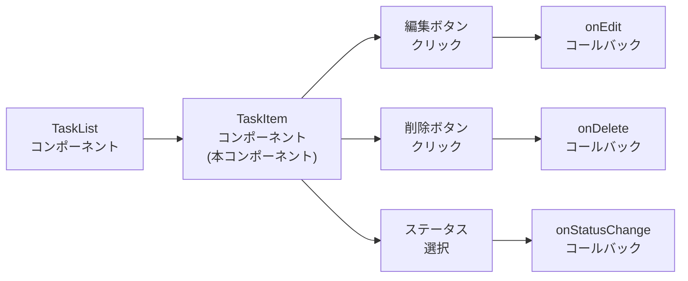
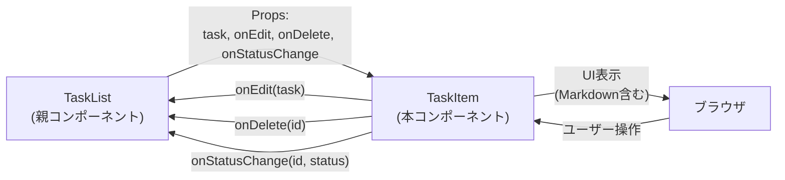

# TaskItemコンポーネント TDD要件定義書

## ドキュメント情報

- **作成日**: 2025-12-11
- **要件名**: todo-app
- **タスク番号**: TASK-1331
- **機能名**: TaskItemコンポーネント
- **担当**: フロントエンド
- **推定工数**: 8時間
- **レビュー日**: 2025-12-11（Codex MCP）

## 1. 機能の概要

🔵 **青信号**: TASK-1331タスク定義、既存設計から確実な要件

### 何をする機能か

タスク一覧の個別アイテムを表示するReactコンポーネント。
1つのタスク情報（タイトル、説明、優先度、ステータス）を受け取り、視覚的に表示する。
ユーザーは表示されたタスクに対して編集・削除・ステータス変更の操作を実行できる。

**重要**: 本コンポーネントは**プレゼンテーション専用**であり、タスク作成(REQ-001)は直接満たさない。
一覧表示(REQ-006)と既存タスクの操作(REQ-002, REQ-003, REQ-004)を担当する。

### どのような問題を解決するか

**As a** ログイン済みユーザー
**I want** タスク一覧で各タスクを視覚的に確認し、操作できる
**So that** タスクの状態を素早く把握し、必要な操作を即座に実行できる

### 想定されるユーザー

- デスクトップ環境でタスク管理を行うユーザー
- モバイル環境でも基本操作が可能（完全最適化はしない）

### システム内での位置づけ



TaskListコンポーネントから呼び出され、個別タスクのプレゼンテーション層を担当する。
ビジネスロジックは持たず、親コンポーネントから受け取ったコールバック関数を呼び出すのみ。

### 参照したEARS要件

- **REQ-002**: タスク更新（本コンポーネントは編集ボタンを提供、モーダル表示は親が担当）
- **REQ-003**: タスク削除（本コンポーネントは削除ボタンを提供、確認ダイアログ表示は親が担当）
- **REQ-004**: ステータス変更（本コンポーネントはステータス選択UIを提供）
- **REQ-005**: 優先度設定（本コンポーネントは優先度の視覚的表現を提供）
- **REQ-006**: タスク一覧表示（本コンポーネントは個別アイテムの表示を担当）
- **REQ-007**: Markdown表示（説明欄にreact-markdown適用）
- **REQ-105**: 削除確認ダイアログ（親コンポーネントが担当）
- **NFR-201**: テーマカラー適用（ベース#710000、アクセント#ff6a00）
- **NFR-202**: 言語非依存の直感的UI
- **NFR-204**: モーダル編集（親コンポーネントが担当）
- **NFR-205**: デスクトップ環境での快適性

### 参照した設計文書

- **アーキテクチャ**: `docs/design/todo-app/architecture.md` - フロントエンドの技術構成・Feature-basedディレクトリ
- **データフロー**: `docs/design/todo-app/dataflow.md` - タスク更新フロー、タスク削除フロー、ステータス変更フロー
- **タスクファイル**: `docs/tasks/todo-app-phase7.md` - TASK-1331の実装詳細

## 2. 入力・出力の仕様

🔵 **青信号**: shared-schemas/tasks.ts、TASK-1331の実装詳細から確実な仕様

### 入力パラメータ（Props）

**TaskItemProps型定義**:

```typescript
import type { Task, TaskStatus } from '@/packages/shared-schemas/src/tasks';

interface TaskItemProps {
  task: Task;                  // 表示するタスク情報（shared-schemasのTask型）
  onEdit: (task: Task) => void;          // 編集ボタンクリック時のコールバック
  onDelete: (id: string) => void;        // 削除ボタンクリック時のコールバック
  onStatusChange: (id: string, status: TaskStatus) => void; // ステータス変更時のコールバック（型安全）
}
```

**Task型定義**（`app/packages/shared-schemas/src/tasks.ts`から抽出）:

```typescript
type Task = {
  id: string;                  // UUID形式のタスクID
  userId: string;              // UUID形式のユーザーID
  title: string;               // タスクタイトル（1-100文字）
  description: string | null;  // タスク説明（Markdown形式、nullまたは空文字列の場合は非表示）
  priority: 'high' | 'medium' | 'low';        // 優先度
  status: 'not_started' | 'in_progress' | 'in_review' | 'completed'; // ステータス
  createdAt: string;           // ISO 8601形式の作成日時
  updatedAt: string;           // ISO 8601形式の更新日時
};

type TaskStatus = 'not_started' | 'in_progress' | 'in_review' | 'completed';
```

**注意**: `shared-schemas/tasks.ts`では`TaskDTO`という型名は存在せず、`Task`型を使用します。

### 出力値

**React要素**: `React.ReactNode`

- タスク情報を表示するJSX要素
- 編集・削除ボタン、ステータス選択UI
- 優先度に応じた色付け
- ステータスに応じたバッジ表示
- **Markdown表示**: `react-markdown` + `remark-gfm`で説明欄をレンダリング

### 入出力の関係性

1. **入力**: Task + コールバック関数（型安全）
2. **表示**: Tailwind CSSでスタイリングされたタスクアイテム
3. **ユーザー操作**: ボタンクリック、ステータス選択
4. **出力**: 親コンポーネントのコールバック関数を呼び出し



### データフロー

🔵 **青信号**: `docs/design/todo-app/dataflow.md` - タスク更新フロー、タスク削除フロー、ステータス変更フローより

**編集ボタンクリック時**:
1. ユーザーが「編集」ボタンをクリック
2. `onEdit(task)` コールバックを呼び出し
3. 親コンポーネント（TaskList）がモーダルを開く

**削除ボタンクリック時**:
1. ユーザーが「削除」ボタンをクリック
2. `onDelete(task.id)` コールバックを呼び出し
3. 親コンポーネント（TaskList）が削除確認ダイアログを表示（REQ-105）
4. ダイアログで「削除」選択時に実際のAPI呼び出しを実行

**ステータス変更時**:
1. ユーザーがステータスドロップダウンで新しいステータスを選択
2. `onChange`イベントで`e.target.value as TaskStatus`を取得（型キャスト）
3. `onStatusChange(task.id, newStatus)` コールバックを呼び出し
4. 親コンポーネント（TaskList）がAPI呼び出しを実行

**型安全性の確保**:
- ステータス選択UIは`<select>`要素で`TaskStatus`型の値のみ選択可能
- `onChange`時に`e.target.value as TaskStatus`で型キャストし、親に渡す

### 参照したEARS要件

- **REQ-002**: タスク更新（モーダルで詳細編集）
- **REQ-003**: タスク削除（確認ダイアログ表示）
- **REQ-004**: ステータス変更（ドロップダウンで選択）
- **REQ-007**: Markdown表示（説明欄）
- **REQ-105**: 削除確認ダイアログ（親が担当）

### 参照した設計文書

- **型定義**: `app/packages/shared-schemas/src/tasks.ts` - Task、TaskPriority、TaskStatus
- **データフロー**: `docs/design/todo-app/dataflow.md` - タスク更新フロー、タスク削除フロー、ステータス変更フロー

## 3. 制約条件

### パフォーマンス要件

🔵 **青信号**: NFR-003、NFR-004より

- **NFR-003**: 100件のタスク表示時にスムーズなスクロールを提供しなければならない
- **NFR-004**: タスクフィルタ・ソート操作は即座にUIに反映されなければならない

**対策**:
- `React.memo`による再レンダリングの最適化
- 不要な再計算を避けるため、`useMemo`でスタイルクラスをメモ化
- Propsが変更されない限り再レンダリングを抑制

### アクセシビリティ要件

🔵 **青信号**: NFR-202より

- **NFR-202**: 言語非依存の直感的UI
- ボタンには`aria-label`を設定（スクリーンリーダー対応）
- ステータス選択には`<select>`要素を使用（キーボード操作可能）
- ホバー時の視覚的フィードバック（`hover:bg-gray-50`）
- 削除ボタンには`aria-label="タスクを削除"`を設定

### アーキテクチャ制約

🔵 **青信号**: `docs/design/todo-app/architecture.md`、CLAUDE.mdより

- **Feature-basedディレクトリ構造**: `app/client/src/features/todo/components/TaskItem.tsx`
- **Tailwind CSS 4**: ユーティリティファーストアプローチ
  - **注意**: `line-clamp-2`はTailwind 4でプラグイン依存のため使用不可
  - 代替: `overflow-hidden`, `text-ellipsis`, または2行制限には`display: -webkit-box`, `-webkit-line-clamp: 2`, `-webkit-box-orient: vertical`を使用
- **テーマカラー適用**:
  - ベースカラー: `#710000`（削除ボタン、カード左罫線に使用）
  - アクセントカラー: `#ff6a00`（high優先度、編集ボタンホバー時に使用）
- **TypeScript**: 全面採用による型安全性確保
- **Bunテスト**: `bun:test`によるユニットテスト

### UI/UX制約

🔵 **青信号**: NFR-201、NFR-204、NFR-205より

- **NFR-201**: テーマカラー（ベース#710000、アクセント#ff6a00）を適用しなければならない
  - **ベースカラー#710000の適用箇所**:
    - 削除ボタンの背景色（`bg-[#710000]`）
    - タスクカード左罫線（`border-l-4 border-[#710000]`）
  - **アクセントカラー#ff6a00の適用箇所**:
    - high優先度のテキスト色（`text-[#ff6a00]`）
    - 編集ボタンのホバー時色（`hover:text-[#ff6a00]`）
- **NFR-204**: モーダル編集は親コンポーネントが担当（本コンポーネントは編集ボタンのみ提供）
- **NFR-205**: デスクトップ環境で快適に動作しなければならない（モバイルは基本動作のみ）
- **NFR-203対象外**: インライン入力（タスク作成）は本コンポーネントのスコープ外

**優先度の視覚的表現**:
- `high`: `text-[#ff6a00]`（アクセントカラー）+ 太字（`font-bold`）
- `medium`: `text-gray-700`
- `low`: `text-gray-400`

**ステータスバッジの視覚的表現**:
- `not_started`: `bg-gray-200 text-gray-700`（未着手）
- `in_progress`: `bg-blue-200 text-blue-700`（進行中）
- `in_review`: `bg-yellow-200 text-yellow-700`（レビュー中）
- `completed`: `bg-green-200 text-green-700`（完了）

### データ制約

🔵 **青信号**: `app/packages/shared-schemas/src/tasks.ts`より

- タイトルは1-100文字
- 説明はnullまたは空文字列許容（nullまたは空文字列時は非表示）
- 優先度は`high | medium | low`のいずれか（型安全性確保）
- ステータスは`not_started | in_progress | in_review | completed`のいずれか（型安全性確保）

**Markdown表示制約**:
- **REQ-007**: react-markdown + remark-gfmで表示
- XSS対策: HTMLタグはエスケープされる（react-markdownのデフォルト動作）
- 長文対策: 2行制限（Tailwindの代替手法を使用）

### 参照したEARS要件

- **NFR-003**: スクロールパフォーマンス
- **NFR-004**: フィルタ・ソート反映速度
- **NFR-201**: テーマカラー適用
- **NFR-202**: 言語非依存UI
- **NFR-204**: モーダル編集（親が担当）
- **NFR-205**: デスクトップ最適化

### 参照した設計文書

- **アーキテクチャ**: `docs/design/todo-app/architecture.md` - フロントエンド技術構成、Feature-basedディレクトリ
- **型定義**: `app/packages/shared-schemas/src/tasks.ts` - Task、TaskPriority、TaskStatus

## 4. 想定される使用例

### 基本的な使用パターン

🔵 **青信号**: TASK-1331実装詳細、REQ-006より

**TaskListコンポーネントからの呼び出し**:

```tsx
import { TaskItem } from './TaskItem';
import { useTasks } from '../hooks/useTasks';
import { useTaskMutations } from '../hooks/useTaskMutations';
import type { Task, TaskStatus } from '@/packages/shared-schemas/src/tasks';

export const TaskList: React.FC = () => {
  // 注意: useTasks()のdataはTask[] | undefinedのため、デフォルト配列を設定
  const { data: tasks = [], isLoading } = useTasks();
  const { deleteTask, changeStatus } = useTaskMutations();
  const [editingTask, setEditingTask] = useState<Task | null>(null);

  if (isLoading) return <LoadingSpinner aria-label="読み込み中" />;

  return (
    <div className="space-y-0">
      {tasks.map((task) => (
        <TaskItem
          key={task.id}
          task={task}
          onEdit={(task) => setEditingTask(task)}
          onDelete={(id) => deleteTask.mutate(id)}
          onStatusChange={(id, status: TaskStatus) => changeStatus.mutate({ id, status })}
        />
      ))}
    </div>
  );
};
```

### エッジケース

🟡 **黄信号**: 一般的なReactコンポーネントのエッジケースから妥当な推測

#### EDGE-001: 説明がnullまたは空文字列の場合

**シナリオ**:
- `task.description`が`null`または空文字列（`""`）の場合
- 説明欄は表示されない

**期待動作**:
```tsx
{task.description && task.description.trim() !== '' && (
  <div className="text-gray-600 text-sm mt-1 overflow-hidden" style={{ display: '-webkit-box', WebkitLineClamp: 2, WebkitBoxOrient: 'vertical' }}>
    <ReactMarkdown remarkPlugins={[remarkGfm]}>
      {task.description}
    </ReactMarkdown>
  </div>
)}
```

#### EDGE-002: タイトルが長い場合

**シナリオ**:
- タイトルが表示領域を超える場合
- 1行で表示し、省略記号（...）を表示

**期待動作**:
```tsx
<h3 className="text-lg font-semibold truncate">
  {task.title}
</h3>
```

#### EDGE-003: 説明が長い場合

**シナリオ**:
- 説明が2行を超える場合
- 2行に制限し、省略記号（...）を表示

**期待動作**:
```tsx
<div className="overflow-hidden" style={{ display: '-webkit-box', WebkitLineClamp: 2, WebkitBoxOrient: 'vertical' }}>
  <ReactMarkdown remarkPlugins={[remarkGfm]}>
    {task.description}
  </ReactMarkdown>
</div>
```

#### EDGE-004: ステータス変更が同じ値の場合

**シナリオ**:
- ユーザーが現在のステータスと同じ値を再選択した場合
- `onStatusChange`は呼び出されない（親コンポーネントで制御）

**期待動作**:
```tsx
<select
  value={task.status}
  onChange={(e) => {
    const newStatus = e.target.value as TaskStatus;
    if (newStatus !== task.status) {
      onStatusChange(task.id, newStatus);
    }
  }}
>
  {/* options */}
</select>
```

#### EDGE-005: 優先度が未定義の場合

**シナリオ**:
- `task.priority`が想定外の値の場合
- TypeScriptの型チェックで防止されるが、フェイルセーフとしてデフォルトスタイルを適用

**期待動作**:
```tsx
const priorityColor = {
  high: 'text-[#ff6a00] font-bold',
  medium: 'text-gray-700',
  low: 'text-gray-400',
}[task.priority] || 'text-gray-700'; // フェイルセーフ
```

### エラーケース

🟡 **黄信号**: 一般的なReactコンポーネントのエラーハンドリングから妥当な推測

#### ERROR-001: コールバック関数が未定義の場合

**シナリオ**:
- `onEdit`, `onDelete`, `onStatusChange`が`undefined`の場合
- TypeScript型チェックで防止される（必須Propsのため）

**対策**:
- TypeScriptの型定義で必須Propsとして定義

#### ERROR-002: 不正なステータス値の選択

**シナリオ**:
- ステータス選択で不正な値が選択された場合
- `<option>`要素で定義された値のみ選択可能

**対策**:
- `<select>`要素の`<option>`で有効な値のみ提供
- `as TaskStatus`で型キャストし、親に渡す

### 参照したEARS要件

- **REQ-006**: タスク一覧表示
- **REQ-007**: Markdown表示（説明欄）

### 参照した設計文書

- **タスクファイル**: `docs/tasks/todo-app-phase7.md` - TASK-1331実装詳細

## 5. EARS要件・設計文書との対応関係

### 参照したユーザストーリー

🔵 **青信号**: `docs/spec/todo-app-user-stories.md`より

- **US-002**: タスク更新（編集ボタン提供）
- **US-003**: タスク削除（削除ボタン提供）
- **US-004**: ステータス変更（ステータス選択UI提供）
- **US-006**: タスク一覧表示（個別アイテム表示）

### 参照した機能要件

🔵 **青信号**: `docs/spec/todo-app-requirements.md`より

- **REQ-002**: タスク更新（編集ボタン提供、モーダル表示は親が担当）
- **REQ-003**: タスク削除（削除ボタン提供、確認ダイアログ表示は親が担当）
- **REQ-004**: ステータス変更（ステータス選択UI提供）
- **REQ-005**: 優先度設定（優先度の視覚的表現提供）
- **REQ-006**: タスク一覧表示（個別アイテム表示担当）
- **REQ-007**: Markdown表示（説明欄にreact-markdown適用）
- **REQ-105**: 削除確認ダイアログ（親コンポーネントが担当）

**スコープ外**:
- **REQ-001**: タスク作成（TaskCreateFormコンポーネントが担当）

### 参照した非機能要件

🔵 **青信号**: `docs/spec/todo-app-requirements.md`より

- **NFR-003**: スクロールパフォーマンス（React.memo適用）
- **NFR-004**: フィルタ・ソート反映速度（React.memo適用）
- **NFR-201**: テーマカラー適用（ベース#710000、アクセント#ff6a00）
- **NFR-202**: 言語非依存の直感的UI（aria-label設定）
- **NFR-204**: モーダル編集（親コンポーネントが担当）
- **NFR-205**: デスクトップ環境での快適性

**スコープ外**:
- **NFR-203**: インライン入力（TaskCreateFormコンポーネントが担当）

### 参照したEdgeケース

🟡 **黄信号**: 一般的なReactコンポーネントのエッジケースから妥当な推測

- **EDGE-001**: 説明がnullまたは空文字列の場合
- **EDGE-002**: タイトルが長い場合
- **EDGE-003**: 説明が長い場合
- **EDGE-004**: ステータス変更が同じ値の場合
- **EDGE-005**: 優先度が未定義の場合（フェイルセーフ）

### 参照した受け入れ基準

🔵 **青信号**: `docs/spec/todo-app-acceptance-criteria.md`より

- タスクの更新・削除・ステータス変更ができる（編集・削除ボタン、ステータス選択UI提供）
- 優先度を視覚的に確認できる（色付け、太字）
- ステータス(未着手・進行中・レビュー中・完了)を視覚的に確認できる（バッジ表示）
- Markdownが正しく表示される（react-markdown適用）
- テーマカラーが適用される（ベース#710000、アクセント#ff6a00）
- 直感的なUIで操作できる（aria-label設定、ホバー時フィードバック）

### 参照した設計文書

🔵 **青信号**: 各設計文書より

- **アーキテクチャ**: `docs/design/todo-app/architecture.md`
  - フロントエンド技術構成（Next.js 15、React 19、TypeScript 5、Tailwind CSS 4）
  - Feature-basedディレクトリ構造
  - Redux + TanStack Query による状態管理
  - テーマカラー（ベース#710000、アクセント#ff6a00）
- **データフロー**: `docs/design/todo-app/dataflow.md`
  - タスク更新フロー（モーダル表示）
  - タスク削除フロー（確認ダイアログ表示）
  - ステータス変更フロー（ドロップダウン選択）
- **型定義**: `app/packages/shared-schemas/src/tasks.ts`
  - Task型定義
  - TaskPriority型定義
  - TaskStatus型定義
- **タスクファイル**: `docs/tasks/todo-app-phase7.md`
  - TASK-1331実装詳細
  - テストケース

## 6. テストケース概要

🔵 **青信号**: TASK-1331テストケースより

### 正常系

- タスクが表示される（タイトル、説明、優先度、ステータス）
- 優先度カラーが適用される（high: #ff6a00 + 太字、medium: gray-700、low: gray-400）
- ステータスバッジが表示される（not_started、in_progress、in_review、completed）
- 説明がnullまたは空文字列の場合は非表示になる
- Markdownが正しくレンダリングされる（見出し、リスト、チェックリスト、リンク、太字、イタリック）
- テーマカラーが適用される（ベース#710000: 削除ボタン・カード左罫線、アクセント#ff6a00: high優先度・編集ホバー）

### イベント系

- 編集ボタンクリック時に`onEdit(task)`が呼び出される
- 削除ボタンクリック時に`onDelete(task.id)`が呼び出される
- ステータス変更時に`onStatusChange(task.id, newStatus)`が呼び出される（TaskStatus型）
- ステータスが同じ値の場合は`onStatusChange`が呼び出されない

### UI/UX系

- ホバー時に背景色が変わる（`hover:bg-gray-50`）
- 編集ボタンホバー時にテキスト色が変わる（`hover:text-[#ff6a00]`）
- 削除ボタンは常にベースカラー（`bg-[#710000]`）
- タイトルが長い場合は省略記号で表示される（`truncate`）
- 説明が長い場合は2行制限で表示される（`-webkit-line-clamp: 2`）
- レスポンシブデザインが適用される（デスクトップ最適化、モバイル基本対応）

### アクセシビリティ系

- 編集ボタンに`aria-label="タスクを編集"`が設定される
- 削除ボタンに`aria-label="タスクを削除"`が設定される
- ステータス選択に`aria-label="ステータスを変更"`が設定される

### パフォーマンス系

- `React.memo`による再レンダリング抑制が機能する
- Propsが変更されない限り再レンダリングされない
- `useMemo`でスタイルクラスがメモ化される

### Markdown表示系

- 見出しが正しく表示される（`## 見出し`）
- リストが正しく表示される（`- 項目`）
- チェックリストが正しく表示される（`- [ ] TODO`）
- リンクが正しく表示される（`[リンク](URL)`）
- 太字が正しく表示される（`**太字**`）
- イタリックが正しく表示される（`*イタリック*`）
- XSS攻撃が防止される（HTMLタグがエスケープされる）

## 7. 実装ファイルパス

🔵 **青信号**: TASK-1331、Feature-basedディレクトリ構造より

- **実装ファイル**: `app/client/src/features/todo/components/TaskItem.tsx`
- **テストファイル**: `app/client/src/features/todo/components/__tests__/TaskItem.test.tsx`
- **型定義**: `app/packages/shared-schemas/src/tasks.ts`（既存）

## 8. 依存関係

### 依存するコンポーネント

- **TaskList**: 親コンポーネント（TaskItemを呼び出す）
- **ReactMarkdown**: Markdown表示用コンポーネント（`react-markdown`）

### 依存するライブラリ

- **react-markdown**: Markdown表示
- **remark-gfm**: GitHub Flavored Markdown対応

### 依存するカスタムフック

- なし（TaskItemはプレゼンテーション専用、ビジネスロジックは親コンポーネントが担当）

### 依存するスキーマ

🔵 **青信号**: `app/packages/shared-schemas/src/tasks.ts`より

- **Task**: タスク情報の型定義（`TaskDTO`ではなく`Task`）
- **TaskPriority**: 優先度の型定義
- **TaskStatus**: ステータスの型定義

## 9. 完了条件

- [ ] TaskItemコンポーネントが実装される
- [ ] すべてのテストケースが通る（bun test）
- [ ] テストカバレッジ100%
- [ ] 型チェックがパスする（bun run typecheck）
- [ ] Biomeチェックがパスする（bun run lint）
- [ ] Codex MCPレビューで品質確認完了
- [ ] Markdownレンダリングが正しく機能する
- [ ] XSS攻撃が防止される
- [ ] テーマカラーが適切に適用される（ベース#710000、アクセント#ff6a00）
- [ ] React.memoによる最適化が機能する
- [ ] aria-labelが適切に設定される
