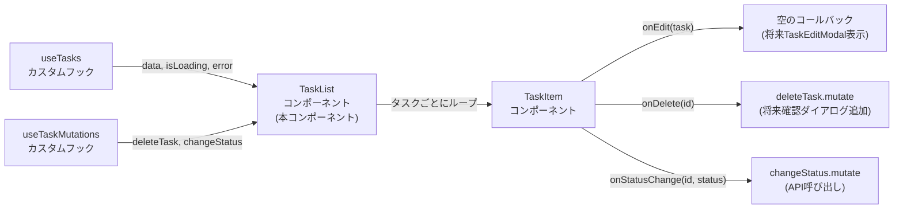
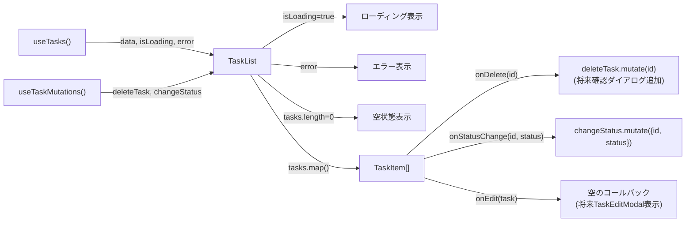

# TaskListコンポーネント TDD要件定義書

## ドキュメント情報

- **作成日**: 2025-12-12
- **要件名**: todo-app
- **タスク番号**: TASK-1332
- **機能名**: TaskListコンポーネント
- **担当**: フロントエンド
- **推定工数**: 8時間
- **レビュー日**: 2025-12-12（Codex MCP）

## 1. 機能の概要

🔵 **青信号**: TASK-1332タスク定義、既存設計から確実な要件

### 何をする機能か

タスク一覧を表示するReactコンポーネント。
複数のタスク情報を取得し、各タスクをTaskItemコンポーネントとして表示する。
ローディング状態、エラー状態、空状態の処理を行い、タスクの削除・ステータス変更の操作を親から子(TaskItem)へ委譲する。

**重要**: 本コンポーネントは**コンテナコンポーネント**であり、データ取得とミューテーション実行を担当する。
削除確認ダイアログ（REQ-105）と編集モーダル（REQ-002）は将来実装予定であり、現時点では空のコールバックを提供する。

### どのような問題を解決するか

**As a** ログイン済みユーザー
**I want** タスク一覧を一目で確認し、各タスクを操作できる
**So that** 自分のタスクの全体像を把握し、効率的に管理できる

### 想定されるユーザー

- デスクトップ環境でタスク管理を行うユーザー
- モバイル環境でも基本操作が可能（完全最適化はしない）

### システム内での位置づけ



TaskListコンポーネントはタスク一覧表示のコンテナコンポーネントとして機能し、
データ取得（useTasks）とミューテーション（useTaskMutations）を統合し、TaskItemに適切にプロパティを渡す。

### 参照したEARS要件

- **REQ-006**: タスク一覧表示（本コンポーネントの主要機能）
- **REQ-003**: タスク削除（削除ミューテーションの実行、確認ダイアログは将来実装）
- **REQ-004**: ステータス変更（ステータス変更ミューテーションの実行）

**将来実装予定**:
- **REQ-002**: タスク更新（編集ボタンのコールバック提供、将来TaskEditModalを表示）
- **REQ-105**: 削除確認ダイアログ（現時点では即時削除、将来ダイアログ追加予定）

### 参照した設計文書

- **アーキテクチャ**: `docs/design/todo-app/architecture.md` - フロントエンドの技術構成・Feature-basedディレクトリ
- **データフロー**: `docs/design/todo-app/dataflow.md` - タスク一覧取得フロー（フィルタ・ソート）
- **タスクファイル**: `docs/tasks/todo-app-phase7.md` - TASK-1332の実装詳細

## 2. 入力・出力の仕様

🔵 **青信号**: useTasks、useTaskMutations、TASK-1332の実装詳細から確実な仕様

### 入力パラメータ（Props）

**TaskListProps型定義**:

```typescript
export const TaskList: React.FC = () => {
  // Propsなし（自己完結型コンポーネント）
}
```

### データ取得（useTasks）

🔵 **青信号**: `app/client/src/features/todo/hooks/useTasks.ts`より

```typescript
const { data: tasks, isLoading, error } = useTasks();
```

- **data**: `Task[] | undefined` - タスク一覧（Redux状態のフィルタ・ソートが適用済み）
- **isLoading**: `boolean` - ローディング状態
- **error**: `Error | null` - エラー情報

**Task型定義**（`app/packages/shared-schemas/src/tasks.ts`から抽出）:

```typescript
type Task = {
  id: string;                  // UUID形式のタスクID
  userId: string;              // UUID形式のユーザーID
  title: string;               // タスクタイトル（1-100文字）
  description: string | null;  // タスク説明（Markdown形式）
  priority: 'high' | 'medium' | 'low';        // 優先度
  status: 'not_started' | 'in_progress' | 'in_review' | 'completed'; // ステータス
  createdAt: string;           // ISO 8601形式の作成日時
  updatedAt: string;           // ISO 8601形式の更新日時
};
```

### データ操作（useTaskMutations）

🔵 **青信号**: `app/client/src/features/todo/hooks/useTaskMutations.ts`より

```typescript
const { deleteTask, changeStatus } = useTaskMutations();
```

- **deleteTask**: `UseMutationResult<void, Error, string>` - タスク削除ミューテーション
  - `deleteTask.mutate(id: string)` でタスク削除を実行
- **changeStatus**: `UseMutationResult<Task, Error, { id: string, status: TaskStatus }>` - ステータス変更ミューテーション
  - `changeStatus.mutate({ id, status })` でステータス変更を実行

### 出力値

**React要素**: `React.ReactNode`

- ローディング状態: `<div>読み込み中...</div>`
- エラー状態: `<div>エラーが発生しました</div>`
- 空状態: `<div>タスクがありません</div>`
- タスク一覧: `<div className="space-y-0">{tasks.map(...)}</div>`

### 入出力の関係性

1. **入力**: useTasks()でタスク一覧取得、useTaskMutations()でミューテーション取得
2. **状態分岐**: isLoading → ローディング表示、error → エラー表示、tasks.length === 0 → 空状態表示
3. **タスク表示**: tasks.map()でTaskItemを生成
4. **ユーザー操作**: TaskItemから受け取ったコールバックでミューテーションを実行



### データフロー

🔵 **青信号**: `docs/design/todo-app/dataflow.md` - タスク一覧取得フロー、タスク削除フロー、ステータス変更フローより

**初期表示フロー**:
1. TaskListコンポーネントがマウントされる
2. useTasks()がRedux状態（フィルタ・ソート）を参照してAPI呼び出し
3. TanStack Queryがキャッシュをチェック（30秒以内ならキャッシュから表示）
4. キャッシュがない場合、`GET /api/tasks?status=...&sort=...`を実行
5. レスポンスを受け取り、`data`に格納
6. TaskListが`tasks.map()`でTaskItemを生成

**削除フロー（現時点）**:
1. ユーザーがTaskItemの「削除」ボタンをクリック
2. TaskItemが`onDelete(task.id)`を呼び出し
3. TaskListが`deleteTask.mutate(id)`を即時実行（確認ダイアログなし）
4. API呼び出し: `DELETE /api/tasks/{id}`
5. 成功時、TanStack Queryがキャッシュを無効化
6. useTasks()が自動的に再取得し、UIが更新される

**削除フロー（将来実装予定）**:
1. ユーザーがTaskItemの「削除」ボタンをクリック
2. TaskItemが`onDelete(task.id)`を呼び出し
3. TaskListが確認ダイアログを表示（REQ-105対応）
4. ユーザーが「削除」を選択した場合に`deleteTask.mutate(id)`を実行
5. ユーザーが「キャンセル」を選択した場合は何もしない
6. API呼び出し以降は現時点と同様

**ステータス変更フロー**:
1. ユーザーがTaskItemのステータスドロップダウンで新しいステータスを選択
2. TaskItemが`onStatusChange(task.id, newStatus)`を呼び出し
3. TaskListが`changeStatus.mutate({ id, status })`を実行
4. API呼び出し: `PATCH /api/tasks/{id}/status`
5. 成功時、TanStack Queryがキャッシュを無効化
6. useTasks()が自動的に再取得し、UIが更新される

**編集フロー（将来実装予定）**:
1. ユーザーがTaskItemの「編集」ボタンをクリック
2. TaskItemが`onEdit(task)`を呼び出し
3. TaskListが編集対象タスクを状態に保存（`useState`）
4. TaskEditModalコンポーネントを表示（REQ-002対応）
5. ユーザーがモーダルで編集し、保存ボタンをクリック
6. `updateTask.mutate({ id, input })`を実行
7. API呼び出し: `PUT /api/tasks/{id}`
8. 成功時、モーダルを閉じ、TanStack Queryがキャッシュを無効化
9. useTasks()が自動的に再取得し、UIが更新される

### 参照したEARS要件

- **REQ-006**: タスク一覧表示
- **REQ-003**: タスク削除（現時点は即時削除、将来確認ダイアログ追加）
- **REQ-004**: ステータス変更
- **REQ-105**: 削除確認ダイアログ（将来実装予定）
- **REQ-201**: 優先度フィルタ（Redux状態がuseTasks()で適用される）
- **REQ-202**: ステータスフィルタ（Redux状態がuseTasks()で適用される）
- **REQ-203**: ソート順（Redux状態がuseTasks()で適用される）

### 参照した設計文書

- **型定義**: `app/packages/shared-schemas/src/tasks.ts` - Task、TaskStatus
- **カスタムフック**: `app/client/src/features/todo/hooks/useTasks.ts` - タスク一覧取得
- **カスタムフック**: `app/client/src/features/todo/hooks/useTaskMutations.ts` - タスク操作
- **データフロー**: `docs/design/todo-app/dataflow.md` - タスク一覧取得フロー、タスク削除フロー、ステータス変更フロー

## 3. 制約条件

### パフォーマンス要件

🔵 **青信号**: NFR-001、NFR-003、NFR-004より

- **NFR-001**: タスク一覧取得APIは1秒以内にレスポンスを返さなければならない
- **NFR-003**: 100件のタスク表示時にスムーズなスクロールを提供しなければならない
- **NFR-004**: タスクフィルタ・ソート操作は即座にUIに反映されなければならない

**対策**:
- TanStack Queryのキャッシュ戦略（30秒）でAPI呼び出しを最小化
- TaskItemに`React.memo`を適用（TASK-1331で実装済み）
- Redux状態変更時、useTasks()が自動的に再取得（queryKey依存）

**仮想スクロールについて（将来検討）**:
🟡 **黄信号**: `docs/design/todo-app/dataflow.md`では`react-window`による仮想スクロールが記載されているが、本タスク（TASK-1332）では対象外とする。
100件程度のタスク表示であれば`React.memo`で十分なパフォーマンスが得られる。
1000件以上の大量タスク表示が必要になった場合、別タスクで仮想スクロールを検討する。

### セキュリティ要件

🔵 **青信号**: NFR-102、NFR-103より

- **NFR-102**: ユーザーは自分自身のタスクのみアクセス可能でなければならない（RLS）
- **NFR-103**: タスク操作APIはすべてJWT認証を必須とする

**対策**:
- useTasks()でJWT付きでAPI呼び出し（Supabase Auth統合）
- バックエンドのRLSで自動的にuser_idフィルタが適用される

### アクセシビリティ要件

🔵 **青信号**: NFR-202より

- **NFR-202**: 言語非依存の直感的UI
- ローディング表示、エラー表示、空状態表示に`aria-label`を設定（将来改善）
- TaskItemが`aria-label`を提供（TASK-1331で実装済み）

### アーキテクチャ制約

🔵 **青信号**: `docs/design/todo-app/architecture.md`、CLAUDE.mdより

- **Feature-basedディレクトリ構造**: `app/client/src/features/todo/components/TaskList.tsx`
- **Tailwind CSS 4**: ユーティリティファーストアプローチ
- **TypeScript**: 全面採用による型安全性確保
- **Bunテスト**: `bun:test`によるユニットテスト
- **TanStack React Query**: サーバー状態管理
- **Redux Toolkit**: UIフィルタ・ソート状態管理

### UI/UX制約

🔵 **青信号**: NFR-205より

- **NFR-205**: デスクトップ環境で快適に動作しなければならない（モバイルは基本動作のみ）
- ローディング表示: 中央配置、グレー文字
- エラー表示: 中央配置、赤文字
- 空状態表示: 中央配置、グレー文字
- タスク一覧: `space-y-0`でタスク間の余白なし（TaskItem内で境界線を持つため）

### データ制約

🔵 **青信号**: `app/client/src/features/todo/hooks/useTasks.ts`より

- `data`は`Task[] | undefined`（undefinedの場合は空配列にフォールバック）
- `error`は`Error | null`（nullの場合はエラー表示しない）
- `isLoading`は`boolean`（trueの場合はローディング表示）

### 受け入れ基準との整合性に関する注記

🟡 **黄信号**: Codex MCPレビュー結果より

**削除確認ダイアログ（REQ-105）について**:
- 受け入れ基準では削除前の確認ダイアログが必須とされている
- 現時点（TASK-1332）では即時削除として実装し、将来タスクで確認ダイアログを追加する
- テストケースには「削除ミューテーションが即時実行される」ことを明記

**完了操作UIについて**:
- 受け入れ基準には「完了チェックボックス」の記載があるが、現行実装はステータスセレクト（`<select>`）を採用
- TaskItemコンポーネント（TASK-1331）でステータスドロップダウンとして実装済み
- 本要件書ではステータスセレクト方式を前提とする

**編集モーダル（REQ-002）について**:
- 現時点（TASK-1332）では`onEdit`に空のコールバックを渡し、将来タスクでTaskEditModalを実装する
- テストケースには「編集ボタンが空のコールバックを呼び出す」ことを明記

### 参照したEARS要件

- **NFR-001**: タスク一覧取得パフォーマンス
- **NFR-003**: スクロールパフォーマンス
- **NFR-004**: フィルタ・ソート反映速度
- **NFR-102**: RLSによるユーザー分離
- **NFR-103**: JWT認証必須
- **NFR-202**: 言語非依存UI
- **NFR-205**: デスクトップ最適化
- **REQ-105**: 削除確認ダイアログ（将来実装予定）

### 参照した設計文書

- **アーキテクチャ**: `docs/design/todo-app/architecture.md` - フロントエンド技術構成、Feature-basedディレクトリ
- **カスタムフック**: `app/client/src/features/todo/hooks/useTasks.ts` - タスク一覧取得

## 4. 想定される使用例

### 基本的な使用パターン

🔵 **青信号**: TASK-1332実装詳細、REQ-006より

**TaskListコンポーネントの使用**:

```tsx
import { TaskList } from '@/features/todo/components/TaskList';

export default function TodoPage() {
  return (
    <div className="container mx-auto py-8">
      <h1 className="text-2xl font-bold mb-4">タスク一覧</h1>
      <TaskList />
    </div>
  );
}
```

**内部実装（現時点）**:

```tsx
import React from 'react';
import { useTasks } from '../hooks/useTasks';
import { useTaskMutations } from '../hooks/useTaskMutations';
import { TaskItem } from './TaskItem';
import type { TaskStatus } from '@/packages/shared-schemas/src/tasks';

export const TaskList: React.FC = () => {
  const { data: tasks, isLoading, error } = useTasks();
  const { deleteTask, changeStatus } = useTaskMutations();

  if (isLoading) {
    return <div className="text-center py-8">読み込み中...</div>;
  }

  if (error) {
    return <div className="text-center py-8 text-red-600">エラーが発生しました</div>;
  }

  if (!tasks || tasks.length === 0) {
    return <div className="text-center py-8 text-gray-500">タスクがありません</div>;
  }

  return (
    <div className="space-y-0">
      {tasks.map((task) => (
        <TaskItem
          key={task.id}
          task={task}
          onEdit={() => {/* 将来TaskEditModalを表示 */}}
          onDelete={(id) => deleteTask.mutate(id)}
          onStatusChange={(id, status: TaskStatus) => changeStatus.mutate({ id, status })}
        />
      ))}
    </div>
  );
};
```

**内部実装（将来実装予定）**:

```tsx
import React, { useState } from 'react';
import { useTasks } from '../hooks/useTasks';
import { useTaskMutations } from '../hooks/useTaskMutations';
import { TaskItem } from './TaskItem';
import { TaskEditModal } from './TaskEditModal'; // 将来実装
import type { Task, TaskStatus } from '@/packages/shared-schemas/src/tasks';

export const TaskList: React.FC = () => {
  const { data: tasks, isLoading, error } = useTasks();
  const { deleteTask, changeStatus, updateTask } = useTaskMutations();
  const [editingTask, setEditingTask] = useState<Task | null>(null);
  const [deletingTaskId, setDeletingTaskId] = useState<string | null>(null);

  const handleDelete = (id: string) => {
    setDeletingTaskId(id);
    // 確認ダイアログを表示（REQ-105）
    if (window.confirm('本当に削除しますか？')) {
      deleteTask.mutate(id);
    }
    setDeletingTaskId(null);
  };

  if (isLoading) {
    return <div className="text-center py-8">読み込み中...</div>;
  }

  if (error) {
    return <div className="text-center py-8 text-red-600">エラーが発生しました</div>;
  }

  if (!tasks || tasks.length === 0) {
    return <div className="text-center py-8 text-gray-500">タスクがありません</div>;
  }

  return (
    <>
      <div className="space-y-0">
        {tasks.map((task) => (
          <TaskItem
            key={task.id}
            task={task}
            onEdit={(task) => setEditingTask(task)}
            onDelete={handleDelete}
            onStatusChange={(id, status: TaskStatus) => changeStatus.mutate({ id, status })}
          />
        ))}
      </div>

      {editingTask && (
        <TaskEditModal
          task={editingTask}
          onClose={() => setEditingTask(null)}
          onSave={(input) => {
            updateTask.mutate({ id: editingTask.id, input });
            setEditingTask(null);
          }}
        />
      )}
    </>
  );
};
```

### エッジケース

🟡 **黄信号**: 一般的なReactコンポーネントのエッジケースから妥当な推測

#### EDGE-001: タスク数が0件の場合

**シナリオ**:
- `tasks`が空配列（`[]`）の場合
- 「タスクがありません」メッセージを表示

**期待動作**:
```tsx
if (!tasks || tasks.length === 0) {
  return <div className="text-center py-8 text-gray-500">タスクがありません</div>;
}
```

#### EDGE-002: データがundefinedの場合

**シナリオ**:
- `data`が`undefined`の場合（初回レンダリング時など）
- 「タスクがありません」メッセージを表示

**期待動作**:
```tsx
if (!tasks || tasks.length === 0) {
  return <div className="text-center py-8 text-gray-500">タスクがありません</div>;
}
```

#### EDGE-003: ローディング中の場合

**シナリオ**:
- `isLoading`が`true`の場合
- 「読み込み中...」メッセージを表示

**期待動作**:
```tsx
if (isLoading) {
  return <div className="text-center py-8">読み込み中...</div>;
}
```

#### EDGE-004: エラーが発生した場合

**シナリオ**:
- `error`が存在する場合
- 「エラーが発生しました」メッセージを赤文字で表示

**期待動作**:
```tsx
if (error) {
  return <div className="text-center py-8 text-red-600">エラーが発生しました</div>;
}
```

#### EDGE-005: タスク削除後のキャッシュ無効化

**シナリオ**:
- タスク削除成功後、TanStack Queryがキャッシュを無効化
- useTasks()が自動的に再取得し、UIが更新される

**期待動作**:
```tsx
onDelete={(id) => deleteTask.mutate(id)}
// useTaskMutations内でonSuccess時にinvalidateQueriesが実行される
```

#### EDGE-006: ステータス変更後のキャッシュ無効化

**シナリオ**:
- ステータス変更成功後、TanStack Queryがキャッシュを無効化
- useTasks()が自動的に再取得し、UIが更新される

**期待動作**:
```tsx
onStatusChange={(id, status) => changeStatus.mutate({ id, status })}
// useTaskMutations内でonSuccess時にinvalidateQueriesが実行される
```

### エラーケース

🟡 **黄信号**: 一般的なReactコンポーネントのエラーハンドリングから妥当な推測

#### ERROR-001: API呼び出し失敗時

**シナリオ**:
- ネットワークエラー、サーバーエラーでAPI呼び出しが失敗
- `error`にエラー情報が格納される

**期待動作**:
- 「エラーが発生しました」メッセージを赤文字で表示
- useTasks()がリトライ戦略を適用（TanStack Queryのデフォルト）

#### ERROR-002: 削除ミューテーション失敗時

**シナリオ**:
- タスク削除APIが失敗（404、403など）
- `deleteTask.error`にエラー情報が格納される

**期待動作**:
- TanStack Queryがエラー状態を管理
- 親コンポーネントでエラートースト表示（将来実装）

#### ERROR-003: ステータス変更ミューテーション失敗時

**シナリオ**:
- ステータス変更APIが失敗（400、404など）
- `changeStatus.error`にエラー情報が格納される

**期待動作**:
- TanStack Queryがエラー状態を管理
- 親コンポーネントでエラートースト表示（将来実装）

### 参照したEARS要件

- **REQ-006**: タスク一覧表示
- **EDGE-101**: タスク数が0件の場合
- **EDGE-005**: ネットワークエラー時

### 参照した設計文書

- **タスクファイル**: `docs/tasks/todo-app-phase7.md` - TASK-1332実装詳細
- **データフロー**: `docs/design/todo-app/dataflow.md` - エラーハンドリングフロー

## 5. EARS要件・設計文書との対応関係

### 参照したユーザストーリー

🔵 **青信号**: `docs/spec/todo-app-user-stories.md`より

- **US-006**: タスク一覧表示（本コンポーネントの主要機能）
- **US-003**: タスク削除（削除ミューテーション実行、確認ダイアログは将来実装）
- **US-004**: ステータス変更（ステータス変更ミューテーション実行）

### 参照した機能要件

🔵 **青信号**: `docs/spec/todo-app-requirements.md`より

- **REQ-006**: タスク一覧表示（本コンポーネントの主要機能）
- **REQ-003**: タスク削除（削除ミューテーション実行、確認ダイアログは将来実装）
- **REQ-004**: ステータス変更（ステータス変更ミューテーション実行）
- **REQ-201**: 優先度フィルタ（Redux状態がuseTasks()で適用される）
- **REQ-202**: ステータスフィルタ（Redux状態がuseTasks()で適用される）
- **REQ-203**: ソート順（Redux状態がuseTasks()で適用される）

**スコープ外（将来実装予定）**:
- **REQ-001**: タスク作成（TaskCreateFormコンポーネントが担当）
- **REQ-002**: タスク更新（TaskEditModalコンポーネントが担当、将来実装）
- **REQ-105**: 削除確認ダイアログ（将来実装）

### 参照した非機能要件

🔵 **青信号**: `docs/spec/todo-app-requirements.md`より

- **NFR-001**: タスク一覧取得パフォーマンス（1秒以内）
- **NFR-003**: スクロールパフォーマンス（100件でスムーズ）
- **NFR-004**: フィルタ・ソート反映速度（即座にUI反映）
- **NFR-102**: RLSによるユーザー分離
- **NFR-103**: JWT認証必須
- **NFR-202**: 言語非依存の直感的UI
- **NFR-205**: デスクトップ環境での快適性

**スコープ外**:
- **NFR-201**: テーマカラー適用（TaskItemコンポーネントが担当）
- **NFR-203**: インライン入力（TaskCreateFormコンポーネントが担当）
- **NFR-204**: モーダル編集（TaskEditModalコンポーネントが担当、将来実装）

### 参照したEdgeケース

🟡 **黄信号**: 一般的なReactコンポーネントのエッジケースから妥当な推測

- **EDGE-001**: タスク数が0件の場合
- **EDGE-002**: データがundefinedの場合
- **EDGE-003**: ローディング中の場合
- **EDGE-004**: エラーが発生した場合
- **EDGE-005**: タスク削除後のキャッシュ無効化
- **EDGE-006**: ステータス変更後のキャッシュ無効化

**EARS要件から**:
- **EDGE-101**: タスク数が0件の場合（「タスクがありません」表示）
- **EDGE-005**: ネットワークエラー時（「通信エラーが発生しました」表示）

### 参照した受け入れ基準

🔵 **青信号**: `docs/spec/todo-app-acceptance-criteria.md`より

- タスク一覧がデフォルトで作成日時（新しい順）で表示される
- 優先度フィルタでタスクを絞り込める（Redux状態がuseTasks()で適用）
- ステータスフィルタ（複数選択可能）でタスクを絞り込める（Redux状態がuseTasks()で適用）
- ソート機能で並び順を変更できる（Redux状態がuseTasks()で適用）
- タスク一覧取得が1秒以内
- 100件のタスクでスムーズにスクロールできる

**受け入れ基準との差分（将来対応予定）**:
- 削除確認ダイアログ（REQ-003受け入れ基準）：現時点では即時削除、将来ダイアログ追加
- 編集モーダル（REQ-002受け入れ基準）：現時点では空のコールバック、将来モーダル実装

### 参照した設計文書

🔵 **青信号**: 各設計文書より

- **アーキテクチャ**: `docs/design/todo-app/architecture.md`
  - フロントエンド技術構成（Next.js 15、React 19、TypeScript 5、Tailwind CSS 4）
  - Feature-basedディレクトリ構造
  - Redux + TanStack Query による状態管理
- **データフロー**: `docs/design/todo-app/dataflow.md`
  - タスク一覧取得フロー（フィルタ・ソート）
  - タスク削除フロー
  - ステータス変更フロー
  - エラーハンドリングフロー
  - サーバー状態キャッシュフロー
- **型定義**: `app/packages/shared-schemas/src/tasks.ts`
  - Task型定義
  - TaskStatus型定義
- **カスタムフック**: `app/client/src/features/todo/hooks/useTasks.ts`
  - タスク一覧取得（Redux状態のフィルタ・ソート適用）
- **カスタムフック**: `app/client/src/features/todo/hooks/useTaskMutations.ts`
  - タスク削除ミューテーション
  - ステータス変更ミューテーション
- **TaskItemコンポーネント**: `app/client/src/features/todo/components/TaskItem.tsx`
  - 個別タスク表示（TASK-1331で実装済み）
- **タスクファイル**: `docs/tasks/todo-app-phase7.md`
  - TASK-1332実装詳細
  - テストケース

## 6. テストケース概要

🔵 **青信号**: TASK-1332テストケースより

### 正常系

- タスク一覧が表示される（複数のTaskItemが生成される）
- タスクがkeyプロパティで一意に識別される（`key={task.id}`）
- ローディング表示が正しく表示される（`isLoading=true`の場合）
- エラー表示が正しく表示される（`error`が存在する場合）
- 空状態表示が正しく表示される（`tasks.length === 0`の場合）
- `data`が`undefined`の場合は空状態表示される

### イベント系

- タスク削除ボタンクリック時に`deleteTask.mutate(id)`が即時呼び出される（確認ダイアログなし）
- ステータス変更時に`changeStatus.mutate({ id, status })`が呼び出される
- タスク削除成功後、TanStack Queryがキャッシュを無効化し、useTasks()が再取得する
- ステータス変更成功後、TanStack Queryがキャッシュを無効化し、useTasks()が再取得する
- 編集ボタンクリック時に空のコールバックが呼び出される（将来TaskEditModal表示）

### UI/UX系

- ローディング表示は中央配置（`text-center py-8`）
- エラー表示は中央配置・赤文字（`text-center py-8 text-red-600`）
- 空状態表示は中央配置・グレー文字（`text-center py-8 text-gray-500`）
- タスク一覧は`space-y-0`で余白なし

### データフロー系

- useTasks()がRedux状態（フィルタ・ソート）を参照してAPI呼び出しする
- Redux状態変更時、useTasks()が自動的に再取得する（queryKey依存）
- TanStack Queryがキャッシュを適用する（30秒）
- キャッシュがない場合、API呼び出しを実行する

### エラーハンドリング系

- ネットワークエラー時、`error`にエラー情報が格納される
- API呼び出し失敗時、「エラーが発生しました」メッセージが表示される
- 削除ミューテーション失敗時、`deleteTask.error`にエラー情報が格納される
- ステータス変更ミューテーション失敗時、`changeStatus.error`にエラー情報が格納される

### パフォーマンス系

- TaskItemに`React.memo`が適用されている（TASK-1331で実装済み）
- Propsが変更されない限りTaskItemが再レンダリングされない
- TanStack Queryがキャッシュを適用し、不要なAPI呼び出しを削減する

### 将来実装予定のテストケース

- 削除ボタンクリック時に確認ダイアログが表示される（REQ-105対応）
- 確認ダイアログで「キャンセル」選択時にタスクが削除されない
- 編集ボタンクリック時にTaskEditModalが表示される（REQ-002対応）
- TaskEditModalで保存時に`updateTask.mutate`が呼び出される

## 7. 実装ファイルパス

🔵 **青信号**: TASK-1332、Feature-basedディレクトリ構造より

- **実装ファイル**: `app/client/src/features/todo/components/TaskList.tsx`
- **テストファイル**: `app/client/src/features/todo/components/__tests__/TaskList.test.tsx`
- **型定義**: `app/packages/shared-schemas/src/tasks.ts`（既存）
- **カスタムフック**: `app/client/src/features/todo/hooks/useTasks.ts`（既存）
- **カスタムフック**: `app/client/src/features/todo/hooks/useTaskMutations.ts`（既存）
- **TaskItemコンポーネント**: `app/client/src/features/todo/components/TaskItem.tsx`（既存、TASK-1331で実装済み）

## 8. 依存関係

### 依存するコンポーネント

- **TaskItem**: 個別タスク表示コンポーネント（TASK-1331で実装済み）

### 依存するカスタムフック

🔵 **青信号**: 各カスタムフックのファイルより

- **useTasks**: タスク一覧取得フック（`app/client/src/features/todo/hooks/useTasks.ts`）
  - Redux状態（フィルタ・ソート）を参照してAPI呼び出し
  - TanStack Queryでキャッシュ管理
- **useTaskMutations**: タスク操作フック（`app/client/src/features/todo/hooks/useTaskMutations.ts`）
  - `deleteTask`: タスク削除ミューテーション
  - `changeStatus`: ステータス変更ミューテーション

### 依存するスキーマ

🔵 **青信号**: `app/packages/shared-schemas/src/tasks.ts`より

- **Task**: タスク情報の型定義
- **TaskStatus**: ステータスの型定義

### 依存するライブラリ

- **@tanstack/react-query**: サーバー状態管理
- **react**: Reactコア
- **tailwindcss**: スタイリング

## 9. 完了条件

- [ ] TaskListコンポーネントが実装される
- [ ] すべてのテストケースが通る（bun test）
- [ ] テストカバレッジ100%
- [ ] 型チェックがパスする（bun run typecheck）
- [ ] Biomeチェックがパスする（bun run lint）
- [ ] Codex MCPレビューで品質確認完了
- [ ] ローディング・エラー・空状態の表示が正しく機能する
- [ ] タスク削除・ステータス変更が正しく機能する（削除は即時実行、確認ダイアログは将来実装）
- [ ] 編集ボタンが空のコールバックを呼び出す（将来TaskEditModal実装）
- [ ] TanStack Queryのキャッシュ戦略が機能する
- [ ] Redux状態（フィルタ・ソート）がuseTasks()で適用される
- [ ] TaskItemに適切にPropsが渡される

## 10. 将来実装予定の機能

🟡 **黄信号**: Codex MCPレビュー結果より

### 削除確認ダイアログ（REQ-105）

**実装タスク**: TASK-1335以降（別タスク）

**実装内容**:
- `useState`で削除対象タスクIDを管理
- 削除ボタンクリック時に確認ダイアログ（またはモーダル）を表示
- 「削除」選択時に`deleteTask.mutate(id)`を実行
- 「キャンセル」選択時は何もしない

**テストケース追加**:
- 削除ボタンクリック時に確認ダイアログが表示される
- 「削除」選択時にタスクが削除される
- 「キャンセル」選択時にタスクが削除されない

### 編集モーダル（REQ-002）

**実装タスク**: TASK-1334（TaskEditModalコンポーネント）

**実装内容**:
- `useState`で編集対象タスクを管理
- 編集ボタンクリック時にTaskEditModalコンポーネントを表示
- モーダルで編集し、保存ボタンクリック時に`updateTask.mutate`を実行
- モーダルを閉じる際に状態をリセット

**テストケース追加**:
- 編集ボタンクリック時にTaskEditModalが表示される
- モーダルで保存時に`updateTask.mutate`が呼び出される
- モーダルを閉じる際に状態がリセットされる

### 仮想スクロール（NFR-003拡張）

**実装タスク**: 将来検討（1000件以上のタスク表示が必要になった場合）

**実装内容**:
- `react-window`または`react-virtualized`を導入
- 可視領域のみレンダリングしてスクロールパフォーマンスを最適化
- 100件程度であれば`React.memo`で十分なため、現時点では不要
