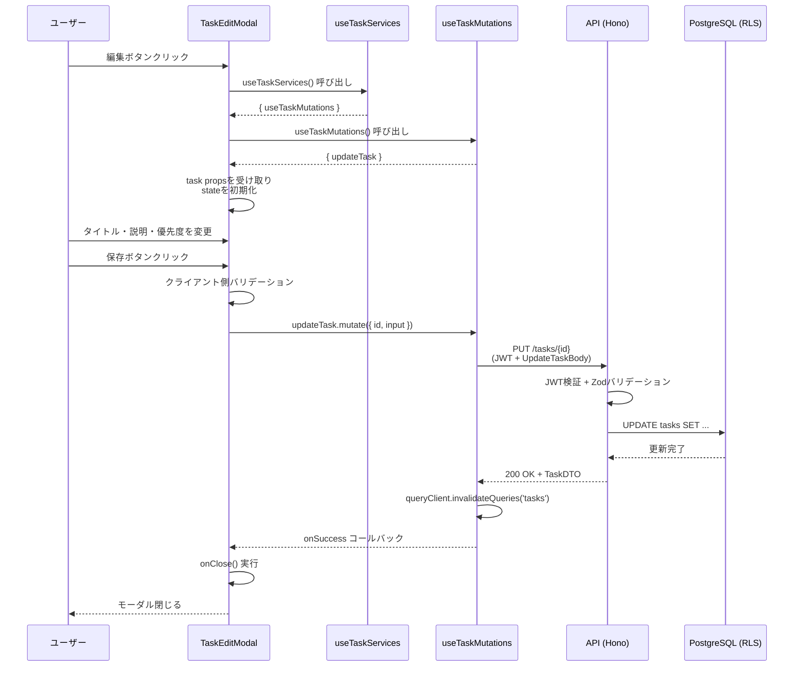
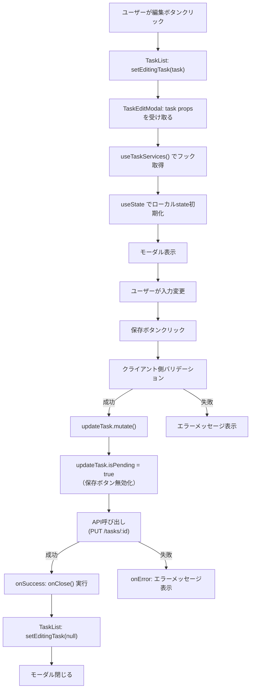

# TaskEditModalコンポーネント - TDD要件定義書

## 📄 ドキュメント情報

- **作成日**: 2025-12-15
- **更新日**: 2025-12-15
- **タスク番号**: TASK-1334
- **要件名**: todo-app
- **機能名**: TaskEditModalコンポーネント
- **実装ファイル**: `app/client/src/features/todo/components/TaskEditModal.tsx`

---

## 1. 機能の概要

🔵 *TASK-1334、todo-app-requirements.md REQ-002、NFR-204*

TaskEditModalは、既存タスクの詳細情報（タイトル・説明・優先度）を編集するためのモーダルダイアログコンポーネントです。

### 何をする機能か

- ユーザーが選択したタスクの情報をモーダルダイアログで表示・編集できる
- タスクのタイトル、説明（Markdown対応）、優先度を変更できる
- 保存ボタンでタスク更新を実行し、キャンセルボタンでモーダルを閉じる

### どのような問題を解決するか

- **問題**: タスク一覧画面でインライン編集すると画面が狭く、複数フィールドの同時編集が困難
- **解決**: モーダルダイアログで専用の編集画面を提供し、タイトル・説明・優先度をまとめて変更可能にする

### 想定されるユーザー

- **As a** ログイン済みのタスク管理ユーザー
- **So that** 既存タスクの詳細情報を効率的に修正できる

### システム内での位置づけ

- **フロントエンド**: Next.js 15 (SSG) + React 19 + TypeScript 5
- **状態管理**: TanStack React Query（サーバー状態）、ローカルstate（フォーム入力値）
- **親コンポーネント**: TaskList（タスク一覧）
- **依存Context**: `TaskServicesProvider`（Context-based DI）
- **フック取得方法**: `useTaskServices()` から `useTaskMutations` を取得

### 参照したEARS要件

- **REQ-002**: システムはタスクのタイトル・説明・優先度を更新できなければならない
- **REQ-104**: ユーザーがタスクを作成する場合、システムはデフォルトでステータスを「未着手」に設定しなければならない（編集時はステータス保持）
- **NFR-204**: タスクの詳細編集はモーダルで実施できなければならない

### 参照した設計文書

- **アーキテクチャ**: [architecture.md](../../../design/todo-app/architecture.md) - フロントエンドセクション、Context-based DI
- **API仕様**: [api-endpoints.md](../../../design/todo-app/api-endpoints.md) - PUT /tasks/{id}
- **タスクファイル**: [todo-app-phase7.md](../../../tasks/todo-app-phase7.md) Line:261-372

---

## 2. 入力・出力の仕様

🔵 *app/packages/shared-schemas/src/tasks.ts、useTaskMutations.ts*

### 入力パラメータ（Props）

```typescript
interface TaskEditModalProps {
  /** 編集対象のタスク情報（nullの場合はモーダル非表示） */
  task: Task | null;
  /** モーダルを閉じる際のコールバック */
  onClose: () => void;
}
```

#### Task型定義（shared-schemas）

🔵 *app/packages/shared-schemas/src/tasks.ts*

```typescript
type Task = {
  id: string;                  // UUID
  userId: string;              // UUID
  title: string;               // 1-100文字
  description: string | null;  // Markdown記法対応、制限なし
  priority: 'high' | 'medium' | 'low';
  status: 'not_started' | 'in_progress' | 'in_review' | 'completed';
  createdAt: string;           // ISO8601形式
  updatedAt: string;           // ISO8601形式
};
```

### 内部状態（ローカルstate）

🟡 *TaskCreateForm.tsxの実装パターンを参考*

```typescript
const [title, setTitle] = useState<string>(task?.title || '');
const [description, setDescription] = useState<string>(task?.description || '');
const [priority, setPriority] = useState<'high' | 'medium' | 'low'>(task?.priority || 'medium');
```

### Context-based DIによるフック取得

🔵 *TaskCreateForm.tsx L19-21、TaskServicesContext.tsx*

```typescript
const services = useTaskServices();
const { updateTask } = services.useTaskMutations();
```

### 出力値（API呼び出し）

🔵 *useTaskMutations.ts L124-150*

**APIエンドポイント**: `PUT /tasks/{id}`

**リクエストボディ（UpdateTaskBody）**:

🔵 *仕様明確化: 全フィールドを常に送信*

```typescript
{
  title: string;               // 1-100文字（現在の値を常に送信）
  description: string | null;  // Markdown記法対応（現在の値を常に送信）
  priority: 'high' | 'medium' | 'low'; // 現在の値を常に送信
}
```

**レスポンス（UpdateTaskResponse）**:

```typescript
{
  data: Task; // 更新後のタスク情報
}
```

### 入出力の関係性

1. **初期化フロー**:
   - `task` propsを受け取る → ローカルstateを初期化（`title`, `description`, `priority`）
   - `task === null` の場合は `null` を返してモーダル非表示

2. **送信フロー**:
   - フォームsubmit → クライアント側バリデーション → `updateTask.mutate()` 呼び出し
   - 引数: `{ id: task.id, input: { title, description, priority } }` （全フィールドを送信）
   - 成功時 → `onClose()` 実行 → 親コンポーネントがモーダル状態をクリア
   - 失敗時 → エラーメッセージ表示（初期実装で対応）

### データフロー

🔵 *architecture.md - タスク作成フロー（更新フローも同様）*



### 参照したEARS要件

- **REQ-002**: システムはタスクのタイトル・説明・優先度を更新できなければならない
- **EDGE-001**: タイトルが空文字の場合、システムは「タイトルを入力してください」エラーを表示する
- **EDGE-002**: タイトルが100文字を超える場合、システムは「タイトルは100文字以内で入力してください」エラーを表示する

### 参照した設計文書

- **型定義**: [app/packages/shared-schemas/src/tasks.ts](../../../../app/packages/shared-schemas/src/tasks.ts) - Task型、UpdateTaskBody型
- **フック**: [app/client/src/features/todo/hooks/useTaskMutations.ts](../../../../app/client/src/features/todo/hooks/useTaskMutations.ts) - updateTask実装
- **Context**: [app/client/src/features/todo/lib/TaskServicesContext.tsx](../../../../app/client/src/features/todo/lib/TaskServicesContext.tsx) - useTaskServices実装

---

## 3. 制約条件

### パフォーマンス要件

🔴 *NFR-002（タスク作成）を更新にも類推適用（タスク更新専用のNFRは存在しない）*

- **想定**: タスク更新APIは500ms以内にレスポンスを返すことが望ましい（NFR-002準拠）
- **クライアント側最適化**: TanStack Queryのキャッシュ無効化により、UIが即座に最新状態を反映する

### セキュリティ要件

🔵 *NFR-102、NFR-103、NFR-104*

- **NFR-102**: ユーザーは自分自身のタスクのみアクセス可能でなければならない（RLS）
- **NFR-103**: タスク操作APIはすべてJWT認証を必須とする
- **NFR-104**: タスクの入力値はサーバーサイドでZodバリデーションを実施しなければならない
- **クライアント側バリデーション**: サーバー側バリデーションに加え、クライアント側でも空文字・文字数制限をチェック

### 互換性要件

🔵 *CLAUDE.md、フロントエンド開発ガイドライン*

- **React 19.1.0**: 最新のReact機能を活用
- **TypeScript 5**: 型安全性を厳守
- **Tailwind CSS 4**: ベースカラー `#710000`、アクセントカラー `#ff6a00` を適用
- **Bun標準テスト**: `bun:test`を使用したユニット/統合テスト

### アーキテクチャ制約

🔵 *architecture.md、CLAUDE.md、frontend.md*

- **Context-based DI**: `TaskServicesProvider`を使用して`useTaskMutations`を注入
- **フック取得**: `useTaskServices()` から `useTaskMutations` を取得（直接importしない）
- **Propsの明示的使用**: `props.task`, `props.onClose`のように記述（`CLAUDE.md`必須項目）
- **React.memo**: パフォーマンス最適化のため`React.memo`でラップ
- **コンポーネント定義形式**:
  ```typescript
  function TaskEditModal(props: TaskEditModalProps): React.ReactNode {
    const services = useTaskServices();
    const { updateTask } = services.useTaskMutations();
    // ...
  }
  export default React.memo(TaskEditModal);
  ```

### データベース制約

🔵 *todo-app-requirements.md L136-187*

- **title**: VARCHAR(100)、NOT NULL、CHECK制約（空文字不可）
- **description**: TEXT、NULL許可
- **priority**: VARCHAR(10)、CHECK制約（'high', 'medium', 'low'のみ）
- **RLS Policy**: `user_id = current_setting('app.current_user_id')::uuid`

### API制約

🔵 *useTaskMutations.ts、updateTaskBodySchema*

- **HTTPメソッド**: PUT `/tasks/{id}`
- **リクエストヘッダー**: `Authorization: Bearer {JWT}`
- **リクエストボディ**: `UpdateTaskBody`（title, description, priorityは全てオプショナルだが、全フィールドを送信）
- **成功レスポンス**: 200 OK + `{ data: Task }`
- **エラーレスポンス**:
  - 400 Bad Request: バリデーションエラー
  - 401 Unauthorized: JWT不正
  - 404 Not Found: タスク不存在 or RLSで拒否

### 参照したEARS要件

- **REQ-402**: システムはSupabase AuthのJWT認証を使用しなければならない
- **REQ-403**: システムはRow-Level Security(RLS)を使用してユーザーごとのタスク分離を実現しなければならない
- **REQ-409**: システムはBun標準テストを使用したTDD開発を実施しなければならない
- **NFR-102**: ユーザーは自分自身のタスクのみアクセス可能でなければならない(RLS)
- **NFR-104**: タスクの入力値はサーバーサイドでZodバリデーションを実施しなければならない
- **NFR-201**: UIはテーマカラー(ベース#710000、アクセント#ff6a00)を適用しなければならない

### 参照した設計文書

- **アーキテクチャ**: [architecture.md](../../../design/todo-app/architecture.md) - セキュリティフロー（RLS）
- **データベース**: [todo-app-requirements.md](../../../spec/todo-app-requirements.md) L136-187 - tasksテーブル定義

---

## 4. 想定される使用例

### 基本的な使用パターン

#### 正常系: モーダルが表示される

🔵 *TASK-1334 テストケース*

**Given**: ユーザーがタスク一覧画面で「編集」ボタンをクリック

**When**: `TaskEditModal`がマウントされ、`task` propsに編集対象のタスク情報が渡される

**Then**:
- モーダルダイアログが画面中央に表示される
- タイトル入力欄に既存のタイトルが表示される
- 説明入力欄に既存の説明が表示される（nullの場合は空文字）
- 優先度選択欄に既存の優先度が選択される
- 「保存」ボタンと「キャンセル」ボタンが表示される

#### 正常系: タスクが更新される

🔵 *TASK-1334 テストケース*

**Given**: モーダルが表示されている状態

**When**: ユーザーがタイトルを「新しいタイトル」に変更し、「保存」ボタンをクリック

**Then**:
- `updateTask.mutate()` が呼ばれる
- 引数: `{ id: task.id, input: { title: '新しいタイトル', description: (現在の値), priority: (現在の値) } }`
- API成功時に `onClose()` が実行される
- モーダルが閉じる
- タスク一覧が自動的に再取得される（TanStack Queryのキャッシュ無効化）

#### 正常系: モーダルを閉じる（キャンセルボタン）

🔵 *TASK-1334 テストケース、TaskCreateForm.test.tsxのパターン*

**Given**: モーダルが表示されている状態

**When**: ユーザーが「キャンセル」ボタンをクリック

**Then**:
- `props.onClose()` が実行される
- モーダルが閉じる
- タスク情報は変更されない

#### 正常系: task === null でモーダル非表示

🟡 *TASK-1334実装詳細（L289）*

**Given**: `TaskEditModal`がマウントされている

**When**: `task` propsが `null`

**Then**:
- `return null;` が実行される
- モーダルは表示されない

#### 正常系: 送信中は保存ボタンが無効化される

🔵 *TaskCreateForm.tsx L105、frontend.md - ローディング状態*

**Given**: モーダルが表示されている状態

**When**: ユーザーが「保存」ボタンをクリックし、`updateTask.isPending === true`

**Then**:
- 保存ボタンが無効化される（`disabled={updateTask.isPending}`）
- 二重送信が防止される

### エラーケース

#### 異常系: タイトルが空文字の場合にエラー表示

🔵 *EDGE-001、TaskCreateForm.test.tsxのパターン*

**Given**: モーダルが表示されている状態

**When**: ユーザーがタイトルを空文字にして「保存」ボタンをクリック

**Then**:
- クライアント側バリデーションで拒否される
- エラーメッセージ「タイトルを入力してください」が表示される
- `updateTask.mutate()` は呼ばれない

#### 異常系: タイトルが100文字を超える場合に入力制限

🔵 *EDGE-002、TaskCreateForm.test.tsxのパターン*

**Given**: モーダルが表示されている状態

**When**: ユーザーがタイトルに101文字目を入力しようとする

**Then**:
- `maxLength={100}` 属性により101文字目以降は入力不可
- エラーメッセージは表示されない（入力自体が制限される）

#### 異常系: API更新失敗時のエラー表示

🔵 *useTaskMutations.ts L131-134、TaskCreateForm.test.tsxのエラーハンドリング*

**Given**: モーダルが表示されている状態

**When**: ユーザーが「保存」ボタンをクリックし、API呼び出しが失敗

**Then**:
- `updateTask.mutate()`のonErrorコールバックが実行される
- エラーメッセージ「タスク更新に失敗しました」が表示される
- モーダルは閉じない

### エッジケース

#### エッジケース: 説明がnullの場合

🟡 *Task型定義、TaskItem.tsxの実装パターン*

**Given**: タスクの`description`が`null`

**When**: モーダルが表示される

**Then**:
- 説明入力欄は空文字で初期化される（`task?.description || ''`）
- ユーザーは説明を新規入力できる

#### エッジケース: 優先度が変更されない場合

🔵 *UpdateTaskBodyの仕様（全フィールド送信）*

**Given**: モーダルが表示されている状態

**When**: ユーザーがタイトルのみ変更し、優先度は変更しない

**Then**:
- `updateTask.mutate()` の `input` には変更されたタイトルと、変更されていない説明・優先度が含まれる
- APIリクエストには全フィールド（title, description, priority）が送信される

#### エッジケース: モーダル表示中にtask propsが変更される

🔴 *想定される動作（既存資料にない推測）*

**Given**: モーダルが表示されている状態

**When**: 親コンポーネントが`task` propsを更新

**Then**:
- ローカルstateは更新されない（useState初期化は初回マウント時のみ）
- ユーザーが編集中の内容が保持される
- **推奨**: 親コンポーネントはモーダル表示中に`task`を変更しない設計とする

### データフロー

🔵 *architecture.md - タスク作成フロー（更新も同様）*



### 参照したEARS要件

- **REQ-002**: システムはタスクのタイトル・説明・優先度を更新できなければならない
- **EDGE-001**: タイトルが空文字の場合、システムは「タイトルを入力してください」エラーを表示する
- **EDGE-002**: タイトルが100文字を超える場合、システムは「タイトルは100文字以内で入力してください」エラーを表示する
- **EDGE-003**: 存在しないタスクを更新・削除しようとした場合、システムは404エラーを返す（API側で処理）
- **EDGE-005**: ネットワークエラー時、システムは「通信エラーが発生しました。再試行してください」と表示する

### 参照した設計文書

- **データフロー**: [architecture.md](../../../design/todo-app/architecture.md) - タスク作成フロー
- **参考実装**: [app/client/src/features/todo/components/TaskCreateForm.tsx](../../../../app/client/src/features/todo/components/TaskCreateForm.tsx)

---

## 5. EARS要件・設計文書との対応関係

### 参照したユーザストーリー

- **ストーリー名**: タスク編集機能（詳細はtodo-app-user-stories.md参照）

### 参照した機能要件

- **REQ-002**: システムはタスクのタイトル・説明・優先度を更新できなければならない 🔵
- **REQ-104**: ユーザーがタスクを作成する場合、システムはデフォルトでステータスを「未着手」に設定しなければならない（編集時はステータス保持） 🔵

### 参照した非機能要件

- **NFR-002**: タスク作成APIは500ms以内にレスポンスを返さなければならない（更新にも類推適用） 🔴
- **NFR-102**: ユーザーは自分自身のタスクのみアクセス可能でなければならない(RLS) 🔵
- **NFR-103**: タスク操作APIはすべてJWT認証を必須とする 🔵
- **NFR-104**: タスクの入力値はサーバーサイドでZodバリデーションを実施しなければならない 🔵
- **NFR-201**: UIはテーマカラー(ベース#710000、アクセント#ff6a00)を適用しなければならない 🔵
- **NFR-204**: タスクの詳細編集はモーダルで実施できなければならない 🔵

### 参照したEdgeケース

- **EDGE-001**: タイトルが空文字の場合、システムは「タイトルを入力してください」エラーを表示する 🟡
- **EDGE-002**: タイトルが100文字を超える場合、システムは「タイトルは100文字以内で入力してください」エラーを表示する 🔴
- **EDGE-003**: 存在しないタスクを更新・削除しようとした場合、システムは404エラーを返す 🟡
- **EDGE-005**: ネットワークエラー時、システムは「通信エラーが発生しました。再試行してください」と表示する 🟡

### 参照した受け入れ基準

- タスク編集モーダルが表示されること
- タスク情報が正常に更新されること
- バリデーションエラーが適切に表示されること
- キャンセル操作が正常に動作すること
- 送信中は保存ボタンが無効化されること

### 参照した設計文書

- **アーキテクチャ**: [architecture.md](../../../design/todo-app/architecture.md)
  - フロントエンド構成
  - セキュリティフロー（RLS）
  - タスク作成フロー（更新も同様）
- **データフロー**: 上記アーキテクチャ内のシーケンス図参照
- **型定義**: [app/packages/shared-schemas/src/tasks.ts](../../../../app/packages/shared-schemas/src/tasks.ts)
  - Task型
  - UpdateTaskBody型
- **データベース**: [todo-app-requirements.md](../../../spec/todo-app-requirements.md) L136-187
  - tasksテーブル定義
- **API仕様**: [useTaskMutations.ts](../../../../app/client/src/features/todo/hooks/useTaskMutations.ts)
  - updateTask実装

---

## 6. テスト要件

### テストファイル配置

🔵 *CLAUDE.md - テストファイル配置ルール*

- **ファイルパス**: `app/client/src/features/todo/__tests__/TaskEditModal.test.tsx`
- **配置理由**: feature配下の`__tests__`ディレクトリに集約

### テストケース詳細（Given-When-Then形式）

#### 正常系

##### 1. モーダルが表示される

**Given**: ユーザーがタスク一覧画面で「編集」ボタンをクリックし、`TaskEditModal`がマウントされ、`task` propsに編集対象のタスク情報が渡される

**When**: コンポーネントがレンダリングされる

**Then**:
- モーダルダイアログが画面中央に表示される
- タイトル入力欄に既存のタイトルが表示される（`screen.getByLabelText('タイトル')` の値が `task.title`）
- 説明入力欄に既存の説明が表示される（nullの場合は空文字）
- 優先度選択欄に既存の優先度が選択される
- 「保存」ボタンと「キャンセル」ボタンが表示される

##### 2. タスクが更新される

**Given**: モーダルが表示されている状態

**When**: ユーザーがタイトルを「新しいタイトル」に変更し、「保存」ボタンをクリック

**Then**:
- `updateTask.mutate()` が呼ばれる
- 引数: `{ id: task.id, input: { title: '新しいタイトル', description: ..., priority: ... } }`
- API成功時に `onClose()` が実行される

##### 3. フォームがリセットされる（今回は不要）

**Given**: モーダルクローズ時

**When**: 親コンポーネントが`task`をnullに設定

**Then**: モーダルが非表示になり、親コンポーネントが状態をクリア

##### 4. task === null でモーダル非表示

**Given**: `TaskEditModal`がマウントされている

**When**: `task` propsが `null`

**Then**:
- `return null;` が実行される
- モーダルは表示されない（`screen.queryByRole('dialog')` が `null`）

##### 5. 送信中は保存ボタンが無効化される

**Given**: モーダルが表示されている状態で、`updateTask.isPending === true`

**When**: コンポーネントがレンダリングされる

**Then**:
- 保存ボタンが無効化される（`screen.getByRole('button', { name: '保存' }).disabled === true`）

#### 異常系

##### 1. タイトルが空文字の場合にエラー表示

**Given**: モーダルが表示されている状態

**When**: ユーザーがタイトルを空文字にして「保存」ボタンをクリック

**Then**:
- クライアント側バリデーションで拒否される
- エラーメッセージ「タイトルを入力してください」が表示される（`screen.getByText('タイトルを入力してください')`）
- `updateTask.mutate()` は呼ばれない

##### 2. タイトルが100文字を超える場合に入力制限

**Given**: モーダルが表示されている状態

**When**: ユーザーがタイトルに101文字を入力しようとする

**Then**:
- `maxLength={100}` 属性により101文字目以降は入力不可
- 入力欄の値は100文字まで（`screen.getByLabelText('タイトル').value.length === 100`）

##### 3. API更新失敗時のエラー表示

**Given**: モーダルが表示されている状態

**When**: ユーザーが「保存」ボタンをクリックし、API呼び出しが失敗（`updateTask.mutate()`のonErrorが実行）

**Then**:
- エラーメッセージ「タスク更新に失敗しました」が表示される（`screen.getByText('タスク更新に失敗しました')`）
- モーダルは閉じない（`onClose()` は呼ばれない）

#### イベント系

##### 1. 保存ボタンクリック

**Given**: モーダルが表示されている状態

**When**: ユーザーが「保存」ボタンをクリック

**Then**: `handleSubmit` が実行され、`updateTask.mutate()` が呼ばれる

##### 2. キャンセルボタンクリック

**Given**: モーダルが表示されている状態

**When**: ユーザーが「キャンセル」ボタンをクリック

**Then**: `props.onClose()` が実行される

##### 3. タイトル・説明・優先度の入力変更

**Given**: モーダルが表示されている状態

**When**: ユーザーがタイトル入力欄に「新しいタイトル」を入力

**Then**: 入力欄の値が「新しいタイトル」に更新される（`screen.getByLabelText('タイトル').value === '新しいタイトル'`）

#### エッジケース

##### 1. 説明がnullの場合

**Given**: タスクの`description`が`null`

**When**: モーダルが表示される

**Then**: 説明入力欄は空文字で初期化される（`screen.getByLabelText('説明（Markdown）').value === ''`）

##### 2. 優先度が変更されない場合

**Given**: モーダルが表示されている状態

**When**: ユーザーがタイトルのみ変更し、優先度は変更せずに「保存」ボタンをクリック

**Then**:
- `updateTask.mutate()` の `input` には変更されたタイトルと、変更されていない説明・優先度が含まれる
- 引数: `{ id: task.id, input: { title: '新しいタイトル', description: (元の値), priority: (元の値) } }`

### テストで使用するContext-based DI

🔵 *frontend.md - Context-based DIパターン*

```typescript
const mockUseTaskMutations = mock(() => ({
  updateTask: {
    mutate: mockMutate,
    isPending: false,
  },
  createTask: { mutate: mock(() => {}), isPending: false },
  deleteTask: { mutate: mock(() => {}), isPending: false },
  changeStatus: { mutate: mock(() => {}), isPending: false },
}));

const mockUseTasks = mock(() => ({
  data: [],
  isLoading: false,
  error: null,
}));

render(
  <TaskServicesProvider
    services={{
      useTasks: mockUseTasks,
      useTaskMutations: mockUseTaskMutations,
    }}
  >
    <TaskEditModal task={mockTask} onClose={mockOnClose} />
  </TaskServicesProvider>
);
```

### テストカバレッジ目標

🔵 *TASK-1334完了条件*

- **目標**: 100%
- **重点項目**:
  - 全ての正常系フロー
  - バリデーションエラー処理
  - APIエラー処理
  - イベントハンドラ
  - ローディング状態（`updateTask.isPending`）

---

## 7. 実装上の注意事項

### 必須事項

🔵 *CLAUDE.md、frontend.md*

1. **Props の明示的使用**: `props.task`, `props.onClose` の形式を厳守
2. **React.memo**: パフォーマンス最適化のため必須
3. **Context-based DI**: `useTaskServices()` から `useTaskMutations` を取得
4. **型安全性**: TypeScript 5の型チェックを厳守
5. **テストファイル配置**: `__tests__/TaskEditModal.test.tsx`
6. **ローディング状態の処理**: `updateTask.isPending` を利用した保存ボタンの無効化
7. **エラーメッセージ表示**: クライアント側バリデーションエラーとAPIエラーの表示

### 推奨事項

🟡 *TaskCreateForm.tsx、TaskItem.tsxの実装パターン*

1. **コメント詳細度3**: ミドルエンジニアが理解できるレベルのコメント
2. **Given-When-Then**: テストケースは日本語で記述
3. **エラーメッセージ**: 日本語で分かりやすく表示

### 禁止事項

🔵 *CLAUDE.md*

1. **`mock.module()` の使用**: Context-based DIを使用すること
2. **`JSX.Element` 型**: `React.ReactNode` を使用すること
3. **`any` 型**: 型が取得不能な場合のみ、理由コメント付きで使用可
4. **`var` の使用**: `const` または `let` を使用すること
5. **直接のフックimport**: `useTaskMutations` を直接importせず、`useTaskServices()` 経由で取得すること

---

## 8. 将来的な拡張

### 優先度: 高（現在は初期実装で対応済み）

🔵 *TaskCreateForm.tsxの実装パターン*

1. **エラーメッセージ表示機能** ✅
   - クライアント側バリデーションエラーの表示
   - APIエラーの表示
   - 再試行ボタンの追加（オプショナル）

2. **ローディング状態の表示** ✅
   - `updateTask.isPending` を利用した保存ボタンの無効化
   - ローディングスピナーの表示（オプショナル）

### 優先度: 中

🔴 *将来的な拡張の推測*

1. **説明欄のMarkdownプレビュー**
   - リアルタイムプレビュー機能
   - Markdownエディタの導入

2. **ステータス変更機能の追加**
   - モーダル内でステータスも変更可能にする
   - `changeStatus` との統合

### 優先度: 低

🔴 *UX向上の推測*

1. **フォームの差分検出**
   - 変更がない場合は保存ボタンを無効化
   - 未保存の変更がある場合の警告

2. **キーボードショートカット**
   - Escキーでモーダルを閉じる
   - Ctrl+Enterで保存

---

## 9. 参考資料

### 関連実装ファイル

- [TaskCreateForm.tsx](../../../../app/client/src/features/todo/components/TaskCreateForm.tsx) - フォーム実装の参考
- [TaskItem.tsx](../../../../app/client/src/features/todo/components/TaskItem.tsx) - UI実装の参考
- [useTaskMutations.ts](../../../../app/client/src/features/todo/hooks/useTaskMutations.ts) - updateTask実装
- [TaskServicesContext.tsx](../../../../app/client/src/features/todo/lib/TaskServicesContext.tsx) - useTaskServices実装

### 関連テストファイル

- [TaskCreateForm.test.tsx](../../../../app/client/src/features/todo/__tests__/TaskCreateForm.test.tsx) - テストケースの参考
- [TaskItem.test.tsx](../../../../app/client/src/features/todo/__tests__/TaskItem.test.tsx) - イベントテストの参考

### 関連ガイドライン

- [CLAUDE.md](../../../../CLAUDE.md) - 開発ガイドライン
- [frontend.md](../../../.claude/skills/common/references/frontend.md) - フロントエンド開発ガイドライン
- [documents.md](../../../.claude/skills/common/references/documents.md) - ドキュメント作成ガイドライン

---

## 10. 信頼性レベルサマリー

| セクション | 青信号🔵 | 黄信号🟡 | 赤信号🔴 |
|-----------|---------|---------|---------|
| 1. 機能の概要 | ✅ | - | - |
| 2. 入力・出力の仕様 | ✅ | ✅ | - |
| 3. 制約条件 | ✅ | - | ✅ (NFR-002類推) |
| 4. 想定される使用例 | ✅ | ✅ | ✅ (props変更) |

**総合評価**: 🔵 **青信号（高品質）**

- **要件の曖昧さ**: なし（TASK-1334、REQ-002で明確）
- **入出力定義**: 完全（Task型、UpdateTaskBodyで定義済み、全フィールド送信と明記）
- **制約条件**: 明確（RLS、JWT、Zodバリデーション、Context-based DI）
- **実装可能性**: 確実（既存実装パターンを踏襲、useTaskServices経由でフック取得）

---

## 11. Codex MCPレビュー指摘事項への対応

### 対応済み

1. ✅ **Context-based DI**: `useTaskServices()` からフックを取得する記述を追加
2. ✅ **ローディング状態**: `updateTask.isPending` による保存ボタン無効化を初期実装に含める
3. ✅ **全フィールド送信**: UpdateTaskBodyは全フィールドを常に送信することを明記
4. ✅ **NFR-002類推**: パフォーマンス要件がタスク更新専用ではないことを明記（🔴赤信号）
5. ✅ **Given-When-Then**: 全テストケースをGiven-When-Then形式で詳細記述

### 未対応（設計上の判断）

- **TASK-1334のexport形式**: TASK-1334では`export const TaskEditModal`だが、本仕様では`export default React.memo(TaskEditModal)`を推奨
  - 理由: 既存の`TaskCreateForm.tsx`との整合性、CLAUDE.mdの推奨パターンに準拠

---

## 変更履歴

| 日付 | バージョン | 変更内容 | 作成者 |
|------|-----------|---------|--------|
| 2025-12-15 | 1.0.0 | 初版作成 | tdd-requirements-skill |
| 2025-12-15 | 1.1.0 | Codex MCPレビュー指摘対応：Context-based DI、ローディング状態、全フィールド送信、Given-When-Then詳細化 | tdd-requirements-skill |
