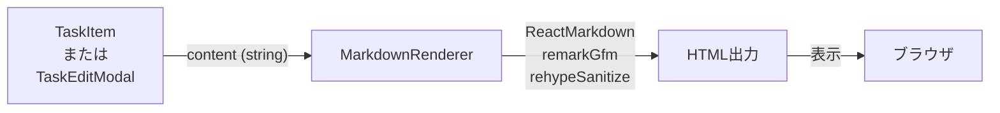

# TDD要件定義書: MarkdownRenderer コンポーネント

## 📄 ドキュメント情報

- **作成日**: 2025-12-29
- **更新日**: 2025-12-29
- **要件名**: todo-app
- **タスク番号**: TASK-1337
- **機能名**: MarkdownRenderer コンポーネント
- **担当フェーズ**: Phase 7 (フロントエンドUI実装)

---

## 1. 機能の概要

### 基本情報

🔵 **青信号**: EARS要件定義書・タスク定義・既存実装から確実な要件

- **何をする機能か**: タスクの説明文をMarkdown形式でレンダリングし、HTML表示する再利用可能なプレゼンテーションコンポーネント
- **解決する問題**: タスクの説明に書式（見出し、リスト、チェックリスト、太字、リンクなど）を適用し、視認性と表現力を向上させる
- **想定されるユーザー**: TODOアプリのログイン済みユーザー（タスク作成者および閲覧者）
- **システム内での位置づけ**: プレゼンテーション層の再利用可能UIコンポーネント（TaskItem、TaskEditModal内で使用）

### 参照した要件・設計

- **参照したEARS要件**: REQ-007
- **参照した設計文書**:
  - `docs/design/todo-app/architecture.md` (フロントエンド構成)
  - `docs/tasks/todo-app-phase7.md` (TASK-1337)
- **既存実装パターン**: `app/client/src/features/todo/components/TaskItem.tsx` (L92-97)

---

## 2. 入力・出力の仕様

### 入力パラメータ

🔵 **青信号**: 既存実装とTypeScript型定義から確実

| パラメータ名 | 型 | 必須 | 制約 | デフォルト値 | 説明 |
|-------------|-----|------|------|-------------|------|
| `content` | `string` | ✅ | - | - | Markdown形式のテキスト |

**インターフェース定義**:
```typescript
interface MarkdownRendererProps {
  content: string;
}
```

### 出力値

🔵 **青信号**: React コンポーネントの標準的な出力

| 出力 | 型 | 説明 |
|------|-----|------|
| レンダリング結果 | `React.ReactNode` | Markdownを解釈したHTML要素 |

### データフロー



🔵 **青信号**: 既存実装（TaskItem.tsx）のパターンを踏襲

---

## 3. 制約条件

### パフォーマンス要件

🟡 **黄信号**: 既存の非機能要件から妥当な推測

- **レンダリング速度**: 100件のタスク表示時もスムーズにスクロール可能であること（NFR-003）
- **メモ化**: 不要な再レンダリングを防ぐため、`React.memo`を適用すること

### セキュリティ要件

🔵 **青信号**: NFR-105、既存実装パターンより

- **XSS対策**: `rehype-sanitize`プラグインを使用し、危険なHTMLタグ・スクリプトを除去すること
- **入力検証**: `content`が空文字列や`null`の場合も安全に処理すること

### 互換性要件

🔵 **青信号**: 技術スタック、package.jsonより

- **依存ライブラリ**:
  - `react-markdown@^9.0.1`
  - `remark-gfm@^4.0.0`
  - `rehype-sanitize@^6.0.0`
- **React**: 19.2.1
- **TypeScript**: 5系

### アーキテクチャ制約

🔵 **青信号**: フロントエンド開発ガイドライン、CLAUDE.mdより

- **コンポーネント定義**: 名前付き関数でコンポーネントを定義し、`React.memo`でラップしてエクスポート
- **Props命名**: `props.content`のように明示的に使用
- **禁止事項**:
  - `JSX.Element`型の返却（`React.ReactNode`を使用）
  - 無名関数コンポーネント
  - `displayName`の使用

### スタイリング制約

🔵 **青信号**: 要件定義書 NFR-201、タスク定義より

- **Tailwind CSS**: `prose prose-sm max-w-none`クラスを適用
- **テーマカラー**: 必要に応じてベースカラー`#710000`、アクセントカラー`#ff6a00`を適用

---

## 4. 想定される使用例

### 基本的な使用パターン

🔵 **青信号**: タスク定義、既存実装パターンより

#### パターン1: TaskItem内での使用（2行制限）

```tsx
<div style={{ display: '-webkit-box', WebkitLineClamp: 2, ... }}>
  <MarkdownRenderer content={task.description} />
</div>
```

#### パターン2: TaskEditModal内での使用（プレビュー表示）

```tsx
<MarkdownRenderer content={formData.description} />
```

### Markdownレンダリング例

🔵 **青信号**: REQ-007、タスク定義のテストケースより

#### ケース1: 見出し

**入力**:
```markdown
## タスク概要
```

**期待される出力**:
```html
<h2>タスク概要</h2>
```

#### ケース2: リスト

**入力**:
```markdown
- 項目1
- 項目2
```

**期待される出力**:
```html
<ul>
  <li>項目1</li>
  <li>項目2</li>
</ul>
```

#### ケース3: チェックリスト（GFM）

**入力**:
```markdown
- [x] 完了したタスク
- [ ] 未完了のタスク
```

**期待される出力**:
```html
<ul>
  <li><input type="checkbox" checked disabled> 完了したタスク</li>
  <li><input type="checkbox" disabled> 未完了のタスク</li>
</ul>
```

#### ケース4: リンク

**入力**:
```markdown
[ドキュメント](https://example.com)
```

**期待される出力**:
```html
<a href="https://example.com">ドキュメント</a>
```

#### ケース5: 太字

**入力**:
```markdown
**重要なポイント**
```

**期待される出力**:
```html
<strong>重要なポイント</strong>
```

### エッジケース

🟡 **黄信号**: セキュリティ要件、一般的なMarkdownレンダラーの挙動から推測

#### エッジ1: XSS攻撃の防止

**入力**:
```markdown
<script>alert('XSS')</script>
```

**期待される挙動**:
- `<script>`タグがサニタイズされ、安全なテキストとして表示される
- または完全に除去される

#### エッジ2: 空文字列

**入力**:
```typescript
<MarkdownRenderer content="" />
```

**期待される挙動**:
- 空のReactノードを返す（エラーを投げない）

#### エッジ3: null/undefined（型エラー）

**入力**:
```typescript
// TypeScriptの型チェックでエラー
<MarkdownRenderer content={null} />
```

**期待される挙動**:
- コンパイルエラー（`content`は`string`型必須）

---

## 5. EARS要件・設計文書との対応関係

### 参照したユーザストーリー

🔵 **青信号**

- **US-001**: タスクの説明にMarkdown記法を適用して表示したい

### 参照した機能要件

🔵 **青信号**

- **REQ-007**: システムはタスクの説明にMarkdown記法を適用して表示しなければならない

### 参照した非機能要件

🔵 **青信号**

- **NFR-003**: システムは100件のタスク表示時にスムーズなスクロールを提供しなければならない
- **NFR-105**: システムはXSS, SQLインジェクションの脆弱性を持たないこと
- **NFR-201**: UIはテーマカラー(ベース#710000、アクセント#ff6a00)を適用しなければならない

### 参照した設計文書

🔵 **青信号**

- **アーキテクチャ**: `docs/design/todo-app/architecture.md` (フロントエンド構成)
- **タスク定義**: `docs/tasks/todo-app-phase7.md` (TASK-1337)
- **型定義**: `app/packages/shared-schemas/src/tasks.ts` (Task型)
- **既存実装**: `app/client/src/features/todo/components/TaskItem.tsx` (Markdownレンダリングパターン)

---

## 6. テスト要件

### テストケース一覧

🔵 **青信号**: タスク定義、既存テストパターン（TaskItem.test.tsx）より

#### 正常系

| テストID | テストケース | Given | When | Then |
|----------|-------------|-------|------|------|
| TC-001 | 見出しが正しく表示される | `content="## タスク概要"` | レンダリング | `<h2>`要素が生成される |
| TC-002 | リストが正しく表示される | `content="- 項目1\n- 項目2"` | レンダリング | `<ul>`と`<li>`要素が生成される |
| TC-003 | チェックリストが正しく表示される | `content="- [x] 完了\n- [ ] 未完了"` | レンダリング | チェックボックス付きリストが生成される |
| TC-004 | リンクが正しく表示される | `content="[リンク](https://example.com)"` | レンダリング | `<a>`要素が生成される |
| TC-005 | 太字が正しく表示される | `content="**太字テキスト**"` | レンダリング | `<strong>`要素が生成される |
| TC-006 | 空文字列を安全に処理できる | `content=""` | レンダリング | エラーなく空のノードを返す |

#### セキュリティ

| テストID | テストケース | Given | When | Then |
|----------|-------------|-------|------|------|
| TC-007 | XSS攻撃が防止される | `content="<script>alert('XSS')</script>"` | レンダリング | `<script>`タグが除去または無害化される |
| TC-008 | 危険なHTMLが無害化される | `content=""` | レンダリング | `onerror`属性が除去される |

#### パフォーマンス

| テストID | テストケース | Given | When | Then |
|----------|-------------|-------|------|------|
| TC-009 | Propsが変更されると新しい内容が表示される | `content="テキスト1"`→`content="テキスト2"` | rerender | 新しいテキストが表示される |
| TC-010 | 同じPropsで再レンダリングされない | `content="同じテキスト"` | 2回レンダリング | React.memoで最適化される |

### テストカバレッジ目標

🔵 **青信号**: フロントエンド開発ガイドラインより

- **目標**: 100%（全コードパスをカバー）
- **測定方法**: `bun test --coverage`

### テスト実行環境

🔵 **青信号**: フロントエンド開発ガイドラインより

- **テストランナー**: Bun標準テスト (`bun:test`)
- **DOM環境**: happy-dom (preload経由)
- **Testing Library**: `@testing-library/react@^16.3.0`
- **実行コマンド**: `docker compose exec client bun test`

---

## 7. 実装ガイドライン

### コンポーネント構造

🔵 **青信号**: フロントエンド開発ガイドライン、既存パターンより

```typescript
import React from 'react';
import ReactMarkdown from 'react-markdown';
import rehypeSanitize from 'rehype-sanitize';
import remarkGfm from 'remark-gfm';

/**
 * MarkdownRendererコンポーネント
 *
 * Markdown形式のテキストをHTML表示する再利用可能なプレゼンテーションコンポーネント。
 * GFM（GitHub Flavored Markdown）対応、XSS対策済み。
 */

interface MarkdownRendererProps {
  /** Markdown形式のテキスト */
  content: string;
}

function MarkdownRenderer(props: MarkdownRendererProps): React.ReactNode {
  return (
    <ReactMarkdown
      remarkPlugins={[remarkGfm]}
      rehypePlugins={[rehypeSanitize]}
      className="prose prose-sm max-w-none"
    >
      {props.content}
    </ReactMarkdown>
  );
}

export default React.memo(MarkdownRenderer);
```

### ファイル配置

🔵 **青信号**: フロントエンド開発ガイドライン、プロジェクト構成より

- **実装ファイル**: `app/client/src/features/todo/components/MarkdownRenderer.tsx`
- **テストファイル**: `app/client/src/features/todo/__tests__/MarkdownRenderer.test.tsx`

### 依存関係

🔵 **青信号**: package.jsonより

```json
{
  "dependencies": {
    "react-markdown": "^9.0.1",
    "rehype-sanitize": "^6.0.0",
    "remark-gfm": "^4.0.0"
  }
}
```

---

## 8. 完了条件

🔵 **青信号**: タスク定義より

- [ ] `MarkdownRenderer.tsx`が実装される
- [ ] テストカバレッジ100%
- [ ] すべてのテストケース（TC-001～TC-010）が合格
- [ ] `docker compose exec client bunx tsc --noEmit`でエラーなし
- [ ] `docker compose exec client bun run fix`でBiomeチェック合格
- [ ] TaskItem、TaskEditModalから正常に使用できることを確認

---

## 9. 品質判定

### 信頼性レベルのサマリー

- 🔵 **青信号**: 18項目（要件、型定義、依存関係、アーキテクチャ制約、テストパターン）
- 🟡 **黄信号**: 2項目（パフォーマンス要件、XSS対策の詳細挙動）
- 🔴 **赤信号**: 0項目

### 品質判定結果

✅ **高品質**

- **要件の曖昧さ**: なし（REQ-007、TASK-1337、既存実装から明確）
- **入出力定義**: 完全（TypeScript型、既存パターン、テストケースで明確）
- **制約条件**: 明確（技術スタック、セキュリティ要件、アーキテクチャ制約）
- **実装可能性**: 確実（依存ライブラリ導入済み、既存パターンあり）

### 次のフェーズ

このTDD要件定義書の品質は十分であり、**テストケース洗い出しフェーズ**に進むことができます。
