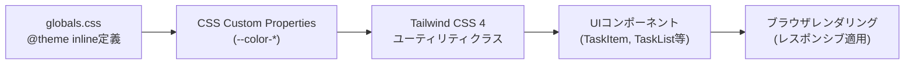

# TDD要件定義書: レスポンシブデザイン・テーマカラー適用

## メタデータ

- **作成日**: 2025-12-30
- **更新日**: 2025-12-30
- **要件名**: todo-app
- **タスク番号**: TASK-1338
- **機能名**: レスポンシブデザイン・テーマカラー適用
- **実装タイプ**: DIRECT（UIスタイル適用のためTDD不要）

## 1. 機能の概要

### 何をする機能か

🔵 **青信号**: EARS要件定義書・設計文書ベース

TODOリストアプリに対して、Tailwind CSS 4を使用したレスポンシブデザインとテーマカラー適用を実施します。この機能は、既存のUIコンポーネントにスタイルを追加・調整し、モバイルからデスクトップまでのデバイスに対応した視覚的に統一されたデザインを提供します。

### どのような問題を解決するか

🔵 **青信号**: EARS要件定義書 NFR-201, NFR-205 ベース

- **デザイン統一性の欠如**: 現在のUIはテーマカラーが部分的にしか適用されておらず、視覚的な統一性に欠ける
- **レスポンシブ対応の不足**: デスクトップ最適化が不十分で、異なる画面サイズでの使用感が低下している
- **ユーザビリティの課題**: デスクトップ環境での快適な操作性が求められている（NFR-205）

### 想定されるユーザー

🔵 **青信号**: ユーザーヒアリング 2025-11-06

- **主要ユーザー**: デスクトップ環境でTODOリストを管理するユーザー
- **副次ユーザー**: モバイル・タブレット環境で基本操作を行うユーザー（完全最適化は不要）

### システム内での位置づけ

🔵 **青信号**: architecture.md フロントエンド構成

- **Layer**: Presentation Layer（フロントエンド UI）
- **技術スタック**: Tailwind CSS 4 + Next.js 15 SSG
- **影響範囲**: 既存UIコンポーネント全体（TaskItem, TaskList, TaskCreateForm, TaskEditModal, TaskFilter, TaskSort）

### 参照したEARS要件

- **NFR-201**: UIはテーマカラー(ベース#710000、アクセント#ff6a00)を適用しなければならない
- **NFR-205**: デスクトップ環境で快適に動作しなければならない(モバイルは基本動作のみ)

### 参照した設計文書

- [architecture.md](../../../design/todo-app/architecture.md) - フロントエンド技術構成
- [todo-app-requirements.md](../../../spec/todo-app-requirements.md) - 非機能要件 NFR-201, NFR-205

## 2. 入力・出力の仕様

### 入力パラメータ

🟡 **黄信号**: 既存設計から妥当な推測

この機能はスタイル適用のため、従来の意味での「入力」は存在しません。ただし、以下の環境変数や設定が影響します：

- **画面サイズ**: ブラウザのビューポートサイズ（モバイル: ~640px, タブレット: 641px~1024px, デスクトップ: 1025px~）
- **カラーテーマ**: `globals.css` の `@theme inline` による定義
- **既存コンポーネント**: TaskItem, TaskList, TaskCreateForm, TaskEditModal, TaskFilter, TaskSort

### 出力値

🔵 **青信号**: EARS要件定義書 NFR-201 ベース

- **テーマカラー適用結果**:
  - ベースカラー（`#710000`）: 主要な強調要素（ボタン、ボーダー）
  - アクセントカラー（`#ff6a00`）: インタラクティブ要素のホバー状態、優先度「高」の表示
- **レスポンシブレイアウト**:
  - モバイル: 1カラム、タッチフレンドリーなボタンサイズ
  - タブレット: 1カラム、適切な余白
  - デスクトップ: 最適化されたレイアウト、ホバー効果

### 入出力の関係性

🟡 **黄信号**: 一般的なレスポンシブデザインの慣習

画面サイズに応じて、Tailwind CSS 4のブレークポイント（`sm:`, `md:`, `lg:`）を使用して、異なるスタイルが適用されます。テーマカラーはCSSカスタムプロパティとして定義され、すべてのコンポーネントで一貫して使用されます。

### データフロー

🔵 **青信号**: architecture.md フロントエンド構成



### 参照したEARS要件

- **NFR-201**: UIはテーマカラー(ベース#710000、アクセント#ff6a00)を適用しなければならない

### 参照した設計文書

- [architecture.md](../../../design/todo-app/architecture.md) - フロントエンド技術構成（Tailwind CSS 4）

## 3. 制約条件

### パフォーマンス要件

🔵 **青信号**: EARS要件定義書 NFR-003, NFR-004 ベース

- **NFR-003**: システムは100件のタスク表示時にスムーズなスクロールを提供しなければならない
- **NFR-004**: タスクフィルタ・ソート操作は即座にUIに反映されなければならない
- **追加制約**: レスポンシブデザイン適用後もパフォーマンスが劣化しないこと

### アーキテクチャ制約

🔵 **青信号**: architecture.md、CLAUDE.md プロジェクト方針

- **Tailwind CSS 4必須**: `@tailwindcss/postcss` を使用したビルド
- **CSSカスタムプロパティ使用**: `globals.css` の `@theme inline` で定義
- **SSG前提**: Next.js 15のStatic Site Generationでビルド
- **レスポンシブ優先順**: モバイルファースト設計（ただし、デスクトップ最適化が主目的）

### デザイン制約

🔵 **青信号**: EARS要件定義書 NFR-201, NFR-202 ベース

- **テーマカラー固定**:
  - ベースカラー: `#710000` (濃い赤)
  - アクセントカラー: `#ff6a00` (オレンジ)
- **言語非依存の直感的UI**: アイコンと視覚的フィードバックで操作を理解可能に（NFR-202）
- **既存コンポーネントの一貫性維持**: TaskItem, LoginButtonなど既にテーマカラーを適用済みのコンポーネントとの整合性

### 互換性要件

🔵 **青信号**: architecture.md、CLAUDE.md プロジェクト方針

- **ブラウザ互換性**: Chrome, Firefox, Safari（最新2バージョン）
- **既存機能への影響ゼロ**: 認証機能、CRUD機能に影響を与えない
- **既存テストの継続合格**: TaskItem.test.tsx、TaskList.test.tsx等が引き続き合格すること

### 参照したEARS要件

- **NFR-201**: UIはテーマカラー(ベース#710000、アクセント#ff6a00)を適用しなければならない
- **NFR-202**: UIは言語に依存せず直感的に理解できるデザインでなければならない
- **NFR-205**: デスクトップ環境で快適に動作しなければならない(モバイルは基本動作のみ)

### 参照した設計文書

- [architecture.md](../../../design/todo-app/architecture.md) - 技術スタック、アーキテクチャ制約
- [todo-app-requirements.md](../../../spec/todo-app-requirements.md) - 非機能要件 NFR-003, NFR-004

## 4. 想定される使用例

### 基本的な使用パターン

🔵 **青信号**: EARS要件定義書 REQ-006 ベース

#### シナリオ1: デスクトップでのタスク一覧表示

**Given**（前提条件）:
- ユーザーがデスクトップブラウザ（1920x1080）でアクセス
- 10件のタスクが存在する

**When**（実行条件）:
- TODOリスト画面を表示

**Then**（期待結果）:
- タスク一覧が最適化されたレイアウトで表示される
- テーマカラー（ベース#710000、アクセント#ff6a00）が適用されている
- ボタンのホバー効果がスムーズに動作する
- 100件のタスクでもスムーズにスクロールできる（NFR-003）

#### シナリオ2: モバイルでの基本操作

**Given**（前提条件）:
- ユーザーがモバイルブラウザ（375x667）でアクセス
- 5件のタスクが存在する

**When**（実行条件）:
- TODOリスト画面を表示
- タスク作成ボタンをタップ

**Then**（期待結果）:
- タスク一覧が1カラムで表示される
- ボタンがタッチフレンドリーなサイズで表示される
- テーマカラーが適用されている
- 基本操作（作成、編集、削除）が可能である

### エッジケース

🟡 **黄信号**: 一般的なレスポンシブデザインの慣習

#### エッジケース1: タブレット縦向き（768x1024）

**Given**: ユーザーがタブレット縦向きでアクセス
**When**: TODOリスト画面を表示
**Then**: デスクトップとモバイルの中間レイアウトで表示される、テーマカラーが適用される

#### エッジケース2: 画面幅の動的変更

**Given**: デスクトップブラウザでウィンドウをリサイズ
**When**: ウィンドウ幅を1920px → 768px → 375pxに変更
**Then**: レスポンシブブレークポイントに応じて即座にレイアウトが変更される

### エラーケース

🟡 **黄信号**: 既存設計から妥当な推測

#### エラーケース1: CSSカスタムプロパティ未定義

**Given**: `globals.css` でテーマカラーが定義されていない
**When**: UIコンポーネントをレンダリング
**Then**: フォールバック値（グレースケール）で表示される

#### エラーケース2: Tailwind CSS 4ビルド失敗

**Given**: PostCSS設定が不正
**When**: `bun run build` を実行
**Then**: ビルドエラーが発生し、エラーログが出力される

### 参照したEARS要件

- **REQ-006**: システムはタスク一覧を表示しなければならない
- **NFR-003**: システムは100件のタスク表示時にスムーズなスクロールを提供しなければならない

### 参照した設計文書

- [todo-app-acceptance-criteria.md](../../../spec/todo-app-acceptance-criteria.md) - 受け入れ基準

## 5. EARS要件・設計文書との対応関係

### 参照したユーザストーリー

🔵 **青信号**: todo-app-user-stories.md より

- **US-101**: タスク一覧を視覚的に整理して表示したい（優先度・ステータスの視覚的区別）

### 参照した機能要件

🔵 **青信号**: todo-app-requirements.md より

- **REQ-006**: システムはタスク一覧を表示しなければならない

### 参照した非機能要件

🔵 **青信号**: todo-app-requirements.md より

- **NFR-003**: システムは100件のタスク表示時にスムーズなスクロールを提供しなければならない
- **NFR-004**: タスクフィルタ・ソート操作は即座にUIに反映されなければならない
- **NFR-201**: UIはテーマカラー(ベース#710000、アクセント#ff6a00)を適用しなければならない
- **NFR-202**: UIは言語に依存せず直感的に理解できるデザインでなければならない
- **NFR-205**: デスクトップ環境で快適に動作しなければならない(モバイルは基本動作のみ)

### 参照したEdgeケース

🟡 **黄信号**: 一般的なレスポンシブデザインの慣習

- **該当なし**: EARS要件定義書にレスポンシブデザインに関するEdgeケースの明示的な記載なし

### 参照した受け入れ基準

🔵 **青信号**: todo-app-acceptance-criteria.md より

- **NFR-201テスト基準**: テーマカラー適用（ベース#710000、アクセント#ff6a00が適用されている）
- **NFR-205テスト基準**: デスクトップ環境での快適性（すべてのブラウザで快適に動作する）

### 参照した設計文書

- **アーキテクチャ**: [architecture.md](../../../design/todo-app/architecture.md) - フロントエンド技術構成（Tailwind CSS 4）
- **データフロー**: [dataflow.md](../../../design/todo-app/dataflow.md) - UIレンダリングフロー
- **型定義**: 該当なし（スタイル適用のため型定義は不要）
- **データベース**: 該当なし（フロントエンドのみの変更）
- **API仕様**: 該当なし（フロントエンドのみの変更）

## 6. 実装詳細（DIRECT実装のため）

### Tailwind CSS 4設定

🔵 **青信号**: 既存ファイル `globals.css` の拡張

```css
/* app/client/src/app/globals.css */
@import "tailwindcss";

:root {
  --background: #ffffff;
  --foreground: #171717;
}

@theme inline {
  --color-background: var(--background);
  --color-foreground: var(--foreground);
  --color-primary: #710000;     /* ベースカラー */
  --color-accent: #ff6a00;      /* アクセントカラー */
  --font-sans: var(--font-geist-sans);
  --font-mono: var(--font-geist-mono);
}

@media (prefers-color-scheme: dark) {
  :root {
    --background: #0a0a0a;
    --foreground: #ededed;
  }
}

body {
  background: var(--background);
  color: var(--foreground);
  font-family: Arial, Helvetica, sans-serif;
}

/* TODOリスト用レスポンシブスタイル */
.todo-container {
  @apply w-full max-w-4xl mx-auto px-4;
  @apply sm:px-6 md:px-8;
}

.todo-button {
  @apply px-4 py-2 text-sm font-medium rounded;
  @apply transition-colors duration-200;
  @apply bg-primary text-white hover:bg-opacity-80;
}

.todo-button-accent {
  @apply px-4 py-2 text-sm font-medium rounded;
  @apply transition-colors duration-200;
  @apply text-primary hover:text-accent;
}
```

### レスポンシブブレークポイント

🟡 **黄信号**: Tailwind CSS 4のデフォルト値を使用

- **モバイル**: デフォルト（~640px）
- **タブレット**: `sm:` (640px~)
- **デスクトップ**: `md:` (768px~), `lg:` (1024px~)

### 既存コンポーネントへの適用例

🔵 **青信号**: 既存ファイル `TaskItem.tsx` の参照

既存のTaskItemコンポーネントでは、以下のようにテーマカラーが適用されています：

```tsx
// app/client/src/features/todo/components/TaskItem.tsx (既存)
<div className="border-l-4 border-[#710000] bg-white p-4 hover:bg-gray-50 transition-colors">
  {/* ... */}
  <button
    type="button"
    onClick={() => props.onDelete(props.task.id)}
    aria-label="タスクを削除"
    className="px-3 py-1 text-sm text-white bg-[#710000] hover:bg-opacity-80 rounded transition-colors"
  >
    削除
  </button>
</div>
```

この実装を参考に、他のコンポーネントにも同様のパターンを適用します。

### 完了条件

🔵 **青信号**: TASK-1338 タスク定義より

- [ ] レスポンシブデザインが適用される（モバイル、タブレット、デスクトップ）
- [ ] テーマカラーが適用される（ベース#710000、アクセント#ff6a00）
- [ ] デスクトップ最適化が完了する
- [ ] 既存テスト（TaskItem.test.tsx等）が引き続き合格する
- [ ] 100件のタスク表示時にスムーズなスクロールが提供される（NFR-003）

## 7. テスト戦略（DIRECT実装のため手動確認）

### 視覚的確認項目

🔵 **青信号**: todo-app-acceptance-criteria.md NFR-201テスト基準

1. **テーマカラー確認**:
   - ベースカラー（#710000）が主要な強調要素に適用されているか
   - アクセントカラー（#ff6a00）がホバー状態に適用されているか

2. **レスポンシブ確認**:
   - モバイル（375px）: 1カラム、タッチフレンドリーなボタン
   - タブレット（768px）: 適切な余白とレイアウト
   - デスクトップ（1920px）: 最適化されたレイアウト

3. **パフォーマンス確認**:
   - 100件のタスクでスムーズなスクロール（NFR-003）
   - フィルタ・ソート操作の即座のUI反映（NFR-004）

### ブラウザ互換性確認

🔵 **青信号**: architecture.md、CLAUDE.md プロジェクト方針

- Chrome（最新2バージョン）
- Firefox（最新2バージョン）
- Safari（最新2バージョン）

### 既存テストの継続合格確認

🔵 **青信号**: CLAUDE.md テストガイドライン

```bash
# フロントエンドユニットテスト
docker compose exec client bun test

# 型チェック
docker compose exec client bunx tsc --noEmit

# Biomeチェック
docker compose exec client bun run check
```

すべてのテストが引き続き合格することを確認します。

## 8. 参考資料

- [Tailwind CSS 4公式ドキュメント](https://tailwindcss.com/)
- [Next.js 15公式ドキュメント](https://nextjs.org/docs)
- [Responsive Design Best Practices](https://web.dev/responsive-web-design-basics/)
