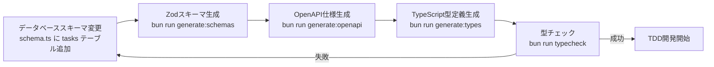

# TODOリストアプリ 要件定義書

## 📄 ドキュメント情報

- **作成日**: 2025-11-06
- **要件名**: TODO リストアプリ
- **バージョン**: 1.0.0
- **ステータス**: ドラフト

## 概要

ログイン済みユーザーが個人のタスク(TODO)を管理するシンプルなアプリケーション。
タスクの追加・更新・削除・完了状態の切り替え、優先度設定、フィルタ・ソート機能を提供する。
DDD + クリーンアーキテクチャに基づき、既存の認証基盤(Supabase Auth)と統合する。

将来的にはバックログ管理機能へ拡張する想定だが、今回のスコープはシンプルなTODO管理機能のみとする。

## 関連文書

- **ユーザーストーリー**: [📖 todo-app-user-stories.md](todo-app-user-stories.md)
- **受け入れ基準**: [✅ todo-app-acceptance-criteria.md](todo-app-acceptance-criteria.md)
- **技術スタック**: [🔧 ../tech-stack.md](../tech-stack.md)
- **既存認証要件**: [🔐 mvp-google-auth-requirements.md](mvp-google-auth-requirements.md)

## 機能要件(EARS記法)

**【信頼性レベル凡例】**:
- 🔵 **青信号**: ユーザーヒアリング・既存設計から確実な要件
- 🟡 **黄信号**: 既存設計・技術制約から妥当な推測
- 🔴 **赤信号**: 既存資料にない推測

### 通常要件(SHALL)

- REQ-001: システムはログイン済みユーザーがタスクを作成できなければならない 🔵 *ユーザーヒアリング 2025-11-06*
- REQ-002: システムはタスクのタイトル・説明・優先度を更新できなければならない 🔵 *ユーザーヒアリング 2025-11-06*
- REQ-003: システムはタスクを物理削除できなければならない 🔵 *ユーザーヒアリング 2025-11-06*
- REQ-004: システムはタスクのステータス(未着手・進行中・レビュー中・完了)を変更できなければならない 🔵 *ユーザーヒアリング 2025-11-06*
- REQ-005: システムはタスクに優先度(高・中・低)を設定できなければならない 🔵 *ユーザーヒアリング 2025-11-06*
- REQ-006: システムはタスク一覧を表示しなければならない 🔵 *ユーザーヒアリング 2025-11-06*
- REQ-007: システムはタスクの説明にMarkdown記法を適用して表示しなければならない 🔵 *ユーザーヒアリング 2025-11-06*

### 条件付き要件(WHEN/IF-THEN)

- REQ-101: ユーザーが未認証の場合、システムはTODOリスト機能へのアクセスを拒否しなければならない 🔵 *既存認証要件との統合*
- REQ-102: ユーザーが新規タスクを追加する場合、システムはタイトルの入力を必須としなければならない 🟡 *一般的なTODOアプリの慣習*
- REQ-103: ユーザーがタスクを作成する場合、システムはデフォルトで優先度を「中」に設定しなければならない 🟡 *UX最適化の推測*
- REQ-104: ユーザーがタスクを作成する場合、システムはデフォルトでステータスを「未着手」に設定しなければならない 🔵 *ユーザーヒアリング 2025-11-06*
- REQ-105: ユーザーがタスクを削除する場合、システムは確認ダイアログを表示しなければならない 🟡 *誤操作防止の推測*

### 状態要件(WHERE)

- REQ-201: 優先度フィルタが適用されている場合、システムは選択された優先度のタスクのみを表示しなければならない 🔵 *ユーザーヒアリング 2025-11-06*
- REQ-202: ステータスフィルタが適用されている場合、システムは選択されたステータス(複数選択可能)のタスクのみを表示しなければならない 🔵 *ユーザーヒアリング 2025-11-06*
- REQ-203: ソート順が指定されている場合、システムは指定された順序でタスクを並べ替えなければならない 🔵 *ユーザーヒアリング 2025-11-06*

### オプション要件(MAY)

- REQ-301: システムはタスクの一括操作(一括削除、一括完了)を提供してもよい 🔴 *将来的な拡張の推測*
- REQ-302: システムはタスクのドラッグ&ドロップによる並び替えを提供してもよい 🔴 *UX向上の推測*

### 制約要件(MUST)

- REQ-401: システムはDDD + クリーンアーキテクチャパターンを適用しなければならない 🔵 *既存プロジェクト方針 CLAUDE.md*
- REQ-402: システムはSupabase AuthのJWT認証を使用しなければならない 🔵 *既存認証基盤*
- REQ-403: システムはRow-Level Security(RLS)を使用してユーザーごとのタスク分離を実現しなければならない 🔵 *既存セキュリティ方針*
- REQ-404: システムはDrizzle ORMでデータベーススキーマを管理しなければならない 🔵 *既存技術スタック*
- REQ-405: システムはスキーマ駆動開発(Drizzle → Zod → OpenAPI → TypeScript型定義)を適用しなければならない 🔵 *既存開発フロー CLAUDE.md*
- REQ-406: フロントエンドはNext.js 15(SSG)、バックエンドはHono 4を使用しなければならない 🔵 *既存技術スタック*
- REQ-407: システムは以下の層構造を実装しなければならない 🔵 *既存アーキテクチャ方針*:
  - Domain層: TaskEntity, TaskAggregate, Domain services
  - Application層: CreateTaskUseCase, UpdateTaskUseCase, DeleteTaskUseCase, GetTasksUseCase
  - Infrastructure層: PostgreSQLTaskRepository
  - Presentation層: TaskController, TaskRoutes
- REQ-408: タスクテーブルは環境変数BASE_SCHEMAで定義されたスキーマ配下に作成しなければならない 🔵 *既存DB設計方針*
- REQ-409: システムはBun標準テストを使用したTDD開発を実施しなければならない 🔵 *既存テスト方針 CLAUDE.md*

## 非機能要件

### パフォーマンス

- NFR-001: タスク一覧取得APIは1秒以内にレスポンスを返さなければならない 🟡 *既存パフォーマンス要件からの推測*
- NFR-002: タスク作成APIは500ms以内にレスポンスを返さなければならない 🟡 *既存パフォーマンス要件からの推測*
- NFR-003: システムは100件のタスク表示時にスムーズなスクロールを提供しなければならない 🔴 *UX要件の推測*
- NFR-004: タスクフィルタ・ソート操作は即座にUIに反映されなければならない 🔴 *UX要件の推測*

### セキュリティ

- NFR-101: すべてのタスク操作はHTTPS経由で行われなければならない 🔵 *既存セキュリティ方針*
- NFR-102: ユーザーは自分自身のタスクのみアクセス可能でなければならない(RLS) 🔵 *既存セキュリティ方針*
- NFR-103: タスク操作APIはすべてJWT認証を必須とする 🔵 *既存認証方針*
- NFR-104: タスクの入力値はサーバーサイドでZodバリデーションを実施しなければならない 🔵 *既存バリデーション方針*
- NFR-105: システムはXSS, SQLインジェクションの脆弱性を持たないこと 🔵 *既存セキュリティ方針*

### ユーザビリティ

- NFR-201: UIはテーマカラー(ベース#710000、アクセント#ff6a00)を適用しなければならない 🔵 *ユーザーヒアリング 2025-11-06*
- NFR-202: UIは言語に依存せず直感的に理解できるデザインでなければならない 🔵 *ユーザーヒアリング 2025-11-06*
- NFR-203: タスクの追加はインライン入力で素早く実行できなければならない 🔵 *ユーザーヒアリング 2025-11-06*
- NFR-204: タスクの詳細編集はモーダルで実施できなければならない 🔵 *ユーザーヒアリング 2025-11-06*
- NFR-205: デスクトップ環境で快適に動作しなければならない(モバイルは基本動作のみ) 🔵 *ユーザーヒアリング 2025-11-06*
- NFR-206: エラーメッセージは日本語で分かりやすく表示されなければならない 🟡 *既存ユーザビリティ方針*

### 保守性・拡張性

- NFR-301: システムは将来的なバックログ管理機能への拡張を考慮した設計とする 🔵 *ユーザーヒアリング 2025-11-06(将来的な考慮事項)*
- NFR-302: タスクエンティティは親子関係を持つ構造への拡張可能性を残す 🔵 *ユーザーヒアリング 2025-11-06(将来的な考慮事項)*
- NFR-303: ステータスはユーザーが自由にカスタマイズできる構造への拡張可能性を残す 🔵 *ユーザーヒアリング 2025-11-06(将来的な考慮事項)*
- NFR-304: 各層の責務が明確に分離され、独立してテスト可能であること 🔵 *既存アーキテクチャ方針*

## Edgeケース

### エラー処理

- EDGE-001: タイトルが空文字の場合、システムは「タイトルを入力してください」エラーを表示する 🟡 *バリデーション要件の推測*
- EDGE-002: タイトルが100文字を超える場合、システムは「タイトルは100文字以内で入力してください」エラーを表示する 🔴 *データ制限の推測*
- EDGE-003: 存在しないタスクを更新・削除しようとした場合、システムは404エラーを返す 🟡 *一般的なREST APIの慣習*
- EDGE-004: 他ユーザーのタスクにアクセスしようとした場合、システムは403エラーを返す 🟡 *RLS要件からの推測*
- EDGE-005: ネットワークエラー時、システムは「通信エラーが発生しました。再試行してください」と表示する 🟡 *既存エラーハンドリング方針*

### 境界値

- EDGE-101: タスク数が0件の場合、システムは「タスクがありません」メッセージを表示する 🟡 *UX要件の推測*
- EDGE-102: タスク数が1000件を超える場合でも正常に動作する 🔴 *スケーラビリティの推測*
- EDGE-103: 説明欄が10000文字を超える場合、システムは適切に保存・表示する 🔴 *データ制限の推測*

### 特殊状況

- EDGE-201: 同時に複数のタブでタスクを編集した場合、最後の更新が反映される 🔴 *並行制御の推測*
- EDGE-202: Markdown記法が不正な場合でも、プレーンテキストとして表示される 🔴 *Markdown処理の推測*
- EDGE-203: 削除確認ダイアログでキャンセルした場合、タスクは削除されない 🟡 *UI動作の推測*

## 技術実装要件

### データベーススキーマ(Drizzle ORM)

```typescript
// app/server/src/infrastructure/database/schema.ts に追加
export const tasks = schema.table(
  'tasks',
  {
    id: uuid('id').primaryKey().defaultRandom(),
    userId: uuid('user_id')
      .notNull()
      .references(() => users.id, { onDelete: 'cascade' }),
    title: varchar('title', { length: 100 }).notNull(),
    description: text('description'),
    priority: varchar('priority', { length: 10 })
      .notNull()
      .default('medium'), // 'high', 'medium', 'low'
    status: varchar('status', { length: 20 })
      .notNull()
      .default('not_started'), // 'not_started', 'in_progress', 'in_review', 'completed'
    createdAt: timestamp('created_at', { withTimezone: true })
      .defaultNow()
      .notNull(),
    updatedAt: timestamp('updated_at', { withTimezone: true })
      .defaultNow()
      .notNull(),
  },
  (table) => {
    return {
      // ユーザーごとのタスク検索用インデックス
      userIdIndex: index('idx_tasks_user_id').on(table.userId),
      // 作成日時でのソート用インデックス
      createdAtIndex: index('idx_tasks_created_at').on(
        table.createdAt.desc(),
      ),
      // 優先度フィルタ用インデックス
      priorityIndex: index('idx_tasks_priority').on(table.priority),
      // タイトル検索用(将来的な拡張)
      titleIndex: index('idx_tasks_title').on(table.title),
      // CHECK制約
      validPriority: check(
        'valid_priority',
        sql`${table.priority} IN ('high', 'medium', 'low')`,
      ),
      validStatus: check(
        'valid_status',
        sql`${table.status} IN ('not_started', 'in_progress', 'in_review', 'completed')`,
      ),
      nonEmptyTitle: check(
        'non_empty_title',
        sql`length(trim(${table.title})) > 0`,
      ),
    };
  },
);
```

### フロントエンド(Next.js)

#### ディレクトリ構成

```
app/client/src/features/
└── todo/
    ├── __tests__/           # テスト
    │   ├── TaskList.test.tsx
    │   ├── TaskForm.test.tsx
    │   ├── useTasks.test.tsx
    │   └── ui-ux/
    ├── components/          # UIコンポーネント
    │   ├── TaskList.tsx
    │   ├── TaskItem.tsx
    │   ├── TaskForm.tsx
    │   ├── TaskEditModal.tsx
    │   ├── TaskFilter.tsx
    │   └── TaskSort.tsx
    ├── hooks/               # カスタムフック
    │   ├── useTasks.ts
    │   ├── useCreateTask.ts
    │   ├── useUpdateTask.ts
    │   └── useDeleteTask.ts
    ├── store/               # Redux状態管理
    │   └── taskSlice.ts
    └── types/               # 型定義
        └── task.ts
```

#### 主要機能

- TanStack Query によるサーバー状態管理
- Redux による UIフィルタ・ソート状態管理
- Markdownレンダリング(react-markdown)
- テーマカラー適用のTailwind CSS設定

### バックエンド(Hono API)

#### ディレクトリ構成

```
app/server/src/
├── domain/
│   └── task/
│       ├── __tests__/
│       │   └── TaskEntity.test.ts
│       ├── TaskEntity.ts
│       ├── errors/
│       │   ├── TaskNotFoundError.ts
│       │   └── InvalidTaskDataError.ts
│       └── valueobjects/
│           ├── TaskPriority.ts
│           ├── CreateTaskInput.ts
│           └── UpdateTaskInput.ts
├── application/
│   └── usecases/
│       ├── __tests__/
│       │   ├── CreateTaskUseCase.test.ts
│       │   ├── GetTasksUseCase.test.ts
│       │   ├── UpdateTaskUseCase.test.ts
│       │   └── DeleteTaskUseCase.test.ts
│       ├── CreateTaskUseCase.ts
│       ├── GetTasksUseCase.ts
│       ├── UpdateTaskUseCase.ts
│       └── DeleteTaskUseCase.ts
├── infrastructure/
│   └── database/
│       ├── __tests__/
│       │   └── PostgreSQLTaskRepository.test.ts
│       └── PostgreSQLTaskRepository.ts
└── presentation/
    └── http/
        ├── controllers/
        │   ├── __tests__/
        │   │   └── TaskController.test.ts
        │   └── TaskController.ts
        └── routes/
            ├── __tests__/
            │   ├── taskRoutes.test.ts
            │   └── taskRoutes.integration.test.ts
            ├── taskRoutes.ts
            └── taskRoutes.schema.ts
```

#### APIエンドポイント

| メソッド | エンドポイント | 説明 |
|---------|---------------|------|
| GET | `/api/tasks` | タスク一覧取得(フィルタ・ソートクエリパラメータ対応) |
| POST | `/api/tasks` | タスク作成 |
| GET | `/api/tasks/:id` | タスク詳細取得 |
| PUT | `/api/tasks/:id` | タスク更新 |
| DELETE | `/api/tasks/:id` | タスク削除 |

### 環境設定

既存の環境変数を使用し、追加の環境変数は不要:

- `SUPABASE_URL`, `SUPABASE_ANON_KEY`: 既存認証
- `DATABASE_URL`: 既存データベース接続
- `BASE_SCHEMA`: 既存スキーマ管理

### 依存関係

#### フロントエンド追加ライブラリ

- `react-markdown`: Markdown表示
- `remark-gfm`: GitHub Flavored Markdown対応

#### バックエンド

既存の依存関係のみで実装可能(追加ライブラリ不要)

## スキーマ駆動開発フロー



## 受け入れ基準(概要)

詳細は [todo-app-acceptance-criteria.md](todo-app-acceptance-criteria.md) を参照。

### 機能テスト

- [x] タスクの作成・更新・削除・ステータス変更ができる
- [x] 優先度を設定・変更できる
- [x] ステータス(未着手・進行中・レビュー中・完了)を変更できる
- [x] タスク一覧がデフォルトで作成日時(新しい順)で表示される
- [x] 優先度フィルタでタスクを絞り込める
- [x] ステータスフィルタ(複数選択可能)でタスクを絞り込める
- [x] ソート機能で並び順を変更できる
- [x] Markdown記法が正しく表示される
- [x] 他ユーザーのタスクにアクセスできない(RLS)

### セキュリティテスト

- [x] 未認証ユーザーはTODO機能にアクセスできない
- [x] JWT認証が正しく機能する
- [x] RLSでユーザー分離が機能する
- [x] XSS脆弱性が存在しない
- [x] SQLインジェクション脆弱性が存在しない

### ユーザビリティテスト

- [x] テーマカラーが適用される
- [x] インライン入力で素早くタスクを追加できる
- [x] モーダルで詳細編集ができる
- [x] 直感的なUIで操作できる
- [x] デスクトップ環境で快適に動作する

### パフォーマンステスト

- [x] タスク一覧取得が1秒以内
- [x] タスク作成が500ms以内
- [x] 100件のタスクでスムーズにスクロールできる

## 将来的な拡張(今回は対象外)

以下は今回のスコープに含めないが、将来的な拡張として考慮する:

### バックログ管理機能への拡張

- バックログエンティティ(親)
- バックログアイテムエンティティ(中間)
- タスクエンティティ(子)
- の3階層親子関係

### 高度な機能

- ストーリーポイント設定
- バーンダウンチャート表示
- スプリント管理
- タスクの期限設定
- リマインダー通知
- タスクのタグ付け
- タスクのカテゴリ分類
- タスクの検索機能
- タスクのアーカイブ(論理削除)
- タスクの一括操作
- タスクのドラッグ&ドロップ並び替え
- モバイルアプリ対応(PWA)

## 参考資料

- [エリック・エヴァンスのドメイン駆動設計](https://www.amazon.co.jp/dp/4798121967)
- [ロバート・C・マーチンのクリーンアーキテクチャ](https://www.amazon.co.jp/dp/4048930656)
- [EARS記法(Easy Approach to Requirements Syntax)](https://www.iaria.org/conferences2009/filesICCGI09/Tutorial%20ICCGI%202009%20Terzakis.pdf)
