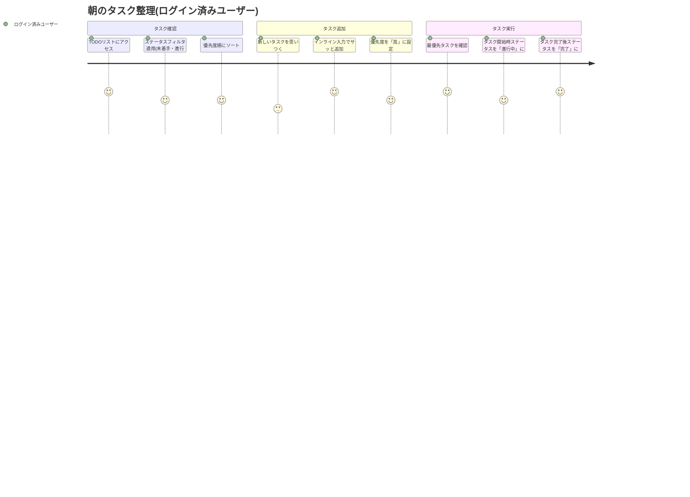
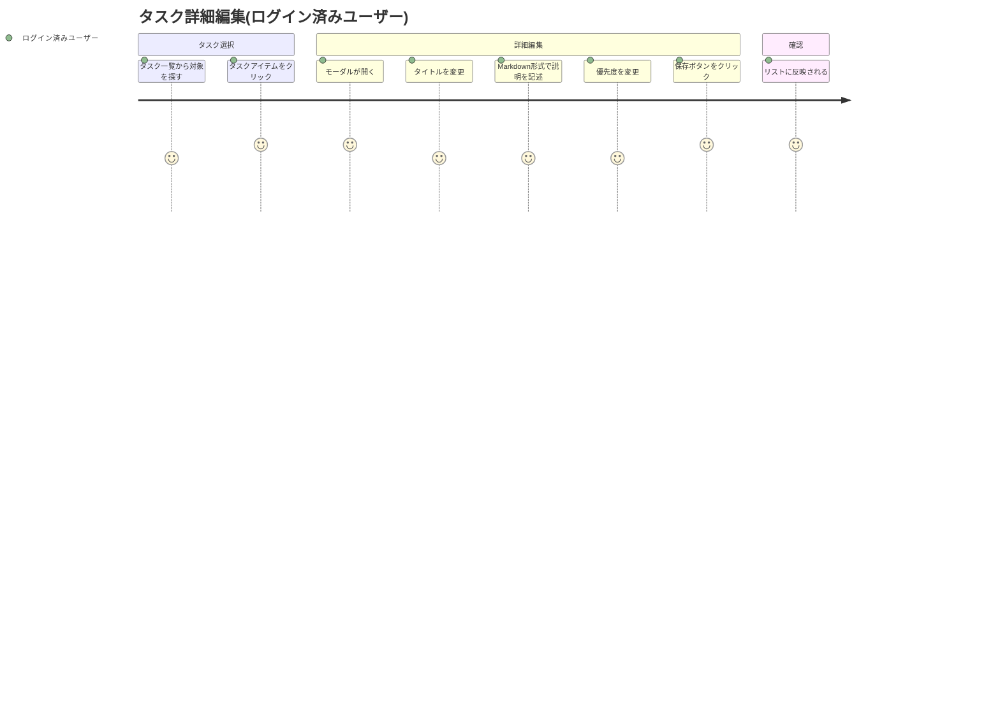

# TODOリストアプリ ユーザーストーリー

## 📄 ドキュメント情報

- **作成日**: 2025-11-06
- **要件名**: todo-app
- **バージョン**: 1.0.0
- **関連文書**: [todo-app-requirements.md](todo-app-requirements.md)

## 概要

このドキュメントはTODOリストアプリ機能の詳細なユーザーストーリーを記載します。
シンプルなタスク管理機能を通じて、ユーザーが効率的に日々のタスクを管理できることを目指します。

## ユーザー種別の定義

### プライマリユーザー

- **ログイン済みユーザー**: Supabase Auth(Google OAuth)で認証済みのアプリケーション利用者
  - 個人のタスクを管理する
  - タスクの作成・更新・削除・完了管理を行う
  - 優先度設定やフィルタ・ソートでタスクを整理する

### セカンダリユーザー

- **システム管理者**: アプリケーションの運用・保守を行う管理者(今回のスコープ外)
- **将来的なユーザー**: チームでのバックログ管理を行うプロジェクトマネージャー(将来的な拡張)

## ユーザーストーリー

**【信頼性レベル凡例】**:
- 🔵 **青信号**: ユーザーヒアリング・既存設計から確実なストーリー
- 🟡 **黄信号**: 既存設計・UX最適化から妥当な推測
- 🔴 **赤信号**: 既存資料にない推測

### 📚 エピック1: タスク管理基本機能 🔵 *ユーザーヒアリング 2025-11-06*

#### ストーリー1.1: 素早いタスク追加 🔵 *ユーザーヒアリング 2025-11-06*

**ユーザーストーリー**:
- **私は** ログイン済みユーザー **として**
- **思いついたタスクをすぐに記録したい時に**
- **リスト上部の入力フォームにタイトルを入力してEnterキーを押す** **ことで**
- **手間なく素早くタスクを追加できる**

**詳細説明**:
- **背景**: タスク管理で最も頻繁に行う操作は「タスクの追加」であるため、この操作を最もシンプルにする必要がある
- **前提条件**: ユーザーがログイン済みで、TODOリスト画面にアクセスしている
- **利用シーン**:
  - 会議中に思いついたタスクをメモする
  - 朝、その日のやることリストを作成する
  - 急な依頼を受けて即座に記録する
- **期待する体験**:
  - 入力フォームが常に見える位置にある
  - タイトルだけでサッと追加できる
  - Enterキーですぐに追加完了
  - 追加後、入力フォームが自動でクリアされ次の入力に備える

**関連要件**: REQ-001, REQ-103, NFR-203

**優先度**: 高

**見積もり**: 2-3日

#### ストーリー1.2: 詳細なタスク編集 🔵 *ユーザーヒアリング 2025-11-06*

**ユーザーストーリー**:
- **私は** ログイン済みユーザー **として**
- **タスクの詳細情報を追加・変更したい時に**
- **タスクアイテムをクリックしてモーダルを開き、説明や優先度を編集する** **ことで**
- **タスクの詳細を充実させて適切に管理できる**

**詳細説明**:
- **背景**: すべてのタスクが詳細情報を必要とするわけではないが、重要なタスクには説明や優先度を設定したい
- **前提条件**: タスクが既に作成されている
- **利用シーン**:
  - 簡易的に追加したタスクに後から詳細を追記する
  - タスクの優先度を変更する
  - Markdown記法でチェックリストや手順を記録する
- **期待する体験**:
  - タスククリックでスムーズにモーダルが開く
  - タイトル・説明・優先度を一度に編集できる
  - Markdownプレビューで記述内容を確認できる
  - 保存後、即座にリストに反映される

**関連要件**: REQ-002, REQ-007, NFR-204

**優先度**: 高

**見積もり**: 3-4日

#### ストーリー1.3: タスクのステータス管理 🔵 *ユーザーヒアリング 2025-11-06*

**ユーザーストーリー**:
- **私は** ログイン済みユーザー **として**
- **タスクの進捗状況を管理したい時に**
- **ステータス(未着手・進行中・レビュー中・完了)を変更する** **ことで**
- **タスクの現在の状態を正確に表現して進捗を可視化できる**

**詳細説明**:
- **背景**: タスクは単純な完了/未完了だけでなく、作業中やレビュー待ちなどの中間状態があるため、詳細なステータス管理が必要
- **前提条件**: タスクが存在する
- **利用シーン**:
  - タスクを開始したら「未着手」→「進行中」に変更
  - 作業が終わったら「進行中」→「レビュー中」に変更
  - レビューが完了したら「レビュー中」→「完了」に変更
  - 状況に応じて自由にステータスを変更できる
- **期待する体験**:
  - ドロップダウンやボタンで簡単にステータスを変更
  - ステータスごとに視覚的に区別される(色やアイコン)
  - 各ステータスの件数が一目で分かる
  - デフォルトは「未着手」で作成される

**関連要件**: REQ-004, REQ-104

**優先度**: 高

**見積もり**: 2-3日

#### ストーリー1.4: 不要なタスクの削除 🔵 *ユーザーヒアリング 2025-11-06*

**ユーザーストーリー**:
- **私は** ログイン済みユーザー **として**
- **不要になったタスクを整理したい時に**
- **削除ボタンをクリックして確認後、タスクを削除する** **ことで**
- **リストを常にクリーンに保つことができる**

**詳細説明**:
- **背景**: 不要なタスクが溜まるとリストが見づらくなるため、削除機能が必要
- **前提条件**: タスクが存在する
- **利用シーン**:
  - 完了済みの古いタスクを定期的に削除
  - 重複したタスクを削除
  - 不要になったタスクを即座に削除
- **期待する体験**:
  - 削除ボタンが分かりやすい位置にある
  - 誤操作防止のため確認ダイアログが表示される
  - 削除後、リストが即座に更新される

**関連要件**: REQ-003, REQ-104

**優先度**: 中

**見積もり**: 1-2日

### 📚 エピック2: 優先度管理 🔵 *ユーザーヒアリング 2025-11-06*

#### ストーリー2.1: タスクの優先度設定 🔵 *ユーザーヒアリング 2025-11-06*

**ユーザーストーリー**:
- **私は** ログイン済みユーザー **として**
- **タスクの重要度を区別したい時に**
- **優先度(高・中・低)を設定する** **ことで**
- **重要なタスクを見失わないようにできる**

**詳細説明**:
- **背景**: すべてのタスクが同じ重要度ではないため、優先順位付けが必要
- **前提条件**: タスクが存在する
- **利用シーン**:
  - 緊急性の高いタスクに「高」を設定
  - 日常的なタスクに「中」を設定
  - 後回しでも良いタスクに「低」を設定
- **期待する体験**:
  - 3段階(高・中・低)から選択できる
  - デフォルトは「中」で設定される
  - 優先度が色やアイコンで視覚的に区別される
  - いつでも優先度を変更できる

**関連要件**: REQ-005, REQ-103

**優先度**: 高

**見積もり**: 2日

#### ストーリー2.2: 優先度による視覚的な区別 🟡 *UX最適化の推測*

**ユーザーストーリー**:
- **私は** ログイン済みユーザー **として**
- **重要なタスクを一目で判別したい時に**
- **優先度が色やアイコンで表現される** **ことで**
- **リストをざっと見るだけで重要タスクを把握できる**

**詳細説明**:
- **背景**: テキストだけでは優先度が分かりにくいため、視覚的な工夫が必要
- **前提条件**: タスクに優先度が設定されている
- **利用シーン**:
  - 朝、その日の優先タスクを確認する
  - リスト全体をスキャンして重要なタスクを探す
- **期待する体験**:
  - 高優先度: 赤系の色(アクセントカラー #ff6a00 など)
  - 中優先度: 通常の表示
  - 低優先度: グレーなど控えめな表示
  - テーマカラーと調和したデザイン

**関連要件**: REQ-005, NFR-201

**優先度**: 中

**見積もり**: 1日

### 📚 エピック3: フィルタ・ソート機能 🔵 *ユーザーヒアリング 2025-11-06*

#### ストーリー3.1: 優先度でのフィルタリング 🔵 *ユーザーヒアリング 2025-11-06*

**ユーザーストーリー**:
- **私は** ログイン済みユーザー **として**
- **特定の優先度のタスクだけを確認したい時に**
- **優先度フィルタを選択する** **ことで**
- **目的のタスクだけを表示できる**

**詳細説明**:
- **背景**: タスクが増えると全体を見渡すのが困難になるため、絞り込み機能が必要
- **前提条件**: 複数のタスクが存在する
- **利用シーン**:
  - 今日やるべき高優先度タスクだけを表示
  - 低優先度タスクを後で確認
- **期待する体験**:
  - ドロップダウンやボタンで優先度を選択
  - 「すべて」「高」「中」「低」から選択可能
  - フィルタ適用後、即座にリストが更新される
  - フィルタ状態が維持される(ページリロード後も)

**関連要件**: REQ-201

**優先度**: 高

**見積もり**: 2日

#### ストーリー3.2: ステータスでのフィルタリング 🔵 *ユーザーヒアリング 2025-11-06*

**ユーザーストーリー**:
- **私は** ログイン済みユーザー **として**
- **特定のステータスのタスクだけを確認したい時に**
- **ステータスフィルタを選択する(複数選択可能)** **ことで**
- **目的のタスクだけを表示できる**

**詳細説明**:
- **背景**: タスクが増えると様々なステータスのタスクが混在し、見づらくなるため、ステータスで絞り込む機能が必要
- **前提条件**: 複数のステータスのタスクが混在している
- **利用シーン**:
  - 作業中は「未着手」と「進行中」のタスクのみ表示
  - レビュー待ちタスクを確認したい時は「レビュー中」のみ表示
  - 振り返りで「完了」タスクを確認
  - すべてのタスクを確認したい時は全選択
- **期待する体験**:
  - チェックボックスまたはマルチセレクトで複数ステータスを選択可能
  - 「すべて」「未着手」「進行中」「レビュー中」「完了」から選択
  - デフォルトは「すべて」(全ステータス表示)
  - 優先度フィルタと組み合わせ可能
  - フィルタ状態が維持される(ページリロード後も)

**関連要件**: REQ-202

**優先度**: 高

**見積もり**: 2-3日

#### ストーリー3.3: タスクの並び替え 🔵 *ユーザーヒアリング 2025-11-06*

**ユーザーストーリー**:
- **私は** ログイン済みユーザー **として**
- **タスクを異なる順序で確認したい時に**
- **ソート方法を選択する** **ことで**
- **タスクを希望の順序で表示できる**

**詳細説明**:
- **背景**: 状況に応じて最適な並び順が異なるため、柔軟なソート機能が必要
- **前提条件**: 複数のタスクが存在する
- **利用シーン**:
  - デフォルトは新しいタスクが上(作成日時降順)
  - 古いタスクから処理したい場合は作成日時昇順
  - 重要度順に確認したい場合は優先度順
- **期待する体験**:
  - ドロップダウンでソート方法を選択
  - 「作成日時(新)」「作成日時(古)」「優先度(高→低)」から選択
  - ソート適用後、即座にリストが並び替わる
  - ソート状態が維持される(ページリロード後も)

**関連要件**: REQ-203

**優先度**: 中

**見積もり**: 2日

### 📚 エピック4: セキュリティとアクセス制御 🔵 *既存認証基盤*

#### ストーリー4.1: ログイン必須のアクセス制御 🔵 *既存認証要件*

**ユーザーストーリー**:
- **私は** 未認証ユーザー **として**
- **TODOリスト機能にアクセスしようとした時に**
- **ログイン画面にリダイレクトされる** **ことで**
- **認証が必要であることが明確に分かる**

**詳細説明**:
- **背景**: 個人のタスク管理機能はプライバシーが重要なため、認証必須とする
- **前提条件**: ユーザーが未認証状態
- **利用シーン**:
  - 直接URLでTODOリストにアクセスしようとする
  - ログアウト後に再アクセスする
- **期待する体験**:
  - 即座にログイン画面にリダイレクト
  - ログイン後、元のページ(TODOリスト)に戻る

**関連要件**: REQ-101, NFR-103

**優先度**: 高

**見積もり**: 1日(既存認証基盤活用)

#### ストーリー4.2: 自分のタスクだけ表示 🔵 *既存RLS方針*

**ユーザーストーリー**:
- **私は** ログイン済みユーザー **として**
- **タスク一覧を表示する時に**
- **自分が作成したタスクだけが表示される** **ことで**
- **他のユーザーのタスクが見えず、プライバシーが守られる**

**詳細説明**:
- **背景**: マルチユーザー環境でのデータ分離は必須のセキュリティ要件
- **前提条件**: 複数のユーザーがシステムを利用している
- **利用シーン**:
  - 通常のタスク一覧表示
  - フィルタ・ソート後の表示
- **期待する体験**:
  - 意識せずとも自分のタスクだけが表示される
  - URLを直接叩いても他ユーザーのタスクにアクセスできない
  - Row-Level Security(RLS)による透過的な制御

**関連要件**: REQ-403, NFR-102, NFR-103

**優先度**: 高

**見積もり**: 2日(RLS設定含む)

## ユーザージャーニー

### ジャーニー1: 朝のタスク整理フロー 🔵 *ユーザーヒアリング 2025-11-06*

**詳細**:
1. **TODOリストにアクセス**: ログイン済みのため即座にアクセス可能、自分のタスクのみ表示
2. **ステータスフィルタ適用**: 「未着手」と「進行中」を選択して、これから取り組むべきタスクに集中
3. **優先度順にソート**: 重要なタスクから取り組むため優先度順に並び替え
4. **新しいタスクを思いつく**: 朝の確認中に新たなタスクを思いつく
5. **インライン入力でサッと追加**: リスト上部の入力欄にタイトルを入力してEnter(デフォルトで「未着手」)
6. **優先度を「高」に設定**: モーダルを開いて詳細設定、または後で設定
7. **最優先タスクを確認**: 優先度「高」のタスクが上部に表示される
8. **タスク開始時ステータスを「進行中」に**: 作業開始時にステータスを変更
9. **タスク完了後ステータスを「完了」に**: タスク完了時、ステータスを「完了」に変更

### ジャーニー2: タスクの詳細編集フロー 🔵 *ユーザーヒアリング 2025-11-06*

**詳細**:
1. **タスク一覧から対象を探す**: フィルタ・ソートで絞り込んで探しやすくなっている
2. **タスクアイテムをクリック**: タスクをクリックするとモーダルがスムーズに開く
3. **モーダルが開く**: タイトル・説明・優先度を一度に編集できるフォームが表示
4. **タイトルを変更**: 必要に応じてタイトルを修正
5. **Markdown形式で説明を記述**: チェックリストや手順をMarkdown記法で記録
6. **優先度を変更**: ドロップダウンで優先度を変更
7. **保存ボタンをクリック**: 変更を保存
8. **リストに反映される**: モーダルが閉じ、変更が即座にリストに反映される

## ペルソナ定義

### ペルソナ1: 個人開発者 田中さん 🟡 *一般的なユーザー像の推測*

- **基本情報**:
  - 年齢: 30代
  - 職業: フリーランスエンジニア
  - 技術レベル: TypeScript・Reactに精通
- **ゴール**:
  - 個人プロジェクトのタスクを効率的に管理したい
  - シンプルで使いやすいTODOツールを使いたい
  - 将来的にバックログ管理にも活用したい
- **課題**:
  - 複雑すぎるツールは使いたくない
  - タスク入力に時間をかけたくない
  - 優先度管理で重要なタスクを見失いがち
- **行動パターン**:
  - 朝一で今日のタスクを確認・追加
  - 作業中に思いついたタスクを即座に追加
  - 週末に完了タスクを振り返り・削除
- **利用環境**:
  - デスクトップPC(メイン)
  - たまにスマホでも確認(基本動作のみ)

### ペルソナ2: 学生 佐藤さん 🟡 *一般的なユーザー像の推測*

- **基本情報**:
  - 年齢: 20代
  - 職業: 大学生
  - 技術レベル: 基本的なWeb操作に慣れている
- **ゴール**:
  - 課題・レポートの期限を管理したい
  - アルバイトのシフトに関連するタスクを整理したい
  - 勉強計画を立てたい
- **課題**:
  - やることが多くて混乱する
  - 重要度の判断が難しい
  - 完了したタスクが溜まると見づらい
- **行動パターン**:
  - 授業後にその日のタスクを追加
  - 優先度フィルタで緊急タスクを確認
  - 完了タスクを定期的に削除
- **利用環境**:
  - ノートPC(メイン)
  - 移動中にスマホで確認

## 非機能的ユーザー要求

### ユーザビリティ要求

- **学習容易性**: 初回利用時に説明なしで基本操作ができる 🔵 *ユーザーヒアリング(言語非依存)*
- **効率性**: タスク追加が5秒以内に完了する 🟡 *UX要件の推測*
- **記憶しやすさ**: 一度使えば次回も迷わず操作できる 🔵 *ユーザーヒアリング(直感的UI)*
- **エラー対応**: 削除などの重要操作には確認ダイアログが表示される 🟡 *UX要件の推測*
- **満足度**: ストレスなくタスク管理ができる 🔵 *ユーザーヒアリング*

### アクセシビリティ要求

- **視覚**: テーマカラーのコントラスト比を確保する 🔵 *ユーザーヒアリング(テーマカラー)*
- **キーボード**: Enterキーでタスク追加、Escキーでモーダル閉じる 🟡 *アクセシビリティ最適化の推測*
- **スクリーンリーダー**: 適切なARIA属性を設定する 🟡 *アクセシビリティ最適化の推測*
- **モバイル**: デスクトップ優先だが、基本操作はモバイルでも可能 🔵 *ユーザーヒアリング 2025-11-06*

## 将来的なユーザーストーリー(今回は対象外)

以下は今回のスコープに含めないが、将来的な拡張として検討するストーリー:

### バックログ管理への拡張

- **エピック5**: バックログ作成・管理
- **エピック6**: バックログアイテムとタスクの階層管理
- **エピック7**: ストーリーポイント設定
- **エピック8**: バーンダウンチャート表示
- **エピック9**: スプリント管理

### 高度な機能

- タスクの期限設定とリマインダー
- タスクのタグ付けとタグフィルタ
- タスクのカテゴリ分類
- タスクの全文検索
- タスクのアーカイブ(論理削除)
- タスクの一括操作
- タスクのドラッグ&ドロップ並び替え
- タスクの履歴管理
- モバイルアプリ(PWA)対応の強化

## 参考資料

- [User Story Mapping](https://www.amazon.co.jp/dp/4873117321)
- [ユーザーストーリーマッピング実践ガイド](https://www.amazon.co.jp/dp/4798158216)
- [ペルソナ作成の基礎](https://www.usability.gov/how-to-and-tools/methods/personas.html)
