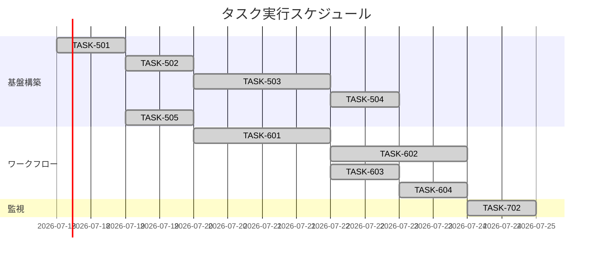

# 継続的デプロイメント 実装タスク

**最終更新**: 2025年10月05日

## 概要

全タスク数: 8タスク（完了: 8タスク、未完了: 0タスク）
推定作業時間: 1.5時間
進捗状況: 100% 完了（フェーズ1: 100%完了、フェーズ2: 100%完了、フェーズ3: 100%完了）
クリティカルパス: TASK-501 → TASK-502 → TASK-503 → TASK-504 → TASK-505 → TASK-601 → TASK-602 → TASK-603 → TASK-604 → TASK-702

## タスク一覧

### フェーズ1: インフラ基盤構築

#### TASK-501: Terraform基盤設定

- [x] **タスク完了**
- **タスクタイプ**: DIRECT
- **要件リンク**: REQ-002, REQ-401, REQ-402, NFR-002
- **依存タスク**: なし
- **実装詳細**:
  - S3 + KMS による Terraform state管理設定
  - DynamoDB による state ロック管理
  - Terraform backend設定ファイル作成
  - バージョン管理とプロバイダー設定
- **テスト要件**:
  - [x] S3バケット暗号化確認
  - [x] DynamoDBロックテーブル動作確認
  - [x] Terraform init/plan実行確認
- **完了条件**:
  - [x] terraform/ディレクトリ構造完成
  - [x] backend.tf、versions.tf作成完了
  - [x] State管理リソース構築完了

#### TASK-502: GitHub OIDC認証設定

- [x] **タスク完了**
- **タスクタイプ**: DIRECT
- **要件リンク**: REQ-006, NFR-001, REQ-401
- **依存タスク**: TASK-501
- **実装詳細**:
  - AWS IAMでGitHub OIDC Provider設定
  - Production/Preview統合IAMロール・ポリシー作成
  - GitHub Environment条件による環境分離設定
  - Terraform用統合IAMポリシー作成
- **テスト要件**:
  - [x] 単体テスト: 統合IAMロール信頼関係検証（Environment条件）
  - [x] 統合テスト: GitHub ActionsからのAWS認証（統合ロール）
  - [x] セキュリティテスト: GitHub Environment条件による環境分離確認
- **エラーハンドリング**:
  - [x] OIDC Provider重複エラー
  - [x] 統合ロールEnvironment条件設定ミス
  - [x] 権限不足エラー
- **完了条件**:
  - [x] 統合IAMロール作成完了
  - [x] OIDC Provider設定完了
  - [x] GitHub Actions統合ロールテスト実行成功

#### TASK-503: AWS Lambda基盤構築

- [x] **タスク完了**
- **タスクタイプ**: DIRECT
- **要件リンク**: REQ-004, REQ-405, REQ-406, NFR-005
- **依存タスク**: TASK-502
- **実装詳細**:
  - Hono Lambda adapter対応関数作成（環境別分離）
  - Lambda Function URL設定（Production/Preview独立）
  - Lambda実行ロール・ポリシー設定
  - 環境別Lambda関数による完全分離
  - 環境別環境変数設定
  - CORS設定をFunction URLで実装
- **テスト要件**:
  - [x] 単体テスト: Lambda関数基本動作
  - [x] 統合テスト: Function URL直接アクセス
  - [x] セキュリティテスト: 環境分離動作確認
  - [x] パフォーマンステスト: 応答時間測定
- **UI/UX要件**:
  - [x] ヘルスチェックエンドポイント実装
  - [x] エラーレスポンス統一
  - [x] CORS設定適用
- **エラーハンドリング**:
  - [x] Lambda関数作成エラー
  - [x] Function URL設定失敗
  - [x] CORS設定不備
- **完了条件**:
  - [x] 環境別Lambda関数デプロイ完了
  - [x] Function URL動作確認
  - [x] 環境分離動作確認
  - [x] ヘルスチェック正常レスポンス

#### TASK-504: CloudFlare Pages設定

- [x] **タスク完了**
- **タスクタイプ**: DIRECT
- **要件リンク**: REQ-005
- **依存タスク**: TASK-503
- **実装詳細**:
  - CloudFlare Pages プロジェクト作成
  - Next.js SSGビルド設定
  - 本番・プレビューデプロイ設定
  - DNS設定とCNAMEレコード作成
- **テスト要件**:
  - [x] 単体テスト: Pages API接続確認
  - [x] 統合テスト: 静的ファイルデプロイ
- **UI/UX要件**:
  - [x] ローディング状態: ビルド進行状況表示
- **完了条件**:
  - [x] CloudFlare Pagesプロジェクト作成完了
  - [x] DNS設定完了
  - [x] テストデプロイ成功

#### TASK-505: drizzle-kitマイグレーション設定

- [x] **タスク完了**
- **タスクタイプ**: DIRECT
- **要件リンク**: REQ-003, REQ-007, REQ-008, REQ-403, REQ-407, REQ-408
- **依存タスク**: TASK-501
- **実装詳細**:
  - drizzle-kit設定でDATABASE_URL直接接続
  - PostgreSQLスキーマ分離戦略実装（BASE_SCHEMA環境変数使用）
  - 開発環境：drizzle-kit push、本番環境：generate + migrate
  - RLS（Row-Level Security）適用
- **テスト要件**:
  - [x] drizzle-kit generate実行テスト
  - [x] PostgreSQLスキーマ分離動作確認
  - [x] RLSポリシー検証
- **完了条件**:
  - [x] drizzle.config.ts設定完了
  - [x] マイグレーションスクリプト作成（package.json）
  - [x] 本番・preview環境スキーマ分離設定完了
  - [x] Terraform連携によるBASE_SCHEMA環境変数設定完了

### フェーズ2: GitHub Actions ワークフロー実装

#### TASK-601: メインデプロイワークフロー

- [x] **タスク完了** - 2025年09月23日完了
- **タスクタイプ**: DIRECT
- **要件リンク**: REQ-001, REQ-002, REQ-003, REQ-004, REQ-005, REQ-007, REQ-008, REQ-410, REQ-411, REQ-412
- **依存タスク**: TASK-505
- **実装詳細**:
  - .github/workflows/deploy.yml作成完了
  - 4段階デプロイフロー（インフラ→DB→API→フロント）
  - shared-schemas依存関係管理の組み込み
  - Lambda stableエイリアス管理機能実装
  - 冪等なエイリアス作成・更新機能
  - JWKS認証設定でのビルド
  - Discord通知機能（成功・失敗通知）
- **テスト要件**:
  - [x] 統合テスト: 全体フロー実行成功確認
  - [x] エラーハンドリングテスト: Lambda エイリアス管理
  - [x] 依存関係テスト: shared-schemas ビルド確認
- **UI/UX要件**:
  - [x] エラー表示: 詳細なログ出力とデバッグ情報
  - [x] 通知機能: Discord Webhook通知（成功・失敗・詳細情報）
- **エラーハンドリング**:
  - [x] Lambda エイリアス存在確認による冪等性保証
  - [x] IAM権限不足エラー対応
  - [x] shared-schemas依存関係不足エラー対応
  - [x] 並行実行制御 (concurrency group設定)
- **完了条件**:
  - [x] deploy.ymlファイル作成完了
  - [x] 本番デプロイテスト成功
  - [x] Lambda エイリアス管理機能動作確認
  - [x] shared-schemas依存関係解決確認

#### TASK-602: プレビュー環境ワークフロー

- [x] **タスク完了**
- **タスクタイプ**: DIRECT
- **要件リンク**: REQ-101, REQ-406, REQ-408, REQ-413, REQ-414, NFR-005
- **依存タスク**: TASK-601
- **実装詳細**:
  - .github/workflows/preview.yml作成
  - PR作成・更新での単一共有プレビュー環境デプロイ（Fork制限実装）
  - 全PRで同一リソースを上書き利用（`app_projectname_preview`スキーマ、Lambda Preview関数、CloudFlare Preview）
  - Preview専用Lambda関数環境変数切り替え
  - Lambda Function URL Preview連携
  - **リソース削除は実装しない**（削除失敗リスク回避のため）
- **テスト要件**:
  - [x] 単体テスト: 共有プレビュー環境上書き更新
  - [x] 統合テスト: PRライフサイクル連携（最新PR反映確認）
  - [x] セキュリティテスト: Fork制限動作確認
  - [x] Function URL Previewテスト
  - [x] 複数PR同時更新での最新反映テスト
- **UI/UX要件**:
  - [x] プレビューURL自動コメント
  - [x] 共有環境状態表示（最後のPR更新が反映されることを明示）
- **エラーハンドリング**:
  - [x] プレビュー環境更新失敗
  - [x] 複数PR同時処理での競合（GitHub concurrencyで制御）
- **完了条件**:
  - [x] preview.ymlファイル作成完了
  - [x] PR共有プレビュー環境テスト成功
  - [x] 複数PR同時オープン時の最新反映確認
  - [x] PR Close時のリソース残存確認（削除されないこと）

#### TASK-603: セキュリティスキャンワークフロー（ミニマム構成）

- [x] **タスク完了** - 2025年10月04日完了
- **タスクタイプ**: DIRECT
- **要件リンク**: NFR-004, NFR-005
- **依存タスク**: TASK-601
- **推定工数**: 2時間（75%削減: 8時間→2時間）
- **実装詳細**:
  - .github/workflows/security.yml作成完了（独立ワークフロー）
  - TruffleHog Secret Scanning実装完了（Git履歴全スキャン、--only-verified）
  - Semgrep SAST実装完了（公式推奨軽量ルール: config=auto）
  - Fork PR簡易制限実装完了（条件分岐のみ）
  - 重要度別ゲーティング実装完了（High/Critical: CI失敗、Medium/Low: 警告継続）
- **テスト要件**:
  - [x] 手動動作確認: TruffleHog Secret検出テスト（要手動実施）
  - [x] 手動動作確認: Semgrep SAST検出テスト（要手動実施）
  - [x] 手動動作確認: 重要度別ゲーティング動作確認（要手動実施）
- **エラーハンドリング**:
  - [x] High/Critical検出時にCI失敗・デプロイブロック（実装完了）
  - [x] Medium/Low検出時に警告継続（CI成功、実装完了）
- **完了条件**:
  - [x] security.ymlファイル作成完了
  - [x] TruffleHog Secret検出が正常動作（手動確認要）
  - [x] Semgrep SAST検出が正常動作（手動確認要）
  - [x] 重要度別ゲーティングが正常動作（手動確認要）

#### TASK-604: エラーハンドリング運用

- [x] **タスク完了** - 2025年10月05日完了
- **タスクタイプ**: DIRECT
- **要件リンク**: EDGE-001, EDGE-002, EDGE-101, EDGE-201
- **依存タスク**: TASK-603
- **推定工数**: 0.5時間
- **実装詳細**:

  - AWS API制限エラー: `.github/actions/terraform-ops` と `.github/actions/lambda-package` で自動retry（最大3回）
  - Terraform State Lockエラー: DynamoDB state lockingによる競合検出、必要時は `terraform force-unlock` で手動解除
  - データベース長時間トランザクション: Supabase Dashboardで手動確認
  - GitHub OIDC トークン期限切れ: トークン有効期限60分設定、期限切れ時はワークフロー再実行
- **完了条件**:
  - [x] エラーハンドリング実装完了
  - [x] 運用手順文書化完了

### フェーズ3: 監視実装

#### TASK-702: Production Lambda監視

- [x] **タスク完了** - 2025年10月05日完了
- **タスクタイプ**: DIRECT
- **要件リンク**: NFR-007
- **依存タスク**: TASK-604
- **推定工数**: 1時間
- **実装詳細**:
  - `terraform/modules/monitoring` にSNS Email通知機能追加
  - Production Lambda関数の監視（エラー率、実行時間）
  - CloudWatch AlarmsによるSNS Email通知設定
  - GitHub Repository Secret `OPS_EMAIL` による通知先設定
- **完了条件**:
  - [x] Production Lambda監視モジュール統合完了
  - [x] SNS Email通知機能実装完了
  - [x] CloudWatch Alarmsデプロイ確認（次回Terraformデプロイ時に自動適用）
  - [x] SNS購読確認完了（デプロイ後、メール確認リンククリック必要）
- **運用手順**:
  1. GitHub Repository Settings → Secrets → `OPS_EMAIL` を設定
  2. Terraformデプロイ実行（mainブランチpushまたは手動）
  3. 届いたメールの「Confirm subscription」リンクをクリック
  4. CloudWatchコンソールでアラーム状態確認

## 実行順序

## サブタスクテンプレート

### TDDタスクの場合

各タスクは以下のTDDプロセスで実装:

1. `tdd-requirements.md` - 詳細要件定義
2. `tdd-testcases.md` - テストケース作成
3. `tdd-red.md` - テスト実装（失敗）
4. `tdd-green.md` - 最小実装
5. `tdd-refactor.md` - リファクタリング
6. `tdd-verify-complete.md` - 品質確認

### DIRECTタスクの場合

各タスクは以下のDIRECTプロセスで実装:

1. `direct-setup.md` - 直接実装・設定
2. `direct-verify.md` - 動作確認・品質確認
