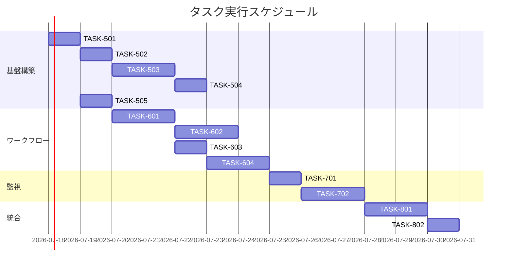

# 継続的デプロイメント 実装タスク

**最終更新**: 2025年9月17日  


## 概要

全タスク数: 18タスク
推定作業時間: 38時間（drizzle-kit採用によりマイグレーション工数削減、統合ロール採用により設定工数削減）
クリティカルパス: TASK-501 → TASK-502 → TASK-503 → TASK-504 → TASK-505 → TASK-601 → TASK-602 → TASK-603 → TASK-604

## タスク一覧

### フェーズ1: インフラ基盤構築

#### TASK-501: Terraform基盤設定

- [x] **タスク完了**
- **タスクタイプ**: DIRECT
- **要件リンク**: REQ-002, REQ-401, REQ-402, NFR-002
- **依存タスク**: なし
- **実装詳細**:
  - S3 + KMS による Terraform state管理設定
  - DynamoDB による state ロック管理
  - Terraform backend設定ファイル作成
  - バージョン管理とプロバイダー設定
- **テスト要件**:
  - [x] S3バケット暗号化確認
  - [x] DynamoDBロックテーブル動作確認
  - [x] Terraform init/plan実行確認
- **完了条件**:
  - [x] terraform/ディレクトリ構造完成
  - [x] backend.tf、versions.tf作成完了
  - [x] State管理リソース構築完了

#### TASK-502: GitHub OIDC認証設定

- [x] **タスク完了**
- **タスクタイプ**: DIRECT
- **要件リンク**: REQ-006, NFR-001, REQ-401
- **依存タスク**: TASK-501
- **実装詳細**:
  - AWS IAMでGitHub OIDC Provider設定
  - Production/Preview統合IAMロール・ポリシー作成
  - GitHub Environment条件による環境分離設定
  - Terraform用統合IAMポリシー作成
- **テスト要件**:
  - [x] 単体テスト: 統合IAMロール信頼関係検証（Environment条件）
  - [x] 統合テスト: GitHub ActionsからのAWS認証（統合ロール）
  - [x] セキュリティテスト: GitHub Environment条件による環境分離確認
- **エラーハンドリング**:
  - [x] OIDC Provider重複エラー
  - [x] 統合ロールEnvironment条件設定ミス
  - [x] 権限不足エラー
- **完了条件**:
  - [x] 統合IAMロール作成完了
  - [x] OIDC Provider設定完了
  - [x] GitHub Actions統合ロールテスト実行成功

#### TASK-503: AWS Lambda基盤構築

- [x] **タスク完了**
- **タスクタイプ**: DIRECT
- **要件リンク**: REQ-004, REQ-405, REQ-406, NFR-005
- **依存タスク**: TASK-502
- **実装詳細**:
  - Hono Lambda adapter対応関数作成（環境別分離）
  - Lambda Function URL設定（Production/Preview独立）
  - Lambda実行ロール・ポリシー設定
  - 環境別Lambda関数による完全分離
  - 環境別環境変数設定
  - CORS設定をFunction URLで実装
- **テスト要件**:
  - [x] 単体テスト: Lambda関数基本動作
  - [x] 統合テスト: Function URL直接アクセス
  - [x] セキュリティテスト: 環境分離動作確認
  - [x] パフォーマンステスト: 応答時間測定
- **UI/UX要件**:
  - [x] ヘルスチェックエンドポイント実装
  - [x] エラーレスポンス統一
  - [x] CORS設定適用
- **エラーハンドリング**:
  - [x] Lambda関数作成エラー
  - [x] Function URL設定失敗
  - [x] CORS設定不備
- **完了条件**:
  - [x] 環境別Lambda関数デプロイ完了
  - [x] Function URL動作確認
  - [x] 環境分離動作確認
  - [x] ヘルスチェック正常レスポンス

#### TASK-504: CloudFlare Pages設定

- [x] **タスク完了**
- **タスクタイプ**: DIRECT
- **要件リンク**: REQ-005
- **依存タスク**: TASK-503
- **実装詳細**:
  - CloudFlare Pages プロジェクト作成
  - Next.js SSGビルド設定
  - 本番・プレビューデプロイ設定
  - DNS設定とCNAMEレコード作成
- **テスト要件**:
  - [ ] 単体テスト: Pages API接続確認
  - [ ] 統合テスト: 静的ファイルデプロイ
  - [ ] E2Eテスト: ドメインアクセス確認
- **UI/UX要件**:
  - [ ] ローディング状態: ビルド進行状況表示
  - [ ] エラー表示: デプロイ失敗通知
  - [ ] モバイル対応: レスポンシブ動作確認
- **エラーハンドリング**:
  - [ ] Pages API認証エラー
  - [ ] ビルド失敗処理
  - [ ] DNS設定エラー
- **完了条件**:
  - [ ] CloudFlare Pagesプロジェクト作成完了
  - [ ] DNS設定完了
  - [ ] テストデプロイ成功

#### TASK-505: drizzle-kitマイグレーション設定

- [ ] **タスク完了**
- **タスクタイプ**: DIRECT
- **要件リンク**: REQ-003, REQ-007, REQ-008, REQ-403, REQ-407, REQ-408
- **依存タスク**: TASK-501
- **実装詳細**:
  - drizzle-kit設定でDATABASE_URL直接接続
  - データベース権限分離（app_role/migrate_role）実装
  - テーブルプレフィックス戦略実装（PostgreSQL）
  - 開発環境：drizzle-kit push、本番環境：generate + migrate
  - RLS（Row-Level Security）適用
- **テスト要件**:
  - [ ] drizzle-kit generate実行テスト
  - [ ] migrate_roleによるマイグレーション実行テスト
  - [ ] テーブルプレフィックス動作確認
  - [ ] RLSポリシー検証
- **完了条件**:
  - [ ] drizzle.config.ts設定完了
  - [ ] マイグレーションスクリプト作成（package.json）
  - [ ] 権限分離設定完了
  - [ ] 本番・preview環境分離設定完了

### フェーズ2: GitHub Actions ワークフロー実装

#### TASK-601: メインデプロイワークフロー

- [ ] **タスク完了**
- **タスクタイプ**: DIRECT
- **要件リンク**: REQ-001, REQ-002, REQ-003, REQ-004, REQ-005, REQ-007, REQ-008
- **依存タスク**: TASK-505
- **実装詳細**:
  - .github/workflows/deploy.yml作成
  - 4段階デプロイフロー（インフラ→drizzle-kit DB→API→フロント）
  - 並行制御とconcurrency group設定
  - Terraformプラン承認フロー実装
- **テスト要件**:
  - [ ] 単体テスト: 各ステップの独立動作
  - [ ] 統合テスト: フロー全体実行
  - [ ] エラーハンドリングテスト: 途中失敗時の動作
- **UI/UX要件**:
  - [ ] ローディング状態: GitHub Actions進行状況
  - [ ] エラー表示: 詳細なログ出力
  - [ ] 通知機能: デプロイ完了アラート
- **エラーハンドリング**:
  - [ ] ワークフロー途中失敗時の停止
  - [ ] 承認待ちタイムアウト
  - [ ] 並行実行競合エラー
- **完了条件**:
  - [ ] deploy.ymlファイル作成完了
  - [ ] 本番デプロイテスト成功
  - [ ] 承認フロー動作確認

#### TASK-602: プレビュー環境ワークフロー

- [ ] **タスク完了**
- **タスクタイプ**: DIRECT
- **要件リンク**: REQ-101, REQ-406, NFR-005
- **依存タスク**: TASK-601
- **実装詳細**:
  - .github/workflows/preview.yml作成
  - PR作成・更新でのプレビューデプロイ（Fork制限実装）
  - PR終了時のリソースクリーンアップ
  - Preview専用Lambda関数環境変数切り替え
  - Lambda Function URL Preview連携
- **テスト要件**:
  - [ ] 単体テスト: プレビュー環境作成
  - [ ] 統合テスト: PRライフサイクル連携
  - [ ] セキュリティテスト: Fork制限動作確認
  - [ ] Function URL Previewテスト
  - [ ] リソースクリーンアップテスト
- **UI/UX要件**:
  - [ ] プレビューURL自動コメント
  - [ ] 環境分離状態表示
  - [ ] クリーンアップ完了通知
- **エラーハンドリング**:
  - [ ] プレビュー環境作成失敗
  - [ ] リソースクリーンアップ失敗
  - [ ] 複数PR同時処理競合
- **完了条件**:
  - [ ] preview.ymlファイル作成完了
  - [ ] PRプレビュー環境テスト成功
  - [ ] クリーンアップ動作確認

#### TASK-603: セキュリティスキャンワークフロー

- [ ] **タスク完了**
- **タスクタイプ**: DIRECT
- **要件リンク**: NFR-004, NFR-005
- **依存タスク**: TASK-601
- **実装詳細**:
  - .github/workflows/security.yml作成
  - TruffleHog Secret Scanning実装
  - Semgrep SAST（Static Analysis）実装
  - Fork制限セキュリティ検証
  - 重要度別エラーハンドリング
- **テスト要件**:
  - [ ] 単体テスト: シークレット検出機能
  - [ ] 統合テスト: SAST脆弱性検出
  - [ ] セキュリティテスト: Fork制限検証
  - [ ] 偽陽性テスト: 正常コードの通過確認
- **エラーハンドリング**:
  - [ ] 高・致命的脆弱性でのデプロイブロック
  - [ ] 中・低レベル脆弱性での警告継続
  - [ ] セキュリティチームへの自動通知
- **完了条件**:
  - [ ] security.ymlファイル作成完了
  - [ ] セキュリティスキャン実行成功
  - [ ] 脆弱性検出テスト成功

#### TASK-604: エラーハンドリング・再試行機能

- [ ] **タスク完了**
- **タスクタイプ**: TDD
- **要件リンク**: EDGE-001, EDGE-002, EDGE-101, EDGE-201
- **依存タスク**: TASK-603
- **実装詳細**:
  - 指数バックオフ再試行戦略実装
  - Terraform state ロック競合解決
  - AWS API制限対応
  - GitHub OIDC トークンリフレッシュ
- **テスト要件**:
  - [ ] 単体テスト: 再試行ロジック
  - [ ] 統合テスト: 各種エラーシナリオ
  - [ ] ストレステスト: 制限超過時の動作
- **エラーハンドリング**:
  - [ ] 最大再試行回数到達時の停止
  - [ ] 管理者アラート機能
  - [ ] 手動介入オプション提供
- **完了条件**:
  - [ ] 再試行機能実装完了
  - [ ] エラーハンドリングテスト成功
  - [ ] アラート機能動作確認

### フェーズ3: 監査・監視実装

#### TASK-701: デプロイメント監査ログ

- [ ] **タスク完了**
- **タスクタイプ**: DIRECT
- **要件リンク**: NFR-006
- **依存タスク**: TASK-604
- **実装詳細**:
  - CloudWatch Logs設定
  - 構造化ログフォーマット実装
  - 基本監査情報記録（実行者・日時・対象）
  - ログ保持期間設定（90日）
- **テスト要件**:
  - [ ] ログ出力テスト
  - [ ] 構造化データ検証
  - [ ] 保持期間設定確認
- **エラーハンドリング**:
  - [ ] ログ出力失敗時の代替手段
  - [ ] ログ容量制限超過対応
  - [ ] CloudTrail連携エラー
- **完了条件**:
  - [ ] 全デプロイ操作のログ記録
  - [ ] CloudTrail連携設定完了

#### TASK-702: 基本監視・アラート

- [ ] **タスク完了**
- **タスクタイプ**: TDD
- **要件リンク**: EDGE-101, EDGE-201
- **依存タスク**: TASK-701
- **実装詳細**:
  - CloudWatch Alarms設定
  - Lambda エラー率・実行時間監視
  - API Gateway レスポンス監視
  - データベース長時間トランザクション検出
- **テスト要件**:
  - [ ] アラーム閾値テスト
  - [ ] 通知配信確認
  - [ ] 偽陽性アラート検証
- **UI/UX要件**:
  - [ ] アラート通知: Slack/Email統合
  - [ ] ダッシュボード: メトリクス可視化
  - [ ] 手動介入: 管理者オプション提供

### フェーズ4: 統合・最適化

#### TASK-801: E2E統合テスト

- [ ] **タスク完了**
- **タスクタイプ**: TDD
- **要件リンク**: 全要件
- **依存タスク**: TASK-702
- **実装詳細**:
  - 全体デプロイフローE2Eテスト実装
  - プレビュー環境作成・削除テスト
  - 破壊的変更承認フローテスト
  - マルチサービス連携テスト
- **テスト要件**:
  - [ ] 正常系: 完全デプロイフロー
  - [ ] 異常系: 各段階での失敗処理
  - [ ] 並行実行: 複数PR同時処理
- **UI/UX要件**:
  - [ ] テスト進行状況表示
  - [ ] 詳細ログ出力
  - [ ] 結果レポート生成
- **エラーハンドリング**:
  - [ ] テスト環境セットアップ失敗
  - [ ] テスト実行タイムアウト
  - [ ] データクリーンアップ失敗
- **完了条件**:
  - [ ] 全E2Eテスト実行成功
  - [ ] テストレポート生成完了
  - [ ] 継続的テスト実行設定完了

#### TASK-802: パフォーマンス最適化

- [ ] **タスク完了**
- **タスクタイプ**: DIRECT
- **要件リンク**: REQ-201
- **依存タスク**: TASK-801
- **実装詳細**:
  - デプロイ時間短縮のための並列化
  - Lambdaコールドスタート最適化
  - CloudFlare Pages ビルドキャッシュ設定
  - Terraform実行時間短縮
- **テスト要件**:
  - [ ] 実行時間測定
  - [ ] 並列実行効果検証
  - [ ] キャッシュヒット率確認
- **エラーハンドリング**:
  - [ ] 最適化による副作用検出
  - [ ] キャッシュ無効化処理
  - [ ] パフォーマンス劣化アラート
- **完了条件**:
  - [ ] デプロイ時間15分以内達成
  - [ ] 並行実行によるスループット向上
  - [ ] パフォーマンス監視設定完了

## 実行順序



## サブタスクテンプレート

### TDDタスクの場合

各タスクは以下のTDDプロセスで実装:

1. `tdd-requirements.md` - 詳細要件定義
2. `tdd-testcases.md` - テストケース作成
3. `tdd-red.md` - テスト実装（失敗）
4. `tdd-green.md` - 最小実装
5. `tdd-refactor.md` - リファクタリング
6. `tdd-verify-complete.md` - 品質確認

### DIRECTタスクの場合

各タスクは以下のDIRECTプロセスで実装:

1. `direct-setup.md` - 直接実装・設定
2. `direct-verify.md` - 動作確認・品質確認

## 環境変数・シークレット設定要件

### GitHub Environment: production
```yaml
Variables:
  AWS_ROLE_ARN: arn:aws:iam::123456789012:role/GitHubActions-Unified  # 統合ロール
  TERRAFORM_STATE_BUCKET: your-project-terraform-state
  TERRAFORM_APPROVERS: admin1,admin2
  LAMBDA_FUNCTION_NAME_PRODUCTION: your-project-api-production  # Production関数名
  LAMBDA_FUNCTION_NAME_PREVIEW: your-project-api-preview  # Preview関数名
  SUPABASE_PROJECT_ID: abcdefghijklmnop
  TABLE_PREFIX: prefix
  CLOUDFLARE_ACCOUNT_ID: your-account-id
  CLOUDFLARE_PROJECT_NAME: your-project-production
  CLOUDFLARE_DOMAIN: your-project.com
  LAMBDA_FUNCTION_URL_PRODUCTION: https://unique-id.lambda-url.ap-northeast-1.on.aws/  # terraform output で取得

Secrets:
  SUPABASE_ACCESS_TOKEN: sbp_xxxxxxxxxxxxx
  CLOUDFLARE_API_TOKEN: your-api-token
```

### GitHub Environment: preview
```yaml  
Variables:
  AWS_ROLE_ARN: arn:aws:iam::123456789012:role/GitHubActions-Unified  # 統合ロール（同一）
  LAMBDA_FUNCTION_NAME_PRODUCTION: your-project-api-production  # Production関数名
  LAMBDA_FUNCTION_NAME_PREVIEW: your-project-api-preview  # Preview関数名
  SUPABASE_PROJECT_ID: abcdefghijklmnop  # 本番と同じ
  TABLE_PREFIX: prefix  # dev prefixは実行時に付与
  CLOUDFLARE_ACCOUNT_ID: your-account-id  
  CLOUDFLARE_PROJECT_NAME: your-project-production  # 同じプロジェクトでpreview
  LAMBDA_FUNCTION_URL_PREVIEW: https://unique-id-preview.lambda-url.ap-northeast-1.on.aws/  # terraform output で取得

Secrets:
  SUPABASE_ACCESS_TOKEN: sbp_xxxxxxxxxxxxx  # 本番と同じトークン
  CLOUDFLARE_API_TOKEN: your-api-token  # 本番と同じトークン
```
