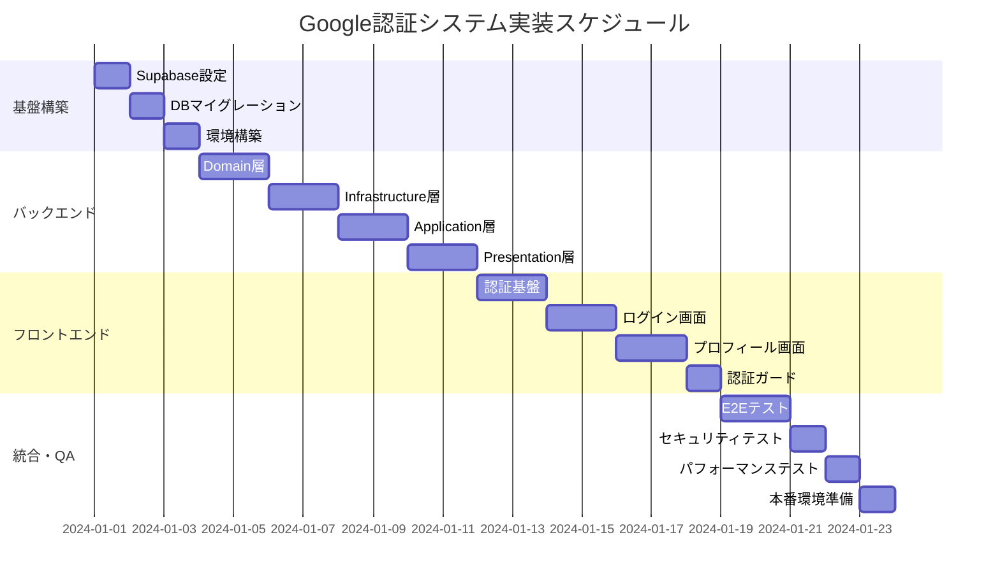

# Google認証システム 実装タスク

## 概要

全タスク数: 23
推定作業時間: 18-22日
クリティカルパス: TASK-001 → TASK-002 → TASK-003 → TASK-101 → TASK-102 → TASK-201 → TASK-202 → TASK-301

## タスク一覧

### フェーズ1: 基盤構築（3-4日）

#### TASK-001: Supabaseプロジェクト設定

- [x] **タスク完了**
- **タスクタイプ**: DIRECT
- **要件リンク**: REQ-401, REQ-402
- **依存タスク**: なし
- **実装詳細**:
  - Supabaseプロジェクトの作成
  - Google OAuth認証プロバイダーの設定
  - 環境変数（URL、ANON_KEY、JWT_SECRET）の取得
  - リダイレクトURL設定（開発・本番）
- **完了条件**:
  - [x] Supabaseプロジェクトが作成されている
  - [x] Google OAuth設定が完了している
  - [x] 認証設定が有効化されている

#### TASK-002: データベースマイグレーション

- [ ] **タスク完了**
- **タスクタイプ**: DIRECT
- **要件リンク**: REQ-001, REQ-002
- **依存タスク**: TASK-001
- **実装詳細**:
  - PostgreSQL用DDLスクリプトの実行
  - テーブル作成（users, user_preferences, user_sessions, domain_events）
  - インデックス作成とパフォーマンス最適化
  - RLS (Row Level Security) ポリシーの設定
  - トリガー関数とプロシージャの作成
- **テスト要件**:
  - [ ] データベース接続テスト
  - [ ] 全テーブル作成確認
  - [ ] 制約・インデックス検証テスト
  - [ ] RLSポリシー動作確認
- **完了条件**:
  - [ ] 全テーブルが作成されている
  - [ ] インデックスが適切に設定されている
  - [ ] RLSが正しく動作している

#### TASK-003: プロジェクト環境構築

- [ ] **タスク完了**
- **タスクタイプ**: DIRECT
- **要件リンク**: システム基盤要件
- **依存タスク**: TASK-002
- **実装詳細**:
  - Docker Compose環境の更新（client/server）
  - 環境変数ファイル設定（.env.local, .env）
  - パッケージインストール（@supabase/supabase-js, hono/jwt等）
  - TypeScript設定の調整
  - 共通型定義ファイル配置（packages/shared-schemas）
- **テスト要件**:
  - [ ] サーバー起動確認
  - [ ] クライアント起動確認
  - [ ] TypeScript型チェック
  - [ ] パッケージ依存関係確認
- **完了条件**:
  - [ ] 開発環境が正常に起動する
  - [ ] 型定義が正しく配置されている
  - [ ] 必要なパッケージがインストールされている

### フェーズ2: バックエンド実装（7-8日）

#### TASK-101: Domain層の実装

- [ ] **タスク完了**
- **タスクタイプ**: TDD
- **要件リンク**: REQ-001, REQ-002, REQ-003
- **依存タスク**: TASK-003
- **実装詳細**:
  - ドメインエンティティ（User, AuthSession）の実装
  - ドメインイベント（UserLoggedInEvent等）の実装
  - UserAggregateルートの実装（セッション管理ロジック）
  - ドメインエラー（AuthDomainError階層）の実装
  - 値オブジェクトとビジネスルールの実装
- **テスト要件**:
  - [ ] 単体テスト: Userエンティティのバリデーション
  - [ ] 単体テスト: UserAggregateのセッション管理
  - [ ] 単体テスト: ドメインイベント発行
  - [ ] 単体テスト: 最大セッション数制限
  - [ ] 単体テスト: ドメインエラーの適切な発生
- **完了条件**:
  - [ ] 全ドメインクラスが実装されている
  - [ ] ビジネスルールが正しく実装されている
  - [ ] テストカバレッジが90%以上

#### TASK-102: Infrastructure層の実装

- [ ] **タスク完了**
- **タスクタイプ**: TDD
- **要件リンク**: REQ-401, REQ-402
- **依存タスク**: TASK-101
- **実装詳細**:
  - SupabaseAuthProvider（IAuthProvider実装）
  - PostgresUserRepository（IUserRepository実装）
  - InMemoryEventBus/RedisEventBus（IDomainEventBus実装）
  - データベースマッピング・永続化ロジック
  - 外部API連携（Supabase Auth）
- **テスト要件**:
  - [ ] 単体テスト: SupabaseAuthProviderのトークン検証
  - [ ] 統合テスト: PostgresUserRepositoryのCRUD操作
  - [ ] 統合テスト: イベントバスの発行・購読
  - [ ] モックテスト: Supabase API連携
- **完了条件**:
  - [ ] 全インフラストラクチャが実装されている
  - [ ] データベース操作が正常に動作する
  - [ ] 外部API連携が正常に動作する

#### TASK-103: Application層の実装

- [ ] **タスク完了**
- **タスクタイプ**: TDD
- **要件リンク**: REQ-001, REQ-002, REQ-003
- **依存タスク**: TASK-102
- **実装詳細**:
  - AuthenticateUserUseCaseの実装（JIT Provisioning）
  - RefreshSessionUseCaseの実装
  - LogoutUserUseCaseの実装
  - GetUserProfileUseCaseの実装
  - UpdateUserProfileUseCaseの実装
  - ドメインイベントハンドラーの実装
- **テスト要件**:
  - [ ] 単体テスト: 各ユースケースのビジネスロジック
  - [ ] 統合テスト: ユースケース間の連携
  - [ ] 統合テスト: イベントハンドラーの処理
  - [ ] エラーケーステスト: 認証失敗・トークン期限切れ
- **完了条件**:
  - [ ] 全ユースケースが実装されている
  - [ ] エラーハンドリングが適切に動作する
  - [ ] イベント処理が正常に動作する

#### TASK-104: Presentation層（API）の実装

- [ ] **タスク完了**
- **タスクタイプ**: TDD
- **要件リンク**: API仕様全般
- **依存タスク**: TASK-103
- **実装詳細**:
  - Hono認証ミドルウェア（JWT検証）の実装
  - AuthControllerの実装（/auth/me, /auth/refresh, /auth/logout）
  - UserControllerの実装（/users/profile, /users/preferences）
  - エラーハンドリングミドルウェア
  - レスポンス統一化・バリデーション
- **テスト要件**:
  - [ ] 単体テスト: 認証ミドルウェアの動作
  - [ ] 統合テスト: 各APIエンドポイント
  - [ ] セキュリティテスト: JWT検証・権限確認
  - [ ] パフォーマンステスト: レスポンス時間
- **エラーハンドリング**:
  - [ ] 401 Unauthorized: 認証失敗
  - [ ] 403 Forbidden: 権限不足
  - [ ] 429 Too Many Requests: レート制限
  - [ ] 500 Internal Server Error: サーバーエラー
- **完了条件**:
  - [ ] 全APIエンドポイントが実装されている
  - [ ] エラーハンドリングが適切に動作する
  - [ ] APIドキュメントが正確である

### フェーズ3: フロントエンド実装（6-7日）

#### TASK-201: 認証基盤の実装

- [ ] **タスク完了**
- **タスクタイプ**: TDD
- **要件リンク**: REQ-101, REQ-102, REQ-103
- **依存タスク**: TASK-104
- **実装詳細**:
  - Supabaseクライアント設定（@supabase/ssr）
  - Redux認証状態管理の実装
  - 認証Contextプロバイダー
  - APIクライアント（Axios Interceptor）
  - トークンリフレッシュ自動化
- **テスト要件**:
  - [ ] 単体テスト: Redux認証reducerの動作
  - [ ] 単体テスト: APIクライアントのインターセプター
  - [ ] 統合テスト: 認証状態の変更フロー
  - [ ] 統合テスト: トークンリフレッシュ
- **完了条件**:
  - [ ] 認証状態管理が正常に動作する
  - [ ] トークン管理が自動化されている
  - [ ] APIとの連携が正常に動作する

#### TASK-202: ログイン・ログアウト画面

- [ ] **タスク完了**
- **タスクタイプ**: TDD
- **要件リンク**: REQ-101, REQ-102, REQ-105
- **依存タスク**: TASK-201
- **実装詳細**:
  - ログインページコンポーネント（/login）
  - Googleログインボタンコンポーネント
  - ログアウト機能の実装
  - エラー表示・ローディング状態
  - リダイレクト処理
- **UI/UX要件**:
  - [ ] ローディング状態: ボタン無効化 + スピナー表示
  - [ ] エラー表示: Toast通知による分かりやすいメッセージ
  - [ ] モバイル対応: レスポンシブデザイン（Tailwind CSS）
  - [ ] アクセシビリティ: ARIA属性、キーボード操作、スクリーンリーダー対応
- **テスト要件**:
  - [ ] コンポーネントテスト: ログインボタンの表示・動作
  - [ ] E2Eテスト: 完全なログインフロー
  - [ ] レスポンシブテスト: モバイル・タブレット・デスクトップ
  - [ ] アクセシビリティテスト: axe-core、キーボードナビゲーション
- **完了条件**:
  - [ ] ログイン・ログアウト機能が正常に動作する
  - [ ] UI/UX要件を満たしている
  - [ ] アクセシビリティ基準に準拠している

#### TASK-203: ユーザープロフィール画面

- [ ] **タスク完了**
- **タスクタイプ**: TDD
- **要件リンク**: REQ-003, REQ-004
- **依存タスク**: TASK-202
- **実装詳細**:
  - プロフィール表示コンポーネント（/profile）
  - プロフィール編集フォーム
  - 画像アップロード機能
  - 設定変更画面（テーマ、言語等）
  - データ検証・保存処理
- **UI/UX要件**:
  - [ ] フォームバリデーション: リアルタイム入力検証
  - [ ] 保存状態: 成功・失敗の明確なフィードバック
  - [ ] 画像プレビュー: アップロード前の確認機能
  - [ ] 入力制限: 文字数制限の可視化
- **テスト要件**:
  - [ ] コンポーネントテスト: フォーム入力・バリデーション
  - [ ] 統合テスト: プロフィール更新API連携
  - [ ] E2Eテスト: 完全な編集フロー
- **完了条件**:
  - [ ] プロフィール表示・編集機能が動作する
  - [ ] データ保存が正常に行われる
  - [ ] バリデーションが適切に動作する

#### TASK-204: 認証ガード・ルーティング

- [ ] **タスク完了**
- **タスクタイプ**: TDD
- **要件リンク**: REQ-005, セキュリティ要件
- **依存タスク**: TASK-203
- **実装詳細**:
  - 認証ガードコンポーネントの実装
  - 保護されたルートの設定
  - 未認証時のリダイレクト処理
  - ローディング状態の管理
  - ルートベースの認証チェック
- **テスト要件**:
  - [ ] 単体テスト: 認証ガードの条件分岐
  - [ ] 統合テスト: ルーティングとガードの連携
  - [ ] E2Eテスト: 認証状態によるページアクセス制御
- **完了条件**:
  - [ ] 保護されたページへの適切なアクセス制御
  - [ ] 未認証時の適切なリダイレクト
  - [ ] ユーザーエクスペリエンスが損なわれない

### フェーズ4: 統合・品質保証（4-5日）

#### TASK-301: E2Eテストスイート

- [ ] **タスク完了**
- **タスクタイプ**: TDD
- **要件リンク**: 全要件
- **依存タスク**: TASK-204
- **実装詳細**:
  - Playwrightテスト環境セットアップ
  - メインユーザーフローのE2Eテスト作成
  - CI/CDパイプラインへの統合
  - テストデータセットアップ・ティアダウン
  - 複数ブラウザ対応テスト
- **テスト要件**:
  - [ ] 完全認証フロー: ログイン〜プロフィール編集〜ログアウト
  - [ ] エラーケース: 認証失敗、ネットワークエラー
  - [ ] セッション管理: トークンリフレッシュ、期限切れ
  - [ ] マルチブラウザ: Chrome、Firefox、Safari
  - [ ] レスポンシブ: モバイル、タブレット、デスクトップ
- **完了条件**:
  - [ ] 主要ユーザーフローが全て正常動作する
  - [ ] CI/CDでの自動実行が設定されている
  - [ ] テスト結果レポートが生成される

#### TASK-302: セキュリティテスト

- [ ] **タスク完了**
- **タスクタイプ**: TDD
- **要件リンク**: NFR-101〜NFR-104
- **依存タスク**: TASK-301
- **実装詳細**:
  - JWT改ざんテスト
  - セッション固定攻撃テスト
  - CSRF攻撃テスト
  - XSS攻撃テスト
  - 認証バイパステスト
- **テスト要件**:
  - [ ] JWT署名検証の確認
  - [ ] 不正トークンの拒否
  - [ ] セッション期限切れの適切な処理
  - [ ] CSRF防御の動作確認
  - [ ] XSS防御の動作確認
- **完了条件**:
  - [ ] セキュリティ脆弱性が検出されない
  - [ ] 全セキュリティテストがパスする
  - [ ] セキュリティレポートが作成される

#### TASK-303: パフォーマンステスト

- [ ] **タスク完了**
- **タスクタイプ**: TDD
- **要件リンク**: NFR-001〜NFR-003
- **依存タスク**: TASK-302
- **実装詳細**:
  - 認証フロー応答時間測定
  - API エンドポイントパフォーマンステスト
  - 同時接続ユーザー負荷テスト
  - データベース クエリパフォーマンス測定
  - フロントエンド レンダリング性能測定
- **パフォーマンス要件**:
  - [ ] 認証フロー: 5秒以内完了
  - [ ] 認証状態確認: 1秒以内完了
  - [ ] APIレスポンス: 500ms以内
  - [ ] 同時接続: 100ユーザー対応
- **完了条件**:
  - [ ] 全パフォーマンス要件を満たしている
  - [ ] ボトルネックが特定・改善されている
  - [ ] パフォーマンスレポートが作成される

#### TASK-304: 本番環境準備

- [ ] **タスク完了**
- **タスクタイプ**: DIRECT
- **要件リンク**: 運用要件
- **依存タスク**: TASK-303
- **実装詳細**:
  - 本番用Supabase設定
  - 環境変数の本番設定
  - Docker本番ビルド設定
  - ログ設定・監視設定
  - バックアップ戦略
- **完了条件**:
  - [ ] 本番環境にデプロイ可能な状態
  - [ ] 監視・ログ収集が設定されている
  - [ ] バックアップが適切に設定されている

## 実行順序

## マイルストーン

### Mile Stone 1: 基盤完成 (Day 3-4)
- Supabase設定完了
- データベース構築完了
- 開発環境動作確認完了

### Mile Stone 2: バックエンドAPI完成 (Day 10-12)
- 全API エンドポイント実装完了
- 認証・認可機能動作確認完了
- ユニット・統合テスト完了

### Mile Stone 3: フロントエンド完成 (Day 16-18)
- 全UI コンポーネント実装完了
- 認証フロー動作確認完了
- レスポンシブ・アクセシビリティ確認完了

### Mile Stone 4: 本番リリース準備完了 (Day 20-22)
- E2E・セキュリティ・パフォーマンステスト完了
- 本番環境デプロイ準備完了
- ドキュメント・運用マニュアル整備完了

## 並行実行可能タスク

### 並行グループ1 (基盤構築後)
- TASK-101 (Domain層) と TASK-201 (認証基盤) の一部準備作業

### 並行グループ2 (バックエンドAPI完成後)
- TASK-202 (ログイン画面)
- TASK-203 (プロフィール画面)
- TASK-204 (認証ガード) の設計

### 並行グループ3 (統合テストフェーズ)
- TASK-302 (セキュリティテスト)
- TASK-303 (パフォーマンステスト)
- TASK-304 (本番環境準備) の一部

## 品質ゲート

各フェーズ完了時に以下をクリアする必要があります:

### フェーズ1完了ゲート
- [ ] データベース正常性確認
- [ ] 開発環境動作確認
- [ ] 基本設定完了確認

### フェーズ2完了ゲート
- [ ] 全APIエンドポイント動作確認
- [ ] ユニットテストカバレッジ90%以上
- [ ] 統合テスト全パス
- [ ] セキュリティ基本チェック完了

### フェーズ3完了ゲート
- [ ] 全UI コンポーネント動作確認
- [ ] レスポンシブデザイン確認
- [ ] アクセシビリティ基準適合
- [ ] ユーザビリティテスト完了

### フェーズ4完了ゲート
- [ ] E2Eテスト全パス
- [ ] セキュリティテスト全パス
- [ ] パフォーマンス要件達成
- [ ] 本番デプロイ準備完了

## 注意事項・リスク

### 技術リスク
- **Supabase API制限**: 開発中のレート制限に注意
- **JWT期限管理**: トークンリフレッシュの実装複雑性
- **型安全性**: フロント・バック間の型整合性維持

### スケジュールリスク
- **DDD実装学習コスト**: 初回実装の場合は追加時間が必要
- **E2Eテスト安定化**: フラッキーなテストの修正時間
- **セキュリティテスト**: 脆弱性発見時の修正時間

### 品質リスク
- **認証フロー複雑性**: エラーケースの網羅的テスト必要
- **ブラウザ互換性**: 各ブラウザでの動作確認必須
- **モバイル対応**: タッチデバイスでのUX確認必須

---

## 次のステップ

実装開始前に以下を確認してください：

1. **開発環境確認**: Docker、Node.js、PostgreSQLの動作確認
2. **アカウント準備**: Supabaseアカウント、Googleデベロッパーアカウントの準備
3. **チーム体制**: フロントエンド・バックエンド担当者の確定
4. **スケジュール調整**: 各フェーズのデッドライン設定

**実装開始準備が整いましたら、TASK-001からスタートしてください！**
