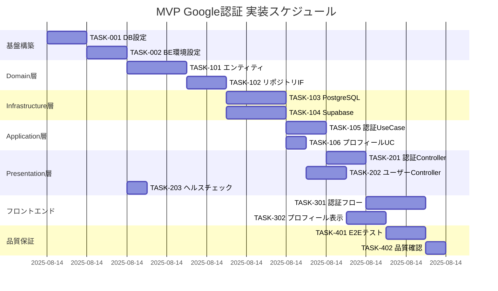

# MVP Google認証 実装タスク

作成日: 2025-08-14
更新日: 2025-08-14

## 概要

全タスク数: 17
推定作業時間: 4時間以内（DDD学習込み）
クリティカルパス: TASK-001 → TASK-002 → TASK-101 → TASK-102 → TASK-201 → TASK-202 → TASK-301

## タスク一覧

### フェーズ1: 基盤構築

#### TASK-001: データベース初期設定

- [x] **タスク完了**
- **タスクタイプ**: DIRECT
- **要件リンク**: データベーススキーマ設計書
- **依存タスク**: なし
- **実装詳細**:
  - PostgreSQLコンテナの起動確認
  - 環境変数 `DB_TABLE_PREFIX` の設定
  - `database-schema.sql` の実行
  - users テーブル・インデックス・トリガーの作成
- **完了条件**:
  - [x] `${DB_TABLE_PREFIX}users` テーブルが作成されている
  - [x] インデックスが全て作成されている
  - [x] RLSが有効化されている

#### TASK-002: バックエンド環境設定

- [x] **タスク完了**
- **タスクタイプ**: DIRECT
- **要件リンク**: バックエンド技術スタック
- **依存タスク**: TASK-001
- **実装詳細**:
  - Supabase JWT Secret の環境変数設定
  - 必要な npm（bun） パッケージのインストール
  - TypeScript設定の確認
  - ヘルスチェックエンドポイントの実装
- [x] **環境変数設定**（.env）:
- **完了条件**:
  - [x] サーバーが `http://localhost:3001` で起動する
  - [x] `GET /api/health` エンドポイントが200を返す
- **確認コマンド**:
  ```bash
  docker compose exec server bun run dev
  curl http://localhost:3001/api/health
  ```

### フェーズ2: Domain層実装（DDD）

#### TASK-101: ドメインエンティティ・値オブジェクト実装

- [x] **タスク完了**
- **タスクタイプ**: TDD
- **要件リンク**: interfaces.ts, architecture.md
- **依存タスク**: TASK-002
- **実装詳細**:
  - `User` エンティティクラスの実装
  - `AuthProvider` 型定義
  - `CreateUserInput`・`UpdateUserInput` 値オブジェクト
  - ドメインエラークラス群の実装
- **ファイル構成**:
  ```
  app/server/src/domain/
  └── user/
      ├── valueobjects/
      │    ├── CreateUserInput.ts
      │    └──UpdateUserInput.ts
      ├── errors/
      │   ├── UserNotFoundError.ts
      │   └── InvalidProviderError.ts
      ├── AuthProvider.ts
      ├── UserEntity.ts
      └── index.ts
  ```
- **単体テスト要件**:
  - [x] User エンティティのバリデーションテスト
  - [x] 各値オブジェクトの生成・検証テスト
  - [x] ドメインエラーの適切な継承・プロパティテスト
- **テストケース例**:
  - 正常なユーザー情報でのエンティティ生成
  - 不正なメールアドレスでのバリデーションエラー
  - 空文字のnameでのバリデーションエラー

#### TASK-102: リポジトリ・サービスインターフェース実装

- [x] **タスク完了**
- **タスクタイプ**: TDD
- **要件リンク**: interfaces.ts, DDD設計
- **依存タスク**: TASK-101
- **実装詳細**:
  - `IUserRepository` インターフェース
  - `IAuthProvider` インターフェース
  - `IAuthenticationDomainService` インターフェース
  - ドメインサービスの実装
- **ファイル構成**:
  ```
  app/server/src/domain/
  ├── repositories/
  │   └── IUserRepository.ts
  ├── services/
  │   ├── IAuthProvider.ts
  │   ├── IAuthenticationDomainService.ts
  │   └── AuthenticationDomainService.ts
  └── aggregates/
      └── UserAggregate.ts
  ```
- **単体テスト要件**:
  - [x] AuthenticationDomainService のJITプロビジョニングテスト
  - [x] UserAggregate の整合性管理テスト
- **テストケース例**:
  - 外部ユーザー情報からのUser作成
  - 既存ユーザーの認証処理
  - 不正なプロバイダー情報でのエラー

### フェーズ3: Infrastructure層実装

#### TASK-103: PostgreSQLリポジトリ実装

- [x] **タスク完了**
- **タスクタイプ**: TDD
- **要件リンク**: database-schema.sql, IUserRepository
- **依存タスク**: TASK-102
- **実装詳細**:
  - `PostgreSQLUserRepository` クラス実装
  - データベース接続管理
  - SQL クエリの実装（CRUD操作）
  - エラーハンドリング
- **ファイル構成**:
  ```
  app/server/src/infrastructure/
  ├── database/
  │   ├── DatabaseConnection.ts
  │   └── PostgreSQLUserRepository.ts
  └── config/
      └── EnvironmentConfig.ts
  ```
- **実装メソッド**:
  - `findByExternalId(externalId, provider)`
  - `findById(id)`
  - `findByEmail(email)` 
  - `create(input)`
  - `update(id, input)`
  - `delete(id)`
- **統合テスト要件**:
  - [x] データベース接続テスト
  - [x] CRUD操作の正常系テスト
  - [x] 制約違反・エラーハンドリングテスト
- **テストケース例**:
  - 新規ユーザー作成と取得
  - 重複ユーザーでの制約エラー
  - 存在しないユーザーでのnull返却

#### TASK-104: Supabase認証プロバイダー実装

- [x] **タスク完了**
- **タスクタイプ**: TDD
- **要件リンク**: IAuthProvider, JWT検証仕様
- **依存タスク**: TASK-102
- **実装詳細**:
  - `SupabaseAuthProvider` クラス実装
  - JWT署名検証ロジック
  - JWTペイロードからのユーザー情報抽出
  - Supabase API連携エラーハンドリング
- **ファイル構成**:
  ```
  app/server/src/infrastructure/
  └── auth/
      └── SupabaseAuthProvider.ts
  ```
- **実装メソッド**:
  - `verifyToken(token)`: JWT検証
  - `getExternalUserInfo(payload)`: ユーザー情報抽出
- **統合テスト要件**:
  - [x] 有効なJWTでの検証成功テスト
  - [x] 無効なJWTでの検証失敗テスト
  - [x] 期限切れJWTでのエラーテスト
- **テストケース例**:
  - 正常なGoogle OAuthのJWT検証
  - 不正な署名のJWT拒否
  - JWTペイロードからの正確な情報抽出

### フェーズ4: Application層実装（Use Cases）

#### TASK-105: ユーザー認証UseCase実装

- [x] **タスク完了** ✅ **完了** (TDD開発完了 - 11テストケース全通過)
- **タスクタイプ**: TDD
- **要件リンク**: interfaces.ts, 認証フロー仕様
- **依存タスク**: TASK-103, TASK-104
- **実装詳細**:
  - `AuthenticateUserUseCase` クラス実装
  - JWT検証→ユーザー取得・作成のフロー
  - JITプロビジョニングの実行
  - トランザクション管理
- **ファイル構成**:
  ```
  app/server/src/application/
  ├── usecases/
  │   └── AuthenticateUserUseCase.ts
  └── services/
      └── ApplicationService.ts
  ```
- **処理フロー**:
  1. JWT署名検証（SupabaseAuthProvider）
  2. JWTペイロードからユーザー情報抽出
  3. `external_id` + `provider` でユーザー検索
  4. 未存在の場合、JITプロビジョニング実行
  5. `lastLoginAt` 更新
  6. ユーザー情報返却
- **単体テスト要件**:
  - [x] 既存ユーザーの認証成功テスト
  - [x] 新規ユーザーのJIT作成テスト
  - [x] JWT検証失敗でのエラーテスト
- **テストケース例**:
  - 正常なJWTでの既存ユーザー認証
  - 新規ユーザーでのJITプロビジョニング
  - 無効なJWTでの認証失敗

#### TASK-106: ユーザープロフィール取得UseCase実装

- [ ] **タスク完了**
- **タスクタイプ**: TDD
- **要件リンク**: interfaces.ts, API仕様
- **依存タスク**: TASK-103
- **実装詳細**:
  - `GetUserProfileUseCase` クラス実装
  - ユーザーIDによる情報取得
  - 認証済みユーザーのプロフィール返却
- **ファイル構成**:
  ```
  app/server/src/application/
  └── usecases/
      └── GetUserProfileUseCase.ts
  ```
- **単体テスト要件**:
  - [ ] 存在するユーザーIDでの取得成功テスト
  - [ ] 存在しないユーザーIDでのエラーテスト
- **テストケース例**:
  - 正常なユーザーIDでのプロフィール取得
  - 存在しないユーザーIDでのUserNotFoundError

### フェーズ5: Presentation層実装（HTTP API）

#### TASK-201: 認証コントローラー実装

- [ ] **タスク完了**
- **タスクタイプ**: TDD
- **要件リンク**: api-endpoints.md, Hono技術仕様
- **依存タスク**: TASK-105
- **実装詳細**:
  - `AuthController` クラス実装
  - `POST /api/auth/verify` エンドポイント
  - HTTPリクエスト・レスポンスの変換
  - エラーハンドリング
- **ファイル構成**:
  ```
  app/server/src/presentation/
  ├── controllers/
  │   └── AuthController.ts
  ├── middleware/
  │   ├── AuthMiddleware.ts
  │   └── ErrorHandlerMiddleware.ts
  └── routes/
      └── authRoutes.ts
  ```
- **エンドポイント実装**:
  - `POST /api/auth/verify`: JWT検証・ユーザー認証
- **レスポンス形式**:
  ```json
  {
    "success": true,
    "data": {
      "user": { /* User情報 */ },
      "isNewUser": false
    }
  }
  ```
- **統合テスト要件**:
  - [ ] 正常なJWTでの認証成功レスポンス
  - [ ] 無効なJWTでの401エラーレスポンス
  - [ ] リクエスト形式不正での400エラーレスポンス
- **UI/UX要件**:
  - ローディング状態: API呼び出し中のスピナー表示
  - エラー表示: 認証失敗時のユーザーフレンドリーメッセージ
  - リダイレクト: 認証成功時のメインページ遷移

#### TASK-202: ユーザーコントローラー実装

- [ ] **タスク完了**
- **タスクタイプ**: TDD
- **要件リンク**: api-endpoints.md, 認証ミドルウェア仕様
- **依存タスク**: TASK-106, TASK-201
- **実装詳細**:
  - `UserController` クラス実装
  - `GET /api/user/profile` エンドポイント
  - 認証ミドルウェアの適用
  - JWT検証後のユーザー情報取得
- **ファイル構成**:
  ```
  app/server/src/presentation/
  ├── controllers/
  │   └── UserController.ts
  └── routes/
      └── userRoutes.ts
  ```
- **エンドポイント実装**:
  - `GET /api/user/profile`: 認証済みユーザーのプロフィール取得
- **認証要件**:
  - `Authorization: Bearer {JWT}` ヘッダー必須
  - AuthMiddleware による事前検証
- **統合テスト要件**:
  - [ ] 有効なJWTでのプロフィール取得成功
  - [ ] Authorizationヘッダー不存在での401エラー
  - [ ] 無効なJWTでの401エラー
- **UI/UX要件**:
  - ローディング状態: API呼び出し中のスケルトン表示
  - エラー表示: 認証エラー時のログイン画面リダイレクト
  - アクセシビリティ: スクリーンリーダー対応のaria属性

#### TASK-203: システム系エンドポイント実装

- [ ] **タスク完了**
- **タスクタイプ**: DIRECT
- **要件リンク**: api-endpoints.md, ヘルスチェック仕様
- **依存タスク**: TASK-002
- **実装詳細**:
  - `GET /api/health` エンドポイント実装
  - データベース接続確認
  - Supabase接続確認
  - システム稼働状態の返却
- **レスポンス形式**:
  ```json
  {
    "success": true,
    "data": {
      "status": "healthy",
      "timestamp": "2025-08-14T10:31:50.000Z",
      "version": "1.0.0",
      "dependencies": {
        "database": "healthy",
        "supabase": "healthy"
      }
    }
  }
  ```
- **完了条件**:
  - [ ] ヘルスチェックが正常時200を返す
  - [ ] DB接続失敗時503を返す
  - [ ] Supabase接続失敗時503を返す

### フェーズ6: フロントエンド実装

#### TASK-301: 認証フロー実装（フロントエンド）

- [ ] **タスク完了**
- **タスクタイプ**: TDD
- **要件リンク**: フロントエンド技術スタック、認証フロー仕様
- **依存タスク**: TASK-201, TASK-202
- **実装詳細**:
  - Supabase Auth の設定
  - Google OAuth フローの実装
  - JWT取得・保存
  - 認証状態管理（Redux）
- **ファイル構成**:
  ```
  app/client/src/
  ├── features/auth/
  │   ├── components/
  │   │   ├── LoginButton.tsx
  │   │   └── LogoutButton.tsx
  │   ├── hooks/
  │   │   └── useAuth.tsx
  │   ├── store/
  │   │   ├── authSlice.ts
  │   │   └── authActions.ts
  │   └── services/
  │       └── authService.ts
  └── lib/
      └── supabase.ts
  ```
- **機能実装**:
  - Google OAuth によるログイン
  - JWT の自動取得・保存
  - ログアウト機能
  - 認証状態の永続化
- **UI/UX要件**:
  - [ ] ローディング状態: ログインボタン無効化 + スピナー
  - [ ] エラー表示: トースト通知またはインラインエラー
  - [ ] モバイル対応: レスポンシブデザインでの適切表示
  - [ ] アクセシビリティ: キーボード操作・ARIA属性対応
- **テスト要件**:
  - [ ] コンポーネントテスト: LoginButton・LogoutButton
  - [ ] ストアテスト: authSlice の状態変更
  - [ ] 統合テスト: 認証フロー全体のE2E

#### TASK-302: ユーザープロフィール表示実装

- [ ] **タスク完了**
- **タスクタイプ**: TDD
- **要件リンク**: フロントエンド技術スタック、API連携仕様
- **依存タスク**: TASK-301
- **実装詳細**:
  - ユーザープロフィール表示コンポーネント
  - バックエンドAPI との連携
  - 認証済み状態でのデータ取得
  - エラーハンドリング
- **ファイル構成**:
  ```
  app/client/src/
  └── features/user/
      ├── components/
      │   └── UserProfile.tsx
      ├── hooks/
      │   └── useUserProfile.tsx
      └── services/
          └── userService.ts
  ```
- **機能実装**:
  - 認証後のユーザー情報表示
  - アバター画像の表示
  - ユーザー名・メールアドレス表示
  - 最終ログイン日時表示
- **UI/UX要件**:
  - [ ] ローディング状態: スケルトンUI表示
  - [ ] エラー表示: 再試行ボタン付きエラーメッセージ
  - [ ] モバイル対応: タブレット・スマートフォン最適化
  - [ ] アクセシビリティ: 画像のalt属性・適切な見出し構造
- **テスト要件**:
  - [ ] コンポーネントテスト: 各状態での適切な表示
  - [ ] APIモックテスト: 成功・失敗レスポンスのハンドリング
  - [ ] レスポンシブテスト: 異なる画面サイズでの表示確認

### フェーズ7: 統合・品質保証

#### TASK-401: E2Eテストスイート実装

- [ ] **タスク完了**
- **タスクタイプ**: TDD
- **要件リンク**: 全体フロー仕様、品質要件
- **依存タスク**: TASK-302
- **実装詳細**:
  - Playwright を使用したE2Eテスト
  - 主要ユーザーフローのテスト自動化
  - CI/CD パイプラインとの統合
- **テストシナリオ**:
  - [ ] 初回ログインフロー（JITプロビジョニング）
  - [ ] 2回目以降ログインフロー（既存ユーザー）
  - [ ] ログアウトフロー
  - [ ] 認証エラー時のハンドリング
  - [ ] ページリロード時の認証状態復元
- **テスト環境**:
  - テスト用Supabaseプロジェクト
  - テスト用データベース
  - モック化されたGoogle OAuth
- **パフォーマンステスト**:
  - [ ] 認証フロー全体: 10秒以内
  - [ ] JWT検証: 1秒以内
  - [ ] JITプロビジョニング: 2秒以内
  - [ ] ユーザー情報取得: 500ms以内

#### TASK-402: 型安全性・品質確認

- [ ] **タスク完了**
- **タスクタイプ**: DIRECT
- **要件リンク**: TypeScript設定、品質要件
- **依存タスク**: TASK-401
- **実装詳細**:
  - TypeScript型チェック（--noEmit）
  - Biome による静的解析・フォーマット
  - 全テストスイートの実行
  - パフォーマンス指標の確認
- **確認項目**:
  - [ ] フロントエンド型チェック通過
  - [ ] バックエンド型チェック通過
  - [ ] 全単体テスト通過
  - [ ] 全統合テスト通過
  - [ ] 全E2Eテスト通過
  - [ ] Biome リント・フォーマット通過
- **品質ゲート**:
  - TypeScript strict mode 準拠
  - テストカバレッジ 80% 以上
  - レスポンス時間目標値クリア
  - セキュリティ要件充足
- **確認コマンド**:
  ```bash
  # フロントエンド
  docker compose exec client bunx tsc --noEmit
  docker compose exec client bun test
  docker compose exec client bunx biome check .

  # バックエンド  
  docker compose exec server bunx tsc --noEmit
  docker compose exec server bun test
  docker compose exec server bunx biome check .
  ```

## 実行順序



## サブタスクテンプレート

### TDDタスクの場合

各TDDタスクは以下のプロセスで実装:

1. **tdd-requirements.md** - 詳細要件定義
2. **tdd-testcases.md** - テストケース作成  
3. **tdd-red.md** - テスト実装（失敗）
4. **tdd-green.md** - 最小実装
5. **tdd-refactor.md** - リファクタリング
6. **tdd-verify-complete.md** - 品質確認

### DIRECTタスクの場合

各DIRECTタスクは以下のプロセスで実装:

1. **direct-setup.md** - 直接実装・設定
2. **direct-verify.md** - 動作確認・品質確認

## セキュリティチェックリスト

### フロントエンド
- [ ] JWTトークンのセキュアな保存（httpOnly Cookie推奨、今回はlocalStorage）
- [ ] XSS対策: 適切なエスケープ処理
- [ ] CSRF対策: SameSite Cookie属性
- [ ] HTTPS通信の強制

### バックエンド
- [ ] JWT署名検証の実装
- [ ] SQLインジェクション対策: パラメータ化クエリ
- [ ] 入力検証: Zod による実行時型チェック
- [ ] レート制限（将来実装）
- [ ] セキュリティヘッダーの設定

### データベース
- [ ] Row Level Security (RLS) の有効化
- [ ] 最小権限の原則: 専用DBユーザー
- [ ] 接続暗号化: SSL/TLS必須
- [ ] 機密情報の適切な暗号化

## トラブルシューティング

### よくある問題と対処法

#### JWT検証エラー
- **原因**: Supabase JWT Secret の設定間違い
- **対処**: 環境変数の確認・再設定

#### データベース接続エラー  
- **原因**: PostgreSQLコンテナの起動失敗
- **対処**: `docker compose logs db` でログ確認

#### Google OAuth エラー
- **原因**: Supabase プロジェクト設定の不備
- **対処**: Supabase ダッシュボードでOAuth設定確認

#### ビルドエラー
- **原因**: TypeScript型エラー・依存関係問題
- **対処**: `bunx tsc --noEmit` で型エラー確認

## 完了確認

全タスク完了後、以下を確認:

### 機能確認
- [ ] Google OAuth によるログインが可能
- [ ] ユーザー情報が正しく表示される
- [ ] ログアウトが正常に動作する
- [ ] 認証状態がページリロード後も維持される

### 品質確認
- [ ] 全テストが通過する
- [ ] TypeScript型チェックが通過する
- [ ] パフォーマンス目標を満たす
- [ ] セキュリティ要件を満たす

### ドキュメント確認
- [ ] README.md の更新（セットアップ手順）
- [ ] API仕様書の最新化
- [ ] デプロイメント手順の文書化

---

**次のステップ**: 実装完了後は本番デプロイメント準備、監視設定、追加プロバイダー対応の検討を行います。
