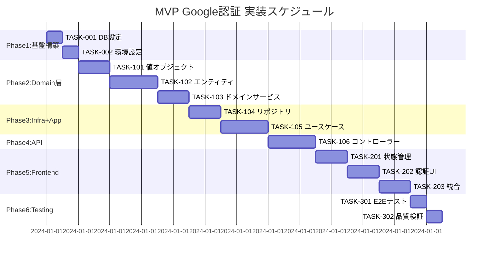

# MVP Google認証 実装タスク

## 概要

**全タスク数**: 18  
**推定作業時間**: 4時間  
**クリティカルパス**: TASK-001 → TASK-002 → TASK-101 → TASK-102 → TASK-103 → TASK-201 → TASK-202 → TASK-301  
**DDD学習重点**: 値オブジェクト・ドメインサービス・依存性逆転の実践的習得

## タスク一覧

### フェーズ1: 基盤構築・環境整備 (45分)

#### TASK-001: データベーススキーマ実装

- [ ] **タスク完了**
- **タスクタイプ**: DIRECT
- **要件リンク**: REQ-404, REQ-405
- **依存タスク**: なし
- **実装詳細**:
  - `{prefix}users` テーブル作成
  - インデックス設定（google_id, email）
  - 更新日時自動更新トリガー設定
  - テーブル接頭辞の環境変数対応
- **テスト要件**:
  - [ ] データベース接続テスト
  - [ ] テーブル作成検証テスト
  - [ ] インデックス動作確認
- **完了条件**:
  - [ ] usersテーブルが正常に作成されている
  - [ ] インデックスが適用されている
  - [ ] トリガーが正常に動作している

#### TASK-002: 環境変数・基本設定

- [ ] **タスク完了**  
- **タスクタイプ**: DIRECT
- **要件リンク**: REQ-401, REQ-402
- **依存タスク**: なし
- **実装詳細**:
  - Supabase接続設定（URL、ANON_KEY、JWT_SECRET）
  - PostgreSQL接続設定
  - テーブル接頭辞環境変数設定
  - CORS設定
- **テスト要件**:
  - [ ] 環境変数読み込みテスト
  - [ ] Supabase接続テスト  
  - [ ] PostgreSQL接続テスト
- **完了条件**:
  - [ ] 全環境変数が正しく設定されている
  - [ ] 外部サービスとの接続が確認できている

### フェーズ2: Domain層実装（DDD強化） (105分)

#### TASK-101: 値オブジェクト実装

- [ ] **タスク完了**
- **タスクタイプ**: TDD  
- **要件リンク**: REQ-403（DDD）
- **依存タスク**: なし
- **実装詳細**:
  - `Email`値オブジェクト（バリデーション付き）
  - `GoogleId`値オブジェクト（基本検証）
  - `UserId`値オブジェクト（UUID検証）
  - `UserProfile`値オブジェクト（名前・アバター）
- **テスト要件**:
  - [ ] 単体テスト: Email形式検証
  - [ ] 単体テスト: GoogleId妥当性確認
  - [ ] 単体テスト: UserId UUID形式確認
  - [ ] 単体テスト: UserProfile不変性確認
- **完了条件**:
  - [ ] 全値オブジェクトがバリデーション機能を持つ
  - [ ] 不変性が保証されている
  - [ ] エラーメッセージが適切

#### TASK-102: Userエンティティ・集約実装

- [ ] **タスク完了**
- **タスクタイプ**: TDD
- **要件リンク**: REQ-403（DDD）、REQ-004（JIT）
- **依存タスク**: TASK-101
- **実装詳細**:
  - `User`エンティティクラス（値オブジェクト使用）
  - `User.createFromGoogleAuth()`ファクトリメソッド
  - `User.updateProfile()`メソッド
  - `User.validateIntegrity()`整合性検証
  - `User.toDatabaseObject()`データ変換
- **テスト要件**:
  - [ ] 単体テスト: Google認証からのユーザー作成
  - [ ] 単体テスト: プロフィール更新ロジック
  - [ ] 単体テスト: 整合性検証ルール
  - [ ] 単体テスト: データベース形式変換
- **完了条件**:
  - [ ] Userエンティティがビジネスルールを実装
  - [ ] 集約ルートとして整合性を管理
  - [ ] ドメインロジックが技術的関心事から分離

#### TASK-103: ドメインサービス・例外実装

- [ ] **タスク完了**
- **タスクタイプ**: TDD
- **要件リンク**: REQ-403（DDD）
- **依存タスク**: TASK-102  
- **実装詳細**:
  - `UserAuthService`ドメインサービス
  - 認証・JITプロビジョニングの複雑なドメインロジック
  - ドメイン例外クラス群
  - 重複チェック・ビジネスルール検証
- **テスト要件**:
  - [ ] 単体テスト: Google認証ユーザー作成・取得
  - [ ] 単体テスト: 重複ユーザーエラーハンドリング
  - [ ] 単体テスト: プロフィール更新検証
  - [ ] 単体テスト: ドメイン例外の適切な発生
- **完了条件**:
  - [ ] 複雑なビジネスロジックがドメインサービスに集約
  - [ ] エラーハンドリングが型安全
  - [ ] 外部依存から完全分離

### フェーズ3: Infrastructure・Application層実装 (75分)

#### TASK-104: リポジトリ・認証プロバイダー実装

- [ ] **タスク完了**
- **タスクタイプ**: TDD
- **要件リンク**: REQ-403（依存性逆転）、REQ-401（Supabase）
- **依存タスク**: TASK-001, TASK-103
- **実装詳細**:
  - `PostgreSQLUserRepository`実装
  - `SupabaseAuthProvider`実装
  - 値オブジェクト ↔ プリミティブ型変換
  - データベースクエリ最適化
- **テスト要件**:
  - [ ] 単体テスト: ユーザーCRUD操作
  - [ ] 単体テスト: JWT検証・認証情報抽出
  - [ ] 統合テスト: データベース操作
  - [ ] 統合テスト: Supabase連携
- **完了条件**:
  - [ ] Domain層インターフェースを正しく実装
  - [ ] データ永続化・外部認証が動作
  - [ ] エラーハンドリングが適切

#### TASK-105: ユースケース実装

- [ ] **タスク完了**
- **タスクタイプ**: TDD  
- **要件リンク**: REQ-002, REQ-004, REQ-005
- **依存タスク**: TASK-103, TASK-104
- **実装詳細**:
  - `AuthenticateUserUseCase`実装
  - `GetUserProfileUseCase`実装
  - `UpdateUserProfileUseCase`実装
  - ドメインサービス活用
  - トランザクション管理
- **テスト要件**:
  - [ ] 単体テスト: 認証フローロジック
  - [ ] 単体テスト: プロフィール取得・更新
  - [ ] 統合テスト: ドメインサービス連携
  - [ ] 統合テスト: リポジトリ操作
- **完了条件**:
  - [ ] ビジネスフロー全体が正常動作
  - [ ] ドメイン層の活用が適切
  - [ ] エラーケースが網羅されている

### フェーズ4: API・Presentation層実装 (45分)

#### TASK-106: コントローラー・ミドルウェア実装

- [ ] **タスク完了**
- **タスクタイプ**: TDD
- **要件リンク**: REQ-002, REQ-405（API仕様）
- **依存タスク**: TASK-105
- **実装詳細**:
  - `AuthController`（/auth/login, /auth/profile, /auth/logout）
  - `AuthMiddleware`（JWT検証）
  - CORSミドルウェア
  - エラーハンドリングミドルウェア
- **テスト要件**:
  - [ ] 単体テスト: 各エンドポイントの動作
  - [ ] 単体テスト: JWT検証ミドルウェア
  - [ ] 統合テスト: API仕様準拠確認
  - [ ] セキュリティテスト: 認証・認可
- **エラーハンドリング**:
  - [ ] 401: JWT検証失敗・期限切れ
  - [ ] 404: ユーザーが見つからない  
  - [ ] 500: 内部サーバーエラー
  - [ ] 400: バリデーションエラー
- **完了条件**:
  - [ ] 全APIエンドポイントが仕様通り動作
  - [ ] 適切なHTTPステータスコード
  - [ ] セキュリティ要件を満たしている

### フェーズ5: フロントエンド実装 (60分)

#### TASK-201: 認証状態管理・Redux実装

- [ ] **タスク完了**
- **タスクタイプ**: TDD
- **要件リンク**: REQ-001, REQ-101, REQ-104
- **依存タスク**: TASK-106
- **実装詳細**:
  - Redux認証状態管理（AuthState）
  - 認証アクション・リデューサー
  - Supabase Auth SDK統合
  - JWT自動更新・セッション管理
- **テスト要件**:
  - [ ] 単体テスト: Redux状態遷移
  - [ ] 単体テスト: アクション・リデューサー
  - [ ] 統合テスト: Supabase Auth連携
  - [ ] 統合テスト: API通信
- **完了条件**:
  - [ ] 認証状態が適切に管理されている
  - [ ] セッション永続化が動作している
  - [ ] エラー状態が正しく処理されている

#### TASK-202: 認証UI・コンポーネント実装  

- [ ] **タスク完了**
- **タスクタイプ**: TDD
- **要件リンク**: REQ-101, REQ-104, REQ-105, NFR-201, NFR-203
- **依存タスク**: TASK-201
- **実装詳細**:
  - Googleログインボタンコンポーネント
  - ユーザープロフィール表示コンポーネント
  - ログアウトボタン
  - ローディング・エラー状態表示
- **UI/UX要件**:
  - [ ] ローディング状態: ボタン無効化 + スピナー表示
  - [ ] エラー表示: 分かりやすい日本語メッセージ
  - [ ] モバイル対応: レスポンシブデザイン（Tailwind CSS使用）
  - [ ] アクセシビリティ: ARIA属性、キーボード操作対応
  - [ ] UX: 認証フローの直感的な案内
- **テスト要件**:
  - [ ] コンポーネントテスト: レンダリング確認
  - [ ] コンポーネントテスト: イベントハンドリング  
  - [ ] E2Eテスト: Google認証フロー
  - [ ] レスポンシブテスト: モバイル表示確認
- **エラーハンドリング**:
  - [ ] Google認証キャンセル時の案内
  - [ ] ネットワークエラー時の再試行案内  
  - [ ] セッション期限切れ時の再ログイン案内
- **完了条件**:
  - [ ] 全認証フローが正常に動作
  - [ ] ユーザーフレンドリーなUI/UX
  - [ ] エラーケースが適切に処理

#### TASK-203: フロントエンド・バックエンド統合

- [ ] **タスク完了**
- **タスクタイプ**: TDD
- **要件リンク**: 全要件
- **依存タスク**: TASK-202, TASK-106
- **実装詳細**:
  - APIクライアント実装
  - エラーハンドリング統合
  - 認証トークン自動付与
  - レスポンス型検証（Zod使用）
- **テスト要件**:
  - [ ] 統合テスト: 認証フロー全体
  - [ ] 統合テスト: プロフィール取得・更新
  - [ ] 統合テスト: エラーハンドリング
  - [ ] パフォーマンステスト: レスポンス時間
- **完了条件**:
  - [ ] フロントエンド・バックエンドが完全連携
  - [ ] 型安全性が保証されている
  - [ ] パフォーマンス目標を達成

### フェーズ6: 統合テスト・品質保証 (30分)

#### TASK-301: E2Eテストスイート実装

- [ ] **タスク完了**
- **タスクタイプ**: TDD
- **要件リンク**: 全要件（受け入れ基準）
- **依存タスク**: TASK-203
- **実装詳細**:
  - Playwrightセットアップ
  - Google認証モック設定
  - 主要ユーザーフロー自動テスト
  - CI/CD統合準備
- **テスト要件**:
  - [ ] E2Eテスト: 初回ユーザー登録フロー
  - [ ] E2Eテスト: 既存ユーザーログイン
  - [ ] E2Eテスト: プロフィール更新
  - [ ] E2Eテスト: ログアウト・再ログイン
  - [ ] E2Eテスト: エラーハンドリング確認
- **完了条件**:
  - [ ] 全E2Eテストがパスしている
  - [ ] 受け入れ基準をすべて満たしている
  - [ ] パフォーマンス目標を達成

#### TASK-302: 品質検証・ドキュメント更新

- [ ] **タスク完了**  
- **タスクタイプ**: DIRECT
- **要件リンク**: NFR-301（実装時間）, NFR-302（DDD分離）
- **依存タスク**: TASK-301
- **実装詳細**:
  - コードレビュー・品質確認
  - DDD層分離確認
  - パフォーマンス計測
  - READMEファイル更新
- **検証要件**:
  - [ ] 認証フロー10秒以内
  - [ ] JWT検証1秒以内
  - [ ] JITプロビジョニング2秒以内
  - [ ] Domain層の技術的関心事分離確認
  - [ ] 依存性逆転原則の適用確認
- **完了条件**:
  - [ ] 全非機能要件を満たしている
  - [ ] DDDパターンが正しく実装されている
  - [ ] 実装時間が4時間以内で完了

## 実行順序・依存関係



## 並行実行可能なタスク

### 🔄 **同時実行可能**
- TASK-001 + TASK-002（基盤設定）
- TASK-201（状態管理） 準備可能（TASK-106完了待ち）
- TASK-301（E2Eテスト）設定準備（完全実装完了待ち）

### ⚠️ **順次実行必須**
- **Domain層**: TASK-101 → TASK-102 → TASK-103（DDD理解のため）
- **縦断実装**: Domain → Infrastructure → Application → Presentation（依存性逆転理解のため）

## クリティカルパス

**最短実行経路**（合計240分 = 4時間）:
```
TASK-001 → TASK-002 → TASK-101 → TASK-102 → TASK-103 → 
TASK-104 → TASK-105 → TASK-106 → TASK-201 → TASK-202 → 
TASK-203 → TASK-301 → TASK-302
```

## マイルストーン

- **🏁 MS1**: フェーズ2完了時点でDDD基本理解完了
- **🏁 MS2**: フェーズ4完了時点でAPI動作確認完了  
- **🏁 MS3**: フェーズ5完了時点で認証フロー完全動作
- **🏁 MS4**: フェーズ6完了時点でMVP品質達成・学習完了

## 学習効果最大化のポイント

### 🎯 **DDD理解深化**
1. **値オブジェクト**: プリミティブ型の問題を体感
2. **エンティティ行動**: データコンテナからの脱却
3. **ドメインサービス**: 複雑なロジックの組織化
4. **依存性逆転**: 抽象化の実践的価値

### 📚 **学習チェックポイント**
- [ ] Domain層が技術的関心事から独立しているか？
- [ ] 値オブジェクトでビジネスルールが表現されているか？
- [ ] エンティティが単なるデータコンテナではないか？
- [ ] Infrastructure層がDomain層の抽象に依存しているか？

---

**🚀 実装準備完了！各タスクを順番に実行してMVP Google認証を完成させましょう！**