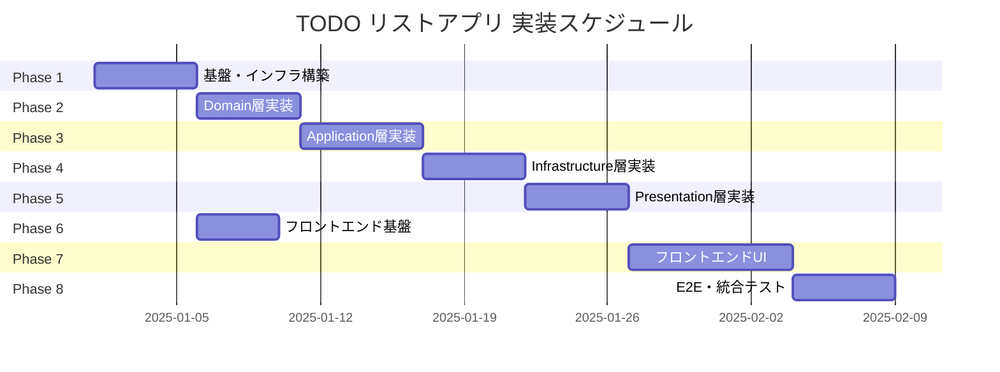
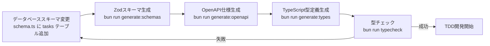

# TODOリストアプリ 実装タスク概要

**作成日**: 2025-11-06
**要件名**: TODO リストアプリ
**要件リンク**: `docs/spec/todo-app-requirements.md`
**ユーザーストーリー**: `docs/spec/todo-app-user-stories.md`
**受け入れ基準**: `docs/spec/todo-app-acceptance-criteria.md`
**技術スタック**: `docs/tech-stack.md`

## 📋 プロジェクト概要

ログイン済みユーザーが個人のタスク(TODO)を管理するシンプルなアプリケーション。
タスクの追加・更新・削除・完了状態の切り替え、優先度設定、フィルタ・ソート機能を提供する。
DDD + クリーンアーキテクチャに基づき、既存の認証基盤(Supabase Auth)と統合する。

### 実装規模

- **総フェーズ数**: 8フェーズ
- **総タスク数**: 約75-80タスク（詳細は各フェーズファイル参照）
- **総工数**: 344時間（約43日、8時間/日換算）
- **開発期間**: 約2ヶ月（並行作業・レビュー時間含む）

### タスク番号管理

- **使用済み番号**:
  - TASK-1〜TASK-599: 他機能で使用
  - TASK-801〜TASK-1301: 型安全性強化・API契約強化（完了）
- **TODOアプリ用開始番号**: TASK-1301〜（本タスク群で使用）
- **次回開始番号**: TASK-1400〜（将来的な機能拡張用）

## 🎯 マイルストーン定義

### M1: データベース基盤構築 (Phase 1完了時)

- **期限**: 開始後5日
- **成果物**:
  - tasksテーブル作成完了
  - RLS設定完了
  - Zodスキーマ自動生成完了
  - OpenAPI仕様生成完了
- **受け入れ基準**:
  - [ ] tasksテーブルがBASE_SCHEMA配下に作成されている
  - [ ] RLSポリシーが正しく動作する
  - [ ] スキーマ駆動開発フローが正常に動作する
  - [ ] 型チェックが成功する

### M2: バックエンドコア機能完成 (Phase 2-5完了時)

- **期限**: 開始後21日
- **成果物**:
  - Domain層: TaskEntity, TaskAggregate実装完了
  - Application層: 全ユースケース実装完了
  - Infrastructure層: PostgreSQLTaskRepository実装完了
  - Presentation層: TaskController、ルーティング実装完了
  - API契約: OpenAPI仕様完成
- **受け入れ基準**:
  - [ ] CRUD操作のAPIエンドポイントがすべて実装されている
  - [ ] ユニットテストが80%以上のカバレッジを達成
  - [ ] Swagger UIでAPI仕様が確認できる
  - [ ] JWT認証が正しく動作する
  - [ ] RLSでユーザー分離が機能する

### M3: フロントエンド基盤構築 (Phase 6完了時)

- **期限**: 開始後25日
- **成果物**:
  - Redux Toolkit設定完了
  - TanStack Query設定完了
  - API型定義自動生成完了
  - テーマカラー適用完了
- **受け入れ基準**:
  - [ ] Redux Storeが正しく設定されている
  - [ ] TanStack Queryのカスタムフックが動作する
  - [ ] OpenAPIからの型定義が自動生成される
  - [ ] テーマカラー(#710000, #ff6a00)が適用されている

### M4: フロントエンドUI完成 (Phase 7完了時)

- **期限**: 開始後33日
- **成果物**:
  - タスク一覧表示機能完成
  - タスク作成機能完成（インライン入力）
  - タスク編集機能完成（モーダル）
  - タスク削除機能完成（確認ダイアログ）
  - フィルタ・ソート機能完成
  - Markdownレンダリング完成
- **受け入れ基準**:
  - [ ] すべてのユーザーストーリーが実装されている
  - [ ] ユニットテストが80%以上のカバレッジを達成
  - [ ] デスクトップ環境で快適に動作する
  - [ ] モバイル環境で基本操作が可能

### M5: 品質保証完了 (Phase 8完了時)

- **期限**: 開始後43日
- **成果物**:
  - E2Eテスト完成
  - 統合テスト完成
  - パフォーマンステスト完了
  - セキュリティテスト完了
  - すべての受け入れ基準クリア
- **受け入れ基準**:
  - [ ] すべてのE2Eテストが成功する
  - [ ] パフォーマンス要件を満たす（一覧取得1秒以内、作成500ms以内）
  - [ ] セキュリティテストで脆弱性が検出されない
  - [ ] すべての機能要件が実装されている
  - [ ] すべての非機能要件を満たす

## 📊 フェーズ構成

| フェーズ | 期間(日) | 成果物 | タスク数(予定) | 工数(時間) | ファイルリンク |
|---------|---------|--------|---------------|-----------|--------------|
| Phase 1: 基盤・インフラ構築 | 5日 | DBテーブル、RLS、スキーマ生成 | 10タスク | 40h | [todo-app-phase1.md](todo-app-phase1.md) |
| Phase 2: Domain層実装 | 5日 | Entity、ValueObject、Repository I/F | 10タスク | 40h | [todo-app-phase2.md](todo-app-phase2.md) |
| Phase 3: Application層実装 | 6日 | ユースケース（CRUD） | 12タスク | 48h | [todo-app-phase3.md](todo-app-phase3.md) |
| Phase 4: Infrastructure層実装 | 5日 | Repository実装、JWT検証 | 10タスク | 40h | [todo-app-phase4.md](todo-app-phase4.md) |
| Phase 5: Presentation層実装 | 5日 | Controller、ルーティング | 10タスク | 40h | [todo-app-phase5.md](todo-app-phase5.md) |
| Phase 6: フロントエンド基盤 | 4日 | Redux、TanStack Query、型定義 | 8タスク | 32h | [todo-app-phase6.md](todo-app-phase6.md) |
| Phase 7: フロントエンドUI | 8日 | コンポーネント、フック | 16タスク | 64h | [todo-app-phase7.md](todo-app-phase7.md) |
| Phase 8: E2E・統合テスト | 5日 | Playwright、品質確認 | 10タスク | 40h | [todo-app-phase8.md](todo-app-phase8.md) |
| **合計** | **43日** | - | **86タスク** | **344h** | - |

### 実行順序（ガントチャート）



**クリティカルパス**: Phase 1 → Phase 2 → Phase 3 → Phase 4 → Phase 5 → Phase 7 → Phase 8（合計39日）

**並行実行可能**: Phase 6（フロントエンド基盤）はPhase 2-5と並行実行可能

## 📝 各フェーズ詳細

### Phase 1: 基盤・インフラ構築（5日 / 40時間）

**目的**: TODOアプリのデータベース基盤を構築し、スキーマ駆動開発フローを確立する

**主要成果物**:
- tasksテーブル定義（Drizzle ORM）
- Row-Level Security(RLS)ポリシー設定
- Zodスキーマ自動生成スクリプト設定
- OpenAPI仕様自動生成設定
- マイグレーション実行

**タスク数**: 10タスク（TASK-1301〜1310）

**進捗**: [ ] 未着手

**詳細**: [todo-app-phase1.md](todo-app-phase1.md)

---

### Phase 2: バックエンドDomain層実装（5日 / 40時間）

**目的**: DDD原則に基づいたドメインモデルを実装する

**主要成果物**:
- TaskEntity（エンティティ）
- TaskAggregate（集約ルート）
- ValueObject（TaskId, TaskTitle, TaskDescription, TaskPriority, TaskStatus）
- ドメインエラー（TaskNotFoundError, InvalidTaskDataError等）
- ITaskRepository（リポジトリインターフェース）
- ドメインサービス（必要に応じて）

**タスク数**: 10タスク（TASK-1311〜1320）

**進捗**: [ ] 未着手

**詳細**: [todo-app-phase2.md](todo-app-phase2.md)

---

### Phase 3: バックエンドApplication層実装（6日 / 48時間）

**目的**: ビジネスロジックを実行するユースケースを実装する

**主要成果物**:
- CreateTaskUseCase（タスク作成）
- GetTasksUseCase（タスク一覧取得）
- GetTaskByIdUseCase（タスク詳細取得）
- UpdateTaskUseCase（タスク更新）
- UpdateTaskStatusUseCase（ステータス変更）
- DeleteTaskUseCase（タスク削除）
- ユースケースのユニットテスト

**タスク数**: 12タスク（TASK-1321〜1332）

**進捗**: [ ] 未着手

**詳細**: [todo-app-phase3.md](todo-app-phase3.md)

---

### Phase 4: バックエンドInfrastructure層実装（5日 / 40時間）

**目的**: データベースアクセスとJWT認証を実装する

**主要成果物**:
- PostgreSQLTaskRepository（ITaskRepositoryの実装）
- JWT検証ミドルウェア統合
- RLSによるユーザー分離実装
- リポジトリ統合テスト

**タスク数**: 10タスク（TASK-1333〜1342）

**進捗**: [ ] 未着手

**詳細**: [todo-app-phase4.md](todo-app-phase4.md)

---

### Phase 5: バックエンドPresentation層実装（5日 / 40時間）

**目的**: HTTPエンドポイントとコントローラを実装する

**主要成果物**:
- TaskController（CRUD操作のエンドポイント）
- taskRoutes.ts（ルーティング定義）
- taskRoutes.schema.ts（Zod + OpenAPIスキーマ）
- 認証ミドルウェア統合
- エラーハンドリングミドルウェア
- 統合テスト（API全体）

**タスク数**: 10タスク（TASK-1343〜1352）

**進捗**: [ ] 未着手

**詳細**: [todo-app-phase5.md](todo-app-phase5.md)

---

### Phase 6: フロントエンド基盤実装（4日 / 32時間）

**目的**: フロントエンドの状態管理と型定義を整備する

**主要成果物**:
- Redux Toolkit設定（taskSlice.ts）
- TanStack Query設定（カスタムフック）
- OpenAPIからの型定義自動生成
- テーマカラー設定（Tailwind CSS）
- 共通UIコンポーネント（ボタン、入力フォーム）

**タスク数**: 8タスク（TASK-1353〜1360）

**進捗**: [ ] 未着手

**詳細**: [todo-app-phase6.md](todo-app-phase6.md)

---

### Phase 7: フロントエンドUI実装（8日 / 64時間）

**目的**: ユーザーが操作するUIコンポーネントを実装する

**主要成果物**:
- TaskList.tsx（タスク一覧表示）
- TaskItem.tsx（タスクアイテム）
- TaskForm.tsx（インライン入力）
- TaskEditModal.tsx（詳細編集モーダル）
- TaskFilter.tsx（フィルタコンポーネント）
- TaskSort.tsx（ソートコンポーネント）
- カスタムフック（useTasks, useCreateTask, useUpdateTask, useDeleteTask）
- Markdownレンダリング（react-markdown）
- ユニットテスト

**タスク数**: 16タスク（TASK-1361〜1376）

**進捗**: [ ] 未着手

**詳細**: [todo-app-phase7.md](todo-app-phase7.md)

---

### Phase 8: E2Eテスト・統合テスト（5日 / 40時間）

**目的**: 品質保証とすべての受け入れ基準のクリア

**主要成果物**:
- Playwright E2Eテスト（全シナリオ）
- パフォーマンステスト
- セキュリティテスト（Semgrep）
- アクセシビリティテスト（WCAG 2.1 AA）
- バグ修正・リファクタリング

**タスク数**: 10タスク（TASK-1377〜1386）

**進捗**: [ ] 未着手

**詳細**: [todo-app-phase8.md](todo-app-phase8.md)

## 🔄 スキーマ駆動開発フロー

TODOアプリの実装は既存のスキーマ駆動開発フローに従います:



### コマンド一覧

```bash
# 1. データベーススキーマ変更後（Phase 1）
docker compose exec server bun run generate:schemas

# 2. OpenAPI仕様生成（Phase 1）
docker compose exec server bun run generate:openapi

# 3. TypeScript型定義生成（Phase 6）
docker compose exec client bun run generate:types

# 4. 型チェック（各フェーズ）
docker compose exec server bun run typecheck
docker compose exec client bun run typecheck

# 5. テスト実行（各フェーズ）
docker compose exec server bun test
docker compose exec client bun test
docker compose exec e2e npx playwright test

# 6. セキュリティチェック（Phase 8）
docker compose run --rm semgrep semgrep scan --config=auto
```

## ✅ チェックリスト（全体進捗）

### 基盤構築

- [ ] データベーステーブル作成完了（Phase 1）
- [ ] RLS設定完了（Phase 1）
- [ ] スキーマ生成スクリプト設定完了（Phase 1）
- [ ] OpenAPI仕様生成設定完了（Phase 1）

### バックエンド実装

- [ ] Domain層実装完了（Phase 2）
- [ ] Application層実装完了（Phase 3）
- [ ] Infrastructure層実装完了（Phase 4）
- [ ] Presentation層実装完了（Phase 5）
- [ ] バックエンドユニットテスト80%達成（Phase 2-5）

### フロントエンド実装

- [ ] Redux/TanStack Query設定完了（Phase 6）
- [ ] API型定義自動生成完了（Phase 6）
- [ ] UIコンポーネント実装完了（Phase 7）
- [ ] カスタムフック実装完了（Phase 7）
- [ ] Markdownレンダリング実装完了（Phase 7）
- [ ] フロントエンドユニットテスト80%達成（Phase 7）

### 品質保証

- [ ] E2Eテスト実装完了（Phase 8）
- [ ] パフォーマンステスト合格（Phase 8）
- [ ] セキュリティテスト合格（Phase 8）
- [ ] すべての受け入れ基準クリア（Phase 8）

## 📈 進捗管理

### 週次レビューポイント

1. **Week 1（Phase 1-2）**: データベース基盤とドメインモデル
2. **Week 2（Phase 3-4）**: ユースケースとリポジトリ実装
3. **Week 3（Phase 5-6）**: APIエンドポイントとフロントエンド基盤
4. **Week 4（Phase 7）**: UI実装
5. **Week 5-6（Phase 8）**: テストと品質保証

### リスク管理

| リスク | 影響度 | 対策 |
|-------|-------|------|
| スキーマ生成スクリプトの不具合 | 高 | Phase 1で十分にテスト、既存の型安全性強化タスクの知見活用 |
| RLS設定の複雑さ | 中 | Phase 1で単体テスト、既存の認証基盤の知見活用 |
| Markdownレンダリングの脆弱性 | 中 | sanitize処理の実装、Semgrepスキャン |
| E2Eテストのフレーク | 中 | storageState APIの正しい使用、Trace Viewer活用 |
| パフォーマンス要件未達 | 中 | 早期にパフォーマンステスト実施、インデックス最適化 |

## 🔗 関連ドキュメント

### 要件定義・設計

- [要件定義書](../spec/todo-app-requirements.md)
- [ユーザーストーリー](../spec/todo-app-user-stories.md)
- [受け入れ基準](../spec/todo-app-acceptance-criteria.md)

### 技術

- [技術スタック](../tech-stack.md)
- [プロジェクトガイドライン](../../CLAUDE.md)

### タスク詳細

- [Phase 1: 基盤・インフラ構築](todo-app-phase1.md)
- [Phase 2: Domain層実装](todo-app-phase2.md)
- [Phase 3: Application層実装](todo-app-phase3.md)
- [Phase 4: Infrastructure層実装](todo-app-phase4.md)
- [Phase 5: Presentation層実装](todo-app-phase5.md)
- [Phase 6: フロントエンド基盤](todo-app-phase6.md)
- [Phase 7: フロントエンドUI](todo-app-phase7.md)
- [Phase 8: E2E・統合テスト](todo-app-phase8.md)

## 📝 メモ・注意事項

### 実装優先順位

1. **最優先**: Phase 1（基盤構築）
   - スキーマ駆動開発フローの確立が最重要
   - 後続フェーズの基盤となる
2. **高優先**: Phase 2-5（バックエンド実装）
   - API契約を早期に確定
   - フロントエンド実装の依存元
3. **中優先**: Phase 6-7（フロントエンド実装）
   - バックエンドAPI完成後に実装
   - ユーザー体験の直接的な実現
4. **低優先**: Phase 8（品質保証）
   - 各フェーズで一定のテストを実施
   - 最後に統合的な品質確認

### 既存機能との統合ポイント

- **認証**: 既存のSupabase Auth（Google OAuth）を利用
- **RLS**: 既存のusersテーブルを参照してユーザー分離
- **JWT検証**: 既存のミドルウェアを流用
- **スキーマ生成**: 既存の`generate-schemas.ts`に設定追加
- **OpenAPI生成**: 既存の`generate-openapi.ts`を利用

### 技術的考慮事項

- **テストカバレッジ**: 各フェーズで80%以上を維持
- **型安全性**: TypeScript strict mode + Zodバリデーション
- **パフォーマンス**: インデックス設計、ページネーション検討（将来的）
- **セキュリティ**: XSS対策（Markdown sanitize）、SQLインジェクション対策（Drizzle ORM）
- **アクセシビリティ**: WCAG 2.1 AA準拠（推奨）

## 🔄 更新履歴

- **2025-11-06**: 初版作成（タスク概要ファイル）
