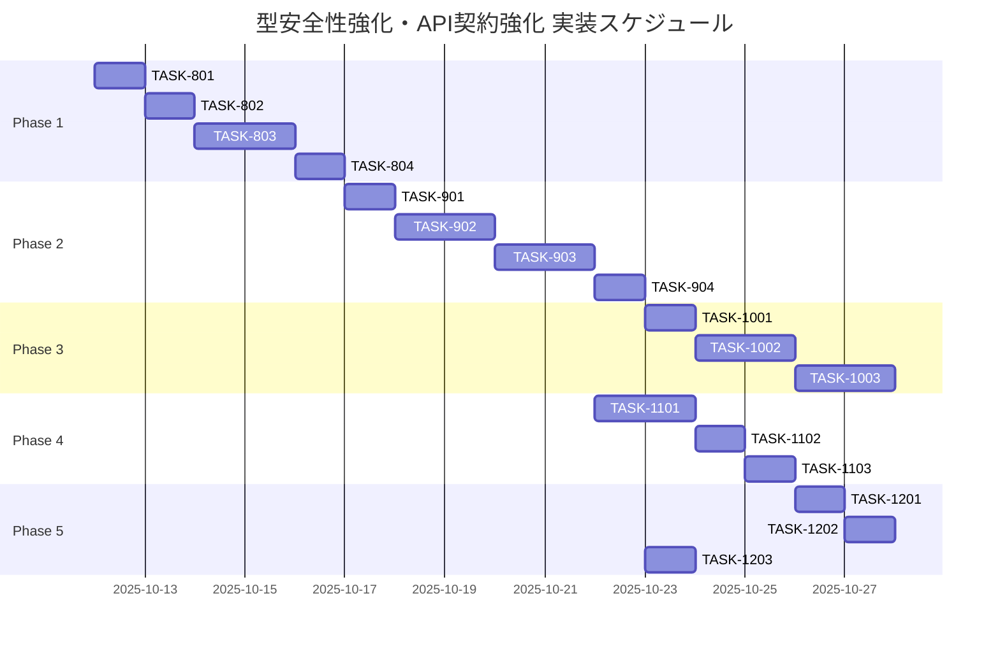

# 型安全性強化・API契約強化 実装タスク

**作成日**: 2025-10-12
**要件リンク**: `docs/spec/type-safety-enhancement-requirements.md`
**設計文書**: `docs/design/type-safety-enhancement/`

## 概要

全タスク数: 18
推定作業時間: 40時間
クリティカルパス: TASK-801 → TASK-802 → TASK-803 → TASK-901 → TASK-902 → TASK-903 → TASK-1001 → TASK-1002

## タスク一覧

---

## フェーズ1: Drizzle Zod統合（基礎構築）

### TASK-801: shared-schemasパッケージ初期設定

- [x] **タスク完了**
- **タスクタイプ**: DIRECT
- **要件リンク**: REQ-001, REQ-002, REQ-401, REQ-402
- **依存タスク**: なし
- **実装詳細**:
  - `app/packages/shared-schemas/`ディレクトリ構成整備
  - `package.json`設定（dependencies: drizzle-zod, zod）
  - TypeScript設定ファイル作成（tsconfig.json）
  - エクスポート集約ファイル（index.ts）作成
  - 既存のDrizzleスキーマへのアクセス確認
- **完了条件**:
  - [x] shared-schemasパッケージがserver/clientからimport可能
  - [x] drizzle-zod ^0.8.3がインストール済み
  - [x] TypeScriptコンパイルが成功する

---

### TASK-802: Drizzle ZodスキーマからZodスキーマ自動生成スクリプト

- [x] **タスク完了** (2025-10-13)
- **タスクタイプ**: DIRECT
- **要件リンク**: REQ-002, REQ-101, REQ-402
- **依存タスク**: TASK-801
- **実装詳細**:
  - `app/server/scripts/generate-schemas.ts`作成（Config駆動アプローチ）
  - Drizzleスキーマから`createSelectSchema`/`createInsertSchema`実行
  - `app/server/src/schemas/users.ts`に自動生成（server専用DBスキーマ）
  - `bun run generate:schemas`コマンド追加
  - 生成ファイルに警告コメント追加（手動編集禁止）
  - TableConfig配列による拡張可能な設計
- **実装成果**:
  ```typescript
  // app/server/scripts/generate-schemas.ts (改善版)
  interface TableConfig {
    tableName: string;
    tableObject: unknown;
    outputFile: string;
    enums?: EnumConfig[];
  }

  const tableConfigs: TableConfig[] = [
    {
      tableName: 'users',
      tableObject: users,
      outputFile: 'users.ts',
      enums: [
        {
          name: 'authProviderType',
          exportName: 'authProviderSchema',
          values: authProviderType.enumValues,
        },
      ],
    },
    // 新規テーブル追加時はここに設定を追記するのみ
  ];
  ```
- **完了条件**:
  - [x] `bun run generate:schemas`が実行可能
  - [x] `shared-schemas/users.ts`が自動生成される
  - [x] selectUserSchema/insertUserSchemaがZodスキーマとして動作
- **実装記録**: `docs/implements/TASK-802/`

---

### TASK-803: DBスキーマのserver内移動とimportパス更新

- [ ] **タスク完了**
- **タスクタイプ**: DIRECT
- **要件リンク**: REQ-402
- **依存タスク**: TASK-802
- **実装詳細**:
  - TASK-802で誤って`shared-schemas/users.ts`に生成したDBスキーマを`server/src/schemas/users.ts`に移動
  - `generate-schemas.ts`の出力先を`../src/schemas/`に変更
  - UserControllerなどのimportパスを`@/schemas/users`に更新
  - `shared-schemas/users.ts`から不要なDB関連エクスポートを削除
  - server側のtsconfig.jsonパスエイリアス確認（`@/schemas/*`が解決可能か）
- **完了条件**:
  - [ ] DBスキーマが`server/src/schemas/users.ts`に配置されている
  - [ ] `generate-schemas.ts`が正しいディレクトリに出力する
  - [ ] server側の型チェックが成功する（`bunx tsc --noEmit`）
  - [ ] client側の型チェックが成功する（`bunx tsc --noEmit`）

---

### TASK-804: API契約スキーマ定義（認証・ユーザー）

- [ ] **タスク完了**
- **タスクタイプ**: DIRECT
- **要件リンク**: REQ-003
- **依存タスク**: TASK-803
- **重要度**: 高（shared-schemasの正しい使用方法を確立）
- **実装詳細**:
  - `shared-schemas/auth.ts`作成（認証リクエスト・レスポンススキーマ）
  - `shared-schemas/common.ts`作成（共通型: UUID、Email等）
  - AuthCallbackRequestスキーマ定義
  - 共通APIレスポンス構造定義（apiResponseSchema、apiErrorResponseSchema）
- **実装例**:
  ```typescript
  // shared-schemas/auth.ts
  export const authCallbackRequestSchema = z.object({
    externalId: z.string().min(1),
    provider: authProviderSchema,
    email: z.string().email(),
    name: z.string().min(1),
    avatarUrl: z.string().url().optional(),
  });

  export const authResponseSchema = apiResponseSchema(selectUserSchema);
  ```
- **完了条件**:
  - [ ] 認証関連スキーマが定義されている
  - [ ] 共通レスポンス構造が再利用可能
  - [ ] TypeScriptコンパイルが成功する

---

## フェーズ2: OpenAPI仕様生成（API契約明示化）

### TASK-901: @hono/zod-openapi導入・設定

- [ ] **タスク完了**
- **タスクタイプ**: DIRECT
- **要件リンク**: REQ-004, REQ-403
- **依存タスク**: TASK-804
- **実装詳細**:
  - `@hono/zod-openapi`パッケージインストール
  - Honoアプリ初期化を`OpenAPIHono`に変更
  - OpenAPIメタデータ設定（title, version, description）
  - `docs/api/openapi.yaml`出力スクリプト作成
  - `bun run generate:openapi`コマンド追加
- **実装例**:
  ```typescript
  // app/server/src/index.ts
  import { OpenAPIHono } from '@hono/zod-openapi';

  const app = new OpenAPIHono();

  app.doc('/api/openapi.json', {
    openapi: '3.1.0',
    info: { title: 'API', version: '1.0.0' },
  });
  ```
- **完了条件**:
  - [ ] @hono/zod-openapiがインストール済み
  - [ ] `bun run generate:openapi`が実行可能
  - [ ] `docs/api/openapi.yaml`が生成される

---

### TASK-902: 認証エンドポイントのOpenAPI対応化

- [ ] **タスク完了**
- **タスクタイプ**: TDD
- **要件リンク**: REQ-004, REQ-104, api-endpoints.md
- **依存タスク**: TASK-901
- **実装詳細**:
  - `POST /auth/callback`をOpenAPIルートに移行
  - authCallbackRequestSchemaをリクエストスキーマに設定
  - authResponseSchemaをレスポンススキーマに設定
  - エラーレスポンススキーマ（400, 401, 500）定義
  - 既存のauthRoutes.tsをOpenAPIルートに置き換え
- **実装例**:
  ```typescript
  app.openapi(
    createRoute({
      method: 'post',
      path: '/auth/callback',
      request: {
        body: {
          content: {
            'application/json': { schema: authCallbackRequestSchema },
          },
        },
      },
      responses: {
        200: {
          content: { 'application/json': { schema: authResponseSchema } },
          description: '認証成功',
        },
        400: {
          content: { 'application/json': { schema: apiErrorResponseSchema } },
          description: 'バリデーションエラー',
        },
      },
    }),
    async (c) => { /* ... */ }
  );
  ```
- **テスト要件**:
  - [ ] 単体テスト: OpenAPIルート定義が正しく動作
  - [ ] 統合テスト: 認証コールバックAPIが正常に動作
  - [ ] OpenAPI仕様書に`/auth/callback`エンドポイントが含まれる
- **完了条件**:
  - [ ] 認証エンドポイントがOpenAPI対応化されている
  - [ ] 既存の認証フローが正常に動作する

---

### TASK-903: ユーザー管理エンドポイントのOpenAPI対応化

- [ ] **タスク完了**
- **タスクタイプ**: TDD
- **要件リンク**: REQ-004, REQ-104, api-endpoints.md
- **依存タスク**: TASK-902
- **実装詳細**:
  - `GET /users/{id}`をOpenAPIルートに移行
  - `GET /users`（一覧取得）をOpenAPIルートに移行
  - `PUT /users/{id}`をOpenAPIルートに移行
  - パスパラメータ・クエリパラメータ・ボディスキーマ定義
  - エラーレスポンススキーマ（400, 401, 404）定義
- **テスト要件**:
  - [ ] 単体テスト: 各エンドポイントのOpenAPIルート定義
  - [ ] 統合テスト: ユーザー取得・一覧取得・更新APIが正常に動作
  - [ ] OpenAPI仕様書にユーザー管理エンドポイントが含まれる
- **完了条件**:
  - [ ] ユーザー管理エンドポイントがOpenAPI対応化されている
  - [ ] 全テストが成功する

---

### TASK-904: Swagger UI統合（開発環境のみ）

- [ ] **タスク完了**
- **タスクタイプ**: DIRECT
- **要件リンク**: REQ-201, REQ-202, api-endpoints.md
- **依存タスク**: TASK-903
- **実装詳細**:
  - `swagger-ui-dist`パッケージインストール
  - `GET /api/docs`エンドポイント作成
  - OpenAPI仕様書を読み込んでSwagger UIを表示
  - 本番環境（NODE_ENV=production）では404を返却
- **実装例**:
  ```typescript
  if (process.env.NODE_ENV === 'development') {
    app.get('/api/docs', (c) => {
      const html = generateSwaggerHTML('/api/openapi.json');
      return c.html(html);
    });
  }
  ```
- **完了条件**:
  - [ ] 開発環境で`http://localhost:3001/api/docs`にアクセス可能
  - [ ] Swagger UIでAPI仕様書が表示される
  - [ ] 本番環境では404が返却される

---

## フェーズ3: TypeScript型定義自動生成（フロントエンド型安全化）

### TASK-1001: openapi-typescript導入・設定

- [ ] **タスク完了**
- **タスクタイプ**: DIRECT
- **要件リンク**: REQ-005, REQ-404
- **依存タスク**: TASK-904
- **実装詳細**:
  - `openapi-typescript`パッケージインストール（クライアント側）
  - OpenAPI仕様からTypeScript型定義生成スクリプト作成
  - `app/client/src/types/api/generated.ts`に出力
  - `bun run generate:types`コマンド追加
  - 生成ファイルに警告コメント追加（手動編集禁止）
- **実装例**:
  ```bash
  docker compose exec client bunx openapi-typescript \
    ../../docs/api/openapi.yaml \
    -o src/types/api/generated.ts
  ```
- **完了条件**:
  - [ ] `bun run generate:types`が実行可能
  - [ ] `src/types/api/generated.ts`が自動生成される
  - [ ] paths型がエクスポートされている

---

### TASK-1002: 型安全なAPIクライアント実装

- [ ] **タスク完了**
- **タスクタイプ**: TDD
- **要件リンク**: REQ-007, NFR-102
- **依存タスク**: TASK-1001
- **実装詳細**:
  - `openapi-fetch`パッケージインストール（オプション）
  - 型安全なAPIクライアント作成（`src/lib/api.ts`）
  - paths型を使用してcreateClient初期化
  - React Queryフック実装（useUser、useUpdateUser等）
- **実装例**:
  ```typescript
  // src/lib/api.ts
  import type { paths } from '@/types/api/generated';
  import { createClient } from 'openapi-fetch';

  export const client = createClient<paths>({
    baseUrl: process.env.NEXT_PUBLIC_API_BASE_URL,
  });
  ```
- **テスト要件**:
  - [ ] 単体テスト: APIクライアントが型安全に動作
  - [ ] 単体テスト: React Queryフックが正しい型を返す
  - [ ] TypeScriptコンパイルで型エラーが検出される
- **完了条件**:
  - [ ] APIクライアントが完全に型安全
  - [ ] 全テストが成功する

---

### TASK-1003: 既存API呼び出しの段階的移行

- [ ] **タスク完了**
- **タスクタイプ**: TDD
- **要件リンク**: REQ-007, NFR-101
- **依存タスク**: TASK-1002
- **実装詳細**:
  - 既存のfetch/axiosベースのAPI呼び出しを特定
  - 型安全なAPIクライアントに置き換え
  - 認証トークン付与ロジックの統合
  - エラーハンドリングの統合
- **テスト要件**:
  - [ ] 統合テスト: 既存の認証フローが動作
  - [ ] 統合テスト: ユーザープロフィール取得が動作
  - [ ] E2Eテスト: ログイン→プロフィール表示フロー
- **完了条件**:
  - [ ] 既存のAPI呼び出しが型安全なクライアントに置き換わっている
  - [ ] 全テストが成功する

---

## フェーズ4: 実行時バリデーション強化（信頼性向上）

### TASK-1101: Honoリクエストバリデーションミドルウェア実装

- [ ] **タスク完了**
- **タスクタイプ**: TDD
- **要件リンク**: REQ-006, REQ-104, NFR-001（レスポンスタイムへの影響測定）
- **依存タスク**: TASK-903
- **実装詳細**:
  - Honoミドルウェアでリクエストボディ・パラメータをZodバリデーション
  - バリデーション失敗時に詳細エラーメッセージ生成（EDGE-001）
  - 400 Bad Requestレスポンス返却
  - バリデーションオーバーヘッドのベンチマーク（NFR-001: 50ms以内）
- **実装例**:
  ```typescript
  app.use('*', async (c, next) => {
    const body = await c.req.json();
    const result = requestSchema.safeParse(body);
    if (!result.success) {
      return c.json({
        success: false,
        error: {
          code: 'VALIDATION_ERROR',
          message: 'バリデーションエラー',
          details: result.error.flatten(),
        },
      }, 400);
    }
    await next();
  });
  ```
- **テスト要件**:
  - [ ] 単体テスト: バリデーション成功時は正常処理
  - [ ] 単体テスト: バリデーション失敗時は400エラー
  - [ ] パフォーマンステスト: レスポンスタイムへの影響を測定
- **エラーハンドリング**:
  - [ ] 詳細なフィールドエラーメッセージ
  - [ ] クライアントに内部エラーを露出しない
- **完了条件**:
  - [ ] リクエストバリデーションが全エンドポイントで動作
  - [ ] パフォーマンス要件を満たす

---

### TASK-1102: レスポンスバリデーション実装（開発環境）

- [ ] **タスク完了**
- **タスクタイプ**: TDD
- **要件リンク**: REQ-006, REQ-105, NFR-303
- **依存タスク**: TASK-1101
- **実装詳細**:
  - レスポンス送信前にZodスキーマで検証（開発環境のみ）
  - バリデーション失敗時は500エラーをログ記録
  - 本番環境ではレスポンスバリデーションを無効化（パフォーマンス優先）
- **実装例**:
  ```typescript
  if (process.env.NODE_ENV === 'development') {
    const result = responseSchema.safeParse(responseData);
    if (!result.success) {
      logger.error('Response validation failed', result.error);
      return c.json({ success: false, error: { code: 'INTERNAL_ERROR', message: 'サーバーエラー' } }, 500);
    }
  }
  ```
- **テスト要件**:
  - [ ] 単体テスト: レスポンスバリデーション成功時は正常レスポンス
  - [ ] 単体テスト: レスポンスバリデーション失敗時は500エラー
  - [ ] 統合テスト: 本番環境ではバリデーションがスキップされる
- **完了条件**:
  - [ ] 開発環境でレスポンスバリデーションが動作
  - [ ] 本番環境でバリデーションが無効化されている

---

### TASK-1103: バリデーションエラーメッセージ改善

- [ ] **タスク完了**
- **タスクタイプ**: DIRECT
- **要件リンク**: NFR-103, EDGE-001
- **依存タスク**: TASK-1102
- **実装詳細**:
  - Zodエラーメッセージのカスタマイズ
  - フィールド名・期待値・実際の値を含むエラーレスポンス生成
  - 日本語エラーメッセージ対応
- **実装例**:
  ```typescript
  const errors = result.error.flatten();
  return {
    success: false,
    error: {
      code: 'VALIDATION_ERROR',
      message: 'バリデーションエラー',
      details: {
        name: 'ユーザー名は1文字以上である必要があります',
        email: '有効なメールアドレスではありません',
      },
    },
  };
  ```
- **完了条件**:
  - [ ] エラーメッセージが開発者にわかりやすい
  - [ ] フィールド単位でエラー詳細を提供

---

## フェーズ5: 自動化・CI/CD統合（運用効率化）

### TASK-1201: 型定義自動生成スクリプト統合

- [ ] **タスク完了**
- **タスクタイプ**: DIRECT
- **要件リンク**: NFR-101, REQ-101, REQ-102, REQ-103
- **依存タスク**: TASK-1002
- **実装詳細**:
  - package.jsonに以下のスクリプト追加:
    - `generate:schemas` - Drizzle ZodからZodスキーマ生成
    - `generate:openapi` - ZodスキーマからOpenAPI仕様生成
    - `generate:types` - OpenAPI仕様からTypeScript型定義生成
    - `generate:all` - 上記を順次実行
  - エラーハンドリング（EDGE-002）
- **実装例**:
  ```json
  {
    "scripts": {
      "generate:schemas": "bun run scripts/generate-schemas.ts",
      "generate:openapi": "bun run scripts/generate-openapi.ts",
      "generate:types": "bunx openapi-typescript docs/api/openapi.yaml -o src/types/api/generated.ts",
      "generate:all": "bun run generate:schemas && bun run generate:openapi && bun run generate:types"
    }
  }
  ```
- **完了条件**:
  - [ ] `bun run generate:all`で全型定義が生成される
  - [ ] エラー発生時にビルドが停止する

---

### TASK-1202: CI/CDパイプライン統合（型定義最新性チェック）

- [ ] **タスク完了**
- **タスクタイプ**: DIRECT
- **要件リンク**: NFR-104
- **依存タスク**: TASK-1201
- **実装詳細**:
  - GitHub Actionsワークフロー作成
  - 型定義自動生成実行
  - 生成ファイルの差分チェック（git diff --exit-code）
  - 差分がある場合はCIエラー
- **実装例**:
  ```yaml
  - name: Check generated types are up to date
    run: |
      bun run generate:all
      git diff --exit-code docs/api/openapi.yaml
      git diff --exit-code app/client/src/types/api/generated.ts
  ```
- **完了条件**:
  - [ ] PRマージ前に型定義の最新性がチェックされる
  - [ ] 古い型定義のマージがブロックされる

---

### TASK-1203: ドキュメント自動生成・公開設定

- [ ] **タスク完了**
- **タスクタイプ**: DIRECT
- **要件リンク**: NFR-401, NFR-403
- **依存タスク**: TASK-904
- **実装詳細**:
  - OpenAPI仕様書の自動生成をCI/CDに統合
  - Swagger UIの静的HTML生成（オプション）
  - ドキュメント公開先の設定（GitHub Pages等）
- **完了条件**:
  - [ ] OpenAPI仕様書が自動生成される
  - [ ] ドキュメントが公開可能な状態

---

## 実行順序



## マイルストーン

### マイルストーン1: Drizzle Zod統合完了（Phase 1終了）
- [ ] TASK-801 ~ TASK-804完了
- [ ] Zodスキーマが自動生成可能
- [ ] shared-schemasパッケージが動作

### マイルストーン2: OpenAPI仕様生成完了（Phase 2終了）
- [ ] TASK-901 ~ TASK-904完了
- [ ] OpenAPI仕様書が自動生成される
- [ ] Swagger UIでAPI仕様が確認可能

### マイルストーン3: フロントエンド型安全化完了（Phase 3終了）
- [ ] TASK-1001 ~ TASK-1003完了
- [ ] TypeScript型定義が自動生成される
- [ ] APIクライアントが完全に型安全

### マイルストーン4: 実行時バリデーション完了（Phase 4終了）
- [ ] TASK-1101 ~ TASK-1103完了
- [ ] リクエスト・レスポンスバリデーションが動作
- [ ] パフォーマンス要件を満たす

### マイルストーン5: 自動化・CI/CD統合完了（Phase 5終了）
- [ ] TASK-1201 ~ TASK-1203完了
- [ ] 型定義自動生成が完全自動化
- [ ] CI/CDで型整合性がチェックされる

## 並行実行可能なタスクグループ

### グループA（Phase 1）
- TASK-801（必須）→ TASK-802（必須）→ TASK-803（必須）→ TASK-804（必須）

### グループB（Phase 2）
- TASK-901（必須）→ TASK-902, TASK-903（並行可）→ TASK-904（必須）

### グループC（Phase 3）
- TASK-1001（必須）→ TASK-1002（必須）→ TASK-1003（必須）

### グループD（Phase 4）
- TASK-1101, TASK-1102（並行可）→ TASK-1103（必須）

### グループE（Phase 5）
- TASK-1201, TASK-1203（並行可）→ TASK-1202（必須）

## 受け入れ基準

### 全体の受け入れ基準
- [ ] Drizzleスキーマ変更時、`bun run generate:all`で全型定義が更新される
- [ ] フロントエンド・バックエンド間の型定義が完全に一致する
- [ ] Zodバリデーションによるレスポンスタイムへの影響が著しくない
- [ ] OpenAPI仕様書が最新の状態でSwagger UIに表示される
- [ ] CI/CDパイプラインで型定義の最新性が検証される
- [ ] 既存のDDD + クリーンアーキテクチャ構造が維持されている

### 品質基準
- [ ] TypeScriptコンパイルエラーがゼロ
- [ ] 全テストが成功する（単体・統合・E2E）
- [ ] ドキュメントとコードが一致している

## リスク管理

### リスク1: Drizzle ZodとDrizzle ORMのバージョン不整合
- **対策**: package.jsonでバージョン固定（drizzle-zod: ^0.8.3, drizzle-orm: 0.44.4）
- **検証**: TASK-802でバージョン互換性確認

### リスク2: OpenAPI生成の複雑化
- **対策**: シンプルなスキーマ定義を維持、複雑なケースは手動調整
- **検証**: TASK-903で複雑なエンドポイントの生成確認

### リスク3: パフォーマンス影響
- **対策**: TASK-1101で影響を測定、本番環境でレスポンスバリデーション無効化
- **検証**: 開発環境でレスポンスタイムへの影響を確認

### リスク4: 既存コードベースとの統合
- **対策**: TASK-803, TASK-1003で段階的移行、既存テストを維持
- **検証**: 既存の認証フロー・ユーザー管理機能が正常に動作することを確認

## 次のステップ

1. **Phase 1開始**: TASK-801から順次実装
2. **定期的なレビュー**: 各フェーズ終了時にマイルストーン達成を確認
3. **ドキュメント更新**: 実装内容をREADMEやアーキテクチャドキュメントに反映
4. **パフォーマンス測定**: Phase 4でベンチマーク実施
5. **CI/CD統合**: Phase 5で自動化完了

---

**作成者**: Claude Code
**最終更新**: 2025-10-12
