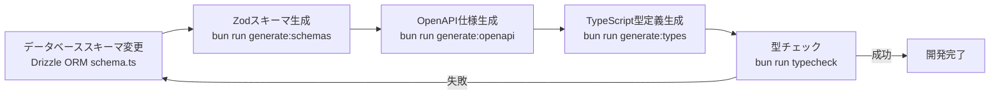

# プロジェクト技術スタック定義

## 🔧 生成情報

- **生成日**: 2025-11-05
- **生成ツール**: tsumiki:init-tech-stack
- **プロジェクトタイプ**: フルスタック（Web + API）
- **チーム規模**: 個人開発
- **開発期間**: 中期プロジェクト（6ヶ月）

## 🎯 プロジェクト要件サマリー

- **既存システム連携**: 新規構築（プロジェクト内完結）
- **パフォーマンス**: 軽負荷（同時利用者数10人以下、レスポンス時間3秒以内）
- **セキュリティ**: 基本的なWebセキュリティ対策
- **技術スキル**: TypeScript、React、AWS/GCP経験あり
- **学習コスト許容度**: 積極的に新技術を導入
- **デプロイ先**: CloudFlare Pages（フロントエンド）、AWS Lambda（バックエンド）
- **予算**: コスト最小化（現実的な範囲で無理のない運用）

## 🚀 フロントエンド

### コア技術

- **フレームワーク**: Next.js 15.4.6
- **レンダリング**: SSG（Static Site Generation）
- **言語**: TypeScript 5
- **UIライブラリ**: React 19.1.0
- **スタイリング**: Tailwind CSS 4
- **状態管理**:
  - Redux Toolkit 2.8.2（グローバル状態）
  - TanStack React Query 5.84.2（サーバー状態）

### 開発ツール

- **パッケージマネージャー**: Bun
- **ランタイム**: Bun（開発環境）
- **リンター/フォーマッター**: Biome 2.1.4
- **型チェック**: TypeScript Compiler（strict mode）

### API連携

- **HTTPクライアント**: openapi-fetch 0.15.0
- **型生成**: openapi-typescript 7.10.1
- **認証**: Supabase JS 2.56.0（認証SDK）
- **JWT処理**: jose 6.1.0

### テスト

- **ユニット/統合テスト**: Bun標準テスト（`bun test`）
- **テストライブラリ**:
  - @testing-library/react 16.3.0
  - @testing-library/user-event 14.6.1
  - @testing-library/jest-dom 6.8.0
- **E2Eテスト**: Playwright 1.55.0
- **DOM環境**: jsdom 26.1.0

### 選択理由

- **Next.js 15 SSG**: CloudFlare Pagesへの最適化、高速な静的サイト生成
- **React 19**: 最新機能（Server Actions等）の活用、パフォーマンス向上
- **TypeScript strict**: 型安全性の最大化、バグの早期発見
- **Tailwind CSS 4**: ユーティリティファースト、高速な開発体験
- **Redux Toolkit + React Query**: グローバル状態とサーバー状態の責任分離
- **Bun**: 高速なビルド・テスト実行、Node.jsの完全互換
- **Biome**: Rustベース、ESLint+Prettierより高速
- **Playwright**: クロスブラウザ対応、トレースビューアーによる強力なデバッグ

## ⚙️ バックエンド

### コア技術

- **フレームワーク**: Hono 4.9.0
- **言語**: TypeScript 5.9.2
- **ランタイム**:
  - Bun（開発環境）
  - Node.js 22.x（本番環境 AWS Lambda）
- **データベース**: PostgreSQL 15（Alpine Linux）
- **ORM**: Drizzle ORM 0.44.4
- **スキーマ管理**: Drizzle Kit 0.31.4

### API設計

- **スキーマバリデーション**: Zod 4.1.12
- **OpenAPI生成**: @hono/zod-openapi 1.1.3
- **ドキュメント**: Swagger UI 5.29.5

### 認証・セキュリティ

- **認証プロバイダー**: Supabase Auth
- **JWT処理**: jose 6.1.0（JWKS認証）
- **環境変数管理**: Docker Compose環境変数

### 本番環境

- **デプロイ**: AWS Lambda（サーバーレス）
- **ビルド**: esbuild 0.25.9（minify + bundle）
- **Node.js互換**: @hono/node-server 1.14.0

### 選択理由

- **Hono**: 軽量（AWS Lambda最適化）、TypeScript完全対応、Zodネイティブ統合
- **Bun開発 + Node.js本番**: 開発体験と本番安定性のバランス
- **Drizzle ORM**: 型安全、PostgreSQL最適化、マイグレーション管理
- **Zod + OpenAPI**: スキーマ駆動開発、フロントエンド型定義自動生成
- **Supabase Auth**: 認証基盤のアウトソース、コスト削減
- **AWS Lambda**: サーバーレス、従量課金でコスト最小化

## 💾 データベース設計

### メインデータベース

- **RDBMS**: PostgreSQL 15
- **接続ライブラリ**:
  - postgres 3.4.7（開発用、軽量）
  - pg 8.12.0（本番用、安定性重視）

### スキーマ管理

- **マイグレーション**: Drizzle Kit
- **スキーマ定義**: `app/server/src/infrastructure/database/schema.ts`
- **環境分離**:
  - 開発: `app_test` schema（Docker Compose内PostgreSQL）
  - 本番: AWS RDS PostgreSQL or Supabase Database

### 設計方針

- **Single Source of Truth**: Drizzle ORMスキーマをベースに全て生成
- **スキーマ駆動開発**: DB変更 → Zodスキーマ生成 → OpenAPI生成 → 型定義生成
- **ACID準拠**: トランザクション整合性の確保
- **適切な正規化**: パフォーマンスとメンテナンス性のバランス

## 🔄 スキーマ駆動開発フロー



### コマンド一覧

```bash
# 1. データベーススキーマ変更後
docker compose exec server bun run generate:schemas

# 2. OpenAPI仕様生成
docker compose exec server bun run generate:openapi

# 3. フロントエンド型定義生成
docker compose exec client bun run generate:types

# 4. 型チェック
docker compose exec server bun run typecheck
docker compose exec client bun run typecheck
```

### 新規テーブル追加手順

1. `app/server/src/infrastructure/database/schema.ts` にテーブル定義を追加
2. `app/server/scripts/generate-schemas.ts` の `tableConfigs` 配列に設定を追加
3. スキーマ生成コマンドを実行（上記コマンド一覧参照）

## 🛠️ 開発環境

### コンテナ構成

- **オーケストレーション**: Docker Compose
- **コンテナ一覧**:
  - `server`: Honoバックエンド（Bun）
  - `client`: Next.jsフロントエンド（Bun）
  - `db`: PostgreSQL 15（Alpine）
  - `e2e`: Playwright E2Eテスト
  - `iac`: Terraformインフラ管理
  - `semgrep`: セキュリティ静的解析

### 開発ツール

- **パッケージマネージャー**: Bun（フロント・バック共通）
- **リンター/フォーマッター**: Biome 2.1.4
- **型チェック**: TypeScript 5
- **セキュリティ**: Semgrep 1.96.0
- **IaC**: Terraform（`iac`コンテナ）

### 環境変数管理

- **開発環境**: `.env` ファイル + Docker Compose環境変数
- **本番環境**: Terraform変数 + AWS Secrets Manager / CloudFlare環境変数

## 🧪 テスト戦略

### フロントエンド

#### ユニット/統合テスト

- **フレームワーク**: Bun標準テスト
- **実行**: `docker compose exec client bun test`
- **カバレッジ目標**: 80%以上
- **方針**:
  - ユーザー中心のクエリ使用（`getByRole` > `getByLabelText` > `getByText`）
  - `user-event`を標準（`fireEvent`禁止）
  - 依存注入によるモック
  - テストケース名は日本語

#### E2Eテスト

- **フレームワーク**: Playwright 1.55.0
- **実行**: `docker compose exec e2e npx playwright test`
- **方針**:
  - `storageState` APIで認証状態管理
  - Locatorsの優先利用（自動待機）
  - Web First Assertions（自動リトライ）
  - Trace Viewerによるデバッグ

### バックエンド

#### ユニット/統合テスト

- **フレームワーク**: Bun標準テスト
- **実行**: `docker compose exec server bun test`
- **カバレッジ目標**: 80%以上
- **方針**:
  - 依存注入によるモック
  - 外部依存（DB、API）のモック化
  - テストケース名は日本語

### セキュリティテスト

- **ツール**: Semgrep 1.96.0
- **実行**: `docker compose run --rm semgrep semgrep scan --config=auto`
- **対象**: OWASP Top 10脆弱性の検出

## ☁️ インフラ・デプロイ

### フロントエンド

- **ホスティング**: CloudFlare Pages
- **ビルド**: Next.js SSG（`next build`）
- **デプロイ**: Git連携自動デプロイ
- **CDN**: CloudFlare CDN（グローバル配信）
- **カスタムドメイン**: CloudFlare DNS管理

### バックエンド

- **コンピュート**: AWS Lambda
- **ランタイム**: Node.js 22.x
- **API Gateway**: AWS API Gateway（HTTP API）
- **データベース**: AWS RDS PostgreSQL or Supabase Postgres
- **IaC**: Terraform

### CI/CD

- **CI**: GitHub Actions
- **ビルドチェック**:
  - 型チェック（`tsc --noEmit`）
  - Biomeチェック（`biome check`）
  - テスト実行（`bun test`）
  - Semgrepスキャン
- **デプロイ**:
  - フロントエンド: CloudFlare Pages自動デプロイ
  - バックエンド: Terraform + AWS Lambda

### コスト最適化方針

- **サーバーレス**: 従量課金でアイドル時コスト0
- **CloudFlare Pages**: 無料プラン活用（帯域・ビルド時間内）
- **AWS Lambda**: 無料枠活用（月100万リクエスト）
- **Supabase**: 無料プラン活用（認証・DB）
- **開発環境**: Docker Composeでローカル完結

## 🔒 セキュリティ

### 基本方針

- **HTTPS**: 必須（CloudFlare + AWS Certificate Manager）
- **認証**: Supabase Auth（JWT + JWKS）
- **CORS**: 適切なOrigin制限
- **環境変数**: 機密情報の適切な管理
- **依存関係**: 定期的な脆弱性チェック（Semgrep）

### 実装指針

- **入力バリデーション**: Zodによるサーバーサイドバリデーション
- **SQLインジェクション対策**: Drizzle ORMのパラメータ化クエリ
- **XSS対策**: Reactの自動エスケープ
- **CSRF対策**: SameSite Cookie属性
- **JWT検証**: JWKSエンドポイントによる署名検証（Supabase JWT Secret非推奨）

### 禁止事項（CLAUDE.mdより）

- `z.string().uuid()`, `z.string().email()`（`z.uuid()`, `z.email()`で代用）
- `@ts-ignore`（`@ts-expect-error`で代用）
- `any`型（型が取得不能な場合のみ、理由コメント付き）
- `var`キーワード
- Supabase JWT Secret認証（JWKSで代用）

## 📊 品質基準

- **テストカバレッジ**: 80%以上
- **型安全性**: TypeScript strict mode
- **コード品質**: Biomeチェック合格
- **セキュリティ**: Semgrepスキャン合格
- **パフォーマンス**:
  - フロントエンド: Lighthouse 90+点（目標）
  - バックエンド: レスポンス時間3秒以内
- **アクセシビリティ**: WCAG 2.1 AA準拠（推奨）

## 📁 ディレクトリ構造

```
hoxt-backlog/
├── app/
│   ├── client/                    # Next.js フロントエンド
│   │   ├── src/
│   │   │   ├── features/         # feature-based ディレクトリ
│   │   │   │   ├── auth/
│   │   │   │   │   ├── __tests__/
│   │   │   │   │   ├── components/
│   │   │   │   │   ├── hooks/
│   │   │   │   │   └── services/
│   │   │   │   └── .../
│   │   │   ├── lib/              # 共通ライブラリ
│   │   │   ├── types/            # 型定義
│   │   │   │   └── api/
│   │   │   │       └── generated.ts  # 自動生成
│   │   │   └── test-setup.ts
│   │   ├── public/               # 静的ファイル
│   │   ├── package.json
│   │   └── playwright.config.ts
│   │
│   ├── server/                    # Hono バックエンド
│   │   ├── src/
│   │   │   ├── domain/           # ドメイン層（DDD）
│   │   │   │   ├── user/
│   │   │   │   │   ├── __tests__/
│   │   │   │   │   ├── UserEntity.ts
│   │   │   │   │   ├── errors/
│   │   │   │   │   └── valueobjects/
│   │   │   │   └── .../
│   │   │   ├── application/      # アプリケーション層
│   │   │   │   └── usecases/
│   │   │   │       └── __tests__/
│   │   │   ├── infrastructure/   # インフラ層
│   │   │   │   ├── auth/
│   │   │   │   ├── database/
│   │   │   │   │   └── schema.ts
│   │   │   │   └── __tests__/
│   │   │   ├── presentation/     # プレゼンテーション層
│   │   │   │   └── http/
│   │   │   │       ├── controllers/
│   │   │   │       ├── routes/
│   │   │   │       └── middleware/
│   │   │   ├── entrypoints/      # エントリポイント
│   │   │   │   ├── bun.serve.ts
│   │   │   │   ├── lambda.ts
│   │   │   │   └── node.serve.ts
│   │   │   └── shared/           # 共通モジュール
│   │   ├── scripts/              # スクリプト
│   │   │   ├── generate-schemas.ts
│   │   │   └── generate-openapi.ts
│   │   ├── dist/                 # ビルド成果物（Lambda用）
│   │   └── package.json
│   │
│   └── packages/
│       └── shared-schemas/       # フロント・バック共有スキーマ
│           ├── __tests__/
│           ├── users.ts          # 自動生成
│           └── .../
│
├── docker/                       # Dockerfiles
│   ├── client/
│   ├── server/
│   ├── db/
│   └── terraform/
│
├── terraform/                    # IaC定義
│   ├── main.tf
│   ├── variables.tf
│   └── .../
│
├── docs/                         # ドキュメント
│   ├── api/
│   │   └── openapi.yaml         # 自動生成
│   ├── design/
│   ├── spec/
│   ├── tasks/
│   └── tech-stack.md            # 本ファイル
│
├── compose.yaml                  # Docker Compose設定
├── CLAUDE.md                     # プロジェクトガイドライン
└── README.md
```

## 🚀 セットアップ手順

### 1. 環境準備

```bash
# リポジトリクローン
git clone <repository-url>
cd hoxt-backlog

# 環境変数設定
cp .env.example .env
# .envファイルを編集（Supabase URL、認証情報等）

# Docker環境起動
docker compose up -d
```

### 2. 初期セットアップ

```bash
# データベースセットアップ
docker compose exec server bun run db:setup

# スキーマ生成（初回必須）
docker compose exec server bun run generate:schemas
docker compose exec server bun run generate:openapi
docker compose exec client bun run generate:types
```

### 3. 開発サーバー起動

```bash
# すべて起動済み（docker compose up -dで自動起動）
```

### 4. 主要コマンド

#### フロントエンド

```bash
# 開発サーバー（自動起動済み）
docker compose exec client bun run dev

# ビルド
docker compose exec client bun run build

# テスト
docker compose exec client bun test
docker compose exec e2e npx playwright test

# 型チェック
docker compose exec client bun run typecheck

# コード品質チェック
docker compose exec client bun run check
docker compose exec client bun run fix
```

#### バックエンド

```bash
# 開発サーバー（自動起動済み）
docker compose exec server bun run dev

# 本番ビルド（Lambda用）
docker compose exec server bun run build:lambda

# テスト
docker compose exec server bun test

# 型チェック
docker compose exec server bun run typecheck

# コード品質チェック
docker compose exec server bun run check
docker compose exec server bun run fix

# データベース
docker compose exec server bun run db:push
```

#### セキュリティチェック

```bash
# Semgrepスキャン
docker compose run --rm semgrep semgrep scan --config=auto
```

## 🔄 スキーマ変更フロー

```bash
# 1. Drizzleスキーマ変更
vim app/server/src/infrastructure/database/schema.ts

# 2. テーブル設定追加（新規テーブルの場合）
vim app/server/scripts/generate-schemas.ts

# 3. スキーマ生成
docker compose exec server bun run generate:schemas

# 4. OpenAPI生成
docker compose exec server bun run generate:openapi

# 5. フロントエンド型定義生成
docker compose exec client bun run generate:types

# 6. 型チェック
docker compose exec server bun run typecheck
docker compose exec client bun run typecheck

# 7. テスト
docker compose exec server bun test
docker compose exec client bun test
```

## 📝 カスタマイズ方法

このファイルはプロジェクトの進行に応じて更新してください：

1. **技術の追加**: 新しいライブラリ・ツールを追加した際は該当セクションに記載
2. **要件の変更**: パフォーマンス・セキュリティ要件が変わったら更新
3. **インフラの変更**: デプロイ先・スケール要件が変わったら更新
4. **チーム変更**: メンバー増減に応じた技術選択の見直し

### 更新時の注意事項

- **バージョン情報**: `package.json`と整合性を保つ
- **コマンド**: 実際の`package.json`スクリプトと一致させる
- **ディレクトリ構造**: 実際のプロジェクト構造と同期
- **スキーマ生成フロー**: `CLAUDE.md`の記載と整合性を保つ

## 🔄 更新履歴

- **2025-11-05**: 初回生成（tsumiki:init-tech-stackにより自動生成）
