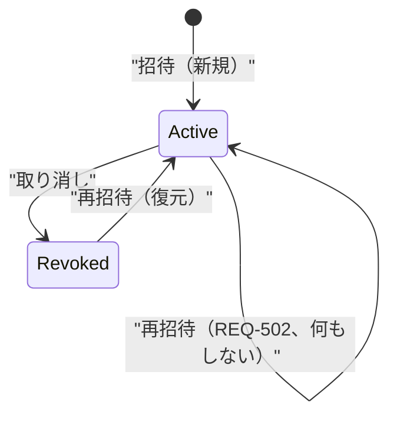

# viewer招待・閲覧 技術設計書

## 1. 概要

- **Requirement ID**: HOXBL-101
- **参照要件**: tasks/HOXBL-101/spec/requirements.md
- **参照技術メモ**: tasks/HOXBL-101/spec/technical-spec.md
- **目的**: Supabase Authアカウントを持たないviewerが、メールアドレス＋アクセストークンで、招待されたprojectのtaskを横断的に閲覧できる仕組みを実現する技術構成を定める
- **対象**: 新ドメイン`src/viewer/`の新設、`project_viewers`/`viewer_access_tokens`テーブル追加、招待・招待一覧・取り消しAPI、トークンベースのviewer横断閲覧API、招待メール送信
- **対象外**: viewerへの編集権限、セルフサービス型トークン再発行、③通知、④リアクション、viewerコメント、トークン自動延長（TI-REF-05、REQ-004により固定期限を採用）

## 2. 入力と前提

### 2.1 参照した情報

- `tasks/HOXBL-101/spec/requirements.md`（正本）
- `tasks/HOXBL-101/spec/technical-spec.md`（補助）
- `tasks/HOXBL-99/technical/design.md`（project/taskの既存設計、アクセス制御パターン）
- 既存実装: `app/server/src/project/**`, `app/server/src/task/**`（domain/application/infrastructure/presentation一式）
- `app/server/src/shared/database/schema.ts`（テーブル定義、email正規化パターン`users_email_lower_unique`、CHECK制約`valid_email`）
- `app/server/src/user/domain/valueobjects/EmailAddress.ts`（メール正規化: trim + lowercase）
- `app/server/src/user/presentation/middleware/auth/AuthMiddleware.ts`（既存Supabase JWT認証ミドルウェアの実装パターン）
- `app/server/scripts/setup-rls.ts`（RLSポリシー、`auth.uid()`が直接DB接続では実効しないという既存の設計判断）
- `app/server/src/shared/middleware/errorMiddleware.ts`（エラー→HTTPステータス変換パターン）
- `docs/todo.md`（②の技術補足: `project_viewers`追加、マジックリンク方式、③のOutboxパターン、SES想定の記載）
- `app/server/src/user/infrastructure/SupabaseEmailSignupGateway.ts`（外部サービス連携Gatewayのインターフェース分離パターン）
- 調査結果: メール送信の既存実装なし、SESのTerraform/IaC定義なし、トークン生成専用ユーティリティなし（`randomUUID()`のみ既存利用）

### 2.2 設計前提

- project作成者側の認可は、HOXBL-99と同じ「所有者IDを条件に含めたクエリ→ヒットしなければ404（`ProjectNotFoundError`再利用）」パターンを踏襲する。新しい403系エラーは設けない
- viewerはSupabase Authセッションを一切持たないため、既存の`authMiddleware`とは完全に別の認証経路（新設`viewerTokenMiddleware`）で処理する。両者を同じHTTPヘッダ（`Authorization: Bearer`）で扱うと、ミドルウェアの掛け違いにより異なる認証方式が混同されるリスクがあるため、viewerトークンは専用ヘッダ`Viewer-Access-Token`で受け渡す（`X-`接頭辞はRFC 6648で非推奨のため付与しない。10.2節）
- RLSは、HOXBL-99と同様「アプリの通常DB接続では`auth.uid()`が伝播せず実効しない」ことを踏まえ、多層防御としてのみ位置づける。特に`viewer_access_tokens`はSupabaseの認証済みロールに紐づく所有者概念自体が存在しないため、`anon`/`authenticated`ロールに対しては原則アクセスを許可しないデフォルト拒否のRLSとする
- メール送信基盤（SES）は③通知機能向けに想定されている（docs/todo.md）。招待メール送信はREQ-101/REQ-303が明示的に要求する必須機能のためHOXBL-101のスコープに含める（ユーザー確認済み）。ただしIaC上のSESリソース定義・検証済み送信ドメインは現時点で存在しないため、実装と並行して整備する前提条件として扱う（DQ-01）

### 2.3 要件との差分・要確認事項

- **DQ-01**: 招待メールの送信手段（SES）はHOXBL-101のスコープに含める（確定）。ただしSES送信ドメイン検証・IAM権限付与などのIaC構築は本設計のコードスコープ外であり、実装と並行して進める前提条件とする（3.1節・12章）
- **DQ-02**: TS-501（運用者向け操作ログの保持要否）は今回実装しない（確定）。招待・取り消しは常にproject作成者本人のみが行える設計のため「誰が」は自明であり、失われるのは「いつ・何回」という経緯情報のみである。将来的に不正利用調査や監査要件が具体化した場合に別途設計する（9章）

## 3. 設計方針

### 3.1 採用方針

- **viewerを独立ドメイン`src/viewer/`として新設し、project/task/user各ドメインを一方向に参照する（読み取り専用の依存）**
  - **根拠**: project作成者向け操作（招待/一覧/取り消し）はprojectの所有権検証（`IProjectRepository`）と自己招待判定（`IUserRepository`でcreatorのemail取得）に依存し、viewer横断閲覧はproject/taskの読み取りに依存する。HOXBL-99が確立した「一方向依存・ドメイン独立」の方針（TS-001）を踏襲
  - **確信度**: 高
- **招待（project×email）とアクセストークン（email単位）を別テーブル・別集約として分離する**（`project_viewers` / `viewer_access_tokens`）
  - **根拠**: TS-101。REQ-102/103/501/502の分岐は「招待の有無」と「トークンの有効性」という独立した2軸の組み合わせであり、1テーブルに混在させると状態遷移が複雑化する。分離することで各分岐がそれぞれの集約の単純なCRUDに帰着する（6章参照）
  - **確信度**: 高
- **招待の取り消しは論理ステータス（`active` / `revoked`）で表現し、削除しない**
  - **根拠**: TS-102, TDQ-04。REQ-503（取り消し前関係の復活）とREQ-105（一覧からの完全非表示）を両立する最小構成。一覧クエリは`status = 'active'`のみを対象にすることで完全非表示を実現し、復活時は既存行の`status`を戻すだけで済む
  - **確信度**: 高
- **アクセストークンは平文をDBに保存せず、SHA-256ハッシュのみ保存する。生 トークンは招待メールの一度きりの送信にのみ使用し、以後どのAPIレスポンスにも含めない**
  - **根拠**: NFR-101、TS-302。招待済みviewer一覧（project作成者向け）や監査用途であっても生トークンを返す必要はなく、漏洩時の被害範囲を最小化する定石（パスワードリセットトークン等と同型）
  - **確信度**: 中（要件からの直接指定ではないが、セキュリティのベストプラクティスとして妥当性が高い）
- **招待メール送信は、DB書き込みをコミットした後に同期送信し、失敗時は補償操作（該当行の削除／ステータスの巻き戻し）でロールバック相当を実現する。DBトランザクションを外部ネットワークI/O跨ぎで保持しない**
  - **根拠**: technical-spec.md RISK-03, TS-401, TDQ-03。REQ-303は「送信失敗時は招待を成立させない」ことを要求するが、単一プールコネクション（HOXBL-99設計前提）でトランザクションを外部送信の待ち時間だけ保持すると、SES遅延がコネクションプール枯渇に直結する。コミット後送信＋失敗時補償の方が、CLAUDE.mdの「リクエストパス上での無条件長時間リトライ禁止」方針とも整合する
  - **確信度**: 中。要件はロールバックの実装方式まで指定していないため設計判断だが、既存のDB接続方式を踏まえた妥当な選択
- **メール送信のリトライはallowlist方式（timeout/DNS/接続エラー/5xx/429のみ）で最大1回、短いタイムアウト（合計2〜3秒程度）に限定する**
  - **根拠**: CLAUDE.md記載のリトライ方針（allowlist限定、fail-fast、長時間リトライ禁止）
  - **確信度**: 高
- **viewer横断閲覧は、project作成者向けの「userIdスコープクエリ」パターンとは別の「トークンから解決したemailに紐づく`active`招待のprojectId一覧でスコープするクエリ」を新設する**
  - **根拠**: viewerはuserIdを持たないため、既存の`findByUserId`は使えない。`ProjectRepository.findByIds` / `TaskRepository.findByProjectIds`を新設し、渡すprojectId一覧はサーバー側でトークン検証済みの`active`招待からのみ導出する（他から任意のprojectIdを注入できない）
  - **確信度**: 高
- **メールアドレスの値オブジェクトは`viewer`ドメインに複製せず、`shared/domain/valueobjects/EmailAddress.ts`（Shared Kernel）に切り出し、`user`ドメインと`viewer`ドメインの両方から参照する**
  - **根拠**: `ProjectName`/`TaskTitle`（HOXBL-99）はたまたま制約が似ているだけの、ドメインごとに独立した業務概念だが、「メールアドレスとして妥当か」は業務ドメインを跨いでも定義が割れてはならない不変の技術的概念である。REQ-304が「既存のuser登録時のメールアドレス形式チェックと同一のものを用いる」と明示している点からも、実装を分岐させず単一の定義を共有すべきと判断した（ユーザー確認済み）
  - **確信度**: 高

### 3.2 不採用案と理由

- **招待とトークンを1テーブルに統合する**: 不採用。REQ-103（トークン維持したまま招待だけ追加）とREQ-106（招待だけ取り消してトークンは維持）という非対称な操作が頻発し、1行に混在させると更新ロジックが複雑化する
- **トークンをDBに平文保存する**: 不採用。読み取り専用閲覧機能とはいえ、漏洩時に全project横断の閲覧権を奪われる強い権限を持つ値であり、ハッシュ化のコストは無視できるほど小さい
- **DBトランザクションをメール送信完了までオープンにし、送信失敗時にDBロールバックする**: 不採用。3.1節の通り、外部I/O待ちでコネクションを保持するとプール枯渇・レイテンシ増幅のリスクがあり、CLAUDE.mdのリトライ方針とも相性が悪い
- **③のOutboxパターン（非同期ワーカー経由送信）をそのまま流用する**: 不採用。REQ-303は「送信失敗＝招待操作自体のエラー」を要求しており、非同期化すると呼び出し元に即座に成否を返せない。②は同期送信、③は非同期のOutboxという使い分けを維持する
- **viewerトークンも既存`Authorization: Bearer`ヘッダで受け渡す**: 不採用。Supabase JWTと形式が似ているため、ミドルウェアの適用順序ミスや将来の実装者の誤り（viewerトークンをJWTとして検証しようとする等）を誘発しやすい。専用ヘッダで明確に区別する
- **専用ヘッダ名を`X-Viewer-Access-Token`とする**: 不採用。RFC 6648 / BCP 178は新規に定義するヘッダーへの`X-`接頭辞付与をSHOULD NOTとしている。既存コードベースにも`X-`接頭辞のカスタムヘッダー前例がなく、踏襲する理由もないため`Viewer-Access-Token`を採用する
- **`ViewerEmail`をuser domainの`EmailAddress`から独立して複製する**: 不採用。3.1節の通り、メールアドレスの妥当性は業務ドメインを跨いで不変の概念であり、`ProjectName`/`TaskTitle`のケース（たまたま制約が一致しただけの独立した業務概念）とは性質が異なる。共有VO化により実装の乖離を構造的に防ぐ

## 4. システム構成と責務分割

### 4.1 コンポーネント構成（server: `src/viewer/`）

- **`ProjectViewerEntity`（domain）**: 招待1件（project_id × email）の状態（`active` / `revoked`）と`revoke()` / `restore()`のふるまいを保持
  - **関連要件**: REQ-105, REQ-106, REQ-503
  - **確信度**: 高
- **`ViewerAccessTokenEntity`（domain）**: email単位のトークン（ハッシュ値、有効期限）と`isExpired(now)`の判定ロジックを保持。生トークンはEntity生成時のみ一時的に保持し、永続化対象外とする
  - **関連要件**: REQ-004, REQ-102, REQ-103, REQ-501, REQ-502, NFR-101
  - **確信度**: 高
- **`EmailAddress`（`shared/domain/valueobjects`、既存`user`ドメインから移設）**: trim + lowercase正規化とメール形式チェック（`users`テーブルの`valid_email`制約と同一の正規表現）を行う値オブジェクト。`viewer`ドメインは新規VOを作らず、これをそのまま再利用する
  - **関連要件**: REQ-304
  - **根拠**: 3.1節。メールアドレスの妥当性判定はドメインを跨いで不変の概念であるため、Shared Kernelとして共有する
  - **移行要否**: 既存`user`ドメイン側（`CreateUserInput`, `UpdateUserInput`, `EmailSignupUseCase`等）のimport先を`@/shared/domain/valueobjects/EmailAddress`に更新するリファクタリングを伴う。実施タイミング（HOXBL-101の一部として行うか、事前の小さな準備作業とするか）はtask-plan側で決定する
  - **確信度**: 高
- **`IProjectViewerRepository` / `IViewerAccessTokenRepository`（domain）**: それぞれの集約の永続化契約。招待側は`findActiveByProject` / `findByProjectAndEmail`（revoked含む取得用） / `save` / `revoke` / `restore`、トークン側は`findByEmail` / `findByTokenHash` / `save`（新規） / `replace`（再発行）
  - **確信度**: 高
- **`IInvitationMailGateway`（application/port）**: `send(email, projectName, accessUrl): Promise<void>`。実装はinfrastructureで差し替え可能（`SupabaseEmailSignupGateway`と同型のポート/アダプタ分離）
  - **確信度**: 高
- **`InviteViewerUseCase` / `ListProjectViewersUseCase` / `RevokeViewerUseCase` / `GetViewerAccessibleProjectsUseCase`（application）**: 5章で詳述
  - **確信度**: 高
- **`PostgreSQLProjectViewerRepository` / `PostgreSQLViewerAccessTokenRepository`（infrastructure）**: Drizzle経由の永続化実装。既存`PostgreSQLProjectRepository`と同一パターン
  - **確信度**: 高
- **`SesInvitationMailGateway`（infrastructure）**: SES SDK経由の送信実装。allowlistリトライ（3.1節）を内包
  - **確信度**: 中（SES未構築のため実装インターフェースは確定するが、実運用確認はDQ-01に依存）
- **`TokenHasher`（infrastructure/shared）**: `node:crypto`の`randomBytes(32)`でトークン生成、`createHash('sha256')`でハッシュ化する小さなユーティリティ
  - **確信度**: 高
- **`ViewerDIContainer`（infrastructure）**: 既存`ProjectDIContainer`/`TaskDIContainer`と同型のシングルトンDI。環境に応じて`SesInvitationMailGateway`とテスト用フェイクを切り替える
  - **確信度**: 高
- **`viewerManagementRoutes.ts`（presentation）**: project作成者向け。既存`authMiddleware`配下、`/api/projects/{projectId}/viewers`
  - **確信度**: 高
- **`viewerAccessRoutes.ts`（presentation）**: viewer向け。新設`viewerTokenMiddleware`配下、`/api/viewer/*`
  - **確信度**: 高

### 4.2 既存project/task側の変更

- **`IProjectRepository`**: `findByIds(projectIds: string[]): Promise<ProjectEntity[]>`を追加（所有者検証なし。呼び出し側がすでに検証済みのprojectId一覧を渡す前提）
- **`ITaskRepository`**: `findByProjectIds(projectIds: string[]): Promise<TaskEntity[]>`を追加（同上、userIdスコープなし）
- **`IUserRepository`**: 既存の`findById`をそのまま利用し、自己招待判定用にproject作成者のemailを取得する（変更不要）

### 4.3 システム境界

- `viewer`ドメインは`project`・`task`・`user`ドメインを参照するが、逆方向の参照は発生しない（既存の一方向依存規約を維持）
- viewer向けAPI（`/api/viewer/*`）はSupabase JWT認証を一切経由しない、完全に独立した認証境界を持つ。ミドルウェア適用順序で誤って`authMiddleware`と混在させないよう、ルーター単位で分離する
- フロントエンドは`features/viewer-management`（project作成者向け、ログイン必須画面配下）と`features/viewer`（トークン付きリンクからの公開閲覧画面、ログイン不要）を分離する

## 5. 処理フロー

### 5.1 正常系フロー（招待）

1. project作成者が招待フォームでメールアドレスを送信 → `POST /api/projects/{projectId}/viewers`
2. `EmailAddress.create(email)`（共有VO）で形式検証（REQ-304）→ 不正なら400
3. `IUserRepository.findById(userId)`で作成者自身のemailを取得し、招待先emailと比較（REQ-302）→ 一致なら400
4. `IProjectRepository.findById(userId, projectId)`で所有権検証（REQ-001, REQ-305）→ 見つからなければ404
5. `IProjectViewerRepository.findByProjectAndEmail(projectId, email)`で既存招待（`active`/`revoked`/なし）を取得
6. `IViewerAccessTokenRepository.findByEmail(email)`で既存トークンを取得
7. DBトランザクション内で以下を実行しコミット:
   - 招待が存在しない → `active`で新規insert
   - 招待が`revoked` → `active`に復元、`revokedAt`をクリア（REQ-503）
   - 招待が`active` → 何もしない（REQ-502）
   - トークンが存在しない、または`isExpired(now)`が真 → 新しい生トークンを生成しハッシュを保存（新規 or 上書き。REQ-102, REQ-501）。**送信要否フラグ = true**
   - トークンが存在し有効期限内 → 何もしない（REQ-103, REQ-502）。**送信要否フラグ = false**
8. 送信要否フラグがtrueの場合のみ、コミット後に`IInvitationMailGateway.send()`を実行（生トークンを含むURLを組み立てる。生トークンはこの時点でのみメモリ上に存在する）
9. 送信成功 → 201でDTOを返す。送信失敗 → 補償操作（7.で新規insert/復元/新規トークン発行した分のみ取り消す）→ 502エラーを返す（REQ-303）

### 5.2 正常系フロー（viewer横断閲覧）

1. viewerがメール内のリンク（`{token}`をクエリではなくフロントのURLパスに含む）を開く → フロントは`Viewer-Access-Token`ヘッダで`GET /api/viewer/tasks`を呼ぶ
2. `viewerTokenMiddleware`がトークンをSHA-256ハッシュ化し`IViewerAccessTokenRepository.findByTokenHash(hash)`で検索
3. 見つからない、または`isExpired(now)`が真 → 401（REQ-301, REQ-306）。この時点で再発行手段は提供しない
4. 見つかった場合、Contextに`viewerEmail`をセットして次へ
5. `GetViewerAccessibleProjectsUseCase`が`IProjectViewerRepository.findActiveByEmail(viewerEmail)`で`active`招待のprojectId一覧を取得
6. projectId一覧が空でも200を返し、空状態として扱う（REQ-201, AC-11）。エラーにしない
7. `IProjectRepository.findByIds(projectIds)`と`ITaskRepository.findByProjectIds(projectIds)`を取得し、projectごとにグルーピングして返す（REQ-104）。各taskはtitle/description/status/priorityを含む（REQ-003）

### 5.3 異常系フロー

- メール形式不正（REQ-304）: `InvalidViewerDataError` → 400
- 自己招待（REQ-302）: `InvalidViewerDataError`（別メッセージ）→ 400
- 他ユーザーのprojectへの招待/一覧/取り消し（REQ-001, REQ-305）: `ProjectNotFoundError`再利用 → 404（HOXBL-99と同じfail-closed方針、403にしない）
- 招待メール送信失敗（REQ-303）: 補償操作後`InvitationMailDeliveryError` → 502
- 無効・失効・存在しないトークン（REQ-301, REQ-306）: `InvalidViewerAccessTokenError` → 401
- 取り消し対象の招待が存在しない、または既に`revoked`（REQ-106境界）: `ViewerNotFoundError` → 404

### 5.4 データフロー

- **入力**: 招待フォーム（email, projectId）、招待一覧確認操作、取り消し操作（viewerId）、viewerアクセス（token）
- **中間処理**: Zod（presentation境界） → VO/Entity（業務ルール） → UseCase（所有権・状態遷移・送信要否判定）
- **保存先**: `project_viewers`, `viewer_access_tokens`
- **連携先**: SES（招待メール送信、失敗時は補償操作でDB状態を巻き戻す）
- **返却内容**: `ProjectViewerDTO`（招待一覧）、`ViewerAccessibleProjectDTO[]`（viewer横断閲覧、生トークンは含まない）

## 6. 状態管理と整合性

- **招待（`project_viewers`）の状態**: `active` / `revoked`の2値。取り消しは物理削除しない（REQ-503の復元を可能にするため）
- **トークン（`viewer_access_tokens`）の状態**: email単位で常に高々1件。再発行は既存行を新しいハッシュ・新しい有効期限で置き換える（履歴は保持しない。REQ-004の「起算日は発行日または直近の再発行日」を満たす）
- **整合性方針**: 招待の状態遷移とトークンの発行判定は独立した2つの意思決定として扱い、UseCase内で順に評価する（5.1節手順7）。DB更新は単一トランザクションでコミットし、外部送信は完全にトランザクション外で行う
- **重複実行対策**: `project_viewers`に`(project_id, email)`の一意制約を設け、招待の二重作成を防ぐ。取り消しの二重実行は「既に`revoked`」を`ViewerNotFoundError`として扱う（冪等ではなくエラーにするが、業務上の実害はない）
- **再試行方針**: メール送信はallowlist方式で最大1回まで（3.1節）。DB書き込み自体の再試行は行わない（一意制約違反時はそのままエラーとし、二重送信によるリトライはクライアント（project作成者のブラウザ）の再操作に委ねる）
- **部分成功の扱い**: 「DB状態は更新されたがメール送信は失敗した」状態を許容しない。5.1節手順9の補償操作で必ずどちらかの完了状態（両方成功／両方失敗＝ロールバック済み）に収束させる。補償操作自体が失敗した場合（DB接続断など）は、招待は成立したがメールが届かない不整合が残り得る。これは低確率の障害シナリオとして12章のリスクに記載し、自動リトライではなくエラーログでの検知に委ねる

## 7. インターフェース設計

### 7.1 API一覧

- **`POST /api/projects/{projectId}/viewers`**: viewer招待。入力`{ email }`、出力`201 ProjectViewerDTO` / `400` / `404` / `502`。関連: REQ-101, REQ-102, REQ-103, REQ-302, REQ-303, REQ-304, REQ-501, REQ-502, REQ-503, AC-01〜AC-06, AC-13
- **`GET /api/projects/{projectId}/viewers`**: 招待済みviewer一覧（`active`のみ、email昇順）。出力`200 ProjectViewerDTO[]` / `404`。関連: REQ-105, AC-07, AC-14
- **`DELETE /api/projects/{projectId}/viewers/{viewerId}`**: 招待取り消し。出力`204` / `404`。関連: REQ-106, AC-08
- **`GET /api/viewer/tasks`**: viewer横断閲覧。ヘッダ`Viewer-Access-Token`必須。出力`200 { projects: ViewerAccessibleProjectDTO[] }` / `401`。関連: REQ-104, REQ-201, REQ-003, AC-09, AC-10, AC-11

`viewerId`は`project_viewers.id`（内部UUID）を用いる。emailをそのままURLパスに含めるとエンコード・大小文字比較の揺れが問題になるため、一覧APIが返す`id`を取り消し操作のキーとする（reuse方針: HOXBL-99の`{id}`ベースAPI設計と統一）。

### 7.2 エラー方針

- 新設エラークラス（`src/viewer/domain/errors/`）:
  - `InvalidViewerDataError`（400, `VALIDATION_ERROR`）: メール形式不正・自己招待
  - `ViewerNotFoundError`（404, `VIEWER_NOT_FOUND`）: 取り消し対象が存在しない/既に取り消し済み
  - `InvalidViewerAccessTokenError`（401, `UNAUTHORIZED_VIEWER_TOKEN`）: トークン不正・失効・期限切れ
  - `InvitationMailDeliveryError`（502, `MAIL_DELIVERY_FAILED`）: 送信失敗（allowlistリトライ後も失敗）
- project所有権エラーは新設せず、既存`ProjectNotFoundError`（404）を再利用する（reuse方針）
- `errorMiddleware`の`ERROR_MAPPINGS`に上記4種を追加登録する

## 8. データモデル

- **`project_viewers`テーブル（新設）**
  - **役割**: project × emailの招待関係
  - **主な属性**: `id`(uuid, PK), `projectId`(uuid, FK→projects.id, NOT NULL, onDelete cascade), `email`(varchar(320), NOT NULL), `status`(enum: active/revoked, NOT NULL, default active), `invitedAt`(timestamp, NOT NULL), `revokedAt`(timestamp, nullable), `createdAt`, `updatedAt`
  - **制約**: 一意制約`(projectId, email)`、CHECK `valid_viewer_email`（`users.valid_email`と同一正規表現）、index`(projectId, status)`（一覧クエリ用）、index`(email, status)`（viewer横断閲覧のprojectId解決用）
  - **関連要件**: REQ-101, REQ-105, REQ-106, REQ-502, REQ-503
  - **根拠**: `tasks`テーブルのCHECK制約パターンを踏襲
  - **確信度**: 高
- **`viewer_access_tokens`テーブル（新設）**
  - **役割**: email単位のアクセストークン（ハッシュ化済み）
  - **主な属性**: `id`(uuid, PK), `email`(varchar(320), NOT NULL, UNIQUE), `tokenHash`(char(64), NOT NULL, UNIQUE, sha256 hex), `expiresAt`(timestamp, NOT NULL), `createdAt`, `updatedAt`
  - **制約**: `email`一意（1email=1トークン）、`tokenHash`一意（衝突検知）、index `tokenHash`（認証時の検索用、UNIQUE制約が兼ねる）
  - **関連要件**: REQ-004, REQ-102, REQ-103, REQ-501, REQ-502, NFR-101
  - **根拠**: 生トークンは保存しない設計方針（3.1節）
  - **確信度**: 高

### 8.1 マイグレーション手順（`.claude/rules/schema-db.md`準拠）

1. `schema.ts`に`project_viewers`・`viewer_access_tokens`テーブル定義を追加
2. `scripts/generate-schemas.ts`の`tableConfigs`に両テーブルを追加
3. `docker compose exec server bun run db:generate` → マイグレーションファイルをコミット
4. `generate:schemas` → `generate:openapi` → `generate:types`の順で実行
5. `scripts/setup-rls.ts`に以下を追加:
   - `project_viewers`: RLS有効化し、`auth.uid()`が対象projectの所有者と一致する場合のみ許可するポリシー（`EXISTS (SELECT 1 FROM projects WHERE projects.id = project_viewers.project_id AND projects.user_id::text = auth.uid()::text)`）
   - `viewer_access_tokens`: RLS有効化し、`anon`/`authenticated`ロールに対する許可ポリシーは追加しない（アプリの直接DB接続経由のみがアクセスする前提。2.2節）
6. Preview/Production適用は既存の`db:migrate:*` → `db:setup`の順を踏襲

## 9. 認証・認可・監査・ログ

- **認証前提（project作成者側）**: 既存のSupabase JWT認証を前提とする（変更なし）
- **認証前提（viewer側）**: Supabase Authを経由しない。`viewerTokenMiddleware`が`Viewer-Access-Token`ヘッダのトークンをハッシュ化し`viewer_access_tokens`と照合する専用の認証経路
- **認可方針**: project作成者側は「所有者IDスコープクエリ」（既存パターン踏襲）。viewer側は「トークンから解決したemailの`active`招待のみを許可する」ホワイトリスト方式で、任意のprojectIdをクライアントから直接指定させない
- **監査対象**: NFR-201は「招待済みviewer一覧を確認できる状態の維持」という業務要件であり、本設計の招待一覧APIそのものが満たす。それを超える運用者向け操作ログ（誰がいつ招待/取り消し/再発行したか）はDQ-02として今回実装しない
- **ログ方針**: 既存の`errorMiddleware`内`console.error`を踏襲。追加で、メール送信の補償操作が失敗した場合（6章の残存リスク）はエラーレベルでログ出力し、後続の運用監視の検知対象とする

## 10. 非機能要件の実現方針

### 10.1 パフォーマンス

- viewer横断閲覧は`(email, status)`インデックス経由でprojectId一覧を取得後、`findByIds`/`findByProjectIds`で一括取得する。N+1を避けるため、projectごとのループで個別クエリを発行しない
  - **根拠**: 既存task検索のインデックス設計方針を踏襲
  - **確信度**: 高

### 10.2 セキュリティ

- NFR-101はトークンを`randomBytes(32)`（256bit）で生成し満たす。DB保存はSHA-256ハッシュのみ（3.1節）
- viewerトークンとSupabase JWTを別ヘッダ（`Viewer-Access-Token` / `Authorization`）で分離し、認証経路の混同を防ぐ（2.2節）
- NFR-102（fail-closed）は、トークンの存在確認・失効確認・期限確認をすべて「見つからない/失効/期限切れ→即401」で統一し、招待0件の状態（REQ-201）とは明確に別の判定ステップとして扱う（5.2節手順3と手順6の分離）
  - **根拠**: requirements.md NFR-101, NFR-102
  - **確信度**: 高

### 10.3 可用性・運用性

- 新規テーブル追加のみで既存データへの破壊的変更を伴わない
- メール送信の外部依存（SES）障害時も、DB状態は補償操作により整合を保つため、APIとしては明確なエラー（502）を返せる
  - **根拠**: 6章・8.1節
  - **確信度**: 中（SES未構築のため実運用での検証はDQ-01に依存）

## 11. 既存設計・既存実装との差分

### 11.1 既存設計との差分

- HOXBL-99設計は「project/taskへのアクセス制御は所有者IDスコープクエリのみで完結する」ことを前提としていたが、本設計ではviewerという「userIdを持たない読み取り専用アクセス者」が新たに加わるため、`findByIds`/`findByProjectIds`という所有者スコープなしのメソッドを両リポジトリに追加する。呼び出し元（`GetViewerAccessibleProjectsUseCase`）が唯一の正当な呼び出し経路であり、他のUseCaseから誤用されないことをコードレビュー・テストで担保する必要がある（12章RISK）

### 11.2 既存実装との差分

- `IProjectRepository`、`ITaskRepository`に新規メソッドを追加する（4.2節）
- `errorMiddleware`の`ERROR_MAPPINGS`に4種のエラーを追加する（7.2節）
- `scripts/setup-rls.ts`、`scripts/generate-schemas.ts`、`schema.ts`を変更する（8.1節）
- フロントエンドに`features/viewer-management`（ログイン必須）と`features/viewer`（ログイン不要、トークン付きURL）を新設する（4.3節）
- `user`ドメインの`EmailAddress`を`shared/domain/valueobjects/EmailAddress.ts`へ移設し、`user`ドメイン側のimport先を更新する（4.1節）

## 12. リスクと確認事項

- **RISK-01**: メール送信の補償操作自体が失敗した場合（DB接続断など）、招待は成立したがメール未達という不整合が残り得る（6章）。自動リトライは行わず、エラーログでの検知・手動対応に委ねる設計とした。発生頻度が問題になる場合は将来的にOutboxパターンへの移行を検討する
- **RISK-02**: `findByIds`/`findByProjectIds`（所有者スコープなし）は、誤って他のUseCaseから呼び出されると全ユーザーの情報が漏洩しうる強い権限を持つ。呼び出し元を`GetViewerAccessibleProjectsUseCase`のみに限定し、契約テストまたはlintルールでの逸脱検知を実装時に検討する
- **RISK-03**: `EmailAddress`を`shared/domain/valueobjects`へ移設する際、既存`user`ドメインの参照箇所（`CreateUserInput`, `UpdateUserInput`, `EmailSignupUseCase`等）をすべて更新しないとimportエラーになる。既存テストの型チェック（`bunx tsc --noEmit`）で漏れを検知できるが、実装時にgrepでの網羅確認を行うこと
- **DQ-01**: 招待メール送信（SES）はHOXBL-101のスコープに含める（確定）。ただしSES送信ドメイン検証・IAM権限のIaC構築は本設計のコードスコープ外であり、実装と並行して整備する必要がある
- **DQ-02**: 運用者向け操作ログ（TS-501）は今回実装しない（確定）

## 13. 実装への引き継ぎ事項

- AC-01〜AC-14をそのままテストケース化できる粒度で本設計を分解済み（5章の手順、7章のAPI、8章のデータモデル）
- 特にAC-10の境界値（発行から30日ちょうど/超過）は、`ViewerAccessTokenEntity.isExpired(now)`の単体テストで「`now < expiresAt`は有効、`now >= expiresAt`は無効」という境界を明示的に検証すること
- 5.1節手順7〜9（DB確定後の同期送信＋補償操作）はUseCase内の重要な分岐であり、テストでは「新規招待+新規トークン」「既存招待+新規トークン(REQ-501)」「既存招待+既存トークン(REQ-502/103)」「復元+新規トークン」の4パターンそれぞれで、メール送信失敗時に正しく巻き戻ることを検証すること
- viewer横断閲覧のレスポンスに生トークン・トークンハッシュを一切含めないことをレスポンスDTOの型レベル（生トークンを保持するフィールド自体を持たない型）で担保すること
- フロントエンドの`features/viewer`（トークン付きURL経由の画面）は、`features/viewer-management`（ログイン必須）から一方向にのみ参照される設計とし、逆方向の依存を作らないこと
