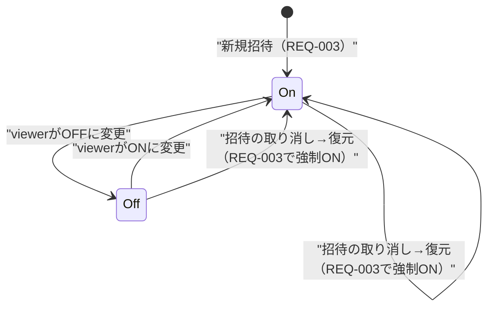

# project閲覧者通知機能 技術設計書

## 1. 概要

- **Requirement ID**: HOXBL-102
- **参照要件**: tasks/HOXBL-102/spec/requirements.md
- **参照技術メモ**: tasks/HOXBL-102/spec/technical-spec.md
- **目的**: task追加・ステータス変更・優先度変更の発生時に、既存の`viewer`ドメイン（HOXBL-101）を経路としてWeb Push通知をviewerへ配信し、viewerがproject単位で通知ON/OFFを切り替えられる仕組みを実現する
- **対象**: Web Push購読の登録、project単位の通知ON/OFF設定（保存・変更・初期化）、task変更3イベントの検知と配信、通知クリック時の遷移先
- **対象外**: メール通知・ダイジェスト配信・通知履歴/既読管理・部下への通知・送信失敗時の代替経路・購読解除専用API（2.3節DQ-03でユーザー確認済み。ブラウザ側の許可取り消しで自然に送信失敗→クリーンアップされるため）

## 2. 入力と前提

### 2.1 参照した情報

- `tasks/HOXBL-102/spec/requirements.md`（正本）
- `tasks/HOXBL-102/spec/technical-spec.md`（補助、TS-001〜TS-501）
- `tasks/HOXBL-101/technical/design.md`（viewerドメインの既存設計方針・命名パターン）
- 既存実装: `app/server/src/shared/database/schema.ts`（`project_viewers`, `viewer_access_tokens`の実カラム定義）
- 既存実装: `app/server/src/viewer/**`（domain/application/infrastructure/presentation一式、`ViewerDIContainer`, `viewerAccessRoutes.ts`, `viewerTokenMiddleware`, `SesInvitationMailGateway.ts`）
- 既存実装: `app/server/src/task/application/{CreateTaskUseCase,ChangeTaskStatusUseCase,UpdateTaskUseCase}.ts`, `TaskDIContainer.ts`
- 既存実装: `app/server/src/entrypoints/index.ts`（ルート・DIの合成ルート）
- 既存実装: `app/server/src/shared/config/env.ts`（環境変数検証パターン、`getViewerAccessBaseUrl()`）
- 既存実装: `app/client/src/app/viewer/[token]/page.tsx`（viewer閲覧画面のURL構造、task単体へのスクロール/ハイライトは未実装）
- 調査結果: Web Push/VAPID/Service Worker/`web-push`パッケージ/Outbox/queue/worker系サービスはリポジトリ内に存在しない（新規導入が必要）
- `.claude/rules/schema-db.md`, `.claude/rules/backend.md`（スキーマ駆動フロー、DIの遅延評価プロキシ方針）

### 2.2 設計前提

- 通知の発行責務は既存`viewer`ドメインの延長として実装し、新規トップレベルドメイン（例: `notification/`）は起こさない。project閲覧者向け機能はHOXBL-101から一貫して`viewer`ドメインの責務であり、購読管理・通知設定・配信もその一部として扱う方が既存構成と整合する
- `task`ドメインは`viewer`ドメインを一切importしない（HOXBL-101で確立した「viewerが一方向にproject/taskを参照する」依存方向を維持する）。通知発行のフックは`task`ドメイン側にポート（インタフェース）として定義し、実体の配線は合成ルート（`entrypoints/index.ts`）で行う
- Outboxパターン（イベントテーブル＋非同期ワーカー）は採用しない。`compose.yaml`にワーカー的サービスが存在せず、今回のために新規インフラ（キュー、常駐ワーカー）を導入するのは要件の規模（NFR-001で抑制不要と確定した程度の量、TI-REF-06は未計測）に対して過剰と判断する。task変更のHTTPリクエスト処理内で非同期（レスポンスをブロックしない）に配信する方式を採る（3章）
- Web Push通知のクリック時遷移（REQ-105）は、既存のviewer閲覧画面`/viewer/{token}`（project横断でtaskが一覧表示される画面）への遷移で満たす。特定taskへのスクロール/ハイライトは要件上必須ではない（AC-07は「該当taskを含む画面に遷移する」であり単一task詳細ページへの遷移ではない）ため、今回は`?taskId=`をオプションのヒントとして付与するに留め、ハイライト表示自体はスコープに含めない
- アクセストークンは生の値をDBに保存しない（HOXBL-101の設計方針）。Push通知のクリックURLに埋め込む生トークンは、サーバーには一切送信・保存させず、購読登録時にクライアント（Service Worker）が自ら保持する値を使う（4.4節で詳述）。これによりHOXBL-101のトークン非保存方針を崩さない

### 2.3 要件との差分・要確認事項

すべて技術設計フェーズのヒアリングで確認済み（未決の確認事項はない）。

- **DQ-01（確定）**: task変更イベントの配信はHTTPレスポンスをブロックしない非同期実行（fire-and-forget、内部でcatchしログのみ）とする。**ユーザー確認済み**: viewer数・デバイス数が多くてもtask更新APIのレスポンスタイムに影響させない方針を優先する
- **DQ-02（確定）**: 通知本文の日本語文言は本設計で確定する（7.3節）。**ユーザー確認済み**: 設計側提案（タイトル=project名、本文=「『{taskTitle}』が追加されました／のステータスが変更されました／の優先度が変更されました」）を採用する
- **DQ-03（確定）**: 購読解除専用APIは設けない（2.1節「対象外」）。**ユーザー確認済み**: ブラウザの通知許可取り消し後の送信失敗時に該当購読を自動削除するクリーンアップのみ実装する
- **DQ-04（確定）**: VAPID鍵ペアはTerraformで管理する（10.3節）。**ユーザー確認済み**: 既存SES `from_address`と同様のパターンをTerraform側に追加する

## 3. 設計方針

### 3.1 採用方針

- **通知発行を`viewer`ドメインの延長として実装し、`task`ドメインには依存させない。`task`側は`ITaskChangeNotifier`ポートのみを持ち、実装配線は合成ルートで行う**
  - **根拠**: technical-spec TS-001, TDQ-01。HOXBL-101で確立した「viewerが一方向にtask/projectを参照する」依存方向（design.md 4.3節）を崩さないため、逆方向の直接import（`task`→`viewer`）は避ける。ポート＆アダプタで依存方向を保つ
  - **確信度**: 高
- **task変更イベントの配信は、DBコミット後・同一HTTPリクエスト内で非同期（awaitしない）に実行し、成否に関わらずAPIレスポンスに影響させない**
  - **根拠**: REQ-302（送信失敗時も処理を終了するのみ）、NFR-001（間引き・レート制限をしない＝配信そのものは即時実行してよい）。Outboxのような別プロセスを新設するインフラコストに見合う要件（高頻度・厳密な配信保証）が明記されていないため、既存プロセス内での非同期実行を採用（3.2節で不採用理由も記載）。DQ-01としてユーザー確認済み
  - **確信度**: 高（ユーザー確認済み）
- **`project_viewers`テーブルに`notificationEnabled boolean not null default true`列を追加する（別テーブル化しない）**
  - **根拠**: technical-spec TS-102, TDQ-02。通知設定はproject×viewer（＝招待関係そのもの）に1:1で従属する属性であり、招待の状態（`status`）と同じ主キーを共有する。別テーブルにすると招待の作成・取り消し・復元のたびに2テーブルへの整合的な書き込みが必要になり複雑化する
  - **確信度**: 高
- **REQ-004（リリース時点の既存招待もON初期化）は、列追加時のDEFAULT true制約のみで満たす。追加のマイグレーションスクリプトは不要とする**
  - **根拠**: PostgreSQLの`ALTER TABLE ... ADD COLUMN ... DEFAULT true NOT NULL`は、リテラルデフォルト値であればテーブル書き換えなしに全既存行へ即時適用される。既存招待・新規招待を区別する後追い処理が不要になり、TI-REF-05/TDQ-05で懸念されていた「移行処理」を実装レベルで解消できる
  - **確信度**: 高
- **招待の復元（`revoked`→`active`、REQ-003）時は、直前の`notificationEnabled`の値に関わらず明示的に`true`へ再設定する**
  - **根拠**: REQ-003「新たに有効な招待状態になった時点でON」。取り消し前にOFFにしていた場合でも、復元＝新規招待と同格に扱うことが要件文言から読み取れる
  - **確信度**: 高
- **Web Push購読情報は`email`単位で複数件保持できる新テーブル`viewer_push_subscriptions`に保存する（1viewer=複数デバイス許容）**
  - **根拠**: TS-301。viewerはSupabase Authアカウントを持たないため、`viewer_access_tokens`と同じ「email」をキーに紐付ける。要件上デバイス数の制約はなく、複数ブラウザ/端末からの購読を妨げる理由がない
  - **確信度**: 中（複数デバイス許容は要件に明記なし。妥当な拡張と判断）
- **Push通知のペイロードに生アクセストークンを含めない。クリック時のURLはService Workerがクライアント側で保持しているトークンとpush payload中の`taskId`から組み立てる**
  - **根拠**: 2.2節。HOXBL-101の「生トークンは永続化・レスポンスに含めない」方針を、Push配信経路にも一貫して適用する
  - **確信度**: 中（Service Worker側の実装詳細を伴う設計判断。13章に引き継ぎ）
- **Web Push送信は`web-push`npmパッケージ + VAPID鍵ペアを新規導入し、送信失敗時はallowlistに基づき区別する: 購読無効化（410/404）は該当購読を削除、それ以外は削除も再送信もしない**
  - **根拠**: REQ-302（再送信しない）、CLAUDE.mdのリトライガイドライン（allowlist方式、blocklistでの判定禁止）。410/404は「もう存在しない購読」を示す確定的なシグナルであり、リトライではなく後始末（クリーンアップ）としての削除であるためREQ-302と矛盾しない
  - **確信度**: 高

### 3.2 不採用案と理由

- **`task_notification_events`テーブル＋非同期ワーカーによるOutboxパターン**（technical-spec TS-001, TS-401の案）: 不採用。`compose.yaml`にワーカー実行基盤が存在せず新設が必要になる。REQ-302が「送信失敗時に再送信しない」と明言しており、Outboxが本来解決する「配信保証」への要求が要件上存在しない。TS-402（将来のダイジェスト配信）はスコープ外であり、今回のためにOutboxを先行導入する理由にならない
- **通知ON/OFFを別テーブル`project_viewer_notification_settings`として分離**: 不採用。3.1節の通り、招待のライフサイクル（作成・取り消し・復元）と通知設定の初期化タイミングが密結合しており、分離すると2テーブル間の整合性維持コードが増える
- **task変更イベント配信をHTTPレスポンス前にawaitする同期方式**: 不採用（DQ-01, ユーザー確認済み）。viewer数・デバイス数が多い場合にtask更新APIのレスポンスタイムが線形に悪化するため、非同期実行を優先する
- **Push通知ペイロードに生トークンを含めてURLを直接埋め込む**: 不採用。HOXBL-101で確立した「生トークンをサーバーに保存しない」方針と衝突する。購読登録時にトークンをサーバーへ送って保存する経路を作ると、実質的にトークンの平文保存経路を新設することになる

## 4. システム構成と責務分割

### 4.1 コンポーネント構成（`viewer`ドメインへの追加）

- **`ProjectViewerEntity`（既存拡張）**: `notificationEnabled`プロパティと`enableNotification()`/`disableNotification()`を追加。`restore()`内で`notificationEnabled = true`に強制する（3.1節）
  - **関連要件**: REQ-002, REQ-003, REQ-106
  - **確信度**: 高
- **`PushSubscriptionEntity`（新規, domain）**: 1購読（email×endpoint）を表す。`id`, `email`, `endpoint`, `p256dhKey`, `authKey`を保持
  - **関連要件**: REQ-001, TS-301
  - **確信度**: 高
- **`IProjectViewerRepository`（既存拡張）**: `updateNotificationEnabled(id, enabled): Promise<ProjectViewerEntity | null>`を追加。既存の`findActiveByProject`/`findActiveByEmail`はそのまま再利用する
  - **確信度**: 高
- **`IPushSubscriptionRepository`（新規, domain）**: `findByEmail(email)`, `save(entity)`（endpoint重複時はupsert）, `deleteByEndpoint(email, endpoint)`
  - **確信度**: 高
- **`IPushNotificationGateway`（新規, application/port）**: `send(subscription, payload): Promise<PushSendResult>`。`SesInvitationMailGateway`と同型のport/adapter分離
  - **確信度**: 高
- **`RegisterPushSubscriptionUseCase`（新規, application）**: 購読の登録（endpoint重複時は鍵情報を上書き）
  - **関連要件**: REQ-001, TS-301
  - **確信度**: 高
- **`UpdateNotificationSettingUseCase`（新規, application）**: viewer本人が指定projectの`notificationEnabled`を切り替える。有効な招待（`active`）が存在しない場合は404相当のエラー
  - **関連要件**: REQ-002, REQ-106, NFR-101
  - **確信度**: 高
- **`DispatchTaskEventNotificationsUseCase`（新規, application）**: `TaskChangeEvent`を受け取り、対象projectの`active`かつ`notificationEnabled`なviewerを`IProjectViewerRepository`から取得 → 各viewerの購読を`IPushSubscriptionRepository`から取得 → `IPushNotificationGateway`で個別送信（5.1節）
  - **関連要件**: REQ-101〜REQ-106, REQ-301〜REQ-305, REQ-501
  - **確信度**: 高
- **`PostgreSQLPushSubscriptionRepository`（infrastructure）**: 既存`PostgreSQLProjectViewerRepository`と同一パターン
  - **確信度**: 高
- **`WebPushGateway`（infrastructure）**: `web-push`パッケージのラッパー。VAPID鍵は`shared/config`から取得
  - **確信度**: 中（`web-push`パッケージは新規導入のため実運用検証はDQ-04に依存）
- **`TaskChangeNotifierAdapter`（infrastructure）**: `task`ドメインが定義する`ITaskChangeNotifier`の実装。内部で`DispatchTaskEventNotificationsUseCase`を呼び出す
  - **確信度**: 高
- **`notificationRoutes.ts`（presentation）**: viewer向け。既存`viewerTokenMiddleware`配下、`/api/viewer/push-subscriptions`, `/api/viewer/projects/{projectId}/notification-setting`
  - **確信度**: 高

### 4.2 `task`ドメイン側の追加（依存方向を保つポート）

- **`ITaskChangeNotifier`（新規, `task/application/ports/`）**: `notify(event: TaskChangeEvent): Promise<void>`。`task`ドメインはこのインタフェースのみを知り、実装（`viewer`ドメイン）を一切importしない
- **`TaskChangeEvent`（新規, `task/application/ports/`）**: `{ type: 'task_added' | 'status_changed' | 'priority_changed'; taskId: string; taskTitle: string; projectId: string; newStatus?: TaskStatusValue; newPriority?: TaskPriorityValue }`。`newStatus`は`type === 'status_changed'`、`newPriority`は`type === 'priority_changed'`のときのみ設定する。UseCaseは更新後の値をすでに保持しているため、通知発行のための追加DB取得は発生しない（REQ-104改訂、2026-09-02）
- **`TaskChangeNotifierRegistry`（新規, `task/infrastructure/`）**: モジュールレベルの差し替え可能な保持箱。デフォルトはNoop実装（何もしない）。`setNotifier()`で合成ルートから実体を注入する。既存`viewerAccessRoutes.ts`の「遅延評価プロキシ」と同じ思想（未配線でもサーバー起動を止めない・taskドメイン単体のテストでも動く）
- **`CreateTaskUseCase` / `ChangeTaskStatusUseCase` / `UpdateTaskUseCase`（既存変更）**: 保存成功後に`TaskChangeNotifierRegistry.getNotifier().notify(event)`を呼び出す。呼び出しはUseCase内で`try/catch`し、失敗をログ出力のみに留めtaskユースケース自体の戻り値・例外には一切影響させない（REQ-302, fail-open）

### 4.3 システム境界

- `viewer`ドメインは引き続き`project`・`task`・`user`ドメインを一方向に参照する（既存方針を維持、逆方向なし）
- `task`ドメインは`viewer`ドメインを一切importしない。両者を繋ぐ配線は`entrypoints/index.ts`（合成ルート）でのみ行う: `TaskChangeNotifierRegistry.setNotifier(ViewerDIContainer.getTaskChangeNotifierAdapter())`
- 通知設定・購読登録APIは`viewerTokenMiddleware`配下に置き、既存の`/api/viewer/tasks`と同じ認証境界を共有する
- フロントエンドはService Worker登録・Push購読・通知許可要求のロジックを既存`features/viewer`（トークン付きURL配下、ログイン不要）に追加する。project作成者向け画面（`features/viewer-management`）には影響しない

## 5. 処理フロー

### 5.1 正常系フロー（task変更イベントの通知配信）

1. `CreateTaskUseCase`/`ChangeTaskStatusUseCase`/`UpdateTaskUseCase`がDB保存に成功する
2. UseCaseが`TaskChangeEvent`を組み立て、`TaskChangeNotifierRegistry.getNotifier().notify(event)`を**awaitせず**呼び出す（内部で`.catch()`しログのみ）。REQ-305対応: `UpdateTaskUseCase`は`projectId`のみの変更では`notify()`を呼ばない。`priority`が変更された場合のみ`priority_changed`イベントを、変更後の`projectId`を宛先として発行する
3. `TaskChangeNotifierAdapter.notify()`が`DispatchTaskEventNotificationsUseCase.execute()`を呼ぶ
4. `IProjectRepository.findByIds([projectId])`でproject名を取得
5. `IProjectViewerRepository.findActiveByProject(projectId)`で`active`な招待を取得し、`notificationEnabled === true`のものだけに絞る（REQ-303, REQ-304を満たす。取り消し済み・OFF設定のviewerはこの時点で除外される）
6. 各viewerの`email`について`IPushSubscriptionRepository.findByEmail(email)`で購読一覧を取得
7. 購読ごとに`IPushNotificationGateway.send(subscription, payload)`を`Promise.allSettled`で並列実行する。payloadは`{ projectName, taskTitle, eventType, newValueLabel? }`（`status_changed`/`priority_changed`の場合のみ、変更後の値を日本語ラベルに変換した`newValueLabel`を含める。変更前の値は含めない。REQ-104）。通知タイトル・本文への整形は7.3節の文言を用いる
8. 送信結果が410/404（購読無効）の場合のみ、該当`viewer_push_subscriptions`行を削除する。それ以外の失敗は何もせず終了する（REQ-302）

### 5.2 正常系フロー（購読登録・通知設定変更）

1. viewerが`/viewer/{token}`画面でブラウザの通知許可を得た後、Service Worker経由で`PushManager.subscribe()`を実行し、得られた`endpoint`/`keys`を`POST /api/viewer/push-subscriptions`（`Viewer-Access-Token`ヘッダ付き）で送信する
2. `viewerTokenMiddleware`がトークンを検証し`viewerEmail`をContextにセット（既存実装を再利用）
3. `RegisterPushSubscriptionUseCase`が`email`+`endpoint`で既存行を検索し、なければ新規保存、あれば鍵情報を上書き（ブラウザが新しい鍵で再購読した場合に対応）
4. viewerが閲覧画面上のトグルでON/OFFを切り替える → `PATCH /api/viewer/projects/{projectId}/notification-setting`
5. `UpdateNotificationSettingUseCase`が`IProjectViewerRepository.findActiveByProjectAndEmail`（既存メソッド流用または同等の新設）で対象行を取得し、`active`でなければ`ViewerNotFoundError`（404, 既存クラス再利用）、`active`なら`notificationEnabled`を更新する。他projectの行には触れない（REQ-106）

### 5.3 異常系フロー

- 通知許可未許可（購読が1件も存在しない）（REQ-301）: `DispatchTaskEventNotificationsUseCase`が該当viewerの購読0件を検出し、そのviewerへは何も送信しない。保留・再試行は行わない
- Push送信失敗（購読期限切れ等、REQ-302）: allowlist外のエラーは再送信・他手段への切替を行わずそのまま終了。410/404のみ購読削除（3.1節）
- 招待取り消し後のイベント（REQ-303）: 5.1節手順5の`findActiveByProject`が`revoked`を除外するため、自然に対象外になる
- 通知OFF設定（REQ-304）: 5.1節手順5の`notificationEnabled`フィルタで自然に対象外になる
- project間のtask付け替え（REQ-305）: 4.2節の通り`UpdateTaskUseCase`が`projectId`単独変更では`notify()`を呼ばない
- 通知設定変更対象のproject招待が存在しない/取り消し済み（NFR-101, fail-closed）: `ViewerNotFoundError` → 404
- Viewer-Access-Tokenが無効・失効（既存ミドルウェア）: `InvalidViewerAccessTokenError` → 401（既存実装を再利用、変更なし）

### 5.4 データフロー

- **入力**: task作成/ステータス変更/優先度変更API呼び出し（project作成者向け、既存）、Push購読登録・通知設定変更API呼び出し（viewer向け、新規）
- **中間処理**: `task`UseCase → `ITaskChangeNotifier`ポート経由でイベント通知 → `viewer`ドメインの`DispatchTaskEventNotificationsUseCase`が対象viewer・購読を解決 → `web-push`でVAPID署名付きペイロードを暗号化送信
- **保存先**: `project_viewers`（`notificationEnabled`列追加）、新設`viewer_push_subscriptions`
- **連携先**: ブラウザのPushサービス（Web Push Protocol, VAPID）。失敗時は再送信・他手段への切り替えなし（REQ-302）
- **返却内容**: task変更API自体のレスポンスは通知の成否に影響されない（4.2節）。Push本文はブラウザのService Workerが`notificationclick`でクリック時URLを組み立て遷移させる

## 6. 状態管理と整合性

- **状態**: `project_viewers.notificationEnabled`（true/false）。招待`status`（active/revoked）とは独立した軸だが、`status`が`revoked`の間は5.1節手順5の`findActiveByProject`で除外されるため実質的に無効化される
- **整合性方針**: 通知設定の読み書きは`project_viewers`の単一行に対する更新のみで完結する（トランザクション不要な単純CRUD）。招待の復元時（既存`RevokeViewerUseCase`/復元ロジック）の`notificationEnabled`強制ONは、招待状態の更新と同一トランザクション内で行う
- **重複実行対策**: Push購読登録は`(email, endpoint)`の一意制約でupsertとして扱い、二重登録を防ぐ。通知設定変更はべき等（同じ値を再設定してもエラーにしない）
- **再試行方針**: Push送信は3.1節の通りallowlist（410/404のみクリーンアップ、それ以外は再試行なし）。task変更UseCase内の`notify()`呼び出し自体はawaitしないため、UseCase側での再試行は発生しない
- **部分成功の扱い**: 複数viewer・複数デバイスへの送信は`Promise.allSettled`で個別に成否を扱う。1件の失敗が他の送信を妨げない（REQ-501の「個別配信」の実装上の帰結）

## 7. インターフェース設計

### 7.1 API一覧

- **`POST /api/viewer/push-subscriptions`**: Push購読登録。ヘッダ`Viewer-Access-Token`必須。入力`{ endpoint, keys: { p256dh, auth } }`、出力`200/201` / `401`。関連: REQ-001, TS-301
- **`PATCH /api/viewer/projects/{projectId}/notification-setting`**: 通知ON/OFF変更。ヘッダ`Viewer-Access-Token`必須。入力`{ enabled: boolean }`、出力`200 ProjectViewerNotificationSettingDTO` / `401` / `404`。関連: REQ-002, REQ-106, NFR-101, AC-06
- **`GET /api/viewer/tasks`（既存拡張）**: レスポンスの各project項目に`notificationEnabled: boolean`を追加する。閲覧画面が現在の設定値を表示するため。関連: REQ-002, AC-06
- **`ITaskChangeNotifier.notify(event)`（Internal Interface）**: `task`→`viewer`間のポート。HTTP境界を持たない内部呼び出し契約。関連: REQ-101〜REQ-103

### 7.2 エラー方針

- 新設エラーは最小限とし、既存`ViewerNotFoundError`（404）・`InvalidViewerAccessTokenError`（401）を再利用する（通知設定変更対象が見つからない/取り消し済みの場合に`ViewerNotFoundError`を再利用）
- Push購読登録の入力バリデーション不正（endpoint形式やkeys欠落）は既存`InvalidViewerDataError`（400）を再利用する
- `errorMiddleware`の`ERROR_MAPPINGS`への新規追加は不要（既存3クラスの再利用のみ）

### 7.3 通知メッセージ文言（DQ-02、REQ-104改訂によりユーザー確認済み・2026-09-02更新）

REQ-104が求める情報要素（project名・task名・イベント種別）を含み、ステータス変更・優先度変更の場合は変更後の値のラベルを含める。変更前の値は含めない。タイトルはproject名固定、本文はイベント種別ごとに以下の形式とする。

| イベント種別（`TaskChangeEvent.type`） | タイトル | 本文 |
| --- | --- | --- |
| `task_added` | `{projectName}` | `「{taskTitle}」が追加されました` |
| `status_changed` | `{projectName}` | `「{taskTitle}」のステータスが{newStatusLabel}に変更されました` |
| `priority_changed` | `{projectName}` | `「{taskTitle}」の優先度が{newPriorityLabel}に変更されました` |

- `{newStatusLabel}`: `not_started`→`未着手`, `in_progress`→`進行中`, `in_review`→`レビュー中`, `completed`→`完了`
- `{newPriorityLabel}`: `high`→`高`, `medium`→`中`, `low`→`低`
- これらのラベルは`app/client/src/features/todo/components/TaskItem.tsx`に既存の表示ラベルと同一である。クライアント側に重複したマッピングをすでに持っているため、`app/packages/shared-schemas/`に共有定数として切り出し、クライアント・サーバー双方から参照する（新造せず既存表示ラベルと1箇所で一致させる。reuse方針）
  - **根拠**: `.claude/rules/backend.md`の車輪の再発明防止、CLAUDE.mdの簡潔さ・重複排除の方針
  - **確信度**: 中（ラベル文言自体はクライアント側の既存表示に合わせる設計判断であり、要件が個別に指定したものではない）

## 8. データモデル

- **`project_viewers`（既存拡張）**
  - **追加属性**: `notificationEnabled`(boolean, NOT NULL, default true)
  - **制約**: 追加インデックス不要（既存`idx_project_viewers_project_status`で通知配信時の`active`絞り込みは足りており、`notificationEnabled`は取得後にアプリ側でフィルタする件数規模である前提。将来的にproject×viewer数が増大しWHERE句への追加が必要になった場合は複合インデックスを検討）
  - **関連要件**: REQ-002, REQ-003, REQ-004, REQ-106
  - **根拠**: 3.1節
  - **確信度**: 高
- **`viewer_push_subscriptions`（新設）**
  - **役割**: viewerのブラウザPush購読情報
  - **主な属性**: `id`(uuid, PK), `email`(varchar(320), NOT NULL), `endpoint`(text, NOT NULL), `p256dhKey`(text, NOT NULL), `authKey`(text, NOT NULL), `createdAt`, `updatedAt`
  - **制約**: 一意制約`(lower(email), endpoint)`、index`(lower(email))`（配信時の購読解決用）
  - **関連要件**: REQ-001, TS-301
  - **根拠**: `viewer_access_tokens`のemail正規化パターン（lower index）を踏襲
  - **確信度**: 高

### 8.1 マイグレーション手順（`.claude/rules/schema-db.md`準拠）

1. `schema.ts`の`projectViewers`定義に`notificationEnabled`列を追加、`viewerPushSubscriptions`テーブルを新設
2. `scripts/generate-schemas.ts`の`tableConfigs`に`viewer_push_subscriptions`を追加（`project_viewers`は既存設定のまま列が増える）
3. `docker compose exec server bun run db:generate` → マイグレーションファイルをコミット（`ADD COLUMN ... DEFAULT true NOT NULL`がリテラルデフォルトのため、既存行への即時反映を確認する。REQ-004はこの一手順で完結する）
4. `generate:schemas` → `generate:openapi` → `generate:types`の順で実行（`GET /api/viewer/tasks`のレスポンス型に`notificationEnabled`が反映されることを確認）
5. `scripts/setup-rls.ts`に`viewer_push_subscriptions`のRLSを追加: `viewer_access_tokens`と同様、`anon`/`authenticated`ロールへの許可ポリシーは追加しない（アプリの直接DB接続のみが操作する前提）
6. Preview/Production適用は既存の`db:migrate:*` → `db:setup`の順を踏襲

## 9. 認証・認可・監査・ログ

- **認証前提**: 購読登録・通知設定変更のいずれも既存`viewerTokenMiddleware`（`Viewer-Access-Token`ヘッダ）を経由する。新しい認証経路は設けない
- **認可方針**: 通知設定変更は「トークンから解決したemailの`active`招待のみ許可」という既存のホワイトリスト方式（HOXBL-101 9章）をそのまま踏襲する。他projectのnotificationEnabledには一切触れない（REQ-106, fail-closed）
- **監査対象**: 通知設定の変更履歴・購読の登録履歴は要件上求められていない（scope外、REQ/AC双方に記載なし）。将来必要になった場合は`updatedAt`のみが現状の唯一の手がかりとなる点をリスクとして12章に記載する
- **ログ方針**: Push送信の失敗（3.1節でクリーンアップ対象外のケース）は`console.error`でログ出力する（既存`errorMiddleware`のログ方針を踏襲）。運用上の障害検知（大量失敗の把握、TS-501）は今回実装しない

## 10. 非機能要件の実現方針

### 10.1 パフォーマンス

- NFR-001（間引き・レート制限をしない）は、5.1節の配信ロジックに一切のスロットリング・キューイングを入れないことで満たす
- task変更APIのレスポンス時間への影響は、配信処理をawaitしない非同期実行（3.1節）で最小化する
  - **根拠**: NFR-001、DQ-01（ユーザー確認済み）
  - **確信度**: 高

### 10.2 セキュリティ

- NFR-101（fail-closed）は、通知設定の参照（`GET /api/viewer/tasks`）・変更（`PATCH .../notification-setting`）を共に`Viewer-Access-Token`必須のミドルウェア配下に置き、対象projectへの`active`招待が存在しない場合は404で拒否することで満たす
- Push通知ペイロードには生アクセストークンを含めない（2.2節、3.1節）。VAPID秘密鍵はサーバー環境変数として保持し、クライアントには公開鍵のみ配布する
  - **根拠**: requirements.md NFR-101
  - **確信度**: 高

### 10.3 可用性・運用性

- `project_viewers`への列追加と新規テーブル追加のみで、既存データへの破壊的変更を伴わない
- `web-push`パッケージ・VAPID鍵ペアという新規インフラ要素を導入する。VAPID鍵は既存SES `from_address`と同様、Terraformでシークレット/環境変数として管理する（DQ-04、ユーザー確認済み）。具体的なTerraformモジュール構成（`terraform/modules/ses`相当の新設か既存モジュール拡張か）は実装フェーズで決定する
  - **根拠**: RISK-01、DQ-04
  - **確信度**: 高（管理方式はユーザー確認済み。モジュール構成の詳細は実装フェーズに委ねる）

## 11. 既存設計・既存実装との差分

### 11.1 既存設計との差分

- HOXBL-101設計は「viewerドメインはproject/task/userを一方向に参照し、逆方向の依存は発生しない」ことを前提としていたが、本設計ではさらに`task`ドメイン側にも新規ポート（`ITaskChangeNotifier`）を追加する。これは`task`→`viewer`の直接依存ではなく、`task`が自身のインタフェースを定義し実装を合成ルートで注入する形のため、既存の一方向依存規約とは矛盾しない。ただし`task`ドメイン単体で見ると初めて「ドメイン外へ通知する」という責務が加わる点は明示しておく
- HOXBL-101設計の8章（データモデル）に対し、`project_viewers`へ列を1つ追加する差分が生じる（HOXBL-101の既存カラム定義は変更しない）

### 11.2 既存実装との差分

- `app/server/src/task/application/{CreateTaskUseCase,ChangeTaskStatusUseCase,UpdateTaskUseCase}.ts`に`notify()`呼び出しを追加する（4.2節）
- `app/server/src/task/infrastructure/`に`TaskChangeNotifierRegistry.ts`を新設する
- `app/server/src/viewer/domain/ProjectViewerEntity.ts`に`notificationEnabled`関連のふるまいを追加する
- `app/server/src/viewer/infrastructure/ViewerDIContainer.ts`に購読リポジトリ・Web Push Gateway・`TaskChangeNotifierAdapter`の解決メソッドを追加する
- `app/server/src/entrypoints/index.ts`に合成配線（`TaskChangeNotifierRegistry.setNotifier(...)`）を1行追加する
- `app/server/scripts/setup-rls.ts`, `generate-schemas.ts`, `schema.ts`を変更する（8.1節）
- `app/client/src/features/viewer`（既存、ログイン不要のトークン付き画面）にService Worker登録・Push購読・通知設定トグルUIを追加する。`app/client/public/`にService Workerファイルを新設する
- `app/server/package.json`に`web-push`を新規依存追加する
- Terraformに VAPID鍵ペア（公開鍵・秘密鍵）のシークレット管理リソースを追加する（DQ-04、既存SES `from_address`のパターンを踏襲）

## 12. リスクと確認事項

- **RISK-01**: Web Push/VAPID/Service Workerが未実装であるため、新規インフラ要素（npm依存、VAPID鍵管理、Service Workerファイル配信）の導入が必要になる（technical-spec RISK-01）
- **RISK-02**: task変更3ユースケースに`notify()`呼び出しを追加することで、`task`ドメインに「配信に失敗しても例外を外へ漏らさない」という新しい責務（fail-open処理）が生まれる。UseCase内の`try/catch`漏れは、REQ-302の「送信失敗が既存のtask機能に影響しない」という前提を壊すため、実装時のテストで重点的に検証する必要がある
- **RISK-03**: Push送信を非同期（awaitしない）で実行する設計（DQ-01、ユーザー確認済み）は、テスト時に完了タイミングが不定になりやすい。ユニットテストでは`DispatchTaskEventNotificationsUseCase`を直接同期的に呼び出して検証し、UseCase層の`notify()`呼び出しは「呼ばれたこと」のみをモックで検証する方針とする
- **RISK-04**: VAPID鍵ペアのTerraform管理（DQ-04）は、既存SESの`terraform/modules/ses`パターンを踏襲するが、新規モジュールとして切り出すか既存モジュールに同居させるかは未設計であり、実装フェーズでの詳細化が必要

DQ-01〜DQ-04はすべて2.3節の通りユーザー確認済みであり、本書時点で未決の確認事項はない。

## 13. 実装への引き継ぎ事項

- AC-01〜AC-10をテストケース化する際、AC-03（通知OFF）・AC-04（招待取り消し）は5.1節手順5のフィルタ条件（`active` AND `notificationEnabled`）の単体テストとして検証できる
- AC-06（招待直後ON初期化、他projectへの非影響）は、`ProjectViewerEntity`の生成時デフォルト値と`updateNotificationEnabled`が対象行のみを更新することの2点をそれぞれ検証すること
- AC-08（個別配信）は`DispatchTaskEventNotificationsUseCase`が`Promise.allSettled`で複数購読へ個別に送信することをモックで検証すること
- AC-09（project付け替えは追加通知としない）は`UpdateTaskUseCase`のテストで、`projectId`のみ変更時に`notify()`が呼ばれない（または`task_added`イベントとしては呼ばれない）ことを明示的に検証すること
- AC-10（既存招待分もON初期化）はマイグレーションのDB統合テストとして、列追加前に作成した`project_viewers`行がマイグレーション後`notificationEnabled = true`になることを確認すること
- Service Workerの`notificationclick`ハンドラがpush payload中の`taskId`とローカル保持トークンからURLを組み立てるロジックは、フロントエンド側のテスト観点として引き継ぐこと（2.2節、task-plan側で詳細化する）
- VAPID鍵ペアのTerraformモジュール構成（RISK-04）は、task-plan側でIaCタスクとして明示的に切り出すこと
- `TaskChangeNotifierRegistry`が未配線（Noop）の状態でも`task`ドメイン単体のテスト・型チェックが独立して通ることを確認すること（RISK-02の裏付け）
