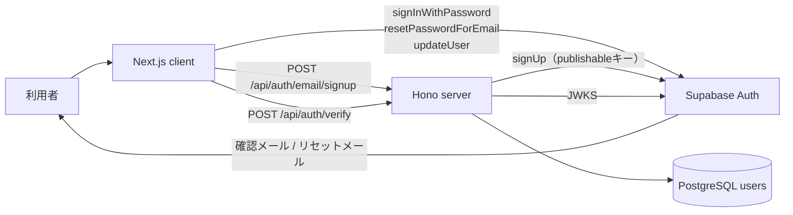
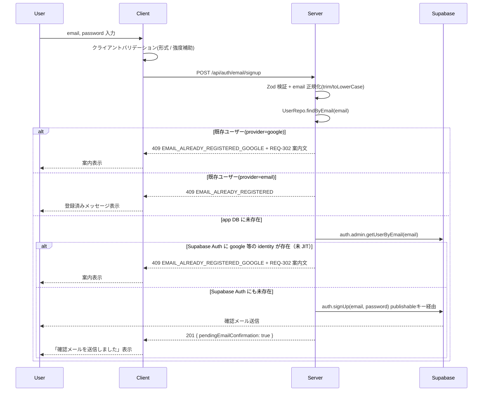
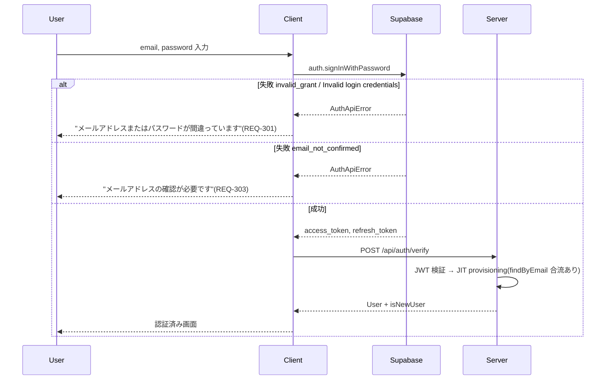
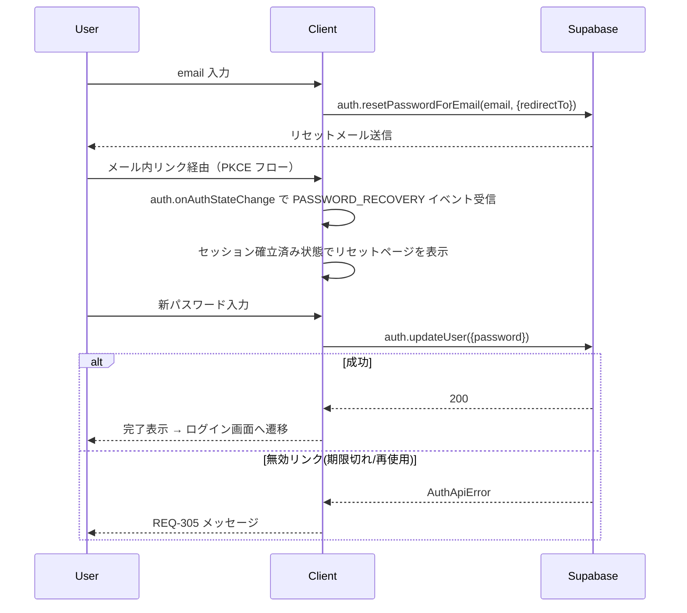

# メールパスワード認証追加 技術設計書

## 1. 概要

- **Requirement ID**: HOXBL-94
- **対象機能**: メールパスワード認証の追加（Google OAuth と並存）
- **参照要件書**: `tasks/HOXBL-94/spec/requirements.md`
- **参照技術メモ**: `tasks/HOXBL-94/spec/technical-spec.md`
- **設計範囲**: クライアント認証フロー、サーバー認証ユースケース、共有スキーマ、DB スキーマ。テストユーザー作成は Supabase Dashboard 手動作成のため実装範囲外（運用ガイドのみ）。

### 1.1 設計方針サマリー

- 既存の Supabase Auth / `IAuthProvider` / `AuthenticateUserUseCase` / `AuthMiddleware` を**そのまま利用**する。サーバー JWT 検証経路は OAuth とメールパスワードで共通。
- JIT プロビジョニング経路は現状の `POST /api/auth/verify` に統一する（`POST /auth/callback` は TASK-904 完了まで未実装のため使用しない）。
- 認証手段が増えても**ユーザー集約は 1 メール = 1 ユーザー**を維持するため、サインアップ前のサーバー先行チェック・JIT 時の `findByEmail` 合流・DB UNIQUE 制約の三重防御を組み合わせる。
- パスワードリセット・サインインはクライアントから Supabase Auth SDK を直接呼ぶ。サインアップのみ REQ-302 案内を確実に返すためサーバー API を経由する。
- テストユーザー作成は Supabase Dashboard 手動作成（ユーザー確認結果）。実装は不要。

### 1.2 ユーザー確認結果

| 確認事項 | 採用 |
|---|---|
| サインアップ時の同一メール衝突チェック | サーバー経由先行チェック（app DB + Supabase Admin 二段階） |
| テストユーザー作成経路 | Supabase Dashboard 手動作成 |
| email カラムの DB UNIQUE 制約 | 追加（lower(email) 正規化 UNIQUE） |
| Supabase identity linking 設定 | ON（二段階衝突チェックで未 JIT リンクリスクを解消） |

## 2. 全体構成

### 2.1 システム境界（更新後）



- **クライアント**: ログイン画面に Google ボタンとメールパスワードフォームを併設。サインアップ／パスワード再設定の各画面を追加。
- **サーバー**: サインアップ専用 API を追加。JIT プロビジョニングは既存の `POST /api/auth/verify` を流用。
- **Supabase Auth**: ユーザー認証、パスワード保管、確認メール送信、リセットメール送信、JWT 発行。

### 2.2 責務分割

| レイヤ | 責務 | 既存 / 新規 |
|---|---|---|
| `app/client/src/features/auth/components/LoginForm` | Google ボタン + メールパスワードフォームの統合 UI | 既存拡張 |
| `app/client/src/features/auth/components/SignUpForm` | サインアップフォーム | 新規 |
| `app/client/src/features/auth/components/ForgotPasswordForm` | リセット要求フォーム | 新規 |
| `app/client/src/features/auth/components/ResetPasswordForm` | 新パスワード設定フォーム | 新規 |
| `app/client/src/features/auth/services/providers/emailPasswordAuthProvider.ts` | Supabase Auth の signInWithPassword/resetPasswordForEmail/updateUser ラッパー | 新規 |
| `app/client/src/features/auth/services/authService.ts` | OAuth と Email の経路を委譲 | 既存拡張 |
| `app/client/src/features/auth/services/authErrorHandler.ts` | Supabase `AuthApiError.code` / `message` → 表示メッセージのマッピング | 既存拡張 |
| `app/server/src/user/presentation/emailSignupRoutes.ts` | `POST /api/auth/email/signup` ルート | 新規 |
| `app/server/src/user/application/EmailSignupUseCase.ts` | 衝突チェック（app DB + Supabase Admin 二段階）→ Supabase signUp 発火 | 新規 |
| `app/server/src/user/domain/AuthProvider.ts` | `email` 値を追加 | 既存拡張 |
| `app/server/src/user/domain/IUserRepository.ts` | `findByEmail` は既存（確認済み）。変更なし | 既存 |
| `app/server/src/user/application/AuthenticateUserUseCase.ts` | JIT に `findByEmail` 合流ロジックを追加 | 既存拡張 |
| `app/server/src/user/infrastructure/SupabaseEmailSignupGateway.ts` | publishable key を使う Supabase signUp ラッパー | 新規 |
| `app/server/src/user/presentation/authRoutes.ts` | 変更なし（`POST /api/auth/verify` を流用） | 既存 |
| `app/server/src/user/presentation/middleware/auth/AuthMiddleware.ts` | `AuthProvider` 型キャスト修正 + identity linking 合流ユーザー向け `findByEmail` フォールバック追加（`findByExternalId` 失敗時に `payload.email` で再検索） | 既存拡張 |
| `app/server/src/shared/database/schema.ts` | `auth_provider_type` に `email` 追加、`lower(email)` UNIQUE インデックス | 既存拡張 |
| `app/server/src/schemas/users.ts`（自動生成） | schema 変更後に再生成 | 自動生成 |
| `app/packages/shared-schemas/src/auth.ts` | `authProviderSchema` に `email` 追加、signup API スキーマ追加 | 既存拡張 |

### 2.3 既存設計・既存実装との差分

| 既存 | 差分 | 影響 |
|---|---|---|
| `authProviderSchema` enum（google/apple/microsoft/github/facebook/line） | `email` を追加 | 自動生成の Zod / OpenAPI / 型に伝播。ドメイン定数 `AuthProvider.ts` の変更も必須 |
| `AuthProvider.ts`（ドメイン定数） | `email` を追加 | 漏れると `provider='email'` の JWT 検証時に `InvalidProviderError` になる |
| `users` テーブル | `lower(email)` UNIQUE インデックス、`provider` enum に `email` を追加 | 既存データに重複メールがある場合は移行できないため事前点検が必要（§9） |
| `POST /api/auth/verify`（JIT プロビジョニング） | `findByEmail` 合流ロジックを `AuthenticateUserUseCase` に追加 | 同一メール・異なる provider の二重登録防止（§7.2） |
| `AuthMiddleware` / `SupabaseJwtVerifier` | 変更なし | Supabase は OAuth/Email を問わず同形式 JWT を発行するため検証経路を共有 |
| `POST /auth/callback`（TASK-904 モック） | **使用しない**。TASK-904 完了後に別途判断 | メールパスワード後の JIT は `/api/auth/verify` に統一 |

## 3. 認証フロー設計

### 3.1 サインアップ（REQ-101, REQ-102, REQ-201, REQ-302）



**採用 Supabase API**: `supabase.auth.signUp({ email, password })` をサーバーから publishable キー（`SUPABASE_PUBLISHABLE_KEY`）の `@supabase/supabase-js` クライアント経由で実行する。signUp は Supabase の公開サインアップフローであり admin 操作ではないため、`service_role` / secret key は使用しない。`email_confirm: false` の `admin.createUser` は確認メールを自動送信しないため採用しない。

**根拠**: Supabase ドキュメント上、`auth.signUp` は `email_confirm` 設定に応じて確認メールを送信する。publishable キー経由の公開 `signUp` は Supabase 標準の確認メールフローそのものであるため、実機確認前提だった DCQ-01 は解消済み（§10 参照）。

email 正規化はサーバーで `trim()` + `toLowerCase()` を適用。

**衝突チェックのスコープ**: app DB の `findByEmail` を第一チェック、Supabase Admin `getUserByEmail` を第二チェックとする二段階構成。identity linking が ON の環境では、app DB に未プロビジョニングの Google ユーザーが Supabase Auth 側にのみ存在するケースで意図しない identity リンクが発生しうる。第二チェックでこのケースを検出し、REQ-302 案内を返すことでリスクを解消する。`getUserByEmail` のレスポンスに email 以外の identity（google 等）が含まれる場合を「未 JIT Google ユーザー」と判定する。

### 3.2 サインイン（REQ-103, REQ-201, REQ-301, REQ-303）



- クライアントはエラーを `AuthApiError.code` と `AuthApiError.message` 両方でマッチし固定文言に変換する。
- サインイン後の JIT プロビジョニングは既存 `POST /api/auth/verify` → `AuthenticateUserUseCase` を流用。`provider='email'` の新規 user 作成を通る。
- `findByEmail` 合流により、同一メールで既存 Google ユーザーがいた場合は create 失敗ではなく既存ユーザーを返す（§7.2）。

### 3.3 パスワードリセット（REQ-104, REQ-105, REQ-305）



**トークン処理**: Supabase のメールリンクは PKCE フローを使用する。`/auth/reset-password` ページで `supabase.auth.onAuthStateChange` を購読し、`PASSWORD_RECOVERY` イベントを受信してからパスワード更新フォームを表示する。URL フラグメントの直接パース（`access_token` 手動取得）は行わない。

- リセット完了後は Supabase が既存セッションを失効させるため、旧パスワードでのサインインは不可（REQ-105 達成）。
- `redirectTo` は Supabase Auth ダッシュボードの許可リストに登録する（§9 §6 ステップ）。

### 3.4 メール確認（REQ-102）

**トークン処理**: 確認メールリンクも PKCE フロー。`/auth/confirm` ページで `supabase.auth.exchangeCodeForSession(code)` を呼び出し確認を完了させる。URL クエリパラメータ `?code=xxx` を受け取り、成功したら「確認完了」表示 → ログイン画面へ誘導する。

### 3.5 テストユーザー作成（REQ-106）

- **採用**: Supabase Dashboard の Users → Add user で email + password を入力し、`Auto Confirm User` を有効化して作成。
- 実装は不要。`docs/operations/test-user-creation.md`（運用ガイド）を新規作成し、手順を記録する。
- 確信度: 高（ユーザー確認結果）。

## 4. データモデル設計

### 4.1 `auth_provider_type` enum

- 既存値: `google, apple, microsoft, github, facebook, line`
- 追加: `email`
- マイグレーション: `ALTER TYPE auth_provider_type ADD VALUE 'email'`

### 4.2 `users` テーブル

| 列 | 型 | 変更 |
|---|---|---|
| `email` | varchar(320) | **`lower(email)` 正規化 UNIQUE インデックス追加** |
| `provider` | auth_provider_type | enum 値追加（'email'） |

**マイグレーション手順**:

1. 既存データの重複 email（大文字小文字含む）を検出するスクリプトを実行（通常 0 件想定）
2. 既存の `idx_users_email` インデックスを削除
3. `CREATE UNIQUE INDEX CONCURRENTLY users_email_lower_unique ON users (lower(email))` を実行
4. Drizzle schema を更新して `UNIQUE INDEX` 定義を反映

**採用理由**: 単純な `UNIQUE` 制約（`varchar` のバイト比較）では `User@example.com` と `user@example.com` が別値として登録できる。REQ-002（1メール=1ユーザー）を DB レベルで確実に保証するため `lower(email)` で正規化する。

- `externalId` は Supabase Auth が発行する user UUID をそのまま使用（OAuth と同様）。
- パスワードハッシュ列は**追加しない**。Supabase Auth の `auth.users` が保持（NFR-102）。

### 4.3 メール正規化規約

- アプリ DB への保存時・比較時とも `trim()` + `toLowerCase()` を適用。
- Supabase Auth 側でも email は lowercase 正規化されているため、`findByEmail` での一致が保証される。
- 根拠: technical-spec.md TS-302。確信度: 中（Supabase の挙動依存）。

## 5. API 設計

### 5.1 新規エンドポイント

#### `POST /api/auth/email/signup`

**用途**: メールパスワードサインアップの先行衝突チェックと Supabase signup の発火。

**Request Body** (shared-schemas で定義):

```ts
{
  email: string,    // RFC 準拠 emailSchema
  password: string  // 8文字以上 / 大小英字 / 記号
}
```

**Response**:

| Status | Body | 条件 |
|---|---|---|
| 201 | `{ pendingEmailConfirmation: true }` | 衝突なし、Supabase 側で確認メール送信開始 |
| 400 | `{ code: "VALIDATION_ERROR", details }` | 形式不正（REQ-304） |
| 409 | `{ code: "EMAIL_ALREADY_REGISTERED_GOOGLE", message }` | 既存 Google ユーザーと衝突（REQ-302）。要件が案内明示を求めているため意図的に情報を返す |
| 409 | `{ code: "EMAIL_ALREADY_REGISTERED" }` | 既存 email ユーザーと衝突（REQ-002 担保） |
| 500 | `{ code: "SIGNUP_FAILED" }` | Supabase 側エラー |

**パスワード強度バリデーション**: Zod で事前チェックは行うが、最終権威は Supabase Auth ダッシュボードのポリシー設定とする。設定値（大小英字・記号含む 8 文字以上）をドキュメントに明記し、Zod 側と一致させて乖離を防ぐ（TS-301）。

### 5.2 既存 API の流用

- `POST /api/auth/verify`: メールパスワードサインイン後の JWT もここに送る。`provider='email'` で JIT 動作する。`authProviderSchema` の enum 拡張で対応。

### 5.3 用いない API

- パスワードリセット要求 / パスワード更新 / メール確認: クライアントから Supabase Auth SDK を直接呼ぶ。サーバーは関与しない。
- `POST /auth/callback`: TASK-904 完了まではモックのため、メールパスワード認証では使用しない。

## 6. クライアント設計

### 6.1 画面構成

| ルート | 画面 | 内容 |
|---|---|---|
| `/login`（既存） | LoginPage | Google ボタン + メールパスワードフォーム + リンク（サインアップ／パスワードを忘れた） |
| `/signup`（新規） | SignUpPage | メール・パスワード入力 + 送信 |
| `/auth/forgot-password`（新規） | ForgotPasswordPage | メール入力 + 送信 |
| `/auth/reset-password`（新規） | ResetPasswordPage | `PASSWORD_RECOVERY` イベント受信後に新パスワード入力フォームを表示 |
| `/auth/confirm`（新規） | EmailConfirmPage | URL の `code` を受け取り `exchangeCodeForSession` 後に完了表示 |

UI 詳細文言は要件範囲外（TI-REF-05）。

### 6.2 状態管理

- 既存 `authSlice` を流用。`isLoading / isAuthenticated / user / authError` の更新で十分。
- サインアップ要求中の状態は `useEmailSignup` フック（新規）でローカル管理し、Redux の認証状態と混在させない。

### 6.3 エラーメッセージマッピング

`authErrorHandler` を拡張し、Supabase `AuthApiError.code` と `AuthApiError.message` の両方で判定する正規化ヘルパーを追加する。REQ-301/303/305 に対応するマッピングはテストで固定する。

| 判定条件 | 表示メッセージ | 根拠 |
|---|---|---|
| `code: "invalid_grant"` または `message` に "Invalid login credentials" 含む | 「メールアドレスまたはパスワードが間違っています」 | REQ-301, NFR-101 |
| `code: "email_not_confirmed"` | 「メールアドレスの確認が必要です。受信したメール内のリンクから確認を完了してください」 | REQ-303 |
| `code: "over_email_send_rate_limit"` または rate limit 系 | 「リクエストが多すぎます。しばらくしてから再度お試しください」 | Supabase デフォルト挙動 |
| リセットリンク無効（`code: "otp_expired"` 等） | 「リンクが無効か期限切れです。再度パスワードリセットを要求してください」 | REQ-305 |

### 6.4 既存 OAuth フローへの影響（RISK-01）

- `authService.signInWithOAuth` / `useOAuthCallback` / `sessionRestoreService` の API シグネチャは変更しない。
- 新規 `emailPasswordAuthProvider` は `authService` の別メソッド経由で公開する（OAuth 経路と並存）。
- 既存の `sessionListener` / `authSlice` は Supabase セッションオブジェクトの形式のみを参照しており、サインイン経路に依存しないため変更不要。

## 7. ドメインモデル整合

### 7.1 ユーザー集約

- `app/server/src/user/domain/AuthProvider.ts` のドメイン定数に `'email'` を追加する。この変更を漏らすと `provider='email'` の JWT から provider を抽出した際に `InvalidProviderError` となる。
- `UserEntity` の `provider` プロパティに `'email'` 値が増える。アグリゲートの不変条件には影響しない。
- `externalId` には Supabase Auth user UUID を入れる前提を維持。

### 7.2 ユーザー解決（同一性）と JIT 合流ロジック

既存の `AuthenticateUserUseCase` は `findByExternalId(externalId, provider)` のみで検索するため、`provider='email'` の JWT が来た際に「同一メールで既に Google ユーザーが存在する」ケースを検出できない。**JIT 時に `findByEmail` 合流を追加する。**

**採用する JIT ロジック（AuthenticateUserUseCase を拡張）**:

```
1. findByExternalId(externalId, provider)
2. 見つかった → 既存ユーザーを返す（通常経路）
3. 見つからない → findByEmail(normalizedEmail)
   3a. 同一メールで既存ユーザーあり → 既存ユーザーを返す（合流）
       - isNewUser = false で返す
   3b. 存在しない → create(email, provider, externalId, ...)
       - isNewUser = true で返す
```

この合流ロジックにより、将来的に Google ユーザーがメールパスワードでも認証した場合に同一ユーザーとして扱われる（REQ-002）。

**例外シナリオ**: Supabase Auth 側にのみ存在し、アプリ DB に未プロビジョニングのユーザー（サインアップ後の `signUp` API エラー等）が JWT を持ってサインインした場合は JIT 作成を試みる。この際に `lower(email)` UNIQUE 制約違反が発生した場合（手動 DB 操作や過去の不整合）は 500 を返し、運用調査対象とする。

## 8. 非機能要件の実現

| NFR | 実現方針 |
|---|---|
| NFR-101 列挙攻撃対策 | サインイン経路の文言を `authErrorHandler` で固定化。サインアップ経路は REQ-302 により案内明示が要件のため例外 |
| NFR-102 パスワード平文不保持 | アプリ DB にパスワード列を持たず Supabase Auth に委譲 |
| NFR-103 セッション保護統一 | Supabase の共通 JWT を流用するため、既存セッションタイムアウト / 失効方針が自動的に適用 |
| 監査・ログ（TS-501） | サインアップ API は既存メトリクスミドルウェアの対象。詳細監査は今回スコープ外 |
| パフォーマンス | `findByEmail` は `lower(email)` UNIQUE インデックス経由で高速 |
| 可用性 | サインアップ API は Supabase 障害時に 5xx を返却。クライアント側で「時間をおいて再試行」表示 |

## 9. 移行・リリース計画

1. **Migration A**: `auth_provider_type` に `'email'` を追加
2. **Migration B**: 既存 `users.email` の重複検出スクリプト実行（大文字小文字を統一した上で重複を検出）
3. **Migration C**: 既存 `idx_users_email` を削除 → `CREATE UNIQUE INDEX CONCURRENTLY users_email_lower_unique ON users (lower(email))` 実行
4. `AuthProvider.ts`（ドメイン定数）に `email` を追加
5. shared-schemas 拡張 → サーバー OpenAPI / クライアント型を再生成（`app/server/src/schemas/users.ts` は自動生成）
6. Supabase Auth ダッシュボードでパスワードポリシー設定（大小英字 + 記号 + 8 文字以上）を確認・設定
7. Supabase Auth Email Provider 有効化、リダイレクト URL の許可リストに `/auth/reset-password`、`/auth/confirm` を追加（Local / Preview / Production 各環境）
8. サーバー実装（EmailSignupUseCase / SupabaseEmailSignupGateway / AuthenticateUserUseCase 拡張）
9. クライアント実装（EmailPasswordAuthProvider / 各画面 / authErrorHandler 拡張）
10. E2E（サインアップ → 確認 → サインイン / リセットフロー）
11. リリース後、Supabase Dashboard で運用担当向けにテストユーザー作成手順を周知

## 10. 設計確認事項（実装前に必ず解消）

| ID | 内容 | 影響 | 格付け |
|---|---|---|---|
| DCQ-01 | **[解消]** publishable キー経由の公開 `auth.signUp` を採用したため、Supabase 標準の確認メールフローがそのまま発火する。service_role 前提だった実機検証は不要 | - | **解消** |
| DCQ-02 | **[解消] identity linking は ON を採用。** signup API の衝突チェックを app DB 確認後に Supabase Admin `getUserByEmail` による二段階構成へ拡張（§3.1）。未 JIT Google ユーザーへの意図しないリンクリスクを防止。JIT 合流 `findByEmail` フォールバック（§7.2）および `lower(email)` DB UNIQUE 制約と合わせて三重防御を維持する。 | **解消** |
| DCQ-03 | Supabase Auth リダイレクト URL 許可リストへの本番・preview 環境 URL 追加（IaC 管理か手動か） | 本番デプロイ前に完了が必要 | リリース前必須 |
| DCQ-04 | 既存 `users.email` に重複データが存在しないことの本番事前確認 | UNIQUE 制約適用前に整合性チェックが必要 | Migration B で確認 |

## 11. 技術的リスク

| ID | リスク | 緩和策 |
|---|---|---|
| RISK-01 | 既存 OAuth フローへの非互換変更 | `authService` の OAuth メソッドシグネチャ不変・既存 E2E グリーンを CI 必須化 |
| RISK-02 | 同一メールで別ユーザー作成（REQ-002 違反） | サインアップ前 `findByEmail` + JIT 合流 + `lower(email)` DB UNIQUE 三重防御 |
| RISK-03 | publishable 鍵の取り扱い | publishable キーは公開前提の鍵でありクライアントにも露出しうる。サーバーは `SUPABASE_PUBLISHABLE_KEY` を環境変数経由で参照する。使用範囲は signup API 内の `SupabaseEmailSignupGateway` のみ。service_role / secret key は本フローで使用しない |
| RISK-04 | 列挙攻撃 | サインイン経路で固定文言。REQ-302 は案内明示が要件として確定のため例外 |

## 12. 要件トレーサビリティ

| 要件 ID | 対応設計箇所 |
|---|---|
| REQ-001 | §6.1 LoginPage |
| REQ-002 | §4.2 lower(email) UNIQUE, §3.1 衝突チェック, §7.2 JIT 合流 |
| REQ-003 | §8 NFR-103, §6.4 |
| REQ-101 | §3.1, §5.1 |
| REQ-102 | §3.4, §6.1 EmailConfirmPage |
| REQ-103 | §3.2 |
| REQ-104 | §3.3 |
| REQ-105 | §3.3 |
| REQ-106 | §3.5 Dashboard 手動 |
| REQ-201 | §3.2 email_not_confirmed 分岐 |
| REQ-301 | §6.3 マッピング |
| REQ-302 | §3.1, §5.1 409 EMAIL_ALREADY_REGISTERED_GOOGLE |
| REQ-303 | §6.3 マッピング |
| REQ-304 | §5.1 400 VALIDATION_ERROR |
| REQ-305 | §3.3, §6.3 マッピング |
| NFR-101 | §6.3, §11 RISK-04 |
| NFR-102 | §4.2 パスワード列なし |
| NFR-103 | §8 |

## 13. 事前リファクタリング

実装フェーズに入る前に、以下のリファクタリングを同ブランチ上で実施してから実装タスクを開始すること。

### R1: `AuthProvider.ts` — `EMAIL` 定数の追加

**対象**: `app/server/src/user/domain/AuthProvider.ts`

`AuthProviders` 定数オブジェクトと DB スキーマ (`schema.ts`)、shared-schemas (`auth.ts`) の `authProviderSchema` enum に `'email'` を追加する。三箇所を同時に変更しないと型エラーになる。

- `AuthProvider.ts`: `EMAIL: 'email'` を追加
- `schema.ts`: `authProviderType` enum に `'email'` を追加
- `shared-schemas/auth.ts`: `authProviderSchema` に `'email'` を追加

これらは実装の前提条件であり、漏れると `provider='email'` の JWT 処理時に `InvalidProviderError` が発生する。

**完了確認**: `docker compose exec server bunx tsc --noEmit` がエラーゼロになること。

---

### R2: `useOAuthCallback.ts` — 未使用パラメータの削除

**対象**: `app/client/src/features/auth/hooks/useOAuthCallback.ts`

`handleCallback` の引数 `_providerType: 'google' | 'mock'` は実際には使用されておらず、プロバイダーの切り替えはトークン内容（`mock_access_token` かどうか）で行われている。引数を削除して実態に合わせる。

```diff
- async (_providerType: 'google' | 'mock') => {
+ async () => {
```

呼び出し元 `app/client/src/app/auth/callback/page.tsx` も合わせて修正する。

```diff
- handleCallback('google');
+ handleCallback();
```

---

### R3: `authErrorHandler.ts` — デッドコードの削除と email 用エラーハンドラーの新設

**対象（削除）**: `app/client/src/features/auth/services/authErrorHandler.ts`

`AuthErrorHandler` クラスは本番コードからインポートされておらず (`oauthErrorHandler.ts` の `OAuthErrorHandler` が実際に使われている)、テストのみで参照されているデッドコードである。削除する。

**対象（削除）**: `errorHandling.test.ts` の「Google認証キャンセル時のエラー処理」テストケース（`AuthErrorHandler` を呼ぶ唯一のテスト）。他のテストケースは別サービスを対象としているため残す。

**新設**: `app/client/src/features/auth/services/emailPasswordErrorHandler.ts`

メールパスワード認証専用のエラーハンドラー。Supabase `AuthApiError` の `code` と `message` 両方でマッチして固定文言に変換する。

```typescript
// 実装すべき変換マップ（REQ-301, REQ-303, REQ-305 を保証）
const EMAIL_ERROR_MAP = {
  'invalid_grant': '...',         // REQ-301
  'email_not_confirmed': '...',   // REQ-303
  'otp_expired': '...',           // REQ-305（リセットリンク無効）
  // ...
} as const;
```

§6.3 のエラーマッピングはこのファイルに実装する。

---

### R4: `AuthenticationDomainService.authenticateUser` — `findByEmail` 合流ロジックの追加（TDD）

**対象**: `app/server/src/user/domain/services/AuthenticationDomainService.ts`

現在の `authenticateUser` は `findByExternalId(externalId, provider)` のみで検索し、ヒットしない場合は即 JIT 作成に進む。これでは同一メールで `provider='google'` のユーザーが存在しても、`provider='email'` の JWT が来た場合に別ユーザーが作成されてしまう（REQ-002 違反）。

**追加するロジック**（TDD: Red → Green（サブエージェント）→ Refactor で実施）:

```
authenticateUser(externalInfo):
  1. findByExternalId(externalId, provider) → 見つかった → 既存ユーザーを返す（既存挙動）
  2. 見つからない → findByEmail(normalizedEmail)
     2a. 同一メールの既存ユーザーあり → 既存ユーザーを返す（isNewUser=false）← 新規追加
     2b. なし → create (isNewUser=true)（既存挙動）
  3. lastLoginAt 更新（既存挙動）
```

**テストケース（Red フェーズで追加）**:

既存テスト `AuthenticationDomainService.test.ts` の `authenticateUser` describe に追加する:

- `findByExternalId` で見つからないが、`findByEmail` で同一メール既存ユーザーが見つかる場合、既存ユーザーを返し `isNewUser=false` になること
- `findByEmail` でも見つからない場合は従来通り JIT 作成されること（既存テストでカバー済み）

---

## 14. 設計外（スコープ外の確認）

- 確認メール再送 UI、Google ユーザー向けパスワード追加設定画面、メール文言カスタマイズ、MFA、独自レート制限は requirements.md §14 に従いスコープ外。
- `POST /auth/callback` の完全実装（TASK-904）はスコープ外。
